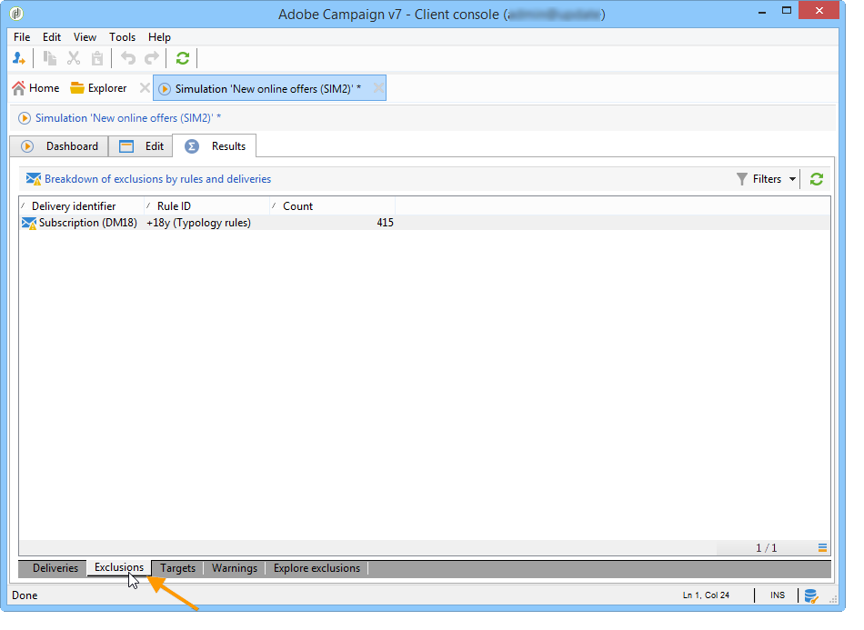
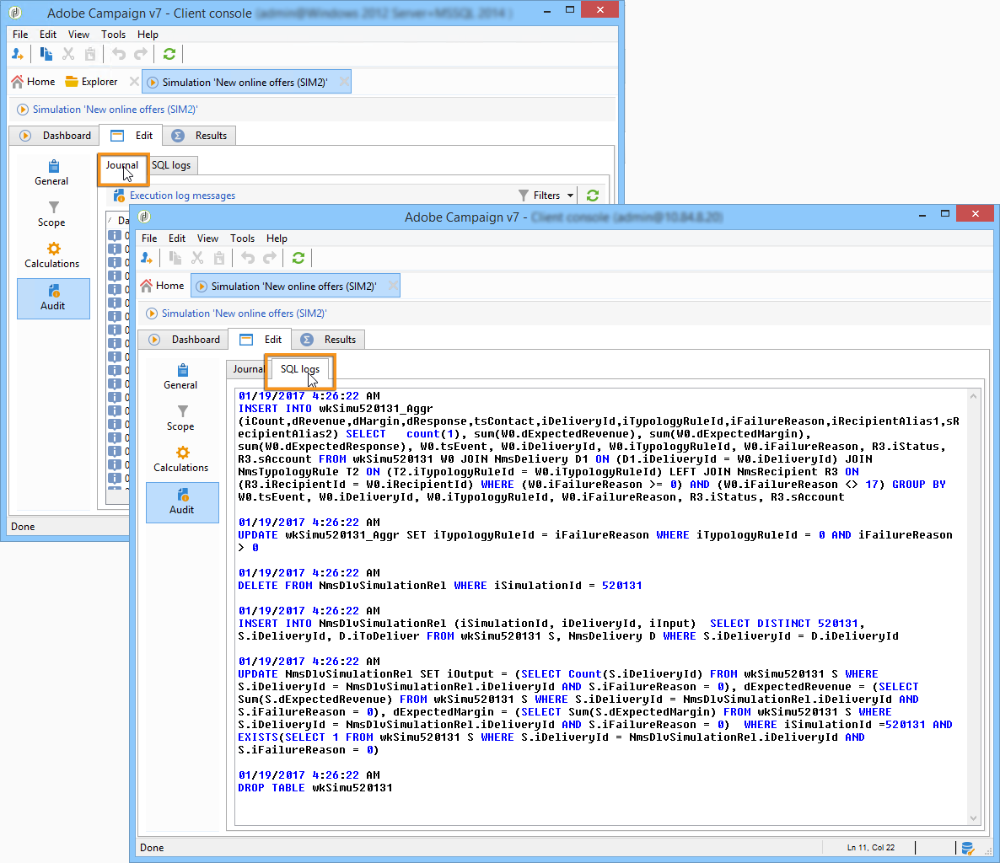
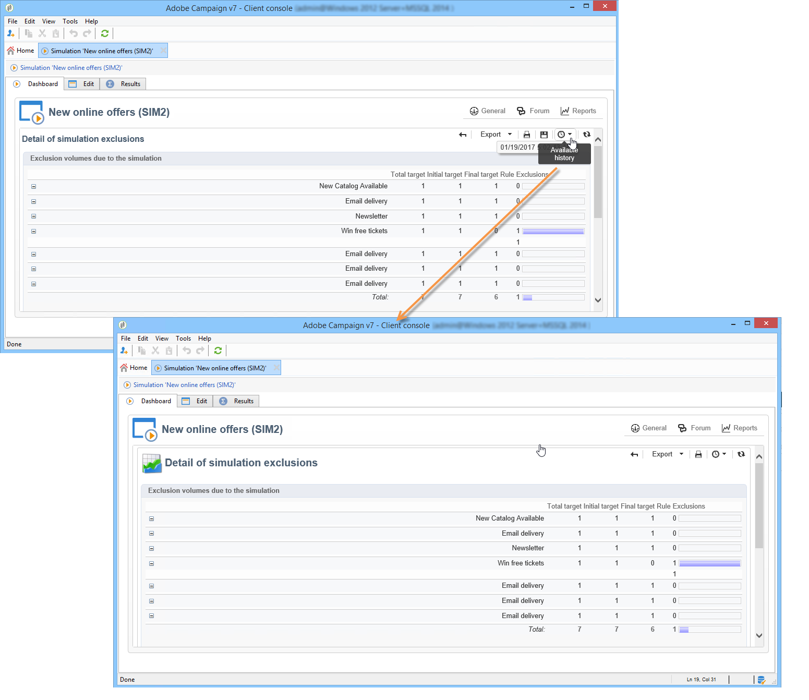

# Simulaciones en Campaign{#campaign-simulations}

La optimización de campañas permite probar la eficacia de un plan de campaña utilizando simulaciones. Esto le permite medir el éxito potencial de una campaña: ingresos generados, volumen de objetivo en función de las reglas de tipología aplicadas, etc.

La simulación permite controlar y comparar el impacto de los envíos.

## Configuración de una simulación {#set-up-a-simulation}

### Precaución

Envíos preparados en **Prueba** Los modos de no se afectan entre sí, por ejemplo al evaluar una campaña en marketing distribuido o siempre que las entregas no estén programados en el calendario provisional.

Esto significa que las reglas de presión y capacidad solo se aplican a los envíos en modo **[!UICONTROL Target estimation and message personalization]**. Envíos en **[!UICONTROL Estimation and approval of the provisional target]** modo y en **[!UICONTROL Target evaluation]** no se tienen en cuenta los modos de.

El modo de entrega se elige en la subpestaña **[!UICONTROL Typology]** en las propiedades de la entrega.

### Creación de una simulación {#create-a-simulation}

Para crear una simulación, aplique los pasos siguientes:

1. Vaya a la pestaña **[!UICONTROL Campaigns]** y, dentro de la sección **[!UICONTROL Create]**, haga clic en el vínculo **[!UICONTROL More]** y seleccione la opción **[!UICONTROL Simulation]**.

   

1. Introduzca la plantilla y el nombre de la simulación. Haga clic en **[!UICONTROL Save]** para crear la simulación.

   

1. Haga clic en la pestaña **[!UICONTROL Edit]** para configurarla.

   

1. En la pestaña **[!UICONTROL Scope]**, especifique los envíos que desea tener en cuenta para esta simulación. Para ello, haga clic en el botón **[!UICONTROL Add]** y especifique el modo de selección de envíos que desea tener en cuenta.

   

   Puede seleccionar cada entrega manualmente u ordenarlos por campaña, programa o plan.

   >[!NOTE]
   >
   >Si selecciona envíos a través de un plan, programa o campaña, Adobe Campaign puede actualizar automáticamente la lista de envíos a tener en cuenta cuando se inicie una simulación. Para ello, marque la opción **[!UICONTROL Refresh the selection of deliveries each time the simulation is started]**.
   >  
   >Si no lo hace, los envíos que no estén disponibles en el plan, programa o campaña cuando se cree la simulación no se tienen en cuenta: los envíos añadidos posteriormente se omiten.

   

1. Seleccione los elementos que desea incluir en el ámbito de simulación. Si es necesario, seleccione varios elementos utilizando las teclas Shift y Ctrl.

   

   Haga clic en **[!UICONTROL Finish]** para aprobar la selección.

   Puede combinar manualmente los envíos seleccionados y los envíos que pertenezcan a planes, programas o campañas.

   

   Si es necesario, puede utilizar una condición dinámica mediante el enlace **[!UICONTROL Edit the dynamic condition...]**.

   Haga clic en **[!UICONTROL Save]** para aprobar esta configuración.

   >[!NOTE]
   >
   >Al calcular las simulaciones, solo se tienen en cuenta los envíos cuyo objetivo se haya calculado (estados: **Target ready** o **Ready to deliver**).

1. En la pestaña **[!UICONTROL Calculations]**, seleccione una dimensión de análisis como, por ejemplo, el esquema de destinatario.

   

1. A continuación, puede añadir expresiones.

   

### Configuración de ejecución {#execution-settings}

La pestaña **[!UICONTROL General]** de la simulación permite introducir los ajustes de ejecución:

* La opción **[!UICONTROL Schedule execution for down-time]** aplaza el inicio de la simulación para un periodo menos intenso, según el nivel de prioridad seleccionado. Las simulaciones utilizan recursos de base de datos significativos, por lo que las simulaciones que no son urgentes deben programarse para su ejecución durante la noche, por ejemplo.
* **[!UICONTROL Priority]** es el nivel que se aplica a la simulación para retrasar su activación.
* **[!UICONTROL Save SQL queries in the log]**. Los registros SQL permiten diagnosticar una simulación si termina con errores. También pueden ayudarle a descubrir por qué una simulación es demasiado lenta. Estos mensajes se pueden ver después de la simulación en la subpestaña **[!UICONTROL SQL logs]** de la pestaña **[!UICONTROL Audit]**.

## Ejecución de una simulación {#execute-a-simulation}

### Inicio de una simulación {#start-a-simulation}

Una vez definido el ámbito de simulación, puede ejecutarlo.

Para ello, abra el panel de simulación y haga clic en **[!UICONTROL Start simulation]**.

Una vez finalizada la ejecución, abra la simulación y haga clic en la pestaña **[!UICONTROL Results]** para ver los objetivos calculados para cada entrega.

1. La subpestaña **[!UICONTROL Deliveries]** enumera todas las entregas que tiene en cuenta la simulación. Muestra dos recuentos:

   * **[!UICONTROL Initial count]** es el destinatario que se calcula durante su estimación en la entrega.
   * **[!UICONTROL Final count]** es el número de destinatarios que se cuentan después de la simulación.

      La diferencia entre los recuentos inicial y final refleja la aplicación de las distintas reglas o filtros configurados antes de la simulación.

      Para obtener más información sobre este cálculo, edite la subpestaña **[!UICONTROL Exclusions]**.

1. La subpestaña **[!UICONTROL Exclusions]** le permite ver el desglose de la exclusión.

   

1. La subpestaña **[!UICONTROL Alerts]** agrupa todos los mensajes de alerta generados durante la simulación. Los mensajes de alerta se pueden enviar en caso de sobrecarga de capacidad (si el número de destinatarios supera la capacidad del conjunto, por ejemplo).
1. La subpestaña **[!UICONTROL Exploration of the exclusions]** permite crear una tabla de análisis de resultados. El usuario debe indicar variables en los ejes de abscisas y ordenadas.

   Para ver un ejemplo de creación de tablas de análisis, consulte el final de [esta sección](#explore-results).

### Visualización de resultados {#view-results}

#### Auditoría {#audit}

La pestaña **[!UICONTROL Audit]** permite monitorizar la ejecución de la simulación. La subpestaña **[!UICONTROL SQL Logs]** resulta útil para los usuarios expertos. Muestra los registros de ejecución en formato SQL. Estos registros solo se muestran si la opción **[!UICONTROL Save SQL queries in the log]** se ha seleccionado en la pestaña **[!UICONTROL General]** antes de la ejecución de la simulación.

#### Exploración de resultados {#explore-results}

La subpestaña **[!UICONTROL Exploration of the exclusions]** permite analizar los datos resultantes de una simulación.

<!--
Descriptive analysis is detailed in [this section](../../reporting/using/about-adobe-campaign-reporting-tools.md).
-->

## Resultados de una simulación {#results-of-a-simulation}

Los indicadores de las pestañas **[!UICONTROL Log]** y **[!UICONTROL Results]** proporcionan una primera descripción de los resultados de simulación. Para obtener una vista más detallada de los resultados, abra la pestaña **[!UICONTROL Reports]**.

### Informes {#reports}

Para analizar el resultado de una simulación, edite sus informes: en ellos se muestran las exclusiones y las causas.

Los siguientes informes se ofrecen de forma predeterminada:

* **[!UICONTROL Detail of simulation exclusions]**: este informe proporciona un gráfico detallado de causas de exclusión para todas las entregas correspondientes.
* **[!UICONTROL Simulation summary]**: este informe muestra las poblaciones excluidas de la simulación en los distintos envíos.
* **[!UICONTROL Summary of exclusions linked to the simulation]**: este informe muestra un gráfico de exclusiones provocadas por la simulación junto con la regla de tipología aplicada y un gráfico que muestra la proporción de exclusiones por regla.

<!--
>[!NOTE]
>
>You can create new reports and add them to the ones offered. For more on this, refer to [this section](../../reporting/using/about-adobe-campaign-reporting-tools.md).
-->

Para acceder a los informes, haga clic en el vínculo **[!UICONTROL Reports]** de la simulación de destinatarios a través de su panel.

También puede editar informes mediante el vínculo **[!UICONTROL Reports]** al que se puede acceder desde el panel de simulación.

### Comparación de simulaciones {#compare-simulations-}

Cada vez que se ejecuta una simulación, el resultado reemplaza los resultados anteriores: no puede mostrar y comparar los resultados de una ejecución a otra.

Para comparar los resultados, debe utilizar los informes. De hecho, Adobe Campaign permite guardar un historial de informes para consultarlos de nuevo más tarde. Este historial se guarda a lo largo del ciclo de vida de las simulaciones.

**Ejemplo:**

1. Cree una simulación sobre una entrega al que se aplique la tipología **A**.
1. En la pestaña **[!UICONTROL Reports]**, edite uno de los informes disponibles, como por ejemplo **[!UICONTROL Detail of simulation exclusions]**.
1. En la sección superior derecha del informe, haga clic en el icono para crear un nuevo historial.

   

1. Cierre la simulación y cambie la configuración de tipología **A**.
1. Vuelva a ejecutar la simulación y compare el resultado con el que se muestra en el informe para el que se creó el historial.

   

   Puede guardar tantos historiales de informes como sea necesario.

### Ejes de notificación {#reporting-axes}

La pestaña **[!UICONTROL Calculations]** permite definir los ejes de creación de informes en el objetivo. Estos ejes se utilizarán durante [análisis de resultados](#explore-results).

>[!NOTE]
>
>Se recomienda definir los ejes de cálculo en las plantillas de simulación en lugar de individualmente para cada simulación.\
>Las plantillas de simulación se guardan en **[!UICONTROL Resources > Templates > Simulation templates]** del explorador de Campaign.

**Ejemplo:**

En el siguiente ejemplo, deseamos crear un eje de informes adicional basado en el estado de los destinatarios (“Cliente”, “Cliente potencial” o ninguno).

1. Para definir un eje de creación de informes, seleccione la tabla que contiene la información que se debe procesar en el campo **[!UICONTROL Analysis dimension]**. Esta información es obligatoria.
1. Aquí, deseamos seleccionar el campo Segmento de la tabla de destinatarios.

   

1. Estas son las opciones disponibles:

   * **[!UICONTROL Generate target overlap statistics]** permite recuperar todas las estadísticas de superposición en el informe de simulación. Las superposiciones son destinatarios a quienes se han dirigido al menos dos envíos dentro de una simulación.

      >[!CAUTION]
      >
      >Si selecciona esta opción, el tiempo de ejecución de la simulación aumenta considerablemente.

   * **[!UICONTROL Keep the simulation work table]** permite conservar los rastros de la simulación.

      >[!CAUTION]
      >
      >El guardado automático de estas tablas requiere una capacidad de almacenamiento importante: asegúrese de que la base de datos es lo suficientemente grande.

Cuando se muestran los resultados de la simulación, la información de la expresión seleccionada se muestra en la subpestaña **[!UICONTROL Overlaps]**.

La superposición de destinatarios de la entrega indica que han estado presentes en al menos dos entregas de una simulación.

>[!NOTE]
>
>Esta subpestaña solo se muestra si se ha activado la opción **[!UICONTROL Generate target recovery statistics]**.

La información sobre los ejes de creación de informes se puede procesar en los informes de análisis de exclusión creados en la subpestaña **[!UICONTROL Exploring exclusions]**. [Más información](#explore-results).
