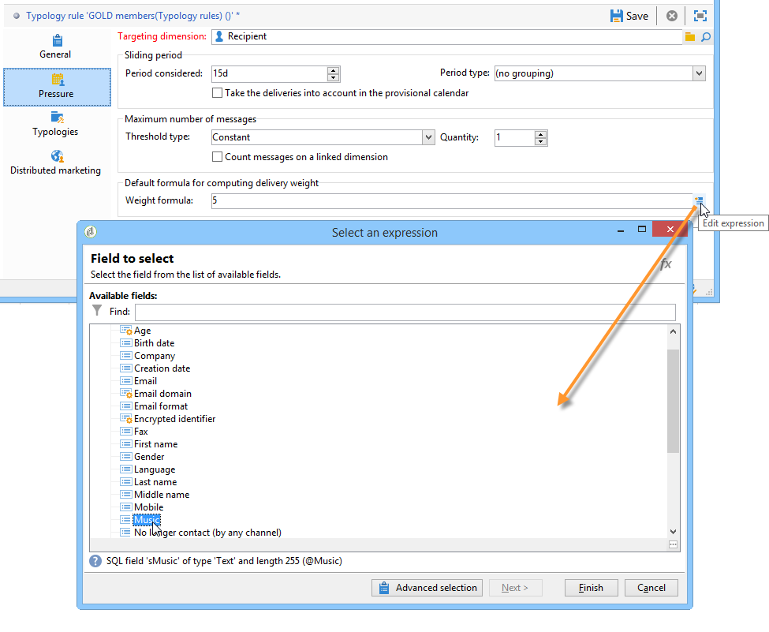

# Reglas de presión{#pressure-rules}

La implementación de la gestión de la presión de las ventas permite evitar la saturación de la población de la base de datos, también conocida como fatiga de marketing. Para ello, puede definir un número máximo de mensajes por destinatario. También le permite implementar reglas de mediación entre campañas para enviar el mejor mensaje al público objetivo.

Las reglas de **presión** para administrar la fatiga de marketing pueden consistir, por ejemplo, en restringir el número de correos que se envían a una población a un máximo de dos, en seleccionar la comunicación que mejor se adapte a los intereses de un grupo de suscriptores, en evitar enviar un SMS a un cliente insatisfecho, etc.

Las campañas se seleccionan según los umbrales definidos y el peso del mensaje.

* Un umbral es la cantidad más alta de envíos autorizados para un destinatario determinado durante un periodo determinado. Puede ser fijo o variable. Se define o calcula en la configuración de reglas de tipología. [Más información](#maximum-number-of-messages).
* El peso del envío le permite identificar las entregas de mayor prioridad dentro del marco de la gestión de presión. Los mensajes con mayor peso son prioritarios. [Más información](#message-weight).

La mediación consiste en asegurarse de que las campañas programadas cuyo peso sea mayor que la campaña en curso no saturen los perfiles: si este es el caso, el perfil se excluye de la entrega.

Los criterios de mediación (peso o umbral del mensaje) pueden variar en función de dos tipos de información:

* preferencias de destinatario, que es información genérica: suscripciones al boletín informativo, estado del destinatario (cliente o cliente potencial),
* comportamiento del destinatario: compras, enlaces visitados, etc.

La regla de mediación para definir los mensajes aptos se aplica durante la fase de análisis. Para cada destinatario y para el periodo correspondiente, el mensaje se envía si la fórmula siguiente es verdadera: **(cantidad de mensajes enviados) + (cantidad de mensajes con mayor peso) &lt; umbral**.

De lo contrario, el destinatario es **[!UICONTROL Excluded by arbitration]**. [Más información](#exclusion-after-arbitration).

## Creación de una regla de presión {#create-a-pressure-rule}

Para configurar la mediación entre campañas utilizando Adobe Campaign, comience creando tipologías de campaña y definiendo reglas de tipología vinculadas (reglas de **presión**).

>[!NOTE]
>
>Para que una regla de presión se aplique correctamente, la dimensión de segmentación de la regla debe coincidir con la dimensión de segmentación de la asignación de entrega.

Para crear y configurar una regla de tipología de **[!UICONTROL Pressure]**, siga los siguientes pasos:

1. En la lista de reglas de tipología de campaña, seleccione el icono **[!UICONTROL New]** situado encima de la lista.

   

1. En la pestaña **[!UICONTROL General]** de la nueva regla, seleccione una regla de tipo **Pressure** e introduzca un nombre y una descripción para ella.

   

1. Cambie el orden de ejecución si es necesario. Cuando se aplican varias reglas de tipología como un conjunto de **[!UICONTROL Typology]**, primero se aplican las reglas ordenadas parcialmente. [Más información](apply-rules.md#execution-order).
1. En la sección **[!UICONTROL Calculation parameters]**, defina una frecuencia si desea guardar el objetivo más allá de la siguiente ejecución diaria de mediación. [Más información](apply-rules.md#adjust-calculation-frequency).
1. Haga clic en la pestaña **[!UICONTROL Pressure]** y seleccione el periodo del calendario durante el cual se aplica la regla de tipología.

   

   La regla se aplica a las entregas cuya fecha de contacto se incluya en el periodo de interés.

   >[!NOTE]
   >
   >En el contexto de una [implementación empresarial (FDAC)](../../v8/architecture/enterprise-deployment.md) de Campaign, no se tienen en cuenta las entregas programadas.

1. Defina el método para calcular el número más alto de mensajes.

   El umbral representa el número máximo de mensajes que se pueden enviar a un destinatario durante el periodo en cuestión.

   De forma predeterminada, el umbral es constante y es necesario indicar un número máximo de mensajes autorizados por la regla.

   

   Para definir un umbral de variable, en el campo **[!UICONTROL Depends on the recipient]** seleccione el valor **[!UICONTROL Type of threshold]** y utilice el icono de la derecha para abrir el editor de expresiones.

   

   Para obtener más información, consulte [Número máximo de mensajes](#maximum-number-of-messages).

1. Especifique el método para calcular el peso del envío.

   Cada entrega tiene un peso, es decir, un valor que representa su nivel de prioridad: esto permite la mediación entre las campañas. El peso se calcula mediante la fórmula definida en la regla de tipología o en sus propiedades. [Más información](#message-weight).

1. De forma predeterminada, todos los mensajes tienen en cuenta el cálculo de umbral. La pestaña **[!UICONTROL Restriction]** permite filtrar los mensajes a los que afecta la regla de tipología:

   * La sección superior de esta pestaña le permite restringir los destinatarios que le interesen.
   * La sección inferior de esta pestaña le permite filtrar los mensajes que se van a contar.

     En el siguiente ejemplo, solo se tienen en cuenta los destinatarios guardados en la carpeta **NewContacts** y las entregas que comienzan con **Newsletter**.

   

1. La pestaña **[!UICONTROL Typologies]** permite ver las tipologías de campaña que aplican esta regla o relaciona la regla con una o más tipologías existentes. [Más información](campaign-typologies.md#apply-typologies).

## Definición de umbrales y pesos {#define-thresholds-and-weights}

### Número máximo de mensajes {#maximum-number-of-messages}

Cada regla de presión define un umbral, es decir, un número máximo de mensajes que se pueden enviar a un destinatario durante un periodo determinado. Una vez alcanzado este umbral, no se pueden realizar más entregas hasta el final del periodo. Este proceso permite excluir automáticamente un destinatario de una entrega si un mensaje supera el umbral establecido, evitando así saturar al destinatario.

Los valores de umbral pueden ser constantes o calculados mediante una fórmula con variables. Esto significa que, para un periodo determinado, los umbrales pueden variar de un destinatario a otro o incluso en un mismo destinatario.

>[!CAUTION]
>
>La introducción de **0** como umbral evita todas las entregas a la población destinataria durante el periodo en cuestión.

**Ejemplo:**

Puede indexar el número de mensajes autorizados según el segmento al que pertenezca el destinatario. Esto significa que un destinatario que pertenece al segmento web puede recibir más mensajes que otros destinatarios. Una fórmula de tipo **[!UICONTROL Iif (@origin='Web', 5, 3)]** autoriza la entrega de 5 mensajes a los destinatarios y 3 para otros segmentos. La configuración resultante es la siguiente:

Para definir el umbral, puede utilizar una dimensión vinculada a la dimensión de segmentación: por ejemplo, para incluir mensajes enviados a los perfiles de destinatario almacenados en la [tabla de visitantes](../../v8/audiences/target-mappings.md) o para evitar que se envíe más de un mensaje por semana a la misma familia (que puede hacer referencia a varias direcciones de correo electrónico) identificada en una dimensión vinculada a los destinatarios.

Para ello, seleccione la opción **[!UICONTROL Count messages on a linked dimension]** y luego seleccione al visitante o la tabla de contacto.

### Peso del mensaje {#message-weight}

Cada envío tiene un peso que representa su nivel de prioridad. De forma predeterminada, el peso de una entrega se establece en 5. Las reglas de presión permiten definir el peso de las entregas a los que se aplican.

El peso puede ser fijo o calcularse mediante una fórmula para adaptarse a los destinatarios. Por ejemplo, puede definir el peso de un envío en función de los intereses del destinatario.

>[!CAUTION]
>
>El peso definido en una regla de tipología se puede sobrecargar individualmente para cada entrega a través de la pestaña **[!UICONTROL Properties]**. Haga clic en la pestaña **[!UICONTROL Typology]** para seleccionar la tipología de la campaña y, si es necesario, especifique el peso que debe aplicarse.\
>Sin embargo, el peso declarado en una regla de tipología no se utiliza para calcular una regla de tipología B: este peso afecta únicamente a las entregas que utilizan la regla A.

**Ejemplo:**

En el ejemplo siguiente, queremos vincular el peso de los boletines de noticias sobre música con la puntuación de tendencia de sus destinatarios. Para ello:

1. Cree un nuevo campo para almacenar las puntuaciones de tendencia de los receptores. El campo, en este caso **@Music**, se enriquece con las respuestas a los sondeos y encuestas en línea, los datos de seguimiento recopilados, etc.
1. Cree una regla de tipología para calcular el peso del mensaje en función de este campo.

   

1. Aplique esta regla a los mensajes con el siguiente asunto: boletines informativos, ofertas especiales, etc. El peso de estos envíos y, por lo tanto, su nivel de prioridad depende de la puntuación de tendencia de cada destinatario.

## Configuración del período {#setting-the-period}

Las reglas de presión se definen en los períodos de desplazamiento de **n** días.

El periodo se configura en la pestaña **[!UICONTROL Pressure]** de la regla. Puede especificar el número de días y, si es necesario, seleccionar el tipo de agrupación que desea aplicar (día, semana, mes, trimestre, etc.).

El tipo de agrupación permite ampliar el campo **[!UICONTROL Period considered]** a todo el día, a una semana del calendario, a un mes del calendario o a un año del calendario para las fechas del periodo.

Por ejemplo, una regla de presión que define un umbral de 2 mensajes por semana, con una agrupación para cada mes de calendario, impide que se envíen más de 2 mensajes en de la misma semana Y dentro de un mismo mes del calendario. Advertencia: si el periodo se superpone en dos meses, el umbral de cálculo tiene en cuenta las entregas de estos dos meses del calendario y, por tanto, evita realizar nuevos envíos durante el segundo mes.

>[!CAUTION]
>
>Al calcular el umbral, solo se tienen en cuenta las entregas que ya se han enviado.

Para restringir las entregas que se tienen en cuenta a un período de 2 semanas, escriba **15d** en el campo **[!UICONTROL Concerned period]**: las entregas que se realicen hasta dos semanas antes de la fecha de entrega a la que se aplica la regla se tendrán en cuenta en el cálculo

La fecha de inicio depende de cómo se haya configurado la base de datos.

Por ejemplo, si aplica una regla de presión de 15 días sin agrupar a una entrega con fecha del 11/12, las entregas se tendrán en cuenta entre el 27/11 y el 12/12. Si la regla de presión tiene en cuenta las entregas del calendario provisional, se tienen en cuenta todas las entregas programadas entre el 27/11 y el 27/12. Por último, si configura un grupo por mes del calendario en la regla, el umbral de cálculo tiene en cuenta todas las entregas de noviembre y diciembre (del 1/11 al 31/12).

**Casos frecuentes**

Para asegurarse de que no se tienen en cuenta las entregas de la semana en curso, así como para no arriesgarse a tener en cuenta también los de la semana anterior para el umbral de cálculo, especifique **[!UICONTROL Period considered]** en “0” y seleccione “Grouping per calendar week” en **[!UICONTROL Period type]**.

Cuando un periodo es superior a 0 (1, por ejemplo), el umbral de cálculo puede tener en cuenta las entregas del día anterior. Por lo tanto, si el día anterior corresponde a la semana anterior del calendario y el tipo de periodo seleccionado es “Agrupación por semana del calendario”, la semana anterior se tiene en cuenta para el umbral del cálculo.

**Ejemplo:**

Queremos crear una regla de presión que limite las solicitudes a 3 mensajes por cada periodo de dos semanas, con una agrupación por mes del calendario.

Tomemos 6 boletines con el mismo peso, programados para el 30/05, el 3/06, el 08/06, el 12/06, el 22/06 y el 30/06.

las entregas programadas para el 12 y 30 de junio no se envían: la entrega del 12/06 supera el umbral de 3 mensajes por periodo de dos semanas y la entrega del día 30 supera el umbral de comunicaciones autorizadas por mes del calendario.

La mediación excluye a todos los destinatarios de estos envíos durante la fase de análisis:

Por la misma regla, si se agrupan las entregas por trimestre, los destinatarios del **boletín informativo n.º 5** también se excluyen y este no se envía.

Por último, si no se selecciona ningún agrupamiento, tan solo no se envía el **boletín informativo n.º 4**, ya que este se encuentra programado para el mismo periodo de dos semanas que los tres primeros boletines.

>[!NOTE]
>
>Al cambiar la definición de una regla de tipología, puede crear una **Simulación** para controlar su impacto sobre las entregas a los que se aplica y monitorizar el impacto que las entregas tienen entre sí. [Más información](campaign-simulations.md).

## Exclusión tras la mediación {#exclusion-after-arbitration}

La mediación se vuelve a aplicar cada noche mediante el flujo de trabajo técnico **[!UICONTROL Forecasting]** y el flujo de trabajo **[!UICONTROL Campaign jobs]**.

El flujo de trabajo de **[!UICONTROL Forecasting]** calcula de forma previa los datos del periodo en curso (desde la fecha de inicio hasta la fecha actual), lo que permite aplicar las reglas de tipología durante el análisis. También recalcula los contadores de exclusión para la mediación nocturna diaria.

Por lo tanto, para cada destinatario, Adobe Campaign comprueba que el número de mensajes enviados no supere el umbral, teniendo en cuenta el número de mensajes enviados durante el periodo en cuestión. Esta información es un **indicador**, ya que todos los cálculos se actualizan en el momento de la entrega.

Si este número supera el umbral, se aplican las reglas de mediación definidas en la campaña de tipología y los destinatarios se excluyen de las campañas con un peso menor.

>[!NOTE]
>
>Si varios envíos tienen puntuaciones iguales, se envía la campaña programada para la fecha más temprana.

## Ejemplos de uso de las reglas de presión {#use-cases-on-pressure-rules}

### Adaptación del umbral según el criterio {#adapt-the-threshold-based-on-criterion}

Queremos crear una regla de tipología para evitar la entrega de más de cuatro mensajes por semana a los clientes y de más de dos mensajes por semana a los posibles clientes.

Para identificar clientes y clientes potenciales, utilice el campo **[!UICONTROL Status]**, que contiene 0 para los clientes potenciales y 1 para los clientes.

Para crear la regla, siga los siguientes pasos:

1. Cree una nueva regla de tipología de tipo **presión**.
1. Edite la pestaña **[!UICONTROL Pressure]**: en la sección **[!UICONTROL Maximum number of messages]** se busca crear una fórmula para calcular el umbral en función de cada destinatario. En el campo **[!UICONTROL Depends on the recipient]** seleccione el valor **[!UICONTROL Threshold type]** y haga clic en **[!UICONTROL Edit expression]** a la derecha del campo **[!UICONTROL Formula]**.

   Haga clic en el botón **[!UICONTROL Advanced parameters]** para definir la fórmula de cálculo.

   

1. Seleccione la opción **[!UICONTROL Edit the formula using an expression]** y haga clic en **[!UICONTROL Next]**.

   

1. En la lista de funciones, haga doble clic en la función **Iif** en el nodo **[!UICONTROL Others]**.

   A continuación, seleccione el **estado** de los destinatarios en la sección **[!UICONTROL Available fields]**.

   

   Introduzca la fórmula siguiente: **Iif(@status=0,2,4)**

   

   Esta fórmula permite asignar el valor 2 si el estado es igual a 0 y el valor 4 para todos los demás estados.

   Haga clic en **[!UICONTROL Finish]** para aprobar la fórmula.

1. Indique el periodo durante el cual desea aplicar la regla: 7 días en este caso, para obtener la cantidad de mensajes por semana.

   

1. Guarde la regla para aprobar la creación.

Ahora, vincule la regla que acaba de crear a una tipología para aplicarla a las entregas. Para ello:

1. Cree una tipología de campaña.
1. Vaya a la pestaña **[!UICONTROL Rules]**, haga clic en el botón **[!UICONTROL Add]** y seleccione la regla que acaba de crear.

   

1. Guarde la tipología: se añade a la lista de tipologías existentes.

Para utilizar esta tipología en las entregas, selecciónela en las propiedades de entrega, en la pestaña **[!UICONTROL Typology]** como se muestra a continuación:

>[!NOTE]
>
>La tipología se puede definir en la plantilla de envíos para que se aplique automáticamente a todas las entregas creadas con esta plantilla.

Durante el análisis de la entrega, los destinatarios de la entrega se excluyen del mismo, si corresponde, en función de la cantidad de envíos que ya hayan recibido. Para ver esta información, puede:

* Consultar el resultado del análisis:

  

* Edite la entrega y haga clic en la pestaña **[!UICONTROL Delivery]** y en la subpestaña **[!UICONTROL Exclusions]**:

  

* Haga clic en la pestaña **[!UICONTROL Audit]** y luego en la subpestaña **[!UICONTROL Causes of exclusions]** para mostrar el número de exclusiones y las reglas de tipología aplicadas:

  

### Cálculo del peso del envío según el comportamiento {#calculate-the-delivery-weight-based-on-behavior}

Puede definir reglas de presión basadas en el comportamiento del destinatario: por lo tanto, el peso de una entrega se puede adaptar a criterios que varían de un destinatario a otro. Por ejemplo: puede decidir enviar un mensaje dependiendo de si un destinatario visitó su sitio de Internet, hizo clic en una sección específica del último boletín, se suscribió a un servicio de información o incluso en función de las respuestas a un estudio, un juego en línea, etc.

En el siguiente ejemplo, deseamos crear una entrega con un peso de 5. Este peso se enriquece con puntuaciones de tendencia basadas en el comportamiento del destinatario: los clientes que ya han hecho un pedido desde este sitio tienen una puntuación de 5, mientras que los clientes que nunca han hecho un pedido en línea tienen una puntuación de 4.

Para realizar este tipo de configuración, debe utilizar una fórmula para definir el peso del mensaje. Se debe poder acceder a la información sobre puntuaciones de tendencia y a las respuestas de encuestas en el modelo de datos. En nuestro ejemplo, se ha añadido el campo **Propensity**.

Aplique los siguientes pasos de configuración:

1. Cree una nueva regla de tipología de tipo **presión**.
1. Edite la pestaña **[!UICONTROL Pressure]**. Se busca crear una fórmula de umbral que se base en cada destinatario individual: haga clic en el icono **[!UICONTROL Edit expression]** a la derecha del campo **[!UICONTROL Weight formula]**.

   

1. De forma predeterminada, el valor **5** se muestra en la sección superior del editor de expresiones. Queremos añadir la puntuación de tendencia de cada destinatario a este peso: coloque el cursor a la derecha de 5, introduzca el carácter **+** y seleccione el campo **Propensity**.

   

1. A continuación, añada un valor más alto para los destinatarios que ya han realizado una compra. Para ellos, el peso de la entrega se debe aumentar en 5, mientras el resto debe hacerlo solo en 4.

   

1. Haga clic en **[!UICONTROL Finish]** para guardar esta regla.
1. Vincule la regla a una tipología de campaña y haga referencia a esta tipología en una entrega para aprobarla.

### Envío de solo los mensajes de mayor peso {#send-only-the-highest-weighted-messages}

Supongamos que desea enviar 2 mensajes como máximo en la misma semana, con un límite de 2 mensajes al día, a cada uno de los destinatarios y solo desea que se envíen los mensajes que tengan un mayor peso.

Para ello, debe programar varios envíos con diferentes pesos para el mismo destinatario y aplicar una regla de presión para excluir las entregas de pesos más bajos.

Primero, configure la regla de presión.

1. Cree una regla de presión. [Más información](#create-a-pressure-rule).
1. En la pestaña **[!UICONTROL General]** , seleccione la opción **[!UICONTROL Re-apply the rule at the start of personalization]** . 

   

   Esta opción anula el valor definido en el campo **[!UICONTROL Frequency]** y aplica automáticamente la regla durante la fase de personalización. [Más información](apply-rules.md#adjust-calculation-frequency).

1. En la pestaña **[!UICONTROL Pressure]**, seleccione **[!UICONTROL 7d]** como **[!UICONTROL Period considered]** y **[!UICONTROL Grouping per day]** como **[!UICONTROL Period type]**.
1. En la pestaña **[!UICONTROL Typologies]**, relacione la regla con una tipología de campaña.
1. Guarde los cambios.

Ahora cree y configure un flujo de trabajo para cada envío al que desee aplicar la regla de presión.

1. Cree una campaña. [Más información](../campaigns/marketing-campaign-create.md#create-a-campaign).
1. En la pestaña **[!UICONTROL Targeting and workflows]** de la campaña, añada una actividad **Query** al flujo de trabajo. Para obtener más información sobre esta actividad, consulte [esta sección](../workflow/query.md).
1. Añada una actividad de **[!UICONTROL Email delivery]** al flujo de trabajo y ábrala. Para obtener más información sobre esta actividad, consulte [esta sección](../workflow/delivery.md).
1. En **[!UICONTROL Approvals]** vaya a la pestaña **[!UICONTROL Delivery properties]** y deshabilite todas las aprobaciones.

   

1. En la pestaña **[!UICONTROL Typology]** dentro de **[!UICONTROL Delivery properties]** haga referencia a la tipología de campaña para aplicar la regla. Defina un peso para la entrega.

   

1. En el envío, haga clic en **[!UICONTROL Scheduling]** y seleccione **[!UICONTROL Schedule delivery (automatic execution when the scheduled date is reached)]**. En este ejemplo, seleccione la opción **[!UICONTROL Use a calculation formula]**.
1. Establezca la fecha de extracción en 10 minutos (fecha actual + 10 minutos).
1. Configure la fecha de contacto en el día siguiente (fecha actual + 1 día).

   

   Para que las exclusiones de regla de presión se implementen correctamente, asegúrese de establecer la fecha y hora de extracción antes de la fecha y la hora de contacto, así como antes de que se reaplique la mediación por la noche. [Más información](#exclusion-after-arbitration).

1. Desmarque la opción **[!UICONTROL Confirm the delivery before sending]** y guarde los cambios.
1. Continúe de la misma forma para cada envío que desee realizar. Asegúrese de definir el peso deseado para cada envío.
1. Ejecute los flujos de trabajo relevantes para preparar y realizar las entregas.

Cuando se aplica la mediación nocturna, se excluyen las entregas con los pesos más bajos para el mismo destinatario. Solo se tienen en cuenta las entregas con el peso más alto a la hora de realizar dichos envíos. [Más información](#message-weight).

Teniendo en cuenta que ya se ha enviado un correo electrónico a los destinatarios en cuestión a principios de la semana, la siguiente tabla muestra un ejemplo de las configuraciones que se pueden aplicar a dos envíos más.

<table> 
 <thead> 
  <tr> 
   <th> Entrega  </th> 
   <th> Aprobaciones  </th> 
   <th> Ponderación  </th> 
   <th> Fecha y hora de extracción  </th> 
   <th> Fecha de contacto  </th> 
   <th> Fecha y hora de inicio de la entrega  </th> 
   <th> Fecha y hora de ejecución del flujo de trabajo de mediación  </th> 
   <th> Estado de la entrega  </th> 
   <th> Envío realizado (fecha/hora)  </th> 
  </tr> 
 </thead> 
 <tbody> 
  <tr> 
   <td> Envío 1  </td> 
   <td> Desactivado  </td> 
   <td> 5  </td> 
   <td> 3 p. m.  </td> 
   <td> 8 a. m. (día siguiente)  </td> 
   <td> 2 p. m.  </td> 
   <td> Nocturno  </td> 
   <td> Excluido  </td> 
   <td> Excluido  </td> 
  </tr> 
  <tr> 
   <td> Envío 2  </td> 
   <td> Desactivado  </td> 
   <td> 10  </td> 
   <td> 4 p. m.  </td> 
   <td> 9 a. m. (día siguiente)  </td> 
   <td> 2 p. m.  </td> 
   <td> Nocturno  </td> 
   <td> Enviado  </td> 
   <td> 9 a. m. (día siguiente)  </td> 
  </tr> 
 </tbody> 
</table>

Después de que la fecha de extracción haya pasado para los dos envíos, la mediación nocturna se vuelve a aplicar antes de las fechas de contacto de ambos envíos. Esto permite buscar todas las entregas ya realizados (destinatarios para los que se procesa una entrega, registrados a través de los registros amplios) o programados para enviarse (destinatarios aptos para recibir una entrega, registrados mediante los registros de previsión).

Una vez que se han enumerado todas las entregas realizadas y potenciales para el periodo definido en la regla de presión, Adobe Campaign las clasifica por peso, con el peso más alto en primer lugar. Cuando se alcanza el umbral establecido en la regla de presión (en este caso, no más de 2 correos electrónicos en la misma semana), los destinatarios se excluyen de la entrega.
