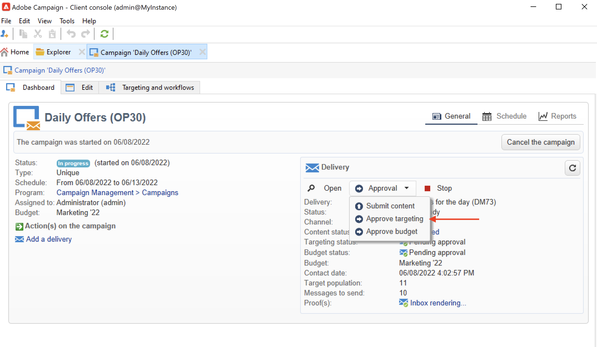

# Configuración y administración del proceso de aprobación {#approval-marketing-campaigns}

Los métodos y las personas implicadas en la creación y aprobación de campañas de marketing son específicos de cada organización. El proceso de aprobación de la campaña implica la coordinación de varias partes interesadas: especialistas en marketing digital, gestores de envío, gestores de contenido y propietarios externos como socios o proveedores.

Con Adobe Campaign, puede configurar un flujo de aprobación para sus campañas y notificar a los operadores cuando sea necesaria una acción. Puede definir aprobaciones para cada paso de una entrega: direccionamiento, contenido, presupuesto, extracción y envío de prueba. A medida que los envíos de la campaña pasan por los distintos pasos de validación, Adobe Campaign compila un historial de modificaciones y bajas, que incluye comentarios, comentarios, solicitudes de cambio y comentarios.

Los mensajes de notificación se envían a los operadores de Adobe Campaign designados como revisores para informarles de una solicitud de aprobación.

Los operadores pueden aprobar de varias formas:

* Desde el mensaje de notificación. El vínculo del correo electrónico lleva al operador a Campaign a través de un explorador web. Después de la conexión, el revisor puede elegir aprobar el contenido o no.
   

* Desde el panel de campañas.
   

* Desde el panel de envío.
   

Los operadores pueden acceder a la campaña y a la entrega desde la ventana de aprobación. También pueden introducir un comentario.

Una vez que un operador valida, la información se muestra en los paneles de campaña y envío, y en los registros.

La información también está disponible en los registros de aprobación de la entrega y en el diario de aprobación de la campaña. Se accede a estos registros a través de la **[!UICONTROL Edit > Audit > Approvals]** pestañas.

## Habilitar aprobaciones{#enable-approvals}

Las notificaciones de aprobación se envían a los operadores afectados a cada proceso para el que se habilitó la aprobación.

Pueden habilitarse para la plantilla de campaña, para cada campaña individualmente o para una entrega.

Todos los trabajos que requieren aprobación están seleccionados en la plantilla de campaña, a través del  **[!UICONTROL Properties]** > **[!UICONTROL Advanced campaign parameters...]** > **[!UICONTROL Approvals]** pestaña . Los revisores o grupos de revisores se seleccionan en esta pestaña. Reciben notificaciones, a menos que esta opción no esté habilitada. [Más información](#approving-processes).

Esta configuración se puede sobrescribir para cada campaña creada con esta plantilla e individualmente para cada entrega. Examine la **[!UICONTROL Properties]** del envío y, a continuación, el botón **[!UICONTROL Approvals]** pestaña .

En el ejemplo siguiente, el contenido de la entrega no requiere aprobaciones:

>[!CAUTION]
>
>Compruebe que los revisores tengan los **permisos apropiados** para la aprobación y que su zona de seguridad esté definida correctamente. [Más información](#selecting-reviewers).

El proceso de aprobación de las entregas se detalla en [esta sección](#review-and-approve-deliveries).

## Selección de revisores {#select-reviewers}

Para cada tipo de aprobación, se seleccionan los operadores o grupos de operadores a cargo de la aprobación de la lista desplegable en la entrega. Se pueden agregar operadores adicionales mediante el vínculo **[!UICONTROL Edit...]**. Esta ventana también le permite editar la fecha límite de la aprobación. De forma predeterminada, los revisores tienen tres días a partir de la fecha de entrega para aprobar un proceso. Para agregar un recordatorio automático, use la variable **[!UICONTROL Add a reminder]** vínculo.

Si no se especifica ningún revisor, el propietario de la campaña es responsable de las aprobaciones y recibe las notificaciones. El propietario de la campaña se especifica en la variable **[!UICONTROL Edit > Properties]** de la campaña:

Todos los demás operadores de Adobe Campaign con **[!UICONTROL Administrator]** también pueden aprobar trabajos, pero no reciben notificaciones.

>[!NOTE]
>
>De forma predeterminada, el propietario de la campaña no puede realizar la aprobación ni iniciar las entregas si se han definido los operadores de aprobación. Como administrador de Adobe Campaign, puede modificar este comportamiento y permitir que los propietarios de la campaña aprueben o inicien las entregas creando el **NmsCampaign_Activate_OwnerConfirmation** , establezca como **1**.

Si se define una lista de revisores, se aprueba un trabajo cuando un revisor lo aprueba. El vínculo de aprobación ya no está disponible en los paneles de campaña y envío. Cuando se activa la entrega de notificaciones, si otro revisor hace clic en el vínculo de aprobación incluido en el mensaje de notificación, se le notifica que otro operador ya ha aprobado el trabajo.

## Revisión y aprobación de entregas {#review-and-approve-deliveries}

Para cada campaña, puede aprobar el objetivo de la entrega, [contenido de entrega](#approving-content) y costes. Los operadores de Adobe Campaign responsables de la aprobación pueden recibir notificaciones por correo electrónico y aceptar o rechazar la aprobación a través de la consola o de una conexión web. [Más información](#approving-processes).

Para las entregas de correo directo, los operadores de Adobe Campaign pueden ver el archivo de extracción antes de enviarlo al enrutador y, si es necesario, pueden cambiar el formato y volver a iniciar la extracción. [Más información](#approve-an-extraction-file).

Cuando se hayan completado estas fases de validación, se puede iniciar el envío. [Más información](marketing-campaign-deliveries.md#starting-a-delivery).

>[!NOTE]
>
>Los procesos que requieren una aprobación están seleccionados en la plantilla de campaña. [Más información](marketing-campaign-templates.md).

### Pasos para aprobar un envío {#approving-processes}

Las etapas que requieren aprobación aparecen en el panel de campañas (a través de la consola o la interfaz web). También aparecen en la tabla de seguimiento de entregas y en el panel de entregas.

En cada entrega de la campaña, puede aprobar los siguientes procesos:

* **Objetivos, contenido y presupuesto**

   Cuando la variable **[!UICONTROL Enable target approval]**, **[!UICONTROL Enable content approval]** o **[!UICONTROL Enable budget approval]** se seleccionan en la ventana de configuración de aprobación, los vínculos relacionados se muestran en los paneles de campaña y envío.

   

   >[!NOTE]
   >
   >La aprobación del presupuesto solo está disponible si la aprobación del objetivo está habilitada en la ventana de configuración de aprobación. El vínculo para la aprobación del presupuesto solo se muestra una vez analizado el objetivo.

   Si las opciones **[!UICONTROL Assign content editing]** o **[!UICONTROL External content approval]** están seleccionadas en la ventana de configuración de aprobación, el panel muestra los vínculos **[!UICONTROL Available content]** y **[!UICONTROL External content approval]**.

   La aprobación de contenido permite acceder a las pruebas enviadas.

* **Aprobación de extracción (entrega de correo directo)**

   Cuando se selecciona **[!UICONTROL Enable extraction approval]** en la ventana de configuración de aprobación, el archivo extraído debe aprobarse antes de que se pueda notificar al enrutador.

   La variable **[!UICONTROL Approve file]** está disponible en los paneles de campaña y envío.

   

   Puede obtener una vista previa del archivo de salida antes de la validación. La vista previa del archivo de extracción solo muestra una muestra de datos. El archivo completo no se carga.

* **Aprobación de entregas asociados**

   La variable **[!UICONTROL Enable individual approval of each associated delivery]** se utiliza para una entrega principal asociado con entregas secundarios. De forma predeterminada, esta opción no está seleccionada para que se pueda realizar una aprobación general de la entrega principal. Si se selecciona esta opción, cada entrega debe aprobarse de forma individual.

   

>[!NOTE]
>
>En un flujo de trabajo de objetivos, si se produce un error vinculado a un problema de configuración durante la preparación del mensaje, en el panel aparece el vínculo **[!UICONTROL Restart message preparation]**. Corrija el error y utilice este vínculo para reiniciar la preparación del mensaje evitando la fase de segmentación.

### Aprobación de un contenido {#approve-content}

>[!CAUTION]
>
>Para aprobar un contenido, es obligatorio ejecutar un ciclo de prueba. Las pruebas permiten aprobar la visualización de información, personalizar los datos y comprobar que los vínculos funcionan.
>
>Las funcionalidades de aprobación de contenido detalladas a continuación están relacionadas con el envío de pruebas.

Se puede configurar un ciclo de aprobación de contenido. Para ello, seleccione la opción **[!UICONTROL Enable content approval]** en la ventana de configuración de aprobación. Los pasos principales del ciclo de aprobación de contenido son:

1. Después de crear una nueva entrega, el administrador de campañas hace clic en el vínculo **[!UICONTROL Submit content]** del panel de campañas para iniciar el ciclo de aprobación de contenido.

   >[!NOTE]
   >
   >Si la opción **[!UICONTROL Enable the sending of proofs]** (para entregas de correo electrónico) o **[!UICONTROL Enable the sending and approval of proofs]** (para entregas de correo directo) se seleccionó en la ventana de configuración de aprobación, las pruebas se envían automáticamente.

1. Se envía un correo electrónico de notificación a la persona responsable del contenido, que puede elegir si lo aprueba o no:

   * mediante el correo electrónico de notificación: el correo electrónico de notificación contiene un vínculo a las pruebas que ya se han enviado y posiblemente a una renderización del mensaje para los distintos entornos limitados si la variable **Capacidad de entrega** el complemento está habilitado para esta instancia.

   * a través de la consola o interfaz web, el seguimiento de entrega, el panel de entrega o el panel de campaña. Este panel de campaña le permite ver la lista de pruebas que se han enviado haciendo clic en el vínculo **[!UICONTROL Inbox rendering...]**. Para ver el contenido, haga clic en el icono **[!UICONTROL Detail]** a la derecha de la lista.

1. Se envía un correo electrónico de notificación a la persona responsable de la campaña en el que se indica si el contenido se ha aprobado o no. La persona responsable de la campaña puede volver a iniciar el ciclo de aprobación de contenido en cualquier momento. Para ello, haga clic en el vínculo en la línea **[!UICONTROL Content status]** del panel de campañas (al nivel de entrega) y luego haga clic en **[!UICONTROL Reset content approval to submit it again]**.

#### Asignación de la edición de contenido {#assign-content-editing}

Esta opción le permite definir a alguien a cargo de la edición de contenido, como un administrador web. Si se selecciona la opción **[!UICONTROL Assign content editing]** en la ventana de configuración de aprobación, se añaden varios pasos de aprobación entre la creación de la entrega y la entrega del correo electrónico de notificación a la persona responsable del contenido:

1. Después de crear una nueva entrega, la persona responsable de la campaña hace clic en el vínculo **[!UICONTROL Submit content editing]** en el panel de campaña para iniciar el ciclo de edición de contenido.

1. La persona responsable de la edición de contenido recibirá un correo electrónico que les informará de que el contenido está disponible.

1. Pueden iniciar sesión en la consola, abrir la entrega y editarlo utilizando un asistente simplificado para cambiar el asunto, el contenido HTML y el contenido de texto y enviar pruebas.

   >[!NOTE]
   >
   >Si la opción **[!UICONTROL Enable the sending of proofs]** (para entregas de correo electrónico) o **[!UICONTROL Enable the sending and approval of proofs]** (para entregas de correo directo) se seleccionó en la ventana de configuración de aprobación, las pruebas se envían automáticamente.

1. Una vez que la persona de la edición de contenido ha terminado de realizar cambios en el contenido de la entrega, puede permitir el acceso al contenido.

   Para ello, pueden utilizar:

   * el **[!UICONTROL Available content]** en la consola de Adobe Campaign.
   * el vínculo en el mensaje de notificación.
El operador puede añadir un comentario antes de enviar el contenido a la persona a cargo de la campaña.
El mensaje de notificación permite que el revisor apruebe o rechace el contenido.

#### Aprobación de contenido externo {#external-content-approval}

Esta opción le permite definir un operador externo encargado de aprobar el procesamiento de la entrega, como coherencia de la comunicación de la marca, tasas, etc. Si se selecciona la opción **[!UICONTROL External content approval]** en la ventana de configuración de aprobación, se añaden varios pasos de aprobación entre la creación de la entrega y la entrega del correo electrónico de notificación a la persona responsable de la campaña:

1. El administrador de contenido externo recibe un mensaje de correo electrónico de notificación que indica que el contenido se ha aprobado y se solicita la aprobación externa.
1. El correo electrónico de notificación contiene vínculos a las pruebas enviadas, lo que le permite ver el procesamiento de la entrega, y un botón para aprobar o rechazar el contenido de la entrega.

Estos vínculos solo están disponibles si se han enviado una o más pruebas. De lo contrario, el procesamiento de la entrega solo está disponible a través de la consola o de la interfaz web.

### Aprobación de un archivo de extracción {#approve-an-extraction-file}

En el caso de entregas sin conexión, Adobe Campaign genera un archivo de extracción que, según cómo se configure, se envía al enrutador. El contenido depende de la plantilla de exportación utilizada.

Cuando se aprueba el contenido, el objetivo y el presupuesto, la entrega cambia a **[!UICONTROL Extraction pending]** hasta que se inicia el flujo de trabajo de extracción de las campañas.

En la fecha de la solicitud de extracción, se crea el archivo de extracción y el estado de la entrega cambia a **[!UICONTROL File to approve]**.

Puede ver el contenido del archivo extraído (haciendo clic en su nombre), aprobarlo o, si es necesario, cambiar el formato y volver a iniciar la extracción con los vínculos del panel.

Una vez aprobado el archivo, puede enviar el correo electrónico de notificación al enrutador. [Más información](marketing-campaign-deliveries.md#start-an-offline-delivery).

## Modos de aprobación {#approval-modes}

Los trabajos se pueden aprobar en el panel de campañas, en la pestaña de seguimiento de envíos, en el panel de entrega o en la notificación por correo electrónico enviada a los revisores.

### Aprobar en el panel {#approval-via-the-dashboard}

Para aprobar un trabajo a través de la consola o la interfaz Web, haga clic en el vínculo correspondiente en el panel de campañas.

Por ejemplo, una vez ejecutado el análisis de entrega:

1. Seleccione **[!UICONTROL Approve targeting]**.

1. En la ventana emergente, compruebe la información que desea aprobar.
1. Seleccione **[!UICONTROL Accept]** o **[!UICONTROL Reject]** e introduzca un comentario si lo considera necesario. Este comentario se muestra en los registros de validación.
1. Confirme su elección con el **[!UICONTROL Target approval]** botón.

Si un operador ya ha aprobado un proceso, el vínculo de aprobación no aparece como disponible.

Si se rechaza un proceso, la información se muestra en el panel de envío de la siguiente manera:

### Aprobar desde los mensajes de notificación {#approval-via-notification-messages}

Para aprobar un trabajo desde el [mensaje de notificación](#notifications):

1. Haga clic en el vínculo de la notificación.
1. Inicie sesión en Adobe Campaign.
1. Compruebe la información que desea aprobar
1. Seleccione **[!UICONTROL Accept]** o **[!UICONTROL Reject]** e introduzca un comentario si lo considera necesario.
1. Validación. Su elección y comentario se muestran en los registros de validación.

>[!NOTE]
>
>Si se han producido advertencias durante el proceso, se muestra un aviso en la notificación.

### Seguimiento de la aprobación{#approval-tracking}

Los registros de aprobación están disponibles en la interfaz de usuario:

* En el registro de aprobación de la campaña, en la subpestaña **[!UICONTROL Approvals]** dentro de la pestaña **[!UICONTROL Edit > Audit]**:

   

* En el registro de entrega de la campaña, en la subpestaña **[!UICONTROL Deliveries]** dentro de la pestaña **[!UICONTROL Edit > Audit]**:

   

* Para ver el estado de aprobación de cada entrega, haga clic en la opción **[!UICONTROL Hide/display logs]** en la pestaña **[!UICONTROL Summary]**.

   

* También se puede acceder a esta información a través de la pestaña **[!UICONTROL Audit > Approvals]** de cada entrega:

   

>[!NOTE]
>
>Una vez que un operador ha aprobado o rechazado un trabajo, los demás revisores ya no pueden cambiarlo.

### Aprobaciones automáticas/manuales {#automatic-and-manual-approval}

Al crear un flujo de trabajo de objetivo, si la aprobación es automática (modo predeterminado), Adobe Campaign muestra el vínculo de aprobación o envía una notificación en cuanto se requiere una aprobación.

Para seleccionar el modo de aprobación (manual o automático), haga clic en la pestaña **[!UICONTROL Edit > Properties]** en la campaña o plantilla de campaña y luego haga clic en **[!UICONTROL Advanced campaign parameters...]** y finalmente en la pestaña **[!UICONTROL Approvals]**.
par

>[!NOTE]
>
>El modo de aprobación se aplica a todas las entregas de la campaña.

Cuando se crea un flujo de trabajo como objetivo, la aprobación manual le permite evitar la creación de vínculos de aprobación o enviar notificaciones automáticamente. A continuación, el panel de campaña le ofrece un vínculo **[!UICONTROL Submit targeting for approval]** para iniciar el proceso de aprobación manualmente.

Los mensajes de confirmación le permiten autorizar las aprobaciones en los trabajos seleccionados para esta entrega.

Los botones de aprobación se muestran en el panel de campañas (para esta entrega), en el panel de entrega y en el seguimiento de entregas. Si las notificaciones están habilitadas, se envían en paralelo.

Este método de activación de aprobaciones le permite trabajar en los objetivos sin enviar notificaciones falsas a los revisores.

## Notificaciones {#notifications}

Las notificaciones son mensajes de correo electrónico específicos enviados a los revisores para informarles de que un proceso está pendiente de aprobación. Cuando el operador hace clic en el vínculo del mensaje, aparece una página de autenticación y, después de iniciar sesión, el operador puede ver la información y aprobar o rechazar el trabajo. También se puede introducir un comentario en la ventana de aprobación.

El contenido de los correos electrónicos de notificación se puede personalizar. Consulte [Contenido de notificación](#notification-content).

### Habilitación/Deshabilitación de la notificación {#enabling-disabling-notification}

De manera predeterminada, los mensajes de notificación se envían si la aprobación del trabajo relacionado está habilitada en la plantilla de campaña, la campaña o la entrega. Sin embargo, las notificaciones se pueden deshabilitar para que solo sea posible autorizar las aprobaciones desde la consola.

Para ello, edite la ventana de aprobación de la plantilla de campaña o la campaña (pestaña **[!UICONTROL Edit > Properties]** > **[!UICONTROL Advanced campaign parameters...]** > **[!UICONTROL Approvals]**) y seleccione **[!UICONTROL Do not enable notification sending]**.

### Contenido de la notificación {#notification-content}

El contenido de la notificación se define en una plantilla específica: **[!UICONTROL Notification of validations for the marketing campaign]**. Esta plantilla se guarda en la carpeta **[!UICONTROL Administration > Campaign management > Technical delivery templates]** del árbol de carpetas de Adobe Campaign.
