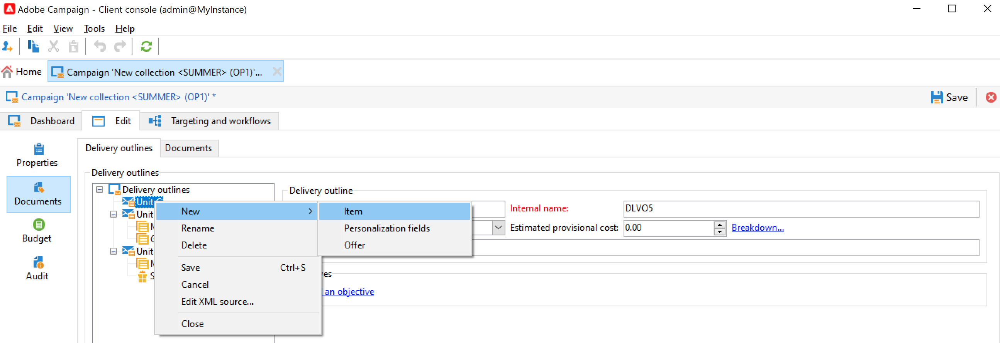
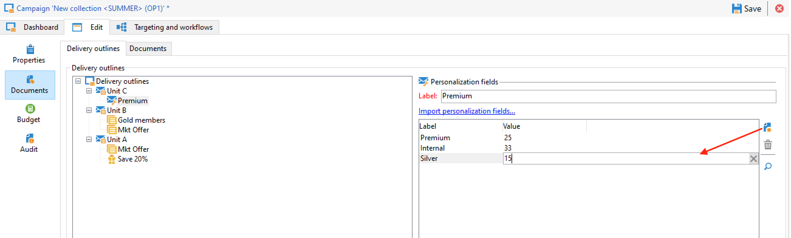

# Administrar recursos y documentos {#manage-assets-documents}

Puede asociar varios documentos a una campaña: informes, fotos, páginas web, diagramas, etc. Estos documentos pueden tener cualquier formato.

En una campaña también se puede hacer referencia a otros elementos, como cupones promocionales, ofertas especiales relacionadas con una marca o tienda específica, etc. Cuando estos elementos se incluyen en una descripción, pueden asociarse con una entrega de correo postal. [Más información](#associating-and-structuring-resources-linked-via-a-delivery-outline).

>[!CAUTION]
>
>Esta capacidad está diseñada para documentos y recursos pequeños.

<!--
>[!NOTE]
>
>If you are using Campaign Marketing Resource Management module, you can also manage a library of marketing resources that are available for several users for collaborative work. [Learn more](../../mrm/using/managing-marketing-resources.md).
-->

## Adición de documentos {#add-documents}

Los documentos se pueden asociar en el nivel de campaña (documentos contextuales) o en el de programa (documentos generales).

Para una campaña, la variable **[!UICONTROL Documents]** contiene:

* Lista de todos los documentos necesarios para el contenido (plantilla, imágenes, etc.) que Adobe Campaign puede descargar localmente con los derechos adecuados,
* Documentos que contienen información para el enrutador, si los hay.

Los documentos están vinculados al programa o a la campaña a través de la pestaña **[!UICONTROL Edit > Documents]**.

También puede agregar un documento a una campaña desde el vínculo dedicado en el panel.

Haga clic en el icono **[!UICONTROL Detail...]** para ver el contenido de un archivo y añadir información:

En el panel, los documentos asociados a la campaña se agrupan en la sección **[!UICONTROL Document(s)]**, como en el siguiente ejemplo:

También pueden editarse y modificarse desde esta vista.

## Uso de las descripciones del envío {#delivery-outlines}

Un esquema de entrega es un conjunto estructurado de elementos (documentos, tiendas, cupones promocionales, etc.) creado por la compañía y para una campaña en particular. Se utiliza en el contexto de los envíos por correo directo.

Estos elementos se agrupan en descripciones de envío y cada descripción de envío concreta se asocia a un envío; se hace referencia en el archivo de extracción enviado al **proveedor de servicios** para que se asocie al envío. Por ejemplo, puede crear una descripción de envío que haga referencia a una unidad y a los folletos de marketing que utiliza.

Para una campaña, las descripciones de envío permiten estructurar los elementos externos que se van a asociar a la entrega según determinados criterios: unidad relacionada, oferta promocional concedida, invitación a un evento local, etc.

>[!CAUTION]
>
>Las descripciones de envío están restringidas a las campañas de correo postal.

### Creación de un esquema de entrega {#create-an-outline}

Para crear una descripción de la entrega, haga clic en el botón **[!UICONTROL Delivery outlines]** en la subpestaña **[!UICONTROL Edit > Documents]** de la campaña correspondiente.

>[!NOTE]
>
>Si no puede ver esta pestaña, esta capacidad no está disponible para esta campaña o la entrega de correo directo no está habilitada en su instancia. Consulte la [configuración de plantilla de campaña](marketing-campaign-templates.md#campaign-templates) o a su contrato de licencia.

Después, haga clic **[!UICONTROL Add a delivery outline]** y cree la jerarquía de descripciones para la campaña:

1. Haga clic con el botón derecho del ratón en la raíz del árbol y seleccione **[!UICONTROL New > Delivery outlines]**.
1. Haga clic con el botón derecho en la descripción que acaba de crear y seleccione **[!UICONTROL New > Item]** o **[!UICONTROL New > Personalization fields]**.

Una descripción puede contener elementos, campos de personalización y ofertas:

* Los elementos pueden ser documentos físicos, por ejemplo, a los que se hace referencia y que se describen aquí y se adjuntan al envío.
* Los campos de personalización permiten crear elementos de personalización relacionados con las entregas en lugar de con los destinatarios. Por lo tanto, es posible crear valores que se utilizarán en entregas para un objetivo específico (oferta de bienvenida, descuento, etc.) Se crean en Adobe Campaign y se importan en el esquema mediante el enlace **[!UICONTROL Import personalization fields...]**.

   

   También pueden crearse directamente en la descripción haciendo clic en el icono **[!UICONTROL Add]** a la derecha del área de la lista.

   

### Selección de una descripción {#select-an-outline}

Para cada envío, puede seleccionar la descripción que desea asociar desde la sección reservada para la descripción de la extracción, como en el siguiente ejemplo:

El esquema seleccionado se muestra en la sección inferior de la ventana. Se puede editar mediante el icono a la derecha del campo o modificar mediante la lista desplegable:

La pestaña **[!UICONTROL Summary]** de la entrega también muestra esta información:

### Resultado de la extracción {#extraction-result}

En el archivo extraído y enviado al proveedor de servicios, el nombre de la descripción y, en este caso, sus características (coste, descripción, etc.) se añaden al contenido de la plantilla de exportación asociada con el proveedor de servicios.

En el siguiente ejemplo, la etiqueta, el coste estimado y la descripción asociada con la entrega se añaden al archivo de extracción.

El modelo de exportación debe estar asociado al proveedor de servicios seleccionado para la entrega. Consulte [esta sección](providers--stocks-and-budgets.md#creating-service-providers-and-their-cost-structures).
