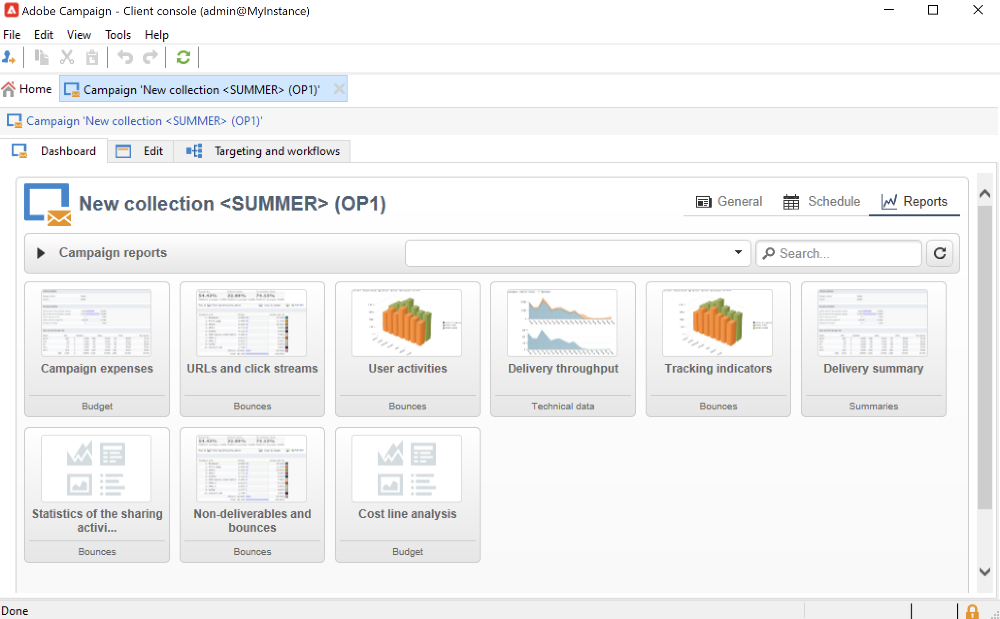

# Creación de programas y campañas{#create-programs-and-campaigns}

Los componentes de orquestación de Campaign se encuentran en **[!UICONTROL Campaigns]** pestaña: aquí puede ver una descripción general de los programas y campañas de marketing, y sus elementos asociados.

Un programa de marketing consta de campañas, que están formadas por envíos, recursos, etc. Toda la información sobre las entregas, los presupuestos, los revisores y los documentos vinculados se agrupa en la campaña.

 [Descubra programas y campañas con este vídeo](#video)

## Trabajar con programas y planes{#work-with-plan-and-program}

### Creación de la jerarquía de planes y programas {#create-plan-and-program}

Cada campaña pertenece a un programa que pertenece a un plan. Todos los planes, programas y campañas están disponibles a través de la **[!UICONTROL Campaign calendar]** en el menú **Campañas** pestaña.

Antes de empezar a crear campañas y envíos, configure la jerarquía de carpetas para planes y programas de marketing.

1. Haga clic en el icono **Explorer** en la página principal.
1. Haga clic con el botón derecho en la carpeta en la que desee crear su plan.
1. Seleccione **Add new folder > Campaign Management > Plan**.

   

1. Cambie el nombre del plan.
1. Haga clic con el botón derecho en el plan recién creado y seleccione **Properties...**
1. En la pestaña **General**, modifique el **Internal name** para evitar duplicados durante las exportaciones de paquetes.

   

1. Haga clic en **Save**.
1. Haga clic con el botón derecho del ratón en el plan recién creado y seleccione **Create a new “Program” folder**.

   

1. Repita los pasos anteriores para cambiar el nombre de la nueva carpeta del programa y su nombre interno.

### Configuración de un programa {#edit-a-program}

Al editar un programa, utilice las pestañas que se describen a continuación para explorarlo y configurarlo.

* El **Programación** La pestaña muestra el calendario de programas de un mes, una semana o un día según la pestaña en la que haga clic en el encabezado del calendario. Puede crear una campaña, un programa o una tarea desde esta página. [Más información](#campaign-calendar)

* La pestaña **Editar** permite personalizar el programa: nombre, fechas de inicio y finalización, presupuesto, documentos vinculados, etc.

  

## Trabajo con campañas{#work-with-campaigns}

### Creación de una campaña {#create-a-campaign}

Puede crear una campaña a través de la lista de campañas. Para mostrar esta vista, seleccione **[!UICONTROL Campaigns]** en el menú **[!UICONTROL Campaigns]** panel y haga clic en **[!UICONTROL Create]**.

El campo **[!UICONTROL Program]** permite seleccionar el programa al que se asocia la campaña. Esta información es obligatoria.

Las campañas también se pueden crear mediante desde el calendario de campañas o programas. [Más información](#campaign-calendar)

En la ventana de creación de campaña, seleccione la plantilla de campaña y añada un nombre y una descripción de la campaña. También puede especificar las fechas de inicio y finalización de la campaña.

Haga clic en **[!UICONTROL OK]** para crear la campaña. Se añade a la programación y a la lista de campañas.

A continuación, puede editar la campaña que acaba de crear y definir sus parámetros. Para abrir y configurar esta campaña, puede:

1. Examine el calendario de campañas y seleccione la campaña que desee visualizar y luego haga clic en **[!UICONTROL Open]** vínculo.
1. Examine la **[!UICONTROL Schedule]** del programa, seleccione la campaña y ábrala.
1. Examine la lista de campañas y haga clic en el nombre de la campaña que desea editar.

Todas estas acciones le llevan al panel de campañas.

Acceda a las siguientes secciones para aprender a configurar la campaña:

* [Agregar envíos](marketing-campaign-deliveries.md)
* [Administración de recursos y documentos](marketing-campaign-assets.md)
* [Creación de la audiencia objetivo](marketing-campaign-target.md)
* [Configuración del proceso de aprobación](marketing-campaign-approval.md)
* [Administración de saldos y presupuestos](providers--stocks-and-budgets.md)

### Editar configuración de campaña {#campaign-settings}

Las campañas se crean mediante plantillas de campaña. Puede configurar plantillas reutilizables para las que algunas opciones están seleccionadas y otras configuraciones ya están guardadas.

Para cada campaña, están disponibles las siguientes capacidades:

* Documentos y recursos de referencia: puede asociar documentos a la campaña (resumen, informe, imágenes, etc.). Se admiten todos los formatos de documento. [Más información](marketing-campaign-deliveries.md#manage-associated-documents).
* Definir costes: para cada campaña, Adobe Campaign permite definir las entradas de coste y las estructuras de cálculo de costes que se pueden utilizar al crear la campaña de marketing. Por ejemplo: costes de impresión, uso de una agencia externa, alquiler de salas, etc. [Más información](providers--stocks-and-budgets.md#defining-cost-categories).
* Definir objetivos: puede definir objetivos cuantificables para una campaña, por ejemplo: número de suscriptores, volumen comercial, etc. Esta información se utiliza posteriormente en los informes de campaña.
* Administrar direcciones semilla y grupos de control. [Más información](marketing-campaign-deliveries.md#defining-a-control-group).
* Manage approvals: puede seleccionar los tratamientos que desea aprobar y, si es necesario, seleccionar los operadores o grupos de operadores revisores. [Más información](marketing-campaign-approval.md#checking-and-approving-deliveries).

>[!NOTE]
>
>Para acceder y actualizar la configuración de la campaña, vaya a **[!UICONTROL Advanced campaign parameters...]** vínculo en el **[!UICONTROL Edit]** pestaña.

### Supervisión de una campaña {#monitor-a-campaign}

Para cada campaña, los trabajos, recursos y envíos están centralizados en un panel. Esta interfaz le permite administrar y organizar acciones de marketing.

Con Adobe Campaign, puede configurar procesos de colaboración para la creación y aprobación de los distintos pasos de las campañas: aprobación del presupuesto, objetivo, contenido, etc. Esta orquestación se detalla en [esta sección](marketing-campaign-approval.md).

>[!NOTE]
>
>Los componentes disponibles en una campaña dependen de su plantilla. La configuración de la plantilla de campaña se presenta en [esta sección](marketing-campaign-templates.md#campaign-templates).

Una vez completada la campaña, utilice el **[!UICONTROL Reports]** para acceder a los informes de campaña.

## Calendario de Campaign {#campaign-calendar}

El calendario de campañas muestra todos los programas, planes, campañas y envíos.

Para editar un plan, programa, campaña o entrega, busque su nombre en el calendario y luego utilice el **[!UICONTROL Open]** vínculo. A continuación se muestra en una nueva pestaña, como se muestra a continuación:

Puede filtrar la información que se muestra en el calendario de campañas. Para ello, haga clic en el vínculo **[!UICONTROL Filter]** y seleccione los criterios de filtrado.

>[!NOTE]
>
>Cuando filtra una fecha, se muestran todas las campañas con una fecha de inicio posterior a la fecha especificada o con una fecha de finalización anterior a la fecha especificada. Las fechas se seleccionan utilizando los calendarios a la derecha de cada campo.

También puede utilizar el campo **[!UICONTROL Search]** para filtrar los elementos mostrados.

Los iconos vinculados a cada elemento permiten ver su estado: terminado, en curso, en edición, etc.

Para filtrar las campañas que desea mostrar, haga clic en el vínculo **[!UICONTROL Filter]** y seleccione el estado de las campañas que desee mostrar.

A medida que navega por el calendario, también puede crear un programa o una campaña.

Cuando crea una campaña a través de la pestaña **[!UICONTROL Schedule]** de un programa, la campaña se relaciona automáticamente con el programa correspondiente. El campo **[!UICONTROL Program]** está oculto en este caso.

## Acceso a Campaign con un explorador web {#use-the-web-interface}

>[!AVAILABILITY]
>
>A partir de la versión 8.6 de Campaign, Campaign está disponible en una interfaz de usuario web. La mayoría de las acciones de marketing se pueden realizar desde esta nueva interfaz. [Más información](../../v8/start/campaign-ui.md#discover-the-user-interface).

Puede acceder a algunas de las pantallas de la consola del cliente de Adobe Campaign a través de un explorador de Internet para ver todas las campañas y envíos, así como informes e información sobre los perfiles de la base de datos. No puede crear componentes a partir de este acceso web, pero, según los derechos de acceso, puede ver los datos de la base de datos o actuar en ellos. Normalmente, puede aprobar el contenido de la campaña y su segmentación, reiniciar o detener una entrega, etc.

1. Inicie sesión a través de https://`<your instance>:<port>/view/home`.
1. Utilice los menús para acceder a las descripciones generales.

   

Además de desplazarse por las campañas y verlas, puede realizar estos tipos de tareas:

* Monitorización de la actividad en una instancia
* Participar en los procesos de validación, por ejemplo, aprobar o rechazar un contenido de entrega
* Realizar otras acciones rápidas como, por ejemplo, pausar un flujo de trabajo
* Acceder a todas las funciones de creación de informes
* Participar en debates en foros

Esta tabla resume las acciones que se pueden realizar en las campañas desde un explorador:

| Página  | Acción |
| --- | --- |
| Lista de campañas, envíos, ofertas, etc. | Eliminar un elemento de lista |
| Campaña | Cancelar una campaña |
| Entrega | Aprobar el contenido de entrega y el destino Enviar el contenido de la entrega Confirmar una entrega Pausar y detener un envío |
| Aplicación web | Crear una aplicación web Editar el contenido y las propiedades de la aplicación Guardar el contenido de la aplicación como una plantilla Publicar la aplicación |
| Oferta | Aprobar el contenido de la oferta y los requisitos Desactivación de una oferta en línea |
| Tarea | Finalizar una tarea Cancelar una tarea |
| Recursos de marketing | Aprobar un recurso Bloqueo y desbloqueo de un recurso |
| Paquete de campañas | Enviar un paquete para su aprobación Aprobar o rechazar un paquete Cancelar un paquete |
| Pedido de la campaña | Creación de un pedido Aceptar o rechazar una solicitud |
| Stock | Eliminar una línea de stock |
| Simulación de oferta | Inicio y parada de una simulación |
| Flujo de trabajo de direccionamiento | Iniciar, pausar y detener un flujo de trabajo |
| Informe | Guardar los datos actuales en el historial de informes |
| Foro | Agregar una conversación Responder a un mensaje en una conversación Siga la conversación y cancele la suscripción |

### Administración de aprobaciones

Las aprobaciones de un destinatario o de un contenido de envío se pueden llevar a cabo mediante el acceso a la web.

También puede utilizar el vínculo incluido en los mensajes de notificación. Para obtener más información, consulte [esta sección](marketing-campaign-approval.md#checking-and-approving-deliveries).

## Tutorial en vídeo {#video}

Este vídeo muestra cómo crear planes, programas y campañas de marketing.

>[!VIDEO](https://video.tv.adobe.com/v/333810?quality=12)
