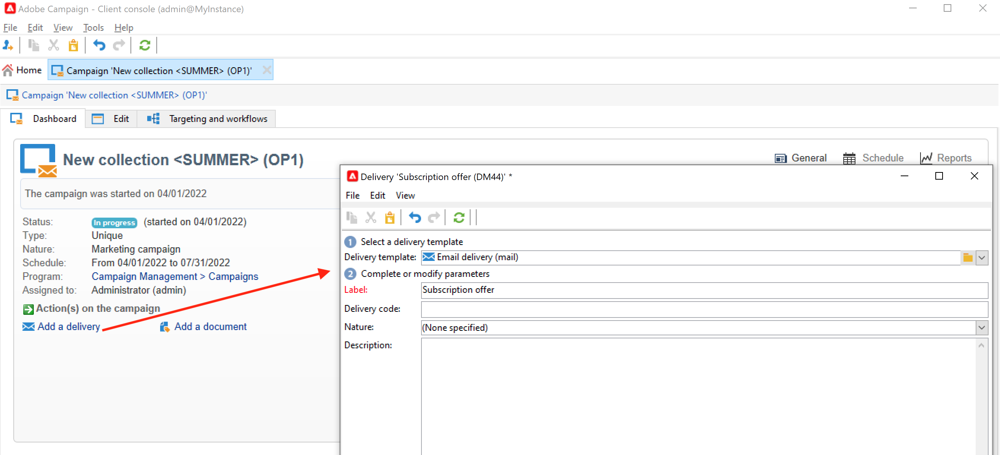

# Entregas de campañas de marketing {#marketing-campaign-deliveries}

Orqueste sus envíos en canales múltiples en sus campañas: optimice sus comunicaciones con Adobe Campaign mediante correos electrónicos personalizados, SMS, notificaciones push y mensajes en la aplicación. Puede utilizar medios enriquecidos como vídeos, emojis o GIF e integrarlos directamente.

Las entregas se pueden crear a través del tablero de la campaña, un flujo de trabajo de la campaña o directamente a través de la descripción general de las entregas. Cuando se crean a partir de una campaña, las entregas se vincularán a esta campaña y se consolidarán en el nivel de la campaña.

## Creación de entregas {#create-deliveries}

Tiene dos formas de añadir envíos a sus campañas de marketing:

* Desde el **[!UICONTROL Add a delivery]** en el panel de campañas.

Una vez guardada, la entrega se agrega al panel de campañas.

* Desde un flujo de trabajo de campaña, en la variable **[!UICONTROL Targeting and workflows]** pestaña, añadiendo la entrega.

  

  Una vez iniciado el flujo de trabajo, la entrega se agrega al panel de campañas.

Obtenga información sobre cómo configurar y ejecutar el flujo de aprobación de envíos [en esta página](marketing-campaign-approval.md).

## Inicio de una entrega {#start-a-delivery}

Se puede realizar una entrega una vez que se hayan concedido todas las aprobaciones. El proceso de ejecución de la entrega depende del canal.

* Para las entregas por correo electrónico o por canal móvil, consulte [esta sección](#start-an-online-delivery)

* Para las entregas de correo directo, consulte [esta sección](#start-an-offline-delivery)

### Iniciar un envío de correo electrónico o móvil {#start-an-online-delivery}

Una vez concedidas todas las solicitudes de aprobación, el estado de entrega cambia a **[!UICONTROL Pending confirmation]** y se puede iniciar. Los revisores que pueden iniciar la entrega reciben una notificación avisando de que una entrega está listo para iniciarse.

La información también aparece en el panel de campañas. El enlace **[!UICONTROL Confirm delivery]** le permite iniciar la entrega.

La confirmación de la entrega está restringida a administradores y al operador o grupo de operadores mencionados explícitamente en la entrega o en las propiedades de la campaña. Si no se diseña ningún operador, los administradores y el propietario de la campaña pueden aprobarla.

Sin embargo, también puede permitir que el propietario de la campaña confirme el envío, incluso si se han definido revisores específicos en las propiedades de entrega o de campaña. Para ello, como administrador, cree la variable **NmsCampaign_Activate_OwnerConfirmation** y configúrelo en. **1**. Las opciones se administran desde el **[!UICONTROL Administration]** > **[!UICONTROL Platform]** > **[!UICONTROL Options]** del explorador de Campaign.

### Inicio de una entrega de correo directo {#start-an-offline-delivery}

Una vez concedidas todas las aprobaciones, el estado de entrega cambia a **[!UICONTROL Pending extraction]**. Los archivos de extracción se crean mediante un [flujo de trabajo técnico](../workflow/technical-workflows.md) que, en una configuración predeterminada, se inicia automáticamente cuando una entrega de correo directo está pendiente de extracción. Cuando un proceso está en curso, se muestra en el panel y se puede editar a través de su enlace.

Una vez ejecutado correctamente el flujo de trabajo de extracción, debe aprobar el archivo de extracción (siempre que se haya seleccionado la aprobación del archivo de extracción en la configuración de envío). [Más información](marketing-campaign-approval.md#approving-an-extraction-file).

Siga los pasos a continuación para validar el contenido y enviar el archivo al proveedor:

1. Una vez aprobado el archivo de extracción, puede generar la prueba del correo electrónico de notificación del enrutador. Este mensaje de correo electrónico se crea en función de una plantilla de envíos. Debe ser aprobado.

   Este paso solo está disponible si **[!UICONTROL Enable the sending and validation of proofs (Direct mail)]** se activó en **[!UICONTROL Approvals]** de los parámetros de campaña avanzados.

   

1. Haga clic en el botón **[!UICONTROL Send a proof]** para crear las pruebas.

   El objetivo de la prueba debe haberse definido previamente.

   Puede crear tantas pruebas como sea necesario. Se accede a ellas a través del enlace **[!UICONTROL Direct mail...]** en los detalles del envío.

1. El estado de entrega cambia a **[!UICONTROL To submit]**. Haga clic en el botón **[!UICONTROL Submit proofs]** para ejecutar el proceso de aprobación.

1. El estado de entrega cambia a **[!UICONTROL Proof to validate]** y un botón permite aceptar o rechazar la aprobación.

   Puede aceptar o rechazar esta aprobación o volver al paso de extracción.

1. Una vez aprobada la prueba, el archivo de extracción se envía al enrutador y finaliza la entrega.

### Cálculo de presupuesto y costes {#compute-costs-and-stocks}

La extracción de archivos inicia dos procesos: cálculo de presupuesto y cálculo de existencias. Las entradas del presupuesto se actualizan.

* La pestaña **[!UICONTROL Budget]** le permite administrar los presupuestos de la campaña. El total de las entradas de costes se muestra en el campo **[!UICONTROL Calculated cost]** de la pestaña principal de la campaña y del programa al que pertenece. Las cantidades también se reflejan en el presupuesto de la campaña.

  

  El coste real se calcula a partir de la información proporcionada por el enrutador. Solo se facturan los mensajes que se han enviado realmente.

* Las existencias se definen en la variable **[!UICONTROL Administration > Campaign management > Stocks]** nodo del árbol.

  

  Estructuras de coste en **[!UICONTROL Administration > Campaign management > Service providers]** nodo.

  

  Las líneas de existencias se pueden ver en la sección existencias. Para definir las existencias iniciales, abra una línea de existencias. Las existencias se reducen cada vez que se produce una entrega. Puede definir un nivel de alerta y notificaciones.

  >[!NOTE]
  >
  >Más información sobre los presupuestos [en esta sección](providers--stocks-and-budgets.md).
