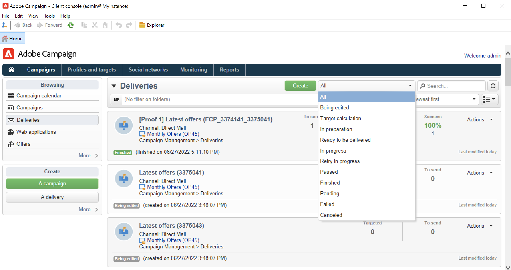

# Monitorización de campañas de marketing {#monitor-marketing-campaigns}

## Seguimiento de una campaña {#tracking-a-campaign}

En cada campaña, la pestaña **[!UICONTROL Tracking]** permite ver todos los trabajos y sus estados.

Desde esta pestaña puede acceder a la siguiente información:

* La variable **[!UICONTROL Audit]** la subpestaña muestra el diario de la actividad. Contiene los trabajos ejecutados en la campaña: creación o inicio de flujo de trabajo, aprobación, extracción, gestión de existencias, etc.

   

* La variable **[!UICONTROL Deliveries]** subpestaña contiene todas las entregas de la campaña. Se pueden editar desde esta vista. Para ello, seleccione la entrega y haga clic en el icono **[!UICONTROL Detail]**.

   

* La variable **[!UICONTROL Approvals]** subpestaña contiene todo el proceso de aprobación de la campaña. Puede comprobar los detalles y comentarios

* Los flujos de trabajo creados para generar mensajes para proveedores de servicios se muestran en la subpestaña **[!UICONTROL Jobs on service providers]**. Haga clic en el icono **[!UICONTROL Detail]** para mostrar el flujo de trabajo seleccionado.

## Seguimiento de envíos {#delivery-tracking}

La lista de envíos está disponible a través del vínculo **[!UICONTROL Deliveries]** del nodo Campaign.

Para cada envío, esta lista le permite acceder a los indicadores clave: estado, número de destinatarios dirigidos, campañas vinculadas, etc.

Para comprobar el estado de una entrega, edite y vea su panel y pestañas.

<!--
>[!NOTE]
>
>Information concerning delivery details is available in [this section](../../delivery/using/about-message-tracking.md) section.
-->

## Seguimiento de la ejecución {#execution-tracking}

Puede comprobar el estado de las entregas haciendo clic en el botón **[!UICONTROL Deliveries]**, a la que se puede acceder desde la página de inicio de Adobe Campaign.

Los detalles sobre los procesos ejecutados en una campaña se recopilan en la **[!UICONTROL Edit > Audit]** de la campaña. Puede ver la lista de envíos en la campaña. [Más información](#tracking-a-campaign).
