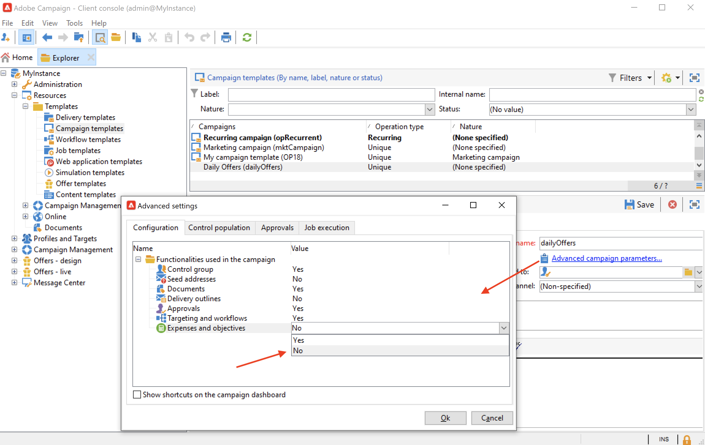

# Creación y configuración de plantillas de campaña {#campaign-templates}

Todas las campañas de marketing se basan en una plantilla que almacena las características y capacidades principales. Campaign viene con una plantilla integrada para crear campañas. Esta plantilla tiene todas las funcionalidades activadas: Documentos, direcciones semilla, aprobaciones, descripciones de envío, etc.

Las funcionalidades disponibles dependen de los permisos, complementos y la configuración de la plataforma de Adobe Campaign.

>[!NOTE]
>
>El árbol se muestra al hacer clic en el icono **[!UICONTROL Explorer]** de la página de inicio.

Se proporciona una plantilla para crear una campaña sin ninguna configuración específica definida. Puede crear y configurar las plantillas de campañas y luego crear campañas a partir de estas plantillas.

## Creación de una plantilla de campaña {#create-a-campaign-template}

Para crear una plantilla de campaña, siga estos pasos:

1. Abrir campaña **Explorer** y busque **Recursos > Plantillas > Plantillas de campaña**.
1. Haga clic en **Nuevo** en la barra de herramientas situada encima de la lista de plantillas.

También puede **duplicado** la plantilla integrada para reutilizar y adaptar su configuración. Para ello, haga clic con el botón derecho en la plantilla y seleccione **Duplicar**.

1. Introduzca la etiqueta de la nueva plantilla de campaña.
1. Haga clic en **Save** y vuelva a abrir la plantilla.
1. En el **Editar** , defina las propiedades de la plantilla.
1. Select **Parámetros de campaña avanzados...** vínculo para añadir un flujo de trabajo a la plantilla de campaña.

   

1. Cambie el **Establecimiento de objetivos y flujos de trabajo** valor **Sí** y confirme. Aprenda a añadir funcionalidades en [esta sección](#typology-of-enabled-modules).
1. La variable **Establecimiento de objetivos y flujos de trabajo** se añade a la plantilla. Haga clic en **Agregar un flujo de trabajo...**, introduzca un **Etiqueta** y haga clic en **Ok**.
1. Cree el flujo de trabajo según sus necesidades.

   

1. Haga clic en **Save**. La plantilla ya está lista para utilizarse para crear una nueva campaña.

Las distintas pestañas y subpestañas de la plantilla de campaña permiten acceder a su configuración, tal y como se describe en [Configuración general](#general-configuration).

## Selección de módulos {#select-modules}

El vínculo **[!UICONTROL Advanced campaign parameters...]** permite habilitar y deshabilitar los trabajos de las campañas en función de esta plantilla. Seleccione las funciones que desee habilitar en las campañas creadas en función de esta plantilla.

Si no se selecciona una funcionalidad, los elementos correspondientes al proceso (menús, iconos, opciones, pestañas, subpestañas, etc.) no aparecen en la interfaz de la plantilla ni en las campañas basadas en esta plantilla. Las pestañas a la izquierda de los detalles de la campaña y las pestañas disponibles coinciden con las funcionalidades seleccionadas en la plantilla. Por ejemplo, la variable **Gastos y objetivos** no está habilitada, la funcionalidad correspondiente **[!UICONTROL Budget]** no se muestran en las campañas basadas en esta plantilla.

Además, los accesos directos a las ventanas de configuración se añaden al panel de campañas. Cuando una funcionalidad está habilitada, un vínculo directo le permite acceder a ella desde el panel de campañas.

### Ejemplos de configuración

* Por ejemplo, con la siguiente configuración:

   

   El panel de campañas muestra:

   

   Tenga en cuenta que **[!UICONTROL Targeting and workflows]** falta la pestaña .

   Las siguientes funcionalidades están disponibles:

   

   Tenga en cuenta que **[!UICONTROL Budget]** falta la pestaña .

   La configuración avanzada de la campaña también refleja esta configuración.

   

   Tenga en cuenta que **[!UICONTROL Approvals]** no está disponible.

* Con esta configuración:
   

   El panel de campañas muestra:

   

   Tenga en cuenta que **[!UICONTROL Targeting and workflows]** está disponible pero la pestaña **Agregar un documento** falta el vínculo .

   Las siguientes funcionalidades están disponibles:

   

   Tenga en cuenta que **[!UICONTROL Budget]** está disponible.

   La configuración avanzada de la campaña también refleja esta configuración.

   

   Tenga en cuenta que **[!UICONTROL Approvals]** está disponible pero la pestaña **[!UICONTROL Control population]** y **[!UICONTROL Seed addresses]** no están activadas.

## Tipología de módulos {#typology-of-enabled-modules}

* **Grupo de control**

   Cuando se selecciona este módulo, se añade una pestaña adicional a la configuración avanzada de la plantilla y a las campañas basadas en esta plantilla. La configuración se puede definir mediante la plantilla o bien por separado para cada campaña. Obtenga más información sobre los grupos de control en [esta sección](marketing-campaign-deliveries.md#defining-a-control-group).

   

* **Direcciones semilla**

   Cuando se selecciona este módulo, se añade una pestaña adicional a la configuración avanzada de la plantilla y a las campañas basadas en esta plantilla. La configuración se puede definir mediante la plantilla o por separado para cada campaña.

   

* **Documentos**

   Cuando se selecciona este módulo, se añade una pestaña adicional a la pestaña **[!UICONTROL Edit]** de la plantilla y a las campañas basadas en esta plantilla. Los documentos adjuntos se pueden agregar desde la plantilla o bien por separado para cada campaña. Obtenga más información sobre los documentos en [esta sección](marketing-campaign-deliveries.md#manage-associated-documents).

   

* **Descripción de la entrega**

   Cuando se selecciona este módulo, se añade una subpestaña **[!UICONTROL Delivery outlines]** a la pestaña **[!UICONTROL Documents]** para definir los esquemas de entrega de la campaña. Obtenga más información sobre los esquemas de entrega en [esta sección](marketing-campaign-assets.md#delivery-outlines).

   

* **Establecimiento de objetivos y flujos de trabajo**

   Al seleccionar el módulo de **[!UICONTROL Targeting and workflows]**, se añade una pestaña para permitirle crear uno o más flujos de trabajo para las campañas basadas en esta plantilla. Los flujos de trabajo también se pueden configurar por separado para cada campaña basada en esta plantilla. Obtenga más información sobre los flujos de trabajo de campañas en [esta sección](marketing-campaign-deliveries.md#build-the-main-target-in-a-workflow).

   

   Cuando este módulo está habilitado, una **[!UICONTROL Jobs]** se añade a la configuración avanzada de la campaña para definir la secuencia de ejecución del proceso.

* **Aprobaciones**

   Si activa la variable **[!UICONTROL Approvals]**, puede seleccionar los procesos de aprobación y los operadores asignados al proceso de aprobación. Obtenga más información sobre aprobaciones en [esta sección](marketing-campaign-approval.md#select-reviewers).

   

   Puede elegir si desea habilitar o no la aprobación del proceso mediante la variable **[!UICONTROL Approvals]** de la sección configuración avanzada de plantillas.

* **Gastos y objetivos**

   Cuando se selecciona este módulo, se añade una pestaña **[!UICONTROL Budget]** a los detalles de la plantilla y las campañas basadas en esta plantilla, de modo que se pueda seleccionar el presupuesto asociado.

   

## Propiedades de plantilla {#template-properties}

Cuando crea una plantilla de campaña, debe introducir la siguiente información:

* Introduzca la variable **label** de la plantilla: la etiqueta es obligatoria y es la etiqueta predeterminada para todas las campañas basadas en esta plantilla.
* Seleccione la **naturaleza** de la campaña en la lista desplegable. Los valores disponibles en esta lista son los guardados en la enumeración **[!UICONTROL natureOp]**.
   <!--
  >[!NOTE]
  >
  >For more information on enumerations, refer to the [Getting Started](../../platform/using/managing-enumerations.md) section.-->

* Seleccione el **tipo de campaña**: única, recurrente o periódica. De manera predeterminada, las plantillas de campaña se aplican a las campañas únicas. Las campañas recurrentes y periódicas se detallan en [esta sección](recurring-periodic-campaigns.md).
* Especifique la duración de la campaña, es decir, el número de días durante los que se desarrolla la campaña. Al crear una campaña basada en esta plantilla, las fechas de inicio y finalización de la campaña se rellenan automáticamente.

   Si la campaña es recurrente, debe especificar las fechas de inicio y finalización de la campaña directamente en la plantilla.

* Especifique la variable **programa relacionado** de la plantilla: las campañas basadas en esta plantilla están vinculadas al programa seleccionado.

<!--
## Track campaign execution{#campaign-reverse-scheduling}

You can create a schedule for a campaign and track accomplishments, for instance to prepare an event schedule for a specific date. Campaign templates now let you calculate the start date of a task based on the end date of a campaign.

In the task configuration box, go to the **[!UICONTROL Implementation schedule]** area and check the **[!UICONTROL The start date is calculated based on the campaign end date]** box. (Here, "start date" is the task start date). Go to the **[!UICONTROL Start]** field and enter an interval: the task will start this long before the campaign end date. If you enter a period which is longer than the campaign is set to last, the task will begin before the campaign.

When you create a campaign using this template, the task start date will be calculated automatically. However, you can always change it later.-->
