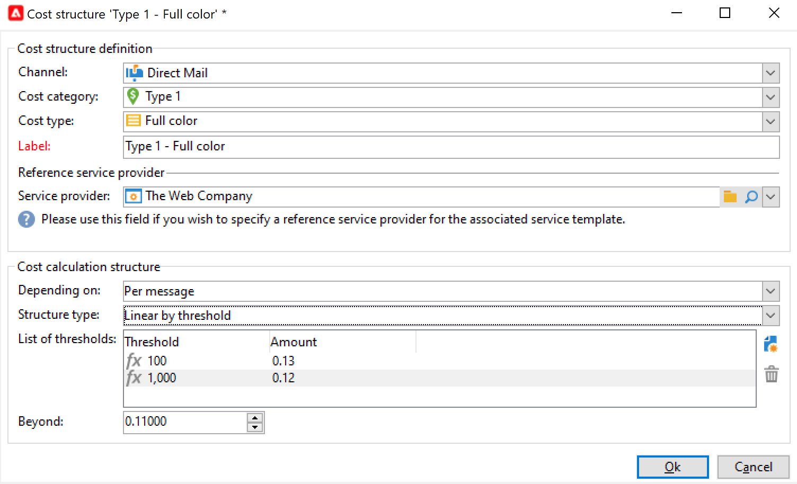
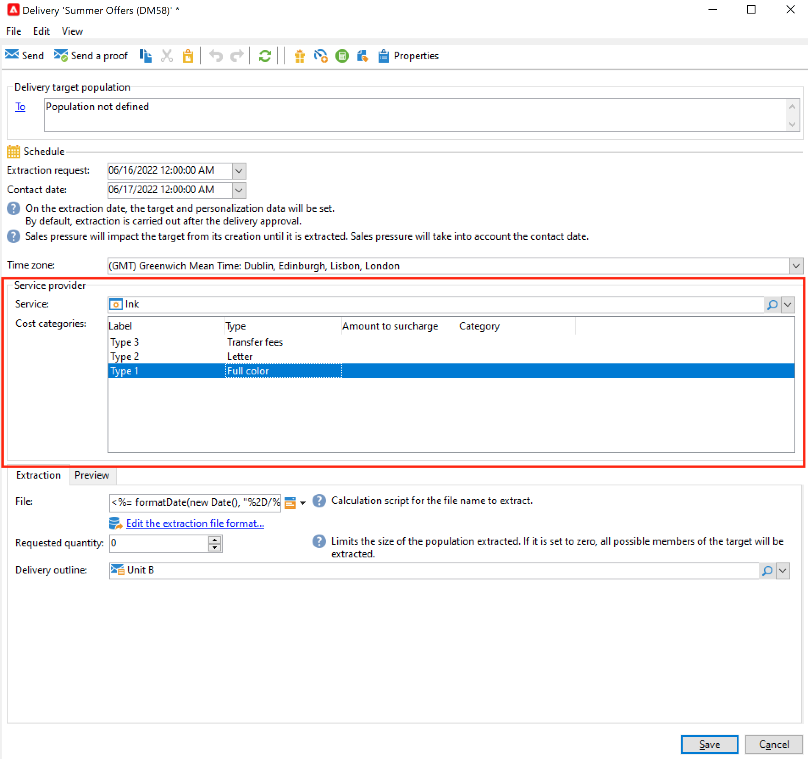
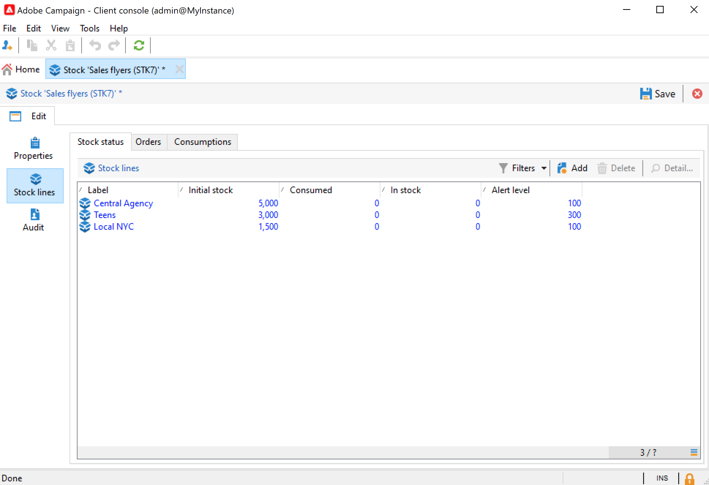

# Proveedores, stock y presupuestos{#providers-stocks-and-budgets}

Adobe Campaign permite definir proveedores de servicios que participan en los trabajos realizados dentro de las campañas. La información sobre los proveedores de servicios y las estructuras de coste relacionadas la define el administrador de Adobe Campaign desde la vista principal. Se hace referencia al proveedor de servicios desde la entrega, y las estructuras de coste permiten el cálculo de los costes asociados con esta entrega, así como la gestión de stock correspondiente.

## Creación de proveedores de servicios y sus estructuras de costes {#create-service-providers-and-their-cost-structures}

Cada proveedor de servicios se guarda en un archivo con detalles de contacto, plantillas de servicio y trabajos relacionados.

Los proveedores de servicios se configuran en **[!UICONTROL Administration > Campaign management]** del explorador de Campaign.

Los trabajos realizados durante las entregas se realizan mediante proveedores de servicios, especialmente en el caso del correo directo y los canales móviles. Estos proveedores de servicios pueden, por ejemplo, participar en la impresión o distribución de mensajes. Estos trabajos implican configuraciones y costes específicos de cada proveedor de servicios. La configuración de proveedores de servicios consta de cuatro etapas:

1. Creación de un proveedor de servicios en Adobe Campaign. [Más información](#add-a-service-provider)

1. Definición de categorías de costes y estructuras de plantillas de servicio asociadas. [Más información](#define-cost-categories)

1. Configuración de procesos. [Más información](#configure-processes-associated-with-a-service).

1. Referencia al proveedor de servicios al nivel de campaña. [Más información](#associate-a-service-with-a-campaign).

### Creación de un proveedor de servicios y sus categorías de costes {#create-a-service-provider-and-its-cost-categories}

#### Adición de un proveedor de servicios {#add-a-service-provider}

Puede crear tantos proveedores de servicios como sea necesario para las entregas. El procedimiento para añadir un proveedor de servicios es el siguiente:

1. Haga clic en **[!UICONTROL New]** botón situado sobre la lista de proveedores de servicios.
1. En la sección inferior de la ventana, especifique el nombre y los detalles de contacto del proveedor de servicios.

   

1. Haga clic en el botón **[!UICONTROL Save]** para añadir al proveedor de servicios a la lista.

#### Definición de categorías de coste {#define-cost-categories}

Ahora puede asociar plantillas de servicio con cada proveedor de servicios. En estas plantillas, primero debe identificar las categorías de coste y, si es necesario, el stock. A continuación, puede crear las reglas de cálculo de costes para cada categoría a través de las estructuras de coste. [Más información](#define-the-cost-structure).

Una categoría de coste es una entidad que contiene un conjunto de costes apto para un tipo de entrega (correo electrónico, correo postal, SMS, etc.). Las categorías de coste se agrupan en las plantillas de servicios asociadas a los proveedores de servicios. Cada proveedor de servicios puede hacer referencia a una o más plantillas de servicio.

Para crear una plantilla de servicio y definir su contenido, siga los pasos a continuación:

1. En el **[!UICONTROL Services]** del proveedor de servicios, haga clic en **[!UICONTROL Add]** y escriba el nombre de la plantilla de servicio.

   

1. Cree las categorías de coste para cada tipo de proceso (entrega por correo directo, por correo electrónico, etc. o tarea). Para ello, haga clic en la pestaña **[!UICONTROL Cost categories]** y luego en el botón **[!UICONTROL Add]** e introduzca los parámetros de cada categoría de coste.

   

   * Introduzca una etiqueta para esta categoría de coste y seleccione el tipo de proceso correspondiente: **[!UICONTROL Direct mail]**, **[!UICONTROL Email]**, **[!UICONTROL Mobile]**, etc.
   * Haga clic en el botón **[!UICONTROL Add]** para definir los tipos de coste asociados a esta categoría.
   * Si es necesario, asocie una línea de stock con cada tipo de coste para que las cantidades utilizadas se relacionen automáticamente con el stock disponible.

     >[!NOTE]
     >
     >Las líneas de stock se definen en el nodo **[!UICONTROL Stock management]**. [Más información](#stock-and-order-management).

1. Puede preseleccionar un valor para esta categoría de coste, que es la predeterminada en las categorías de coste del proveedor de servicios (en lugar de una vacía). Para ello, habilite la variable **Sí** en la opción **[!UICONTROL Selected]** para el tipo de categoría:

   

   Al nivel de entrega, el valor se selecciona de forma predeterminada.

### Definición de la estructura de coste {#define-the-cost-structure}

Para cada tipo de coste, la estructura de coste especifica las reglas de cálculo que se deben aplicar.

Haga clic en la pestaña **[!UICONTROL Cost structure]** para configurar el cálculo de coste de cada categoría y tipo de coste. Haga clic en **[!UICONTROL Add]** y escriba la estructura de coste.

* Para crear la estructura de coste, seleccione el tipo de mensaje y la categoría de coste que le interesen en las listas desplegables, así como el tipo de coste que se aplica a la regla de cálculo. El contenido de estas listas desplegables proviene de la información introducida a través de la pestaña **[!UICONTROL Cost categories]**.

  Debe asignar una etiqueta a la estructura de coste. De forma predeterminada, tiene el siguiente esquema de entrega: **Cost category, Type of cost**.

  Sin embargo, puede cambiarle el nombre: introduzca el valor deseado directamente en el campo **[!UICONTROL Label]**.

* La fórmula de cálculo de coste se define en la sección inferior de la ventana.

  Esta fórmula puede ser fija (para cualquier número de mensajes) o calculada según el número de mensajes.

  Cuando depende del número de mensajes, la estructura de cálculo de costes puede ser **[!UICONTROL Linear]**, **[!UICONTROL Linear by threshold]** o **[!UICONTROL Constant by threshold]**.

#### Estructura lineal {#linear-structure}

Si la cantidad siempre es la misma para un mensaje (o un lote de mensajes) independientemente del número total de mensajes, seleccione **[!UICONTROL Linear]** e introduzca el coste de cada mensaje.

Si esta cantidad se aplica a un lote de mensajes, especifique el número de mensajes que le interesen en el campo **[!UICONTROL for]**.

#### Estructura lineal por umbral {#linear-structure-by-threshold}

Si la cantidad se aplica por umbral para cada mensaje, debe definir una estructura de cálculo **[!UICONTROL Linear by threshold]**. En este tipo de estructura de costes, cada mensaje cuesta 0,13, por ejemplo, si el número total de mensajes está entre 1 y 100, y 0,12 si envía entre 100 y 1000 mensajes, o 0,11 más allá de los 1000 mensajes.

La configuración es la siguiente:

Para añadir un umbral, haga clic en el botón **[!UICONTROL Add]** situado a la derecha de la lista.

#### Estructura constante por umbral {#constant-structure-by-threshold}

Finalmente, puede configurar un cálculo de coste en función del número total de mensajes. Para ello, seleccione una estructura de cálculo **[!UICONTROL Constant by threshold]**. Por ejemplo, el coste se establece en una cantidad fija de 12,00 para una entrega de entre 1 y 100 mensajes, y de 100,00 para una entrega de entre 101 y 1000 mensajes, y de 500,00 para cualquier entrega de más de 1000 mensajes, sea cual sea el número total.

### Configuración de trabajos asociados a un servicio {#configure-processes-associated-with-a-service}

Puede asociar información sobre los procesos asociados con el proveedor de servicios a través del **[!UICONTROL Jobs]** pestaña. Esta sección permite configurar la entrega de información al enrutador.

* La sección **[!UICONTROL File extraction]** indica la plantilla de exportación utilizada para la entrega cuando se selecciona este servicio. Puede indicar el nombre del archivo de salida en el campo **[!UICONTROL Extraction file]**. El botón situado a la derecha del campo le permite insertar variables.

* La sección **[!UICONTROL Notification email]** permite especificar la plantilla para enviar una notificación a los proveedores de servicios después de enviar los archivos. Seleccione la plantilla utilizada para crear el mensaje de alerta y el grupo de destinatarios.

  De forma predeterminada, las plantillas de entrega de los mensajes de notificación se guardan en la variable **[!UICONTROL Administration > Campaign management > Technical delivery templates]** , a la que se puede acceder desde la vista general.

* La sección **[!UICONTROL Post-processing]** permite seleccionar el flujo de trabajo que se inicia después de aprobar la entrega. Si se introduce una plantilla de flujo de trabajo, se crea automáticamente una instancia de flujo de trabajo y, a continuación, se inicia en cuanto surta efecto la aprobación. Este flujo de trabajo puede enviar el archivo de extracción a un proveedor de servicios externos para su procesamiento, por ejemplo.

### Asociación de un servicio a una campaña {#associate-a-service-with-a-campaign}

Los proveedores de servicios están asociados a envíos de campañas. Se hace referencia a ellos en las plantillas de envío para ofrecer sus servicios en las entregas creados mediante esta plantilla.

Cuando se selecciona un servicio, las categorías de coste correspondientes al tipo de entrega (correo electrónico, correo directo, etc.) se indican automáticamente en la tabla central junto con las opciones de procesamiento definidas.

>[!NOTE]
>
>Si no se muestra ninguna categoría de coste cuando se selecciona un servicio, significa que no se definió ninguna categoría de costes para ese tipo de proceso. Por ejemplo, para una entrega por correo electrónico, si no se ha definido ninguna categoría de coste de tipo **[!UICONTROL Email]**, no se muestra ninguna categoría y seleccionar el servicio no causa ningún efecto.

* Para una entrega por correo directo, se puede seleccionar el servicio en la ventana de configuración.

  

* Para el envío mediante canales móviles o por teléfono, se aplica el mismo modo de selección.
* Para una entrega por correo electrónico, el servicio se selecciona en la pestaña **[!UICONTROL Advanced]** de las propiedades de entrega, como en el siguiente ejemplo:

  

La columna **[!UICONTROL Amount to surcharge]** permite añadir un coste para esta categoría en el contexto de la entrega o de la tarea correspondiente.

Puede definir una selección obligatoria de un tipo de coste durante la definición de categorías de coste para una entrega. Para ello, seleccione **[!UICONTROL A cost type must be selected]**.

## Gestión de stock y pedidos {#stock-and-order-management}

Los tipos de coste se pueden asociar a las líneas de stock para administrar las alertas, realizar un seguimiento de los suministros e iniciar pedidos.

El procedimiento para configurar la gestión de stock y de pedidos en Adobe Campaign y avisar a los operadores en caso de suministros insuficientes para que se realice una entrega es el siguiente:

1. Creación de stock y referencia a los proveedores de servicios asociados. [Más información](#create-a-stock).

1. Adición de líneas de stock. [Más información](#add-stock-lines).

1. Notificación de los operadores en caso de una alerta. [Más información](#alert-operators).

1. Pedidos y suministro. [Más información](#orders).

### Gestión de stock {#stock-management}

Adobe Campaign puede alertar a un grupo de operadores si el stock se ha agotado o alcanzado un umbral mínimo. Es posible acceder a los niveles de stock desde el vínculo **[!UICONTROL Stocks]** de la pestaña **[!UICONTROL Campaigns]** a través del vínculo **[!UICONTROL Other choices]** del área de navegación.

#### Creación de stock {#creating-a-stock}

Siga los siguientes pasos para crear un nuevo stock:

1. Haga clic en el botón **[!UICONTROL Create]** situado encima de la lista de stock.
1. Introduzca la etiqueta del inventario de stock y seleccione el proveedor de servicios con el que está asociado en la lista desplegable. [Más información](#create-service-providers-and-their-cost-structures).

#### Añadir líneas de stock {#add-stock-lines}

Un inventario consta de varias líneas de stock. Una línea de stock contiene una cantidad inicial de recursos destinados a las entregas. Cada línea de stock indica la cantidad consumida, la cantidad en inventario y la cantidad pedida.

Cuando cree una existencia, haga clic en la pestaña **[!UICONTROL Stock lines]** para añadir nuevas líneas.

Una vez creado el inventario, utilice su panel para crear y supervisar líneas de stock.

Haga clic en **[!UICONTROL Create]** para añadir nuevas líneas de stock.

* Indique la cantidad inicialmente disponible en el campo **[!UICONTROL Initial stock]**. Los campos **[!UICONTROL Consumed]** e **[!UICONTROL In stock]** se calculan automáticamente y se actualizan mientras las campañas progresan.

  

* Indique el umbral desde el cual se debe avisar a los operadores para que soliciten la existencia en el campo **[!UICONTROL Alert level]**. Cuando se alcanza el nivel de alerta, aparece un mensaje de advertencia en la ventana de aprobación de entregas con este stock.

#### Asociar un inventario con las categorías de coste {#associate-a-stock-with-cost-categories}

Para un proveedor de servicios determinado, en un servicio, se puede hacer referencia a una línea de stock mediante una de las categorías de coste de la manera siguiente:

### Seguimiento de stock {#stock-tracking}

#### Operadores de alerta {#alert-operators}

La alerta aparece cuando el stock a las que se hace referencia en una entrega no son suficientes. Por ejemplo, se mostrará la siguiente alerta cuando se apruebe un archivo de extracción:

#### Pedidos {#orders}

La subpestaña **[!UICONTROL Orders]** permite ver las solicitudes actuales y guardar las nuevas.

Para guardar una solicitud, edite la línea de stock de destino, haga clic en el botón **[!UICONTROL Add]** y especifique la fecha de entrega y la cantidad solicitada.

>[!NOTE]
>
>Una vez que llega la fecha de entrega, la línea de stock solicitada desaparece automáticamente y la cantidad introducida en el campo **[!UICONTROL Volume on order]** se añade a la pestaña **[!UICONTROL Tracking]**. Esta cantidad se añade automáticamente al volumen de stock.

La pestaña **[!UICONTROL Consumptions]** contiene el volumen consumido por campaña. La información de esta pestaña se introduce automáticamente según las entregas realizadas. Haga clic en el botón **[!UICONTROL Edit]** para abrir la campaña correspondiente.

## Cálculo de presupuestos {#calculate-budgets}

### Principio {#principle}

Los costes se administran para las entregas y la campaña. Según el progreso, estos costes se asignan a los presupuestos.

Los costes de entrega de una campaña se consolidan al nivel de campaña y los costes de todas las campañas de un programa se pasan al programa con el que están asociados. Los informes dedicados permiten rastrear los presupuestos de toda la plataforma o para cada plan y cada programa.

### Implementación {#implementation}

En una campaña, cuando seleccione el presupuesto, debe introducir la cantidad inicial. Los costes calculados se actualizan de forma automática según el nivel de compromiso de las cantidades introducidas (gastos realizados, previstos, reservados, comprometidos).

<!--
See [Calculating amounts](../../mrm/using/controlling-costs.md#calculating-amounts).

>[!NOTE]
>
>The procedure for creating budgets is presented in [Creating a budget](../../mrm/using/controlling-costs.md#creating-a-budget).
-->
