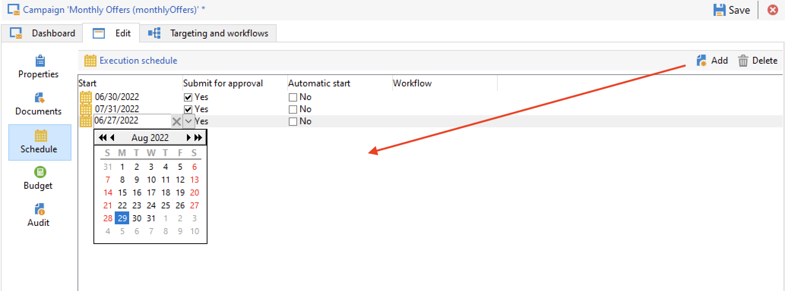

# Campañas recurrentes y periódicas {#recurring-and-periodic-campaigns}

A **campaña recurrente** es una campaña basada en una plantilla específica, cuyos flujos de trabajo están configurados para ejecutarse según una programación asociada. El objetivo se duplica en cada ejecución y se rastrean los distintos procesos y la ubicación de destino.  Una vez configurada, las campañas recurrentes crean automáticamente un nuevo flujo de trabajo (duplicando la plantilla de flujo de trabajo) y lo ejecutan. Por ejemplo, si necesita enviar un recordatorio mensual a un segmento de audiencia, configure una campaña recurrente para que, al principio de cada año, cree 12 flujos de trabajo, uno para cada mes. [Más información](#create-a-recurring-campaign)

A **campaña periódica** es una campaña basada en una plantilla específica que permite crear instancias de campaña basadas en una programación de ejecución. Las instancias de campaña se crean automáticamente en función de una plantilla de campaña periódica, dependiendo de la frecuencia definida en la programación de plantillas. [Más información](#create-a-periodic-campaign)

## Creación de una campaña recurrente {#create-a-recurring-campaign}

Las campañas recurrentes se crean a partir de una plantilla específica que define la plantilla de flujo de trabajo que se va a ejecutar y la programación de ejecución.

### Creación de una plantilla para campañas recurrentes {#create-the-campaign-template}

Para crear una plantilla para campañas recurrentes, siga los pasos a continuación:

1. Abra el explorador de Campaign y vaya a **[!UICONTROL Resources > Templates > Campaign templates]**.
1. Duplique el complemento integrado **[!UICONTROL Recurring campaign]** plantilla.
   
1. Introduzca el nombre de la plantilla y la duración de la campaña.
1. Para este tipo de campaña, se añade una pestaña **[!UICONTROL Schedule]** para crear la programación de ejecución de la plantilla. Utilice esta pestaña para definir las fechas de ejecución de las campañas basadas en esta plantilla.
   

   El modo de configuración de la programación de ejecución coincide con el objeto **[!UICONTROL Scheduler]** del flujo de trabajo. [Más información](../workflow/scheduler.md).

   >[!CAUTION]
   >
   >La configuración de la programación de ejecución debe realizarse cuidadosamente. Las campañas recurrentes duplican los flujos de trabajo de su plantilla en función de la programación especificada. Esta operación puede sobrecargar la base de datos.

1. Especifique un valor en el campo **[!UICONTROL Create in advance for]** para crear los flujos de trabajo correspondientes durante el periodo indicado.
1. En el **[!UICONTROL Targeting and workflows]** , diseñe la plantilla de flujo de trabajo que se utilizará en las campañas basadas en esta plantilla. Este flujo de trabajo suele contener los parámetros de objetivo y uno o más envíos.

   >[!NOTE]
   >
   >Este flujo de trabajo debe guardarse como plantilla de flujo de trabajo recurrente. Para ello, edite las propiedades del flujo de trabajo y, en la pestaña **[!UICONTROL Recurring workflow template]**, seleccione la opción **[!UICONTROL Execution]**.

   

### Creación de la campaña recurrente {#create-the-recurring-campaign}

Para crear la campaña recurrente y ejecutar sus flujos de trabajo según la programación definida en la plantilla, debe:

1. Cree una nueva campaña basada en la plantilla de campaña recurrente.
1. Complete la programación de ejecución del flujo de trabajo, en **[!UICONTROL Schedule]** pestaña. La programación de la campaña permite introducir una creación automática de flujo de trabajo o una fecha de inicio de la ejecución para cada línea.

   Para cada línea, puede añadir las siguientes opciones adicionales:

   * Habilite la **[!UICONTROL To be approved]** para forzar las solicitudes de aprobación de envíos en el flujo de trabajo.
   * Habilite la **[!UICONTROL To be started]** para iniciar el flujo de trabajo cuando se llegue a la fecha de inicio.

   El campo **[!UICONTROL Create in advance for]** permite crear todos los flujos de trabajo que abarcan el periodo introducido.

   Tras la ejecución del flujo de trabajo **[!UICONTROL Jobs on campaigns]**, se crean los flujos de trabajo específicos según los casos definidos en la programación de campaña. Por lo tanto, se crea un flujo de trabajo para cada fecha de ejecución.

1. Los flujos de trabajo recurrentes se crean automáticamente a partir de la plantilla de flujo de trabajo presente en la campaña. Se pueden ver en la pestaña **[!UICONTROL Targeting and workflows]** de la campaña.

   

   La etiqueta de una instancia de flujo de trabajo recurrente consta de su etiqueta de plantilla y el número de flujo de trabajo, con el carácter # en el medio.

   Los flujos de trabajo creados a partir de la programación se asocian automáticamente a él en la columna **[!UICONTROL Workflow]** de la pestaña **[!UICONTROL Schedule]**.

   

   Cada flujo de trabajo se puede editar desde esta pestaña.

   >[!NOTE]
   >
   >La fecha de inicio de la línea de programación asociada al flujo de trabajo está disponible en una variable del flujo de trabajo con la siguiente sintaxis:\
   >`$date(instance/vars/@startPlanningDate)`

## Creación de una campaña periódica {#create-a-periodic-campaign}

Una campaña periódica es una campaña basada en una plantilla específica que le permite crear instancias de campaña basadas en una programación de ejecución. Las instancias de campaña se crean automáticamente en función de una plantilla de campaña periódica, dependiendo de la frecuencia definida en la programación de plantillas.

### Creación de la plantilla de campaña {#create-the-campaign-template-1}

1. Abra el explorador de Campaign y vaya a **[!UICONTROL Resources > Templates > Campaign templates]**.
1. Duplique el complemento integrado **[!UICONTROL Periodic campaign]** plantilla.
1. Introduzca las propiedades de la plantilla.

   >[!NOTE]
   >
   >El operador al que se asigna la plantilla debe tener los permisos adecuados para crear campañas en el programa seleccionado.

1. Cree el flujo de trabajo asociado a esta plantilla. Este flujo de trabajo se duplica en cada campaña periódica creada por la plantilla.

   >[!NOTE]
   >
   >Este flujo de trabajo es una plantilla de flujo de trabajo. No se puede ejecutar desde la plantilla de campaña.

1. Complete la programación de ejecución como en una plantilla de campaña recurrente: haga clic en el botón **[!UICONTROL Add]** y defina las fechas de inicio y finalización o complete la programación de ejecución mediante el vínculo.

   >[!CAUTION]
   >
   >Las plantillas de campañas periódicas crean nuevas campañas según la programación definida anteriormente. Por lo tanto, debe completarse cuidadosamente para evitar sobrecargar la base de datos de Adobe Campaign.

1. Una vez que se llega a la fecha de inicio de la ejecución, la campaña correspondiente se crea automáticamente. Tiene en cuenta todas las características de la plantilla.

   Cada campaña se puede editar a través de la programación de plantillas.

   Todas las campañas periódicas contienen los mismos elementos. Una vez creada, se administra como una campaña estándar.
