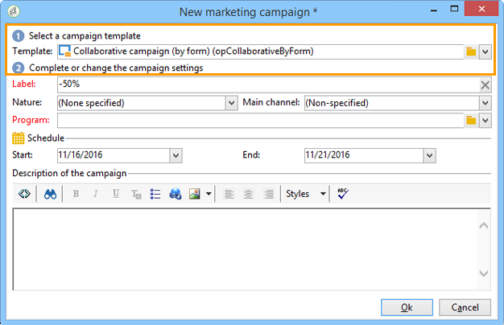
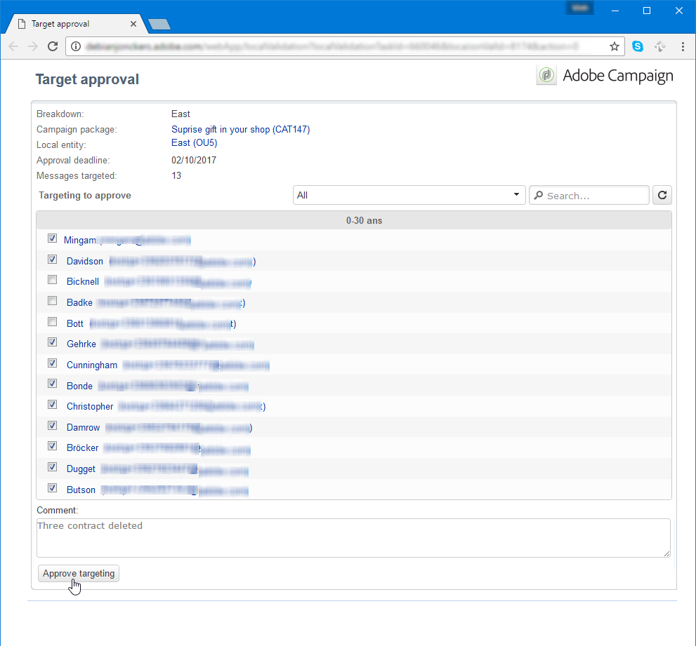
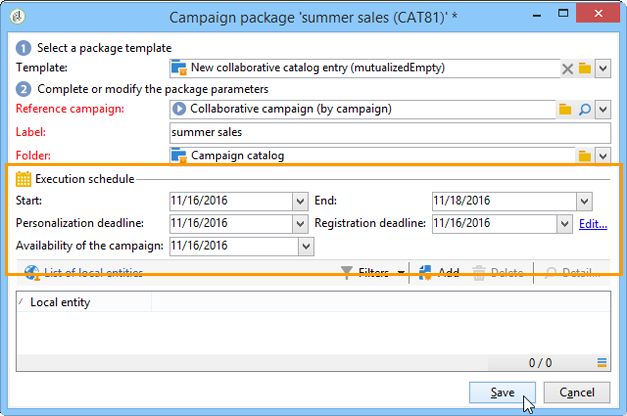

# Creación de una campaña colaborativa{#creating-a-collaborative-campaign-intro}

La entidad central crea campañas de colaboración a partir de plantillas de campañas de **Distributed Marketing.** Consulte [esta página](about-distributed-marketing.md#collaborative-campaign).

## Creación de una campaña colaborativa {#creating-a-collaborative-campaign}

Para configurar una campaña de colaboración, haga clic en **[!UICONTROL Campaign management > Campaigns]** y, a continuación, la **[!UICONTROL New]** icono.

>[!NOTE]
>
>Además de **[!UICONTROL collaborative campaigns (by campaign)]**, estas campañas se pueden configurar y ejecutar mediante una interfaz web.

El proceso de configuración de una base de datos de campaña de colaboración es similar al de una plantilla de campaña local. A continuación se describen las especificaciones de los diferentes tipos de campañas colaborativas.

### Por formulario {#by-form}

Para crear una campaña de colaboración (por formulario), la plantilla **[!UICONTROL Collaborative campaign (by form)]** debe estar seleccionada.

En la pestaña **[!UICONTROL Edit]**, haga clic en el vínculo **[!UICONTROL Advanced campaign parameters...]** para acceder a la pestaña **Marketing distribuido**.

Seleccione la interfaz web **Por formulario**. Este tipo de interfaz le permite crear campos de personalización que se utilizarán en entidades locales cuando se solicite una campaña. Consulte [Creación de una campaña local (por formulario) ](examples.md#creating-a-local-campaign--by-form-).

Guarde la campaña. Ahora puede usarlo desde la vista **Campaign packages** en la pestaña **Campaign**, haciendo clic en el botón **[!UICONTROL Create]**.

La vista **[!UICONTROL Campaign Package]** permite utilizar plantillas de campañas locales (ya sean predeterminadas o duplicadas), así como campañas de referencia para campañas de colaboración con el objetivo de crear campañas para diferentes entidades de organización.

### Por campaña {#by-campaign}

Para crear una campaña de colaboración (por campaña), debe estar seleccionada la plantilla **[!UICONTROL Collaborative campaign (by campaign) (opCollaborativeByCampaign)]**.

Al realizar la solicitud de la campaña, la entidad local puede completar los criterios predefinidos por la entidad central y evaluar la campaña antes de realizar la solicitud.

Una vez aprobada la solicitud de una campaña **Collaborative campaign (by campaign)** en la entidad central, se crea una campaña secundaria para la entidad local. Una vez disponibles, la entidad local puede modificar:

* el flujo de trabajo de la campaña,
* reglas de tipología,
* y campos de personalización.

La entidad local ejecuta la campaña secundaria. La entidad central ejecuta la campaña principal.

La entidad central puede ver todas las campañas secundarias relacionadas con una **Collaborative Campaign (by campaign)** desde este panel (a través del vínculo **[!UICONTROL List of associated campaigns]**).

### Por aprobación de destino {#by-target-approval}

Para crear una campaña de colaboración (por aprobación de destino), debe estar seleccionada la plantilla **[!UICONTROL Collaborative campaign (by target approval)]**.

>[!NOTE]
>
>En este modo, la entidad central no necesita especificar las entidades locales.

El flujo de trabajo de campaña debe integrar la actividad de tipo de **Local approval** . Los parámetros de actividad son los siguientes:

* **[!UICONTROL Action to perform]** : Notificación de aprobación del objetivo.
* **[!UICONTROL Distribution context]** : Explícito.
* **[!UICONTROL Data distribution]** : Distribución de entidad local.

Se debe crear la distribución de datos del tipo de **Local entity distribution** . La plantilla de distribución de datos permite limitar el número de registros de una lista de valores de agrupación. En **[!UICONTROL Resources > Campaign management > Data distribution]**, haga clic en el icono **[!UICONTROL New]** para crear una nueva **[!UICONTROL Data distribution]**. Para obtener más información sobre la distribución de datos,

Seleccione **Targeting dimension** y **[!UICONTROL Distribution field]**. Para **[!UICONTROL Assignment type]**, seleccione **Local entity**.

En la pestaña **[!UICONTROL Distribution]**, añada un campo para cada entidad local y especifique el valor.

Puede añadir una segunda **aprobación de destino** después de la actividad de **envío** para configurar un informe.

En el mensaje de notificación de creación de la campaña, la entidad local recibe una lista de contactos predefinida por los parámetros de la entidad central.

La entidad local puede eliminar ciertos contactos según el contenido de la campaña.

### Sencilla {#simple}

Para crear una campaña de colaboración sencilla, debe estar seleccionada la plantilla **[!UICONTROL Collaborative campaign (simple)]**.

## Creación de un paquete de campaña de colaboración {#creating-a-collaborative-campaign-package}

Para que una campaña esté disponible para las entidades locales, la entidad central debe crear un paquete de campañas.

Siga estos pasos:

1. En la sección **[!UICONTROL Navigation]** de la página de **Campañas**, haga clic en el enlace **[!UICONTROL Campaign packages]**.
1. Haga clic en el botón **[!UICONTROL Create]**.
1. La sección de la parte superior de la ventana permite seleccionar la plantilla **[!UICONTROL New collaborative package (mutualizedEmpty)]**.
1. Seleccione la campaña de referencia.
1. Especifique la etiqueta, la carpeta y el programa de ejecución para el paquete de campaña.

### Fechas {#dates}

Las fechas de inicio y finalización definen el periodo de visibilidad de la campaña en la lista de paquetes de campañas.

Para las **campañas de colaboración**, la entidad central debe especificar el plazo de registro y personalización.

>[!NOTE]
>
>**[!UICONTROL Personalization deadline]** permite que la entidad central elija un plazo en el que las entidades locales deben haber enviado los documentos (hojas de cálculo, imágenes) para configurar la campaña. Esta no es una opción obligatoria. Omitir esta fecha no afecta la implementación de la campaña.

### Audiencia {#audience}

La entidad central debe especificar las entidades locales involucradas en cada campaña en cuanto se cree la campaña colaborativa.

>[!CAUTION]
>
>No se puede aprobar **[!UICONTROL Simple, by form and by campaign collaborative campaign kits]** a menos que se hayan especificado las entidades locales pertinentes.

### Modos de aprobación {#approval-modes}

Para las **campañas de colaboración**, se puede especificar el modo de aprobación de la solicitud.

En modo manual, la entidad local necesita suscribirse para poder participar en la campaña.

En modo automático, la entidad local se presuscribe automáticamente a la campaña. Puede cancelar la suscripción de la campaña o modificar sus parámetros sin necesidad de que la entidad central lo apruebe.

### Notificaciones {#notifications}

La configuración de las notificaciones es idéntica a las notificaciones de una entidad local. Consulte [esta sección](creating-a-local-campaign.md#notifications).

## Solicitud de una campaña {#ordering-a-campaign}

Cuando se añade una campaña colaborativa a la lista de paquetes de campaña, se notifica a las entidades locales pertenecientes a la audiencia definida por la entidad central (**Collaborative campaigns (by target approval)** no tienen un público predefinido). El mensaje enviado contiene un vínculo que le permite registrarse en la campaña, como se muestra a continuación:

Este mensaje también permite que las entidades locales vean la descripción introducida por el operador central que creó el paquete, así como los documentos vinculados a la campaña. No pertenecen a la misma campaña, aunque proporcionan información adicional sobre ella.

Una vez que los operadores locales se han registrado a través de una interfaz web, pueden añadir información personalizada a la campaña de colaboración que deseen solicitar:

Una vez que una entidad local ha finalizado su registro, se notifica a las entidades centrales por correo electrónico para que aprueben la solicitud.

Para obtener más información, consulte la sección [Proceso de aprobación](creating-a-local-campaign.md#approval-process).

## Aprobación de una solicitud {#approving-an-order}

El proceso de aprobación de una solicitud de paquete de campaña de colaboración es el mismo que al hacerlo para una campaña local. Consulte [esta sección](creating-a-local-campaign.md#approving-an-order).
