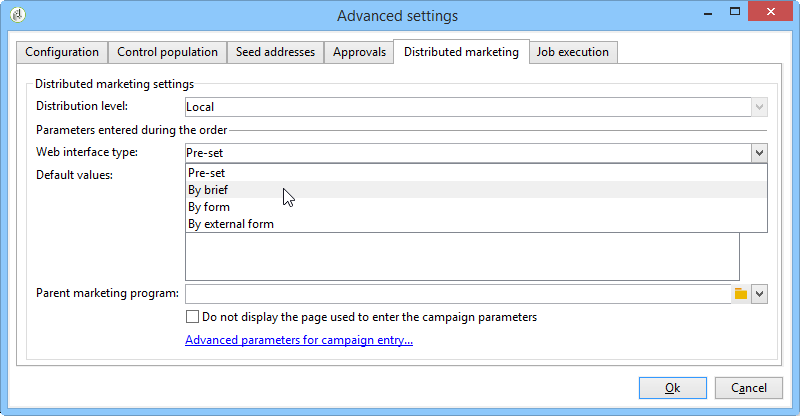

# Creación de una campaña local{#creating-a-local-campaign}

Una campaña local es una instancia creada a partir de una plantilla a la que se hace referencia en la lista de **[!UICONTROL campaign packages]** con una **programación de ejecución determinada**. Su objetivo es utilizar una comunicación local mediante una plantilla de campaña configurada por la entidad central. Las principales fases para implementar una operación local son las siguientes:

**Para la entidad central**

1. Creación de una plantilla de campaña local.
1. Creación de un paquete de campaña a partir de una plantilla.
1. Publicación de un paquete de campaña.
1. Aprobación de solicitudes.

**Para la entidad local.**

1. Solicitud de la campaña.
1. Ejecución de campañas.

## Creación de una plantilla de campaña local {#creating-a-local-campaign-template}

Para crear un paquete de campañas, primero debe crear la **plantilla de campaña** a través del nodo **[!UICONTROL Resources > Templates]**.

Para crear una nueva plantilla local, duplique la plantilla predeterminada **[!UICONTROL Local campaign (opLocal)]**.

Asigne un nombre a la plantilla de campaña y complete los campos disponibles.

En la ventana de la campaña, haga clic en la pestaña **[!UICONTROL Edit]** y luego en el enlace **[!UICONTROL Advanced campaign parameters...]**.

### Tipo de interfaz {#web-interface}

En la ficha **Marketing distribuido**, puede elegir el tipo de interfaz y especificar los valores y parámetros predeterminados que se especificarán cuando una entidad local realice una solicitud.

La interfaz corresponde a un formulario que la entidad local rellena al solicitar la campaña.

Seleccione el tipo de interfaz que se aplicará a las campañas creadas a partir de la plantilla:

Hay cuatro tipos de interfaces disponibles:

* **[!UICONTROL By brief]**: la entidad local debe proporcionar una descripción de las configuraciones de campaña. Una vez aprobada la solicitud, la entidad central se configura y ejecuta la campaña en su totalidad.

  

* **[!UICONTROL By form]**: la entidad local tiene acceso a un formulario web en el que, según la plantilla utilizada, pueden editar el contenido, el destinatario, su tamaño máximo, así como las fechas de creación y extracción utilizando campos de personalización. La entidad local puede evaluar el destinatario y obtener una vista previa del contenido desde este formulario web.

  

  El formulario ofrecido se especifica en una aplicación web que debe estar seleccionada de la lista desplegable del campo **[!UICONTROL web Interface]** en el vínculo **[!UICONTROL Advanced campaign parameters...]** de la plantilla. Consulte [Creación de una campaña local (por formulario) ](examples.md#creating-a-local-campaign--by-form-).

  >[!NOTE]
  >
  >La aplicación web utilizada es un ejemplo. Debe crear una aplicación web específica para poder utilizar un formulario.

  

* **[!UICONTROL By external form]**: la entidad local tiene acceso a los parámetros de campaña en su extranet (no en Adobe Campaign). Estos parámetros son idénticos a los de una campaña local (por formulario) o **local campaign (by form)**.
* **[!UICONTROL Pre-set]**: la entidad local solicita la campaña utilizando el formulario predeterminado sin localizarlo.

  

### Valores predeterminados {#default-values}

Seleccione los **[!UICONTROL Default values]** que desea completar en las entidades locales. Por ejemplo:

* fechas de contacto y extracción,
* características de objetivo (segmento de edad, etc.).

Complete los campos **[!UICONTROL Parent marketing program]** y **[!UICONTROL Charge]**.

### Aprobaciones {#approvals}

Desde el vínculo **[!UICONTROL Advanced parameters for campaign entry]**, puede especificar el número máximo de revisores.

La entidad local deberá introducir los revisores cuando se solicite la campaña.

Si no desea asignar nombres a los revisores de una campaña, escriba 0.

### Documentos {#documents}

Puede permitir que los operadores de la entidad local vinculen los documentos (archivos de texto, hojas de cálculo, imágenes, descripciones de campañas, etc.) a la campaña local al crear la solicitud. El enlace **[!UICONTROL Advanced parameters for campaign entry...]** permite restringir el número de documentos. Para ello, simplemente introduzca el número máximo permitido en el campo **[!UICONTROL Number of documents]**.

Al solicitar un paquete de campaña, el formulario sugiere vincular tantos documentos como se indica en el campo correspondiente de la plantilla.

Si no desea mostrar un campo de carga de documento, escriba **[!UICONTROL 0]** en el campo **[!UICONTROL Number of documents]**.

>[!NOTE]
>
>El **[!UICONTROL Advanced parameters for campaign entry]** se puede desactivar marcando **[!UICONTROL Do not display the page used to enter the campaign parameters]**.

### Flujo de trabajo {#workflow}

En la pestaña **[!UICONTROL Targeting and workflows]**, cree el flujo de trabajo de campaña que recopila los **[!UICONTROL Default values]** especificados en **[!UICONTROL Advanced campaign parameters...]** y crea los envíos.

Haga doble clic en la actividad **[!UICONTROL Query]** para configurarla según el **[!UICONTROL Default values]** especificado.

### Entrega {#delivery}

En la pestaña **[!UICONTROL Audit]**, haga clic en el icono **[!UICONTROL Detail...]** para ver el **[!UICONTROL Scheduling]** del envío seleccionado.

El icono **[!UICONTROL Scheduling]** permite configurar la fecha de contacto y ejecución de la entrega.

Si es necesario, configure el tamaño máximo de la entrega:

Localice el código HTML de la entrega. Por ejemplo, en **[!UICONTROL Delivery > Current order > Additional fields]**, utilice el campo **[!UICONTROL Age segment]** para localizar la entrega de acuerdo con la edad del objetivo.

Guarde la plantilla de campaña. Ahora puede usarlo desde la vista **[!UICONTROL Campaign packages]** en la pestaña **[!UICONTROL Campaigns]**, haciendo clic en el botón **[!UICONTROL Create]**.

>[!NOTE]
>
>Las plantillas de campaña y su configuración general se detallan en [esta página](../campaigns/marketing-campaign-templates.md).

## Creación del paquete de campaña {#creating-the-campaign-package}

Para que la plantilla de campaña esté disponible para las entidades locales, debe añadirla a la lista. Para ello, la agencia central necesita crear un nuevo paquete.

Siga estos pasos:

1. En la sección **[!UICONTROL Navigation]** de la página de **Campañas**, haga clic en el enlace **[!UICONTROL Campaign packages]**.
1. Haga clic en el botón **[!UICONTROL Create]**.

   

1. La sección encima de la ventana permite seleccionar la plantilla de paquete de campaña especificada [anteriormente](#creating-a-local-campaign-template).

   De forma predeterminada, la plantilla **[!UICONTROL New local campaign package (localEmpty)]** se utiliza para campañas locales.

1. Especifique la etiqueta, la carpeta y el programa de ejecución para el paquete de campaña.

### Fechas {#dates}

Las fechas de inicio y finalización definen el periodo de visibilidad de la campaña en la lista de paquetes de campañas.

La fecha de disponibilidad es la fecha en que la campaña estará disponible para las entidades locales (para que las soliciten).

>[!CAUTION]
>
>Si una entidad local no reserva la campaña antes de la fecha límite, no podrá utilizarla.

Esta información se encuentra en el mensaje de notificación enviado a las agencias locales, como se muestra a continuación:

### Público {#audience}

Para una campaña local, la entidad central puede especificar las entidades locales involucradas en la comprobación de **[!UICONTROL Limit the package to a set of local entities]**.

### Ajustes adicionales {#additional-settings}

Una vez guardado el paquete, la entidad central puede editarla desde la pestaña **[!UICONTROL Edit]**.

Desde la pestaña **[!UICONTROL General]**, la entidad central puede:

* configurar el revisor de paquetes de campañas desde el enlace **[!UICONTROL Approval parameters...]**,
* revisar la programación de ejecución,
* añadir o eliminar entidades locales.

>[!NOTE]
>
>De manera predeterminada, cada entidad puede solicitar una **campaña local** solo una vez.
>   
>Marque la opción **[!UICONTROL Enable multiple creation]** para permitir que se creen varias campañas locales en el paquete de campañas.

### Notificaciones {#notifications}

Cuando una campaña está disponible o cuando se llega a la fecha límite de registro, se envía un mensaje a los operadores del grupo de notificación local. Para obtener más información, consulte [Entidades organizativas](about-distributed-marketing.md#organizational-entities).

## Solicitud de una campaña {#ordering-a-campaign}

Las entidades locales pueden acceder a los paquetes de campañas una vez que se han aprobado y ha comenzado su periodo de implementación. Las entidades locales reciben un correo electrónico que le informa de que hay un nuevo paquete de campaña disponible (en cuanto se alcanza su fecha de disponibilidad).

>[!NOTE]
>
>Si se especificaron entidades locales al crear el paquete de campaña, estas serán las únicas que recibirán una notificación. Si no se especifica ninguna entidad local, todas las entidades locales recibirán una notificación.

Para utilizar una campaña proporcionada por la entidad central, la entidad local debe solicitarla.

Para solicitar una campaña:

1. En el mensaje de notificación, haga clic en **[!UICONTROL Order campaign]** o en el botón correspondiente de Adobe Campaign.

   Introduzca su ID y contraseña para solicitar la campaña. La interfaz está formada por un conjunto de páginas definidas en una aplicación web.

1. Introduzca la información necesaria en la primera página (etiqueta de orden y comentario) y haga clic en **[!UICONTROL Next]**.

   

1. Complete los parámetros disponibles y apruebe la solicitud.

1. Se envía una notificación al administrador de la entidad organizativa a la que pertenece la entidad local para aprobar la solicitud.

   

1. La información se devuelve a las entidades local y central. Aunque las entidades locales solo pueden ver sus propias solicitudes, la entidad central puede ver todas las solicitudes de cualquier entidad local, como se muestra a continuación:

   

   Los operadores pueden mostrar detalles de la solicitud:

   

   La pestaña **[!UICONTROL Edit]** contiene información introducida por la entidad local al solicitar la campaña.

   

1. La entidad central debe aprobar la solicitud.

   

   Para obtener más información, consulte la sección [Proceso de aprobación](#approval-process).

1. El operador local recibe una notificación cuando la campaña está disponible: la disponibilidad de la campaña puede encontrarse en la lista de paquetes de campañas en la pestaña **Campañas**. La campaña entonces se puede utilizar. Para obtener más información, consulte [Acceso a campañas](accessing-campaigns.md).

   La opción **[!UICONTROL Start targeting with order approval]** permite que la entidad local ejecute la campaña en cuanto se apruebe la solicitud.

   

## Aprobación de una solicitud {#approving-an-order}

Para confirmar una solicitud de campaña, la entidad central debe aprobarla.

La vista general de **[!UICONTROL Campaign orders]**, a la que se accede a través de la pestaña **Campañas**, permite ver el estado de las solicitudes de campaña y aprobarlas.

>[!NOTE]
>
>Las entidades locales pueden realizar cambios en la solicitud hasta que se apruebe.

### Proceso de aprobación {#approval-process}

#### Notificación por correo electrónico {#email-notification}

Cuando una entidad local solicita una campaña, sus revisores reciben notificaciones por correo electrónico, como se muestra a continuación:

>[!NOTE]
>
>Para saber cómo seleccionar revisores, consulte la sección [Revisores](#reviewers). Pueden aceptar o rechazar la solicitud.

#### Aprobación mediante la consola de cliente {#approving-via-the-adobe-campaign-console}

Las solicitudes también se pueden aprobar a través de la consola del cliente, en la información general de la solicitud de la campaña. Para aprobar una solicitud, selecciónela y haga clic en **[!UICONTROL Approve the order]**.

>[!NOTE]
>
>La campaña todavía se puede editar y volver a configurar hasta que se alcance la fecha de disponibilidad de la campaña. Las entidades locales también pueden rechazar la campaña haciendo clic en el botón **[!UICONTROL Cancel]**.

#### Creación de una campaña {#creating-a-campaign}

Una vez aprobada la solicitud de una campaña, la entidad local puede configurarla y ejecutarla.

Para obtener más información, consulte [Acceso a campañas](accessing-campaigns.md).

### Rechazar una aprobación {#rejecting-an-approval}

El operador de aprobación puede rechazar una solicitud o un paquete de campaña.

Si el revisor rechaza una solicitud, se envía la notificación correspondiente automáticamente a las respectivas entidades locales: muestra el comentario introducido por el operador que rechazó la aprobación.

La información se muestra en la lista de página de paquetes de campañas o en la página de solicitud de campañas. Si tienen acceso a la consola del cliente de Adobe Campaign, se informa a las entidades locales de este rechazo.

Pueden ver el comentario relacionado en la pestaña **[!UICONTROL Edit]** del paquete de la campaña.

### Revisores {#reviewers}

Cada vez que se necesita una aprobación, los revisores reciben una notificación por correo electrónico.

Para cada entidad local, se seleccionan los revisores para la aprobación de solicitudes y campañas. Para obtener más información sobre la selección de revisores locales, consulte [Entidades organizativas](about-distributed-marketing.md#organizational-entities).

>[!NOTE]
>
>Para que esta selección sea posible, la aprobación de solicitudes no debe ser eficaz.

### Cancelación de una solicitud {#canceling-an-order}

La agencia central puede cancelar una solicitud utilizando el botón **[!UICONTROL Delete]** situado en el panel de solicitudes.

Esto cancela la campaña en la vista **[!UICONTROL Campaign orders]**.
