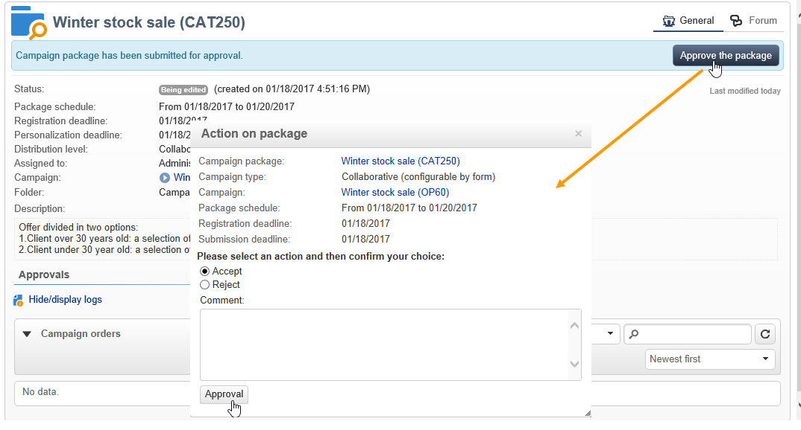

# Ejemplos de marketing distribuido{#distributed-marketing-samples}


## Creación de una campaña local (por formulario) {#creating-a-local-campaign--by-form-}

La interfaz web tipo **Por formulario** implica utilizar una **aplicación web**. Según su configuración, esta aplicación web puede contener cualquier tipo de elemento personalizado definido. Por ejemplo, puede sugerir vínculos para evaluar el objetivo, el presupuesto, el contenido, etc. mediante API dedicadas.

>[!NOTE]
>
>La aplicación web utilizada en este ejemplo no es una aplicación web incluida con Adobe Campaign. Para utilizar un formulario en una campaña, debe crear la aplicación web correspondiente.

Al crear la plantilla de campaña, haga clic en el icono **[!UICONTROL Zoom]** dentro de la opción **[!UICONTROL Web interface]** del vínculo **[!UICONTROL Advanced campaign parameters...]** para acceder a los detalles de la aplicación web.


>[!NOTE]
>
>Los parámetros de la aplicación web solo están disponibles en la plantilla de campaña.

En la pestaña **[!UICONTROL Edit]**, seleccione la actividad de la **solicitud de campaña** y ábrala para acceder a su contenido.


En este ejemplo, la actividad de la **solicitud de campaña** incluye:

* campos introducidos por la entidad local durante la solicitud,

  

* vínculos que permiten a la entidad local evaluar la campaña (por ejemplo: el objetivo, el presupuesto, el contenido, etc.),

  

* secuencias de comandos que permiten calcular y mostrar el resultado de estas evaluaciones.

  

En este ejemplo se utilizan las siguientes API:

* Para la evaluación de destino,

  ```
  var res = nms.localOrder.EvaluateTarget(ctx.localOrder);
  ```

* Para la evaluación del presupuesto,

  ```
  var res = nms.localOrder.EvaluateDeliveryBudget(ctx.@deliveryId, NL.XTK.parseNumber(ctx.@compt));
  ```

* Para la evaluación de contenido,

  ```
  var res = nms.localOrder.EvaluateContent(ctx.localOrder, ctx.@deliveryId, "html", resSeed.@id);
  ```

## Creación de una campaña de colaboración (por aprobación de destino) {#creating-a-collaborative-campaign--by-target-approval-}

### Introducción {#introduction}

Usted es el responsable de marketing de una gran marca de moda que tiene una tienda en línea y varias tiendas por todo Estados Unidos. Ahora que ha llegado la primavera, decide crear una oferta especial que otorgue a sus mejores clientes un 50% de descuento en todos los vestidos del catálogo.

Esta oferta está dirigida a los mejores clientes de sus tiendas de EE. UU., es decir, aquellos que han gastado más de 300 $ desde el comienzo del año.

Por tanto, decide utilizar Distributed Marketing para crear una campaña de colaboración (por aprobación de destino) que le permitirá seleccionar los mejores clientes (agrupados por región), que recibirán la entrega de correo electrónico con la oferta especial.

La primera parte de este ejemplo ilustra las entidades locales que reciben la notificación de creación de campañas y cómo pueden utilizarla para evaluar la campaña y solicitarla.

La segunda parte de este ejemplo explica cómo crear la campaña.

Los pasos son los siguientes:

**Para la entidad local.**

1. Utilice la notificación de creación de campañas para acceder a la lista de contactos seleccionados por la entidad central.
1. Seleccione los contactos y apruebe la participación.

**Para la entidad central:**

1. Cree una **[!UICONTROL Data distribution]** actividad.
1. Cree la campaña de colaboración.
1. Publique la campaña.

### Lado de la entidad local {#local-entity-side}

1. Las entidades locales seleccionadas para participar en la campaña recibirán una notificación por correo electrónico.

   

1. Al hacer clic en el vínculo **[!UICONTROL Access your contact list and approve targeting]**, la entidad local obtiene acceso (a través del explorador web) a la lista de clientes seleccionados para la campaña.

   

1. La entidad local desmarca ciertos contactos de la lista porque ya se han puesto en contacto con una oferta similar desde el inicio del año.

   

Una vez aprobadas las comprobaciones, la campaña puede iniciarse automáticamente.

### Lado de la entidad central {#central-entity-side}

#### Creación de una actividad de distribución de datos {#creating-a-data-distribution-activity}

1. Para configurar una campaña de colaboración (por aprobación de objetivo) debe crear primero una **[!UICONTROL Data distribution activity]**. Haga clic en **[!UICONTROL New]** en el menú **[!UICONTROL Resources > Campaign management > Data distribution]** del explorador de Campaign.

   

1. En la pestaña **[!UICONTROL General]**, debe especificar:

   * El **[!UICONTROL Targeting dimension]**. Aquí se lleva a cabo la **distribución de datos** para los **destinatarios**.
   * El **[!UICONTROL Distribution type]**. Puede elegir un **Tamaño fijo** o un **Tamaño como porcentaje**.
   * El **[!UICONTROL Assignment type]**. Seleccione la opción **Local entity**.
   * El **[!UICONTROL Distribution type]**. El campo **[!UICONTROL Origin (@origin)]** presente en la tabla de destinatarios, permite identificar la relación entre el contacto y la entidad local.
   * El campo **[!UICONTROL Approval storage]**. Seleccione la opción **Local approval of recipient**.

1. En la pestaña **[!UICONTROL Breakdown]**, especifique:

   * el **[!UICONTROL Distribution field value]**, que corresponde a las entidades locales involucradas en la próxima campaña.
   * la **[!UICONTROL label]** de la entidad local.
   * el **[!UICONTROL Size]** o tamaño (fijo o como porcentaje). El **valor predeterminado 0** implica la selección de todos los destinatarios vinculados a la entidad local.

   

1. Guarde la nueva distribución de datos.

#### Creación de una campaña colaborativa {#creating-a-collaborative-campaign}

1. Desde el **[!UICONTROL Campaign management > Campaign]** del explorador de Campaign, cree una nueva **[!UICONTROL collaborative campaign (by target approval)]**.
1. En la pestaña **[!UICONTROL Targeting and workflows]**, cree un flujo de trabajo para la campaña. Debe contener una actividad **Split** en la que **[!UICONTROL Record count limitation]** se define mediante la actividad **[!UICONTROL Data distribution]**.

   

1. Añada una acción **[!UICONTROL Local approval]** donde se pueda especificar:

   * el contenido del mensaje que se envía a las entidades locales en la notificación,
   * el recordatorio de aprobación,
   * el procesamiento esperado para la campaña.

   

1. Guarde el registro.

#### Publicación de la campaña {#publishing-the-campaign}

Ahora puede añadir un **paquete de campaña** desde la pestaña **[!UICONTROL Campaigns]**.

1. Elige tu **[!UICONTROL Reference campaign]**. En la pestaña **[!UICONTROL Edit]** del paquete, puede seleccionar el **[!UICONTROL Approval mode]** que desea utilizar para la campaña:

   * en el modo **Manual**, las entidades locales participan en la campaña si aceptan la invitación de la entidad central. Pueden eliminar contactos previamente configurados si lo desean y se necesita la aprobación del administrador para confirmar su participación en la campaña.
   * en el modo **automático**, las entidades locales deben participar en la campaña, a menos que no estén registrados en ella. Pueden eliminar contactos sin aprobación.

   

1. En la pestaña **[!UICONTROL Description]**, puede agregar una descripción para la campaña, así como cualquier documento que se enviará a las entidades locales.

   

1. Apruebe el paquete de campaña y, a continuación, inicie el flujo de trabajo para publicar el paquete y ponerlo a disposición de todas las entidades locales de la lista de paquetes.

   

## Creación de una campaña de colaboración (por formulario) {#creating-a-collaborative-campaign--by-form-}

### Introducción {#introduction-1}

Usted es el responsable de marketing de una gran marca de cosméticos que tiene una tienda en línea y varias tiendas por todo Estados Unidos. Para dar salida a sus existencias de invierno y dejar espacio para sus nuevas existencias, decide crear una oferta especial dirigida a dos categorías de clientes: a personas mayores de 30 años, a quienes le ofrecerá productos para pieles sensibles, y a personas menores de 30 años, a quienes ofrecerá productos de cuidados de la piel más básicos.

Por ello, decide utilizar Distributed Marketing para crear una campaña de colaboración (por formulario) que le permitirá seleccionar clientes de sus diferentes tiendas según los intervalos de edad. Estos clientes recibirán un correo electrónico con una oferta especial que se habrá personalizado según su intervalo de edad.

La primera parte de este ejemplo ilustra las entidades locales que reciben la notificación de creación de campañas y cómo pueden utilizarla para evaluar la campaña y solicitarla.

La segunda parte de este ejemplo explica cómo crear la campaña.

Los pasos son los siguientes:

**Para la entidad local.**

1. Utilice la notificación de creación de campañas para acceder al formulario en línea.
1. Personalice la campaña (objetivo, contenido, volumen de entrega).
1. Compruebe estos campos y cámbielos si es necesario.
1. Apruebe su participación.
1. El administrador de la entidad local (o de la entidad central) aprueba la configuración y participación.

**Para la entidad central:**

1. Cree la campaña de colaboración.
1. Configure los **[!UICONTROL Advanced campaign parameters...]** como lo haría para una campaña local.
1. Configure el flujo de trabajo de campaña y la entrega tal como lo haría para una campaña local.
1. Actualice el formulario web.
1. Cree el paquete de campaña y publíquelo.

### Lado de la entidad local {#local-entity-side-1}

1. Las entidades locales seleccionadas para participar en la campaña reciben una notificación por correo electrónico que les informa de su participación en la campaña.

   

1. Las entidades locales completan el formulario personalizado y:

   * evalúan el objetivo y el presupuesto,
   * previsualizan el contenido de entrega,
   * aprobar su participación.

     

1. El operador de validación de solicitudes aprueba su participación.

   

### Lado de la entidad central {#central-entity-side-1}

1. Para implementar una campaña de colaboración (por formulario), debe crear una campaña con la plantilla de campaña de **Campaña de colaboración (por formulario)**.

   

1. En la pestaña de la campaña **[!UICONTROL Edit]**, haga clic en el enlace **[!UICONTROL Advanced campaign parameters...]** para configurarlo como una campaña local. Consulte [Creación de una campaña local (por formulario)](#creating-a-local-campaign--by-form-).

   

1. Configure el flujo de trabajo de la campaña y el formulario web. Consulte [Creación de una campaña local (por formulario)](#creating-a-local-campaign--by-form-).
1. Cree su paquete de campaña especificando el calendario de ejecución y las entidades locales involucradas.

   

1. Finalice la configuración del paquete seleccionando el modo de aprobación en la pestaña **[!UICONTROL Edit]**.

   

1. Desde la pestaña **[!UICONTROL Description]** puede introducir una descripción del paquete de campaña, un mensaje de notificación que se enviará a las entidades locales cuando se publique el paquete y adjuntar cualquier documento informativo al paquete de la campaña.

   

1. Apruebe el paquete para publicarlo.

   
