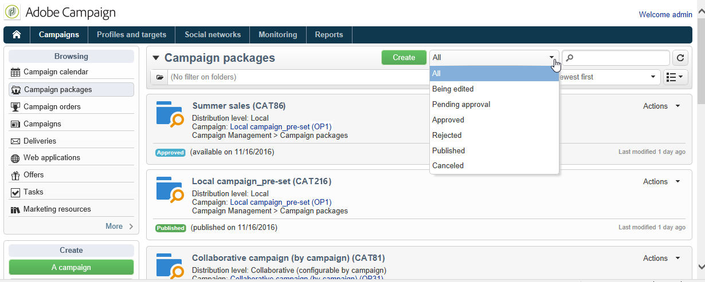
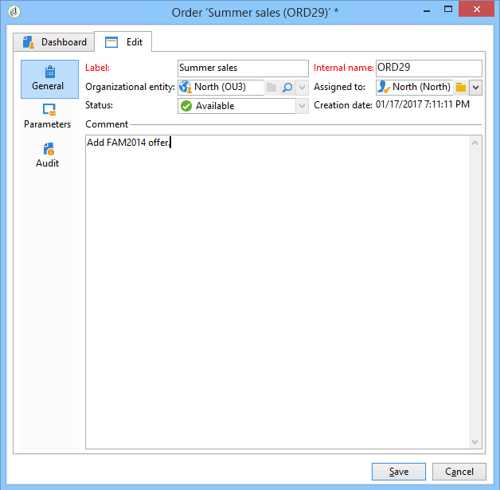
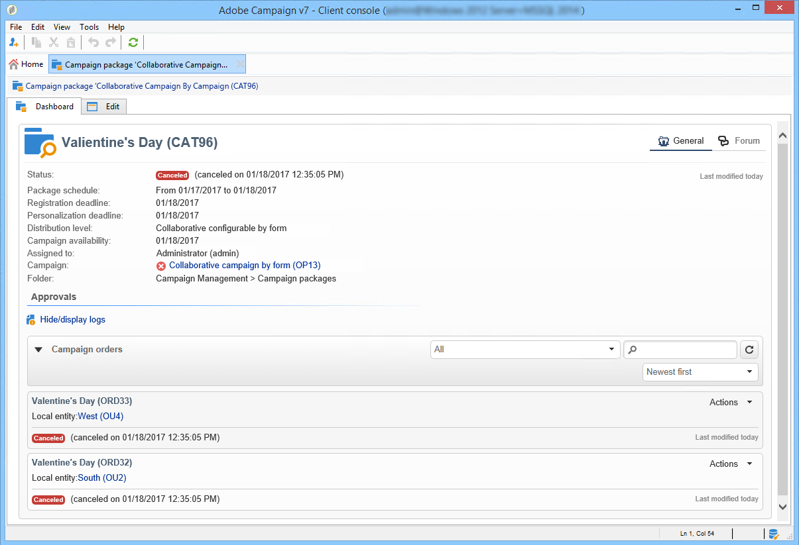

# Seguimiento de una campaña{#tracking-a-campaign}

Los operadores de entidad central pueden rastrear las solicitudes de campaña en la lista de paquetes de campañas.

Esto les permite:

* [Filtración de paquetes](#filter-packages),
* [Editar paquetes](#edit-packages),
* [Cancelar un paquete](#cancel-a-package),
* [Reinicialización de un paquete](#reinitializing-a-package).

## Filtrado de paquetes {#filter-packages}

En la pestaña **[!UICONTROL Campaigns]**, puede mostrar la lista de **[!UICONTROL Campaign packages]** que reagrupa todas las campañas de marketing distribuido existentes. Puede filtrar esta lista para que muestre solo las campañas que se han publicado, que se han retrasado, que están pendientes de aprobación, etc. Para ello, haga clic en los vínculos de la sección superior de esta vista o utilice el vínculo **[!UICONTROL Filter list]** y seleccione el estado del paquete de campaña que desea mostrar.

## Edición de paquetes {#edit-packages}

La página **[!UICONTROL Campaign packages]** permite ver el resumen de cada paquete.

Este resumen muestra la siguiente información: etiqueta, tipo de campaña, así como el nombre de la campaña desde la que se creó y la carpeta.

Haga clic en el nombre del paquete para editarlo. También puede ver solicitudes por sus entidades locales y por su estado.

Esta información también se incluye en la vista **[!UICONTROL Campaign orders]**, que enumera todas las solicitudes.

El operador central puede editar la solicitud. Hay dos formas de hacerlo:

1. El operador puede hacer clic en el nombre de la solicitud para editarla: esto muestra los detalles de las solicitudes.

   

   La pestaña **[!UICONTROL Edit > General]** permite ver la información introducida por la entidad local cuando solicita la campaña.

   

1. El operador puede hacer clic en la etiqueta del paquete de campaña para editarlo y cambiar ciertas configuraciones.

   

## Cancelación de un paquete {#cancel-a-package}

La entidad central puede cancelar un paquete de campaña en cualquier momento.

En el paquete de campaña **[!UICONTROL Dashboard]**, haga clic en **[!UICONTROL Cancel]**.

El campo **[!UICONTROL Comment]** le permite justificar la cancelación.

Para las **campañas locales**, cancelar un paquete las elimina de la lista de campañas de marketing disponibles.

Para las **campañas de colaboración**, cancelar un paquete activa varias acciones:

1. Todas las solicitudes relacionadas con este paquete se cancelan.

   

1. La campaña de referencia se cancela y todos los procesos activos (flujos de trabajo, envíos) se detienen.

   

1. Se envía una notificación a todas las entidades locales correspondientes.

   

La entidad central puede seguir accediendo y reiniciando los paquetes cancelados (consulte a continuación) si es necesario. Solo se ofrecen a las entidades locales una vez aprobadas e iniciadas. A continuación, se muestra el proceso de reinicio de paquetes.

## Reinicialización de un paquete {#reinitializing-a-package}

Los paquetes de campañas que ya se han publicado se pueden reiniciar, modificar y ponerlo a disposición de entidades locales.

1. Seleccione el paquete que desee.
1. Haga clic en el enlace **[!UICONTROL Reinitialize the package to reuse it]** y en **[!UICONTROL OK]**.

   

1. Haga clic en el botón **[!UICONTROL Save]** para aprobar el reinicio del paquete.

   

1. El estado del paquete cambia a **[!UICONTROL Being edited]**. Modifique, apruebe y vuelva a publicarlo para restaurarla en la lista de paquetes de campañas.

>[!NOTE]
>
>También puede reiniciar paquetes de campañas canceladas.
