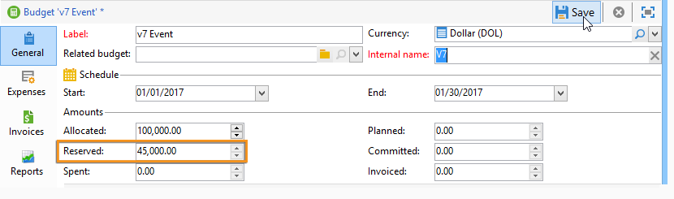

# Costes de control{#controlling-costs}

Adobe Campaign permite controlar los costes de marketing programados, comprometidos y facturados y desglosarlos por categoría mediante el módulo Gestión de recursos de marketing.

Los costes comprometidos para los distintos procesos de una campaña se cobran a un presupuesto establecido de antemano por el departamento de marketing. Las cantidades se pueden desglosar en varias categorías para facilitar la comprensión de la información y proporcionar informes más detallados sobre las inversiones de marketing.

La administración y el seguimiento de presupuestos están centralizados en un nodo específico del árbol de Adobe Campaign. Esto permite controlar las cantidades asignadas, reservadas, comprometidas y gastadas desde la misma vista y para todos los presupuestos.

Se deben aplicar los pasos siguientes para implementar la administración del presupuesto utilizando MRM:

1. Defina el presupuesto. [Más información](#creating-a-budget).

1. Defina el método de cálculo de costes: las estructuras de costes se definen para los proveedores de servicios. [Más información](../campaigns/providers--stocks-and-budgets.md).

1. Defina los costes de campaña (entregas/tareas) : los costes incurridos por las entregas y las tareas se introducen de forma individual o global para la plantilla de campaña. [Más información](../campaigns/marketing-campaign-deliveries.md#compute-costs-and-stocks).

1. Consolidar: según el estado de progreso de las tareas, las entregas y la campaña, los costes se calculan y se transfieren al presupuesto correspondiente. Cuando la creación de la campaña avanza lo suficiente, el estado del progreso del presupuesto de la campaña se puede cambiar a **[!UICONTROL Specified]**. El coste calculado del programa se introduce automáticamente con el coste calculado de la campaña. [Más información](#cost-commitment--calculation-and-charging).

## Creación de un presupuesto {#creating-a-budget}

Para crear un presupuesto, siga los pasos a continuación:

1. Vaya a la **[!UICONTROL Campaign management > Budgets]** del explorador de Campaign.
1. Haga clic en el icono **[!UICONTROL New]**, cambie el nombre del presupuesto y guárdelo.
1. Introduzca la cantidad inicial: indique la cantidad asignada en el campo correspondiente. Las demás cantidades se introducen automáticamente. [Más información](#calculating-amounts).
1. Defina el periodo de validez introduciendo las fechas de inicio y finalización. Esta información es meramente ilustrativa.
1. Cree las categorías de gastos a las que se pueden vincular los costes asignados a este presupuesto para campañas, tareas, etc. [Más información](#expense-categories).

>[!NOTE]
>
>Puede seleccionar un presupuesto relacionado. Para obtener más información, consulte [esta sección](#linking-a-budget-to-another).

### Calcular cantidades {#calculating-amounts}

Cada presupuesto se define por una cantidad inicial que se reducirá con los costes de las diversas campañas, entregas o tareas relacionadas una vez que se han programado o llevado a cabo. El estado de las cantidades (programadas, reservadas, comprometidas, invertidas o facturadas) depende del tipo de coste y del nivel de compromiso definido en la campaña, entrega o tarea.

>[!NOTE]
>
>Las cantidades introducidas para cada categoría deben coincidir con la dotación presupuestaria definida en el campo **[!UICONTROL Allocated]**.

Para las campañas, según el nivel de compromiso, se puede planear, comprometer o reservar un coste para una acción futura.

>[!CAUTION]
>
>Cuando se crea una campaña, el estado del progreso en **[!UICONTROL Budget]** debe configurarse como **[!UICONTROL Defined]** para que se tengan en cuenta los costes en la ejecución. Si el estado es **[!UICONTROL Being edited]**, los costes no se consolidan.
>   
>La opción **[!UICONTROL Commitment level]** representa una proyección de los costes en el futuro antes de que se cobren en el presupuesto. Según el progreso de una campaña, tarea o entrega, puede optar por asignar un nivel de compromiso más alto o más bajo (1. Planificado, 2. Reservado, 3. Comprometido) utilizando el cuadro combinado.

Por ejemplo, el coste previsto estimado de una campaña web es de 45 000 euros.

En dicha campaña, cuando el estado de creación del presupuesto se establece en **[!UICONTROL Defined]**, el coste real (o, si no, el coste calculado) se envía a los totales del presupuesto.

Según el nivel de compromiso del presupuesto de la campaña, la cantidad se introduce en el campo **[!UICONTROL Planned]**, **[!UICONTROL Reserved]** o **[!UICONTROL Committed]**.

Se puede modificar el nivel de compromiso:

* en el nivel de **campaña**, en la ventana **[!UICONTROL Budget]**, se encuentra en la pestaña **[!UICONTROL Edit]**. Es donde se configuran los presupuestos, los costes y los gastos.
* en el nivel de **tareas**, en la ventana **[!UICONTROL Expenses and revenues]**.

Cuando el presupuesto está **[!UICONTROL Reserved]**, la actualización se realiza automáticamente para el presupuesto cobrado.

El procedimiento es el mismo en el nivel de tarea.

Cuando un gasto genera una factura y esta se paga, su importe se introduce en el campo **[!UICONTROL Invoiced]**.

### Categorías de gastos {#expense-categories}

Las cantidades se pueden distribuir en varias categorías de gastos para facilitar la comprensión de los datos y para obtener un sistema de informes más detallado sobre las inversiones de marketing. Las categorías de ahorro se definen durante la creación del presupuesto, a través del nodo **[!UICONTROL Budgets]** del árbol.

Para añadir una categoría, haga clic en el botón **[!UICONTROL Add]** de la sección inferior de la ventana.

Puede seleccionar una categoría de las existentes o definir una nueva categoría introduciéndola directamente en el campo. Cuando confirme la información introducida, un mensaje de confirmación le permite agregar esta categoría a la lista de categorías existentes y asociarla con una naturaleza en caso necesario. Esta información se utiliza en los informes de presupuesto.

### Vinculación de un presupuesto a otro {#linking-a-budget-to-another}

Puede vincular un presupuesto a un presupuesto principal. Para ello, seleccione el presupuesto principal en el campo **[!UICONTROL related budget]** de los presupuestos secundarios.

Se agrega una pestaña adicional al presupuesto principal para mostrar la lista de presupuestos relacionados.

Esta información se transfiere a los informes de presupuesto.

## Añadir líneas de gastos {#adding-expense-lines}

Las líneas de gastos se añaden automáticamente al presupuesto. Se crean durante el análisis de entrega y cuando finaliza una tarea.

Para cada campaña, entrega o tarea, los costes generados se agrupan en las líneas de coste del presupuesto al que se cobran. Estas líneas de gasto se crean según las líneas de coste del proveedor de servicios correspondiente y calculan a través de las estructuras de coste asociadas.

Cada línea de coste contiene la siguiente información:

* La campaña y la entrega o tarea con la que está relacionado
* La cantidad calculada a partir de las estructuras de coste o el coste provisional estimado
* Coste real de la entrega o la tarea correspondientes
* La línea de factura correspondiente (solo MRM)
* Lista de los costes calculados por categoría de coste (si existe una estructura de coste)

En el ejemplo anterior, la línea de gastos editada contiene los costes calculados para la entrega de **nuevas tarjetas** para la campaña de **Loyalty Spring Pack.** Cuando se edita el envío, la pestaña **[!UICONTROL Direct Mail]** le permite ver cómo se calcula la línea de gastos.

El cálculo de costes de esta entrega se basa en las categorías de costes seleccionadas para el proveedor de servicios:

Según las categorías de costes seleccionadas, se aplican las estructuras de costes correspondientes para calcular las líneas de costes. En este ejemplo, para el proveedor de servicios correspondiente, las estructuras de coste son las siguientes:

>[!NOTE]
>
>Las categorías y estructuras de coste se presentan en [esta página](../campaigns/providers--stocks-and-budgets.md#create-a-service-provider-and-its-cost-categories)

## Compromiso, cálculo y cobro de costes {#cost-commitment--calculation-and-charging}

Los costes se pueden comprometer para entregas y tareas. El estado de un coste se actualiza en función del progreso del proceso con el que se relacione.

### Proceso de cálculo de costes {#cost-calculation-process}

Los costos se dividen en tres categorías:

1. Coste estimado provisional

   El coste estimado provisional es una estimación de los costes de los procesos de la campaña. Mientras se esté editando, las cantidades introducidas no se consolidan. Debe encontrarse en estado **[!UICONTROL Specified]** para que las cantidades se introduzcan en los cálculos.

   Esta cantidad se introduce de forma manual y puede dividirse en varias categorías de gastos. Para desglosar un coste, haga clic en el enlace **[!UICONTROL Breakdown...]** y, luego, en el botón **[!UICONTROL Add]** para definir una nueva cantidad.

   

   Puede asociar cada coste con una categoría para que el desglose del coste por categoría de gastos se pueda ver más tarde en el presupuesto relacionado y en los informes de presupuesto.

1. Coste calculado

   El coste calculado depende del elemento en cuestión (campaña, entrega, tarea, etc.) y su estado (en proceso de edición, en curso, terminado). En cualquier caso, si se especifica el coste real, el coste calculado utiliza esa cantidad.

   Si no se indica el coste real, se aplican las siguientes reglas:

   * Para una campaña que se está editando, el coste calculado es el coste estimado provisional de la campaña o, si el coste no está definido, el coste calculado es la suma de todos los costes provisionales de las solicitudes y tareas de la campaña. Si la campaña termina, el coste calculado de la campaña es la suma de todos los costes calculados.
   * En el caso de las entregas que aún no se hayan analizado, el coste calculado es el coste estimado provisional. Si ya se ha realizado el análisis, el coste calculado es la suma de todos los costes calculados desde el servicio, teniendo en cuenta estructuras de costes y el número de destinatarios objetivo.
   * Para una tarea en curso, el coste calculado utiliza el coste estimado provisional. Si la tarea ha finalizado, el coste calculado es la suma de todos los costes calculados a partir de las estructuras de coste del proveedor de servicios y el número de días completados.
   * Para el plan de marketing, como en el programa, el coste calculado es la suma de los costes calculados para las campañas. Si no se especifican estos costes, el coste calculado utiliza los costes estimados provisionales.

   >[!NOTE]
   >
   >El enlace **[!UICONTROL Breakdown]** le permite ver los detalles del cálculo y la fecha de cálculo del último coste.

1. Coste real

   El coste real se introduce de forma manual y, si es necesario, se desglosa en distintas categorías de gastos.

### Cálculo y cobro {#calculation-and-charging}

Los costes se calculan a través de las estructuras de coste y se cobran según los presupuestos seleccionados en las campañas, las entregas o las tareas correspondientes.

Se puede realizar una verificación de las cantidades comprometidas a las campañas a través de la aprobación del presupuesto. Se pueden crear tareas adicionales de control de estilo en una campaña para configurar otras aprobaciones. Consulte [Tipos de tareas](creating-and-managing-tasks.md#types-of-task).

### Ejemplo {#example}

Creemos una campaña con:

* Entrega de correo directo con las estructuras de coste de un proveedor de servicios
* Una tarea con un coste fijo
* Una tarea con un coste diario

#### Paso 1: Creación del presupuesto {#step-1---creating-the-budget}

1. Cree un nuevo presupuesto a través del nodo **[!UICONTROL Campaign management > Budgets]**.

1. En la sección **[!UICONTROL Amounts]**, defina un presupuesto de 10 000 euros en el campo **[!UICONTROL Allocated]**. Añada dos categorías de gastos en la sección inferior de la ventana:

#### Paso 2: Configuración del proveedor de servicios y definición de las estructuras de coste {#step-2---configuring-the-service-provider-and-defining-the-cost-structures}

1. Cree un proveedor de servicios y una plantilla de servicio con su estructura de coste del nodo **[!UICONTROL Administration > Campaigns]**. Para obtener más información, consulte [esta sección](../campaigns/providers--stocks-and-budgets.md#create-a-service-provider-and-its-cost-categories).

   Para los envíos de correo postal, cree las categorías de coste **[!UICONTROL Envelopes]** (tipos 114 x 229 y 162 x 229), **[!UICONTROL Postage]** y **[!UICONTROL Print]** (tipos A3 y A4). A continuación, cree las siguientes estructuras de coste:

   

1. Agregue un coste fijo (en las categorías de coste) cuyo cálculo sea fijo y cuya cantidad esté vacía (en la estructura de coste correspondiente) y que se especifique individualmente para cada entrega.

   

   Para las tareas, cree las dos siguientes categorías de coste:

   * **[!UICONTROL Room reservation]** (Cuarto pequeño y Cuarto grande), con una estructura de coste **fijo** de 300 y 500 euros:

   

   * **[!UICONTROL Creation]** (**de tipo plantilla de contenido**), con una estructura de coste **diaria** de 300 euros:

   

#### Paso 3: Asignación del presupuesto a la campaña {#step-3---charging-the-budget-in-the-campaign}

1. Cree una campaña y seleccione el presupuesto creado en el paso 1.

   >[!NOTE]
   >
   >De manera predeterminada, el presupuesto seleccionado para el programa se aplica a todas las campañas del programa.

   

1. Especifique el coste provisional estimado, con desglose:

   

1. Haga clic en **[!UICONTROL Ok]** y, a continuación, en **[!UICONTROL Save]** para confirmar esta información. El coste calculado de la campaña se actualiza con el coste provisional estimado.

#### Paso 4: Creación de la entrega de correo directo {#step-4---creating-the-direct-mail-delivery}

1. Cree un flujo de trabajo para la campaña y coloque las actividades de consulta para seleccionar el objetivo (deben especificarse las direcciones postales de los destinatarios).

1. Cree una entrega de correo directo y seleccione el proveedor de servicios creado en el paso 2: las categorías de coste se muestran automáticamente.

1. Sobrescriba el coste de los sobres y agregue un coste fijo. Seleccione también las categorías que le interesen.

   

   >[!NOTE]
   >
   >Si no se utiliza una de las categorías de coste, esta no genera gastos.

1. Inicie el flujo de trabajo que acaba de crear para iniciar el análisis y calcular los costes.

   

1. Si la aprobación del presupuesto está habilitada para esta campaña, apruebe el presupuesto desde el panel. Puede comprobar la aprobación de las categorías de coste.

   

La línea de gastos relativa a la entrega se agrega en la pestaña **[!UICONTROL Edit > Budget]** de la campaña. Edítela para ver los detalles del cálculo.

El coste calculado para la entrega se actualiza con esta información:

Al editar el coste calculado, puede comprobar el desglose del coste y el estado y la fecha del cálculo de los costes.

#### Paso 5: Creación de tareas {#step-5---creating-tasks}

A esta campaña, agregaremos las dos tareas para las que se mostraron las estructuras de coste [creado anteriormente](#step-2---configuring-the-service-provider-and-defining-the-cost-structures).

Para ello, en el panel de campañas, haga clic en el botón **[!UICONTROL Add a task]**. Asigne un nombre a la tarea y haga clic en **[!UICONTROL Save]**.

1. La tarea se agrega entonces a la lista. Debe editarla para configurarla.

1. En la pestaña **[!UICONTROL Properties]**, seleccione el servicio y la categoría de coste correspondiente:

   

1. A continuación, haga clic en el icono **[!UICONTROL Expenses and revenue]** de la tarea y especifique el coste provisional estimado.

   

   Una vez que se ha guardado la tarea, el coste calculado se especifica con el valor introducido para el coste provisional estimado.

   Cuando finaliza la tarea (estado **[!UICONTROL Finished]**), el coste calculado se actualiza automáticamente con el coste del cuarto grande tal como se ha introducido en su estructura de coste. Este coste también aparece en esta categoría en el desglose.

1. A continuación, cree una segunda tarea siguiendo el mismo procedimiento, programada para cinco días y relacionada con la estructura de coste creada anteriormente.

   

   Cuando finalice la tarea, el coste calculado se especifica con el valor de la estructura de coste relacionada, por ejemplo: 1500 euros en nuestro ejemplo (5 días x 300 euros):

   

#### Paso 6: Actualización del estado del presupuesto de la campaña {#step-6---update-the-campaign-budget-status}

Cuando se configura la campaña, su estado se puede actualizar a **[!UICONTROL Specified]**. El coste calculado de la campaña indica la suma de los costes calculados de la entrega y las tareas de la campaña:

#### Aprobación del presupuesto {#budget-approval}

Cuando se activa la aprobación, un vínculo especial permite aprobar el presupuesto desde el panel de campañas. Este vínculo se muestra cuando se ha iniciado el flujo de trabajo de objetivos, y requiere la aprobación de la entrega de correo directo.

Puede hacer clic en el vínculo para conceder o rechazar la aprobación, o utilizar el vínculo del mensaje de correo electrónico de notificación si se ha activado la notificación para esta campaña.

Cuando el presupuesto se ha aprobado y ha concluido la entrega, los costes se cargan automáticamente mediante un flujo de trabajo técnico especial.

## Pedidos y facturas {#orders-and-invoices}

En el contexto de MRM, puede guardar pedidos con un proveedor de servicios y emitir facturas. El ciclo de vida completo de estos pedidos y facturas se puede administrar mediante la interfaz de Adobe Campaign.

### Creación de pedidos {#order-creation}

Para guardar un nuevo pedido con un proveedor de servicios, haga clic en el nodo **[!UICONTROL MRM > Orders]** del árbol y, a continuación, en el botón **[!UICONTROL New]**.

Especifique el número de pedido, el proveedor de servicios y la cuantía total del pedido.

### Emisión y seguimiento de facturas {#issuing-and-tracking-invoices}

Para cada proveedor de servicios, puede guardar las facturas y definir su estado y el presupuesto cobrado.

Las facturas se crean y almacenan en el nodo **[!UICONTROL MRM > Invoices]** de Adobe Campaign.

Una factura consta de líneas de factura cuyo total permite calcular la cuantía automáticamente. Estas líneas se crean manualmente desde la pestaña **[!UICONTROL Invoice lines]**. Pueden asociarse con una solicitud para cargar la información a los pedidos.

Las facturas de cada proveedor de servicios se muestran en la pestaña **[!UICONTROL Invoices]** del perfil:

La pestaña **[!UICONTROL Details]** permite mostrar el contenido de la factura.

Haga clic en **[!UICONTROL Add]** para crear una factura nueva.
