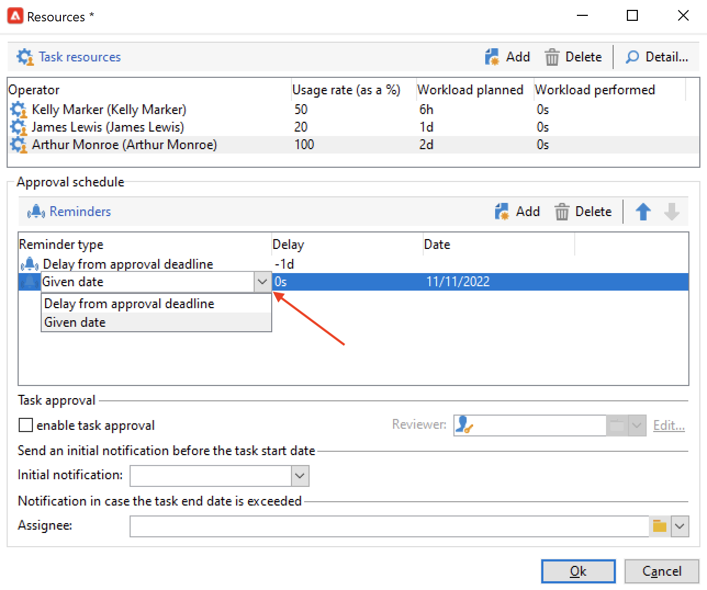
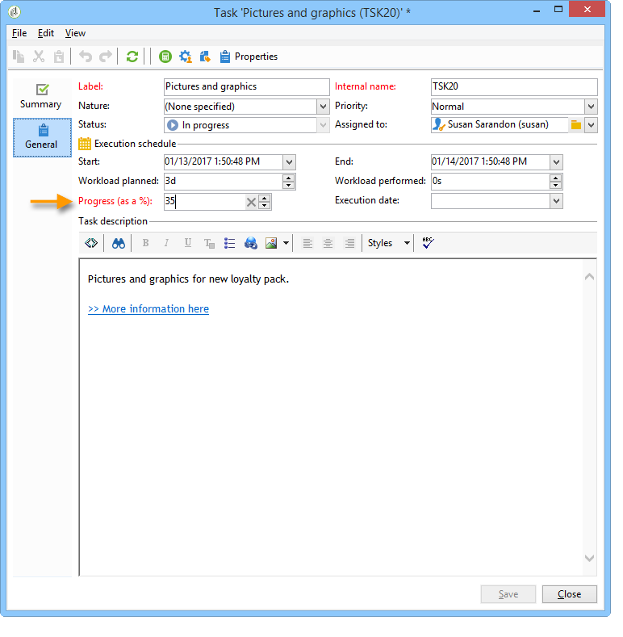
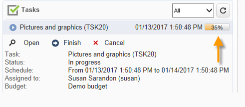
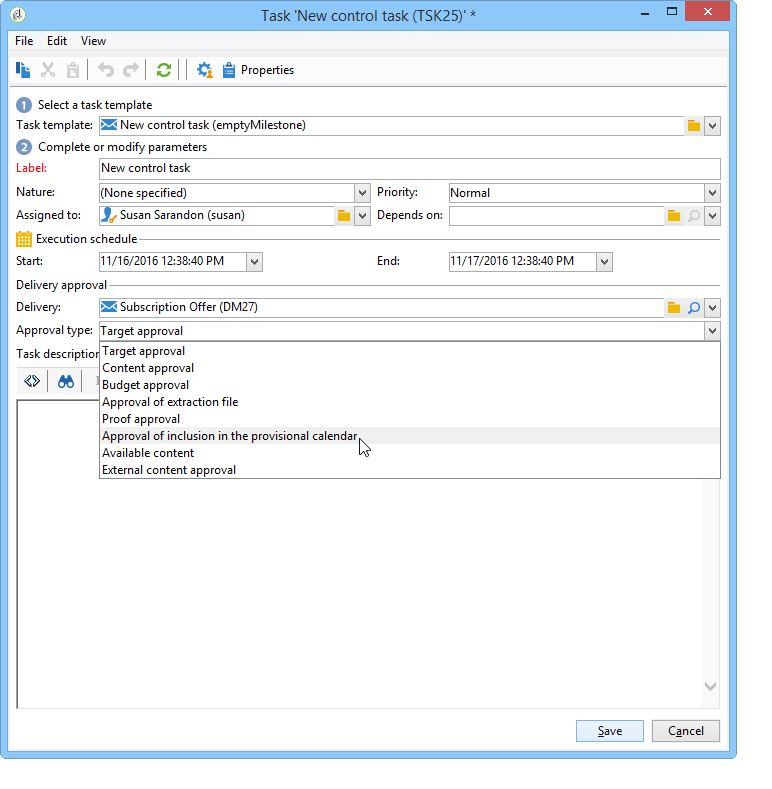

# Creación y administración de tareas{#creating-and-managing-tasks}

Adobe Campaign le permite crear tareas y gestionar su ciclo de vida completo directamente desde la aplicación. La implementación de programas y campañas se puede dividir en tareas asignadas a operadores de Adobe Campaign o a proveedores de servicios externos. Este modo de operación le permite crear un entorno de colaboración abierto que incluye todos los participantes del programa y participantes externos.

Se pueden crear, ver y monitorizar las tareas de la lista de tareas o del panel de campañas. También se pueden consultar y rastrear en las programaciones del plan de marketing, programas y campañas.

Las tareas se adjuntan a la campaña y pueden tener dependencias, es decir, tareas asociadas. Cada tarea tiene un estado, prioridad, carga estimada y costes relacionados.

Todas las tareas se agrupan en una lista accesible a través de la pestaña **Campañas**. Para obtener más información, consulte [Acceder a tareas](#accessing-tasks).

Pueden mostrarse en la programación del programa al que pertenecen.

## Tareas de acceso {#accessing-tasks}

### Mostrar tareas {#displaying-tasks}

Las tareas se muestran en la lista de tareas a la que se puede acceder mediante la pestaña **[!UICONTROL Campaigns]**.

Puede ver todas las tareas del operador actual.

Para obtener más información sobre esto, consulte [Ejecución del estado de una tarea](#execution-status-of-a-task) y [Progreso del estado de una tarea](#progress-status-of-a-task).

### Filtrar tareas {#filtering-tasks}

Al mostrar esta vista, se filtra automáticamente para mostrar solo la variable **tareas del operador actual**. También puede filtrar las tareas utilizando los campos de la parte superior de la ventana.

### Editar tareas {#editing-tasks}

Haga clic en una tarea para editarla.

## Creación de una tarea nueva {#creating-a-new-task}

Para crear una tarea, siga los pasos a continuación:

1. Vaya a la **[!UICONTROL Tasks]** en el **[!UICONTROL Campaigns]** y haga clic en **[!UICONTROL Create]**.

   

1. Introduzca el nombre de la tarea y seleccione la campaña a la que está vinculada.
1. Establezca las fechas de inicio y finalización.
1. Haga clic en **[!UICONTROL Save]** para crear la tarea.

   

También puede crear una tarea a través del panel de una campaña: en este caso, se vincula automáticamente a la campaña a partir de la cual se creó.

Después de crear una tarea, esta se agrega a la programación de campañas, al panel de campañas y a la lista de tareas. Para editar una tarea, haga clic en su nombre en la lista de tareas o selecciónelo en la programación o en el panel de campañas y haga clic en **[!UICONTROL Open]**.

Una vez creada, puede configurar la tarea definiendo:

* El administrador y los participantes. [Más información](#manager-and-participants)
* La programación de creación. [Más información](#execution-schedule)
* Los costes comprometidos. [Más información](#expenses-and-revenues)

También puede agregar [revisores](#reviewers) y [documentos de referencia](#documents-referenced).

El ciclo de vida de la tarea se presenta en [esta sección](#life-cycle).

### Administrador y participantes {#manager-and-participants}

De forma predeterminada, la tarea se asigna al operador que la creó. Se notifica a este operador cuando se requiere una acción para esa tarea.

Puede seleccionar un operador diferente del operador **[!UICONTROL Assigned to]** lista desplegable.

>[!NOTE]
>
>La administración del operador se detalla en [esta sección](../../v8/start/permissions.md).
>
>Solo el operador a cargo de una tarea puede cerrarla.

Puede especificar más operadores implicados en la realización de la tarea. No se permite que estos operadores cierren la tarea: solo pueden aprobar la tarea asignada.

Para agregar operadores de tareas, siga los pasos a continuación:

1. Haga clic en el **[!UICONTROL Resources]** en la barra de herramientas de tareas.

   

1. Haga clic en **[!UICONTROL Add]** y seleccione los operadores que le interesen.
1. Introduzca la tasa de uso: esto representa la carga de trabajo asignada al operador durante la ejecución de la tarea. Esta tasa es solo indicativa y se expresa como un porcentaje.

   

   Por ejemplo, para una tarea cuya programación de ejecución esté configurada a 10 días, un operador cuya tasa de uso es del 50 % se moviliza en relación con esta tarea para la mitad de su jornada de trabajo durante los 10 días.

   Para cada operador, puede introducir una carga de trabajo programada y una carga de trabajo real. Estas duraciones también son únicamente para fines informativos.

1. Puede configurar un recordatorio desde el **[!UICONTROL Add a reminder...]** vínculo. Se enviará una notificación por correo electrónico a todos los operadores implicados en la tarea antes de su fecha de finalización.

   

1. También puede enviar una notificación antes de que se inicie la tarea. Para configurarlo, seleccione la fecha en la **[!UICONTROL Initial notification]** campo .
1. Cuando se llega a la fecha de finalización y la tarea no se cierra, se puede enviar una notificación al usuario asignado o al grupo de destinatarios seleccionados en la **[!UICONTROL Assignee]** lista desplegable.

El tablero del operador permite comprobar la carga de trabajo (otras tareas en curso).

### Aprobación de tareas {#reviewers}

Además de los participantes, puede definir operadores que revisan la tarea una vez que se haya cerrado.

Para ello, haga clic en el botón **[!UICONTROL Enable task approval]** en la sección inferior del **[!UICONTROL Resources]** ventana. Puede ser un operador individual, un grupo de operadores o una lista de operadores.

Para especificar una lista de operadores, haga clic en el enlace **[!UICONTROL Edit...]** a la derecha del primer revisor y añada tantos operadores como sea necesario, como se muestra a continuación:

Puede definir una programación de aprobación para la tarea en la sección inferior de la ventana de configuración. De forma predeterminada, los revisores tienen tres días a partir de la fecha de envío para aprobar la tarea. También puede añadir un recordatorio, que se envía a los operadores correspondientes automáticamente antes de la fecha límite de aprobación.

La persona responsable de la tarea puede asignarse la tarea de aprobarla, incluso si ya se han asignado otros operadores para hacerlo. Si no se ha definido ningún revisor, las notificaciones se envían a la persona responsable de la tarea. Todos los demás operadores de Adobe Campaign con derechos de **[!UICONTROL Administrator]** también pueden aprobar la tarea. Sin embargo, no reciben notificaciones.

### Documentos de referencia {#documents-referenced}

Puede añadir [documentos y recursos de marketing](managing-marketing-resources.md) a una tarea.

Para realizar esto:

1. Abra la tarea y haga clic en el botón **[!UICONTROL Documents]** en la barra de herramientas de tareas.

   

1. Haga clic en **[!UICONTROL Add]** y seleccione el documento que desea añadir a la tarea. Aplique el mismo proceso para los recursos de marketing.

Los documentos de referencia se añaden a las notificaciones enviadas a los operadores implicados en la tarea. También se añaden en el panel de tareas.

### Programación de ejecución {#execution-schedule}

El periodo de validez de una tarea se indica en los campos **[!UICONTROL Start]** y **[!UICONTROL End]**. La carga programada indica la carga de trabajo que se lleva a cabo durante el periodo. Se expresa en días o en horas.

>[!NOTE]
>
>El ciclo de vida de una tarea se presenta en [Life cycle](#life-cycle).

El campo **[!UICONTROL Workload performed]** también se expresa en días y horas, lo que permite actualizar de forma manual el progreso de la tarea con respecto a la carga de trabajo programada.

El **[!UICONTROL Progress status]** de la tarea, expresado como porcentaje, se actualiza automáticamente en función de las tareas realizadas por los operadores implicados. Se puede introducir de forma manual.

Esta información se puede ver en el panel de tareas.

También se puede ver en la pestaña de campaña.

Si se ha alcanzado la fecha de finalización de la programación de tareas, pero la tarea no se ha completado, el estado de la tarea pasa a ser **[!UICONTROL Late]**. También se muestra un mensaje de advertencia a los operadores.

Para obtener más información sobre esto, consulte [Progreso del estado de una tarea](#progress-status-of-a-task).

### Gastos e ingresos {#expenses-and-revenues}

Puede definir los gastos relacionados y prever los ingresos de cada tarea. Ambos se calculan y después se consolidan para la campaña a la que acompaña la tarea.

Para especificar esta información, haga clic en el icono **[!UICONTROL Expenses and revenue]** de la barra de tareas.

De manera predeterminada, el presupuesto cargado es el presupuesto de la campaña a la que acompaña la tarea. Se muestra en los detalles de la tarea.

>[!NOTE]
>
>Para obtener más información sobre gastos y presupuestos, consulte [esta sección](../campaigns/providers--stocks-and-budgets.md#cost-commitment--calculation-and-charging).

En esta ventana, también puede definir los objetivos que desea alcanzar. Los objetivos se expresan en términos de ingresos previstos para la tarea.

### Proveedores de servicios {#service-providers}

Un proveedor de servicios externos puede participar en la administración de una tarea.

Para ello, edite las propiedades de la tarea y seleccione el proveedor de servicios que desee. Las categorías de costes asociadas al proveedor de servicios se enumeran automáticamente en la sección central de la ventana.

Seleccione las categorías de costes relacionadas con la ejecución de la tarea. Para ello, seleccione el tipo de costes y, si fuera necesario, añada una cantidad de recargo.

>[!NOTE]
>
>El método para administrar presupuestos y costes se muestra en [Control de costes](controlling-costs.md).

Al seleccionar un proveedor de servicios, este se muestra en el panel de tareas:

### Tareas atrasadas {#late-tasks}

Una tarea está atrasada si ha alcanzado su fecha de finalización sin cambiar su estado a **[!UICONTROL Finished]**. De forma predeterminada, no se avisa a ningún operador cuando una tarea está atrasada. Puede configurar la entrega de un correo electrónico de notificación: se puede notificar a todos los operadores aunque no estén implicados en la tarea.

Vaya al cuadro **[!UICONTROL Resources]** y añada el operador al campo **[!UICONTROL Assignation]**. Para notificar a varias personas, seleccione un grupo de operadores.

### Notificaciones iniciales {#initial-notifications}

Cuando crea o modifica una tarea con una fecha de inicio futura, Adobe Campaign ofrece la opción de enviar un mensaje de correo electrónico a la persona a cargo de la tarea para que sepa cuándo se inicia esta.

Sin embargo, si queda mucho tiempo para la tarea que está creando, es preferible programar la notificación para que se envíe antes del inicio de la tarea. Por ejemplo, si la tarea se inicia dentro de un mes, puede notificar a la persona a cargo una semana antes de comenzar.

Para programar una notificación, vaya al cuadro **[!UICONTROL Resources]** y utilice el campo **[!UICONTROL Initial notification]**.

* Para las tareas dentro de las campañas, seleccione una fecha y una hora específicas.
* Para las tareas dentro de las plantillas de campaña, el tiempo de notificación se expresa como el tiempo restante antes de que se inicie la tarea (por ejemplo, si introduce 2d en el campo **[!UICONTROL Initial notification]**, el correo electrónico se envía 2 días antes de la fecha de inicio de la tarea).

Si ha programado una notificación, al guardar la tarea, Adobe Campaign le ofrece igualmente la opción de enviar una notificación inmediata. Puede optar por enviarla, lo que no elimina la notificación programada.

### Tarea vinculada a un programa {#task-linked-to-a-program}

Puede crear tareas directamente en un programa para administrar las acciones que pertenecen a su organización general y no a una campaña específica (por ejemplo, una reunión para analizar el tema de las próximas campañas dentro del programa). La tarea aparece en la programación.

Para crear una tarea vinculada directamente a un programa:

1. Abra la programación: en la página principal, vaya a **[!UICONTROL Campaigns > Browse > Other choices > Programs]**. La programación general del programa se abre en la sección derecha de la ventana.
1. En la programación, haga clic en el programa deseado: junto a él aparece una ventana.
1. En esta ventana, haga clic en **[!UICONTROL Open]**. Esto abre la programación del programa.
1. Haga clic en el botón **[!UICONTROL Add]** situado encima de la programación a la derecha, luego haga clic en **[!UICONTROL Add a task]**.

### Disponibilidad de operadores {#operator-availability}

En el panel de tareas, un icono junto al nombre del operador indica que ya está trabajando en otra tarea o evento durante el período que abarca la tarea. La tarea en la que participa el operador o de la que está a cargo aparece en el campo **[!UICONTROL Assigned to]** o en el cuadro **[!UICONTROL Resources]** de la tarea.

### Tarea en un flujo de trabajo {#task-in-a-workflow}

El uso de un elemento **[!UICONTROL Task]** en un flujo de trabajo de campaña permite definir dos situaciones en función de si la tarea se aprueba o no.

En los flujos de trabajo de campaña, la actividad **[!UICONTROL Task]** se encuentra en la pestaña **[!UICONTROL Flow control]**.

## Tipos de tarea {#types-of-task}

Al crear tareas a través de una campaña, puede crear tareas específicas. El tipo de tarea se define en la plantilla seleccionada.

Se pueden programar las siguientes tareas:

* [Tareas de control](#control-tasks),
* [Tarea de agrupamiento](#grouping-task),
* [Tarea de agrupamiento](#grouping-task),
* [Tarea de notificación](#notification-task).

>[!NOTE]
>
>Las tareas **[!UICONTROL Control task]** y **[!UICONTROL Grouping]** se pueden crear **solo** a través del panel de campañas.\
>Se muestran en el mapa de tareas del operador al que se asignan. Consulte [Tareas de acceso](#accessing-tasks).

### Tareas de control {#control-tasks}

Una **[!UICONTROL Control task]** está vinculada a una aprobación de entrega: aprobación de destinatario, contenido, extracción de archivo, presupuesto o prueba.

Una vez creada, la tarea se agrega al panel de campañas.

A continuación, puede editarla y especificar sus parámetros.

### Tarea de creación de recursos de marketing {#marketing-resource-creation-task}

Se puede utilizar una tarea de creación de recursos de marketing para administrar la creación y publicación de un recurso de marketing. Si administra un recurso a través de una tarea y no a través del propio recurso, puede:

* Controlar el proceso de creación de recursos mediante una campaña.
* Ver el proceso de creación de recursos en una programación.
* Gestionar el proceso de creación de recursos (recordatorios, notificaciones).
* Calcular y controlar los costes vinculados a la creación de recursos.
* Aprobar y publicar el recurso mediante la tarea (si la opción correspondiente está activada).

#### Interacción entre la tarea y su recurso vinculado {#interaction-between-the-task-and-its-linked-resource}

La tarea de creación de recursos de marketing interactúa con el recurso vinculado. Esto significa que:

* La programación de la creación de recursos y los costes vinculados se gestionan a través de la tarea.
* Los operadores pueden trabajar en el recurso con normalidad (descarga o carga, bloqueo y desbloqueo): esto no afecta a la tarea.
* La aprobación y la publicación de recursos se pueden realizar mediante la tarea: si la opción **[!UICONTROL Publish the marketing resource]** está habilitada, el recurso se aprueba y se publica automáticamente una vez finalizada la tarea. Si la opción no está activada, la tarea y el recurso no interactúan: la modificación de una no afecta al otro, y viceversa.

   Puede utilizar una serie de tareas vinculadas para definir un ciclo de aprobación completo. Compruebe la opción **[!UICONTROL Publish the marketing resource]** solo para la última tarea: todas las tareas deben haber terminado para que se publique el recurso. Además, al crear una tarea secundaria de recursos de marketing, el recurso se selecciona automáticamente en la tarea secundaria.

   * **Mediante el recurso**: si envía el recurso para su aprobación o lo aprueba, eso no afecta a la tarea.
   * **Via the task**: si la opción **[!UICONTROL Publish the marketing resource]** está activada, el recurso se aprueba y se publica automáticamente una vez se haya finalizado la tarea (consulte más arriba). Si la opción no está activada, la tarea y el recurso no interactúan: la modificación de una no afecta al otro, y viceversa.

#### Configuración de una tarea de creación de recursos de marketing {#configuring-a-marketing-resource-creation-task}

La persona que revisa la tarea no es necesariamente la misma persona que controla el contenido definido en el recurso. Sin embargo, si la opción **[!UICONTROL Publish the marketing resource]** está activada (consulte a continuación), el revisor de la tarea tiene autorización para aprobar el contenido del recurso, ya que la tarea aprueba automáticamente el recurso (o, si no se ha definido ningún revisor, el administrador de tareas).

En el campo **[!UICONTROL Marketing resource]**, defina el recurso que desea administrar mediante esta tarea. Se puede:

* Seleccione un recurso existente: la lista desplegable ofrece todos los recursos con el estado **[!UICONTROL Being edited]**.
* Creación de un recurso: haga clic en el icono **[!UICONTROL Select the link]** y, a continuación, haga clic en el icono **[!UICONTROL Create]**.

La opción **[!UICONTROL Publish the marketing resource]** permite automatizar la publicación de recursos: una vez que la tarea pasa a estar **[!UICONTROL Finished]**, el estado del recurso cambia automáticamente a **[!UICONTROL Published]**, aunque no se haya enviado para aprobación ni se haya aprobado, incluso si el revisor que completa la tarea no es el definido en el recurso.

El botón **[!UICONTROL Publish the resource]** pasa a estar disponible y el revisor de publicación de recursos recibe un mensaje de correo electrónico de notificación para informarles de que está listo para publicarse. En la pestaña **[!UICONTROL Edit > Tracking]**, el revisor de tareas puede ver y publicar la tarea. Si se ha definido un flujo de trabajo de posprocesamiento de recursos, este se ejecuta en este momento.

### Tarea de grupo {#grouping-task}

La tarea de tipo **[!UICONTROL Grouping task]** le permite agrupar varias tareas y sincronizar la gestión de su progreso y su aprobación.

Las tareas de agrupamiento no tienen costes ni recursos vinculados.

Todas las tareas agrupadas a una tarea de agrupación se pueden ver en su propio panel. Esto le permite filtrar la lista de tareas para mostrar solo las que le interesen.

Las tareas de agrupamiento incluyen un enlace que permite crear fácilmente una tarea agrupada.

Para crear una tarea agrupada basada en una tarea de agrupación, vaya al panel de campañas y haga clic en el nombre de la tarea de agrupación para mostrar su descripción y luego haga clic en **[!UICONTROL Add a task]**.

Sin embargo, si ya ha creado una tarea que desea vincular con una tarea de agrupación, puede hacerlo mediante el campo **[!UICONTROL Linked to]** del cuadro **[!UICONTROL Properties]**.

### Tarea de notificación {#notification-task}

Las tareas de notificación permiten programar envíos de correo electrónico (a un operador, un grupo de operadores, un proveedor de servicios, etc.). Esto permite programar recordatorios, por ejemplo para notificar a alguien que una campaña finaliza pronto o para enviar documentos antes de que una campaña comience, de manera que los operadores puedan prepararse. Esto significa que puede realizar un seguimiento de las comunicaciones dentro de la campaña o el programa y prestar especial atención a las acciones realizadas.

#### Ciclo de vida {#life-cycle}

Las tareas de notificación no requieren aprobación. Esto significa que su ciclo de vida es más sencillo que el de una tarea estándar:

Una tarea de notificación puede tener los siguientes estados:

* **[!UICONTROL Scheduled]** hasta que se envíe el correo electrónico
* **[!UICONTROL In progress]** una vez enviado el mensaje de correo electrónico y hasta que se alcance la fecha final
* **[!UICONTROL Finished]** una vez que se alcanza la fecha de finalización.

#### Configuración {#configuration}

Durante la creación, se deben introducir los siguientes elementos en la tarea:

* **[!UICONTROL Assigned to]**: el operador o el grupo de operadores que recibe el correo electrónico. Si asigna la tarea una vez enviado el correo electrónico, este no se envía al operador nuevo (para esto, debe volver a ejecutar la tarea y cambiar su fecha inicial).
* **Fecha de inicio de la tarea**: fecha en la que se envía el mensaje de correo electrónico de notificación. Esta fecha debe ser futura en el momento de la registrar la tarea.
* **Task end date**: fecha en la que el estado de la tarea cambia a **[!UICONTROL Finished]**. De forma predeterminada, la fecha de finalización es idéntica a la fecha de inicio. Sin embargo, la asignación de una duración a la tarea permite simbolizar la cantidad de tiempo que el operador debe invertir en la programación, si fuera necesario.
* **[!UICONTROL Description]**: el texto introducido aquí aparece en el cuerpo del mensaje de correo electrónico de notificación.

   

Puede agregar un archivo adjunto a la tarea y al correo electrónico de notificación. Para ello, haga clic en el icono **[!UICONTROL Documents]** de la barra de herramientas en la esquina superior derecha.

## Ciclo de vida {#life-cycle-1}

### Vínculos entre tareas {#links-between-tasks}

El botón **[!UICONTROL Properties]** de cada tarea permite definir los enlaces entre las tareas de una campaña. Puede dividir tareas en subtareas utilizando una tarea de agrupación (consulte [Tareas vinculadas](#linked-tasks)) o definir dependencias entre las tareas (véase [Tareas de agrupamiento](#grouping-tasks)).

#### Tareas vinculadas {#linked-tasks}

Utilice el campo **[!UICONTROL Linked task]** para asociar tareas con una tarea de agrupación. Consulte [Tipos de tareas](#types-of-task).

En el ejemplo siguiente, la aprobación de destinatarios se divide en cuatro subtareas.

Cada subtarea es una tarea estándar vinculada a la tarea principal.

#### Tareas de grupo {#grouping-tasks}

Utilice el campo **[!UICONTROL Grouped to]** para hacer que la ejecución de una tarea dependa de la ejecución de otra tarea.

La dependencia entre tareas se representa mediante flechas en el panel de campañas.

En el caso de las tareas agrupadas, Adobe Campaign asigna automáticamente la fecha de finalización de la tarea principal a la tarea secundaria como fecha de inicio. Por ejemplo, si una tarea de **creación de invitación** finaliza el 15 de octubre a las 3:30 p. m., la tarea secundaria **envío de correo electrónico de invitación** comienza el 15 de octubre a las 3:30 p. m.

Además, si pospone el final de una tarea principal, algunas de sus tareas secundarias podrían verse afectadas: estas son las tareas secundarias cuyo estado es **[!UICONTROL Scheduled]** y cuya fecha de inicio es anterior a la nueva fecha final de la tarea principal. La duración de la tarea sigue siendo la misma. Si la fecha de inicio de una tarea secundaria es posterior a la nueva fecha de finalización de la tarea principal, la tarea secundaria no se ve afectada.

**Ejemplo**

Una tarea principal programada para finalizar el 9 de octubre a las 5 p. m. tiene dos tareas secundarias, la tarea A y la tarea B. La tarea A está programada para empezar el 10 de octubre a las 2 p. m. y la tarea B está programada para el 12 de octubre a las 8 a. m.

Posponemos la tarea principal: ahora termina el 11 de octubre a la 1 p. m. Solo se pospone la tarea A, que comienza el 11 de octubre a la 1 p. m.

### Estado de ejecución de una tarea {#execution-status-of-a-task}

Los estados de tareas pueden verse en el mapa de tareas. El estado de ejecución de una tarea se actualiza automáticamente según las acciones del operador.

Una tarea puede ser: **[!UICONTROL Scheduled]**, **[!UICONTROL In progress]**, **[!UICONTROL Finished]**, **[!UICONTROL Canceled]**, **[!UICONTROL Pending approval]** o **[!UICONTROL Rejected]**.

* Cuando se crea una tarea, aparece como **[!UICONTROL Scheduled]** si la fecha de inicio es futura. Mantiene este estado hasta que se llega a su fecha de inicio.
* Una vez iniciada, la tarea está **[!UICONTROL In progress]**. Cuando la persona a cargo de la tarea cierra dicha tarea, esta cambia a **[!UICONTROL Finished]**.
* Si se ha definido un revisor, la tarea pasa a estar **[!UICONTROL Pending approval]** una vez que la persona a cargo se encargue de cerrarla y hasta que el revisor la apruebe. Si el revisor la rechaza, la tarea pasa a estar **[!UICONTROL Rejected]**.
* La persona responsable puede cancelar una tarea a través del panel o mediante el **[!UICONTROL Task map]** haciendo clic en el botón **[!UICONTROL Cancel]**.
* Para programar una tarea, escriba una fecha de inicio futura. A continuación, puede enviar una primera notificación a los operadores de Adobe Campaign implicados en realización de la tarea. Consulte [Ciclo de vida completo de la tarea](#complete-task-life-cycle).

>[!NOTE]
>
>* El estado de la tarea se actualiza automáticamente.
>* Incluso si el periodo de validez ha terminado, las tareas que no se hayan cerrado aparecen en la lista de tareas en curso. Una advertencia notifica a los operadores de que la tarea está atrasada.
>

### Estado de progreso de una tarea {#progress-status-of-a-task}

Además del estado de ejecución, una tarea puede asociarse con un estado de progreso: **[!UICONTROL Late]**, **[!UICONTROL To approve]**, **[!UICONTROL To do today]** o **[!UICONTROL To do this week]**. Esta información se introduce automáticamente según la programación de tareas.

Puede filtrar la lista de tareas por estado de progreso o del proceso.

Para obtener más información, consulte [Acceder a tareas](#accessing-tasks).

### Ciclo de vida completo de la tarea {#complete-task-life-cycle}

A continuación, se muestran las fases del ciclo de vida completo de una tarea para el que la persona a cargo ha definido participantes y revisores.

1. La persona a cargo crea la tarea e introduce los distintos campos. Para más información, consulte [Crear una tarea nueva](#creating-a-new-task).

   Al crear y editar una tarea **programada en el futuro** (siempre que no se alcance la fecha de inicio de la tarea), es posible enviar una notificación a los participantes y a los administradores para que sepan que se ha programado una nueva tarea.

   

   Para enviar esta primera notificación, haga clic en **[!UICONTROL Yes]**. Esta notificación le informa sobre la siguiente tarea e incluye detalles sobre el contenido y el número de días restantes hasta su fecha límite.

   Cuando se crea una tarea y se reserva para el futuro, su estado es **[!UICONTROL Scheduled]**.

1. En la fecha de inicio de la tarea, la persona responsable y los participantes reciben una notificación que les informa de que la tarea se ha iniciado. Su estado cambia a **[!UICONTROL In progress]**.
1. Después de completar la sección asignada a ellos, los participantes pueden aprobar la tarea, ya sea:

   * mediante el correo electrónico de notificación.
   * mediante la consola o la interfaz web en el panel de tareas.

      

1. Cada vez que un participante aprueba un trabajo, se actualiza el estado de progreso de la tarea.

   

1. El revisor recibe un correo electrónico de notificación que le informa de que el operador ha finalizado la sección asignada.

   Puede seguir el progreso en el panel de tareas.

   

1. Una vez que la persona a cargo de la tarea decide que esta se ha completado, puede cerrarla con el enlace incluido en el mensaje de correo electrónico de notificación enviado cuando se inició la tarea, así como mediante la consola o la interfaz.

   

   >[!NOTE]
   >
   >La persona a cargo de una tarea puede cerrarla en cualquier momento, incluso si faltan aprobaciones. El estado de progreso cambia a 100 % de forma automática.

1. El estado de la tarea cambia a **[!UICONTROL To approve]** y se envía una notificación al revisor.

   Este aprueba la tarea por medio del correo electrónico de notificación, la consola o la interfaz Web.

   Puede actuar a través del panel de campañas:

   

   También puede utilizar el botón de aprobación de tareas:

   

   >[!NOTE]
   >
   >El estado de la tarea solo cambiará a **[!UICONTROL To approve]** si ha activado la opción **[!UICONTROL Enable task validation]** en la ventana **[!UICONTROL Resources]** de la tarea.\
   >Si el revisor rechaza la tarea, su estado cambia a **[!UICONTROL Rejected]** y el ciclo de vida de la tarea se reinicia automáticamente.

1. El estado de la tarea cambia a **[!UICONTROL Finished]**. Se envía una notificación a todos los implicados.

   >[!NOTE]
   >
   >Una vez finalizada la tarea, la persona a cargo puede reiniciar el ciclo de vida. Para ello, abra la tarea y haga clic en el enlace **[!UICONTROL Reset task to execute it again...]** en la parte inferior del panel.
