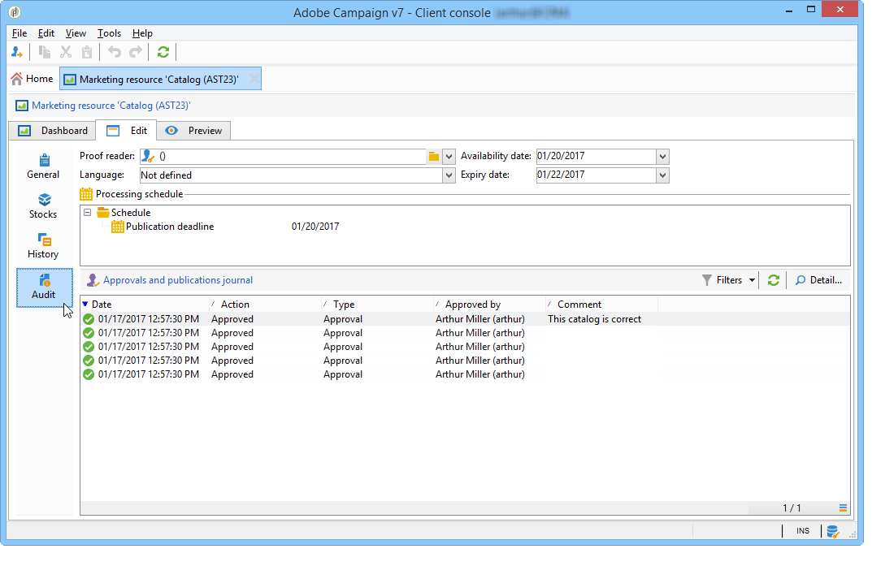

# Administración de recursos de marketing{#managing-marketing-resources}

Adobe Campaign le permite administrar y hacer un seguimiento de los recursos de marketing implicados en el ciclo de vida de la campaña. Estos recursos de marketing pueden ser un folleto, una ayuda visual o cualquier otro medio de comunicación que implique varios operadores.

Puede rastrear el estado y el historial de cualquier recurso de marketing gestionado por Adobe Campaign en cualquier momento y consultar la versión actual.

## Adición de un recurso de marketing {#adding-a-marketing-resource}

Se accede a los recursos de marketing a través de la pestaña **[!UICONTROL Campaigns]**.

Para agregar un recurso, haga clic en el botón **[!UICONTROL Create]**.

Para que un recurso esté disponible en el servidor de Adobe Campaign, debe agregar el recurso deseado arrastrándolo y soltarlo en el área central del editor. También puede hacer clic en el vínculo **[!UICONTROL Upload file to server...]**.

Un mensaje de confirmación le permite iniciar la carga.

Una vez completada la carga, el recurso se añade a la lista de recursos disponibles. Los operadores de Adobe Campaign pueden acceder a él. Pueden verlo (a través de la pestaña **[!UICONTROL Preview]**), realizar una copia para modificarla o actualizar el archivo en el servidor (mediante la pestaña **[!UICONTROL Edit]**).

Haga clic en la pestaña **[!UICONTROL General]** para seleccionar los operadores o grupos de operadores encargados de la supervisión, el seguimiento y la aprobación de este recurso. La selección del revisor se realiza mediante el vínculo **[!UICONTROL Advanced parameters]**.

* El operador al que se asigna el recurso es responsable de su seguimiento.
* El operador encargado de la aprobación es responsable de aprobar el recurso de marketing. Se le notifica cuando se inicie el proceso de validación de recursos.

   Si no hay ningún revisor seleccionado, el recurso **[!UICONTROL cannot be]** puede estar sujeto a aprobación.

* Si es necesario, también puede especificar un corrector.

Puede especificar una fecha de disponibilidad (orientativa) para el recurso. Más allá de esta fecha, aparece con estado **[!UICONTROL Late]**.

## Trabajo en colaboración sobre los recursos {#collaborative-work-on-resources}

Puede modificar y actualizar un recurso de marketing y, si fuera necesario, informar a otros operadores de Adobe Campaign al respecto. Se puede:

* Descargar el recurso de forma local para modificarlo.
* Actualizar el archivo en el servidor y facilitar el acceso a él a otros operadores.
* Bloquee un recurso para evitar que otros operadores lo modifiquen.

>[!NOTE]
>
>La pestaña **[!UICONTROL History]** contiene el registro de descargas y actualizaciones del recurso. El botón **[!UICONTROL Details]** permite ver la versión seleccionada.

### Bloqueo/desbloqueo de un recurso {#locking-unlocking-a-resource}

Una vez creados, los recursos están disponibles en el panel de recursos de marketing y los operadores pueden editarlos y modificarlos.

Cuando un operador desea trabajar con un recurso, es preferible bloquearlo antes de iniciar el trabajo para evitar que otros operadores lo modifiquen al mismo tiempo. A continuación, el recurso se reserva; permanece accesible, pero el resto de operadores no lo pueden publicar ni actualizar en el servidor.

Un mensaje especial notifica a los operadores que intentan acceder a él:

La pestaña **[!UICONTROL Tracking]** indica el nombre del operador que ha bloqueado el recurso y la fecha de actualización prevista.

Para bloquear un recurso, haga clic en el recurso y después en el botón **[!UICONTROL Lock]** en el panel del recurso.

Puede indicar la fecha de retorno planeada en la pestaña **[!UICONTROL Tracking]** del recurso.

Esta información le permite informar a otros operadores de Adobe Campaign de la fecha en que pretende desbloquear el recurso.

Cuando el recurso se ha actualizado, se desbloquea automáticamente y se pone a disposición de todos los operadores.

Si es necesario, también puede desbloquearlo manualmente desde el panel.

>[!NOTE]
>
>Solo el operador que ha bloqueado el recurso y los operadores con derechos de administrador están autorizados a desbloquear un recurso.

### Foros de debate {#discussion-forums}

La pestaña **[!UICONTROL Forum]** de cada recurso permite a los participantes intercambiar información.

[Foros de debate](discussion-forums.md) explica cómo funcionan los foros de debate en Adobe Campaign.

## Ciclo de vida de un recurso de marketing {#life-cycle-of-a-marketing-resource}

Cuando se crea el recurso, los operadores de Adobe Campaign tienen la función de diseñar, corregir, aprobar y publicar el recurso. Se puede determinar una duración para estas campañas.

La pestaña **[!UICONTROL Tracking]** le permite hacer un seguimiento de cualquier acción llevada a cabo sobre el recurso: aprobaciones, denegaciones de aprobación, comentarios relacionados o publicaciones.

La pestaña **[!UICONTROL History]** muestra las transferencias de archivos realizadas para este recurso.

### Proceso de aprobación {#approval-process}

La fecha de disponibilidad prevista se muestra en los detalles del recurso si dicha fecha se especificó en la pestaña **[!UICONTROL Tracking]**. Una vez que llegue esta fecha, puede ejecutar el proceso de aprobación mediante el botón **[!UICONTROL Submit for approval]** del panel de recursos. El estado del recurso cambia a **[!UICONTROL Approval in progress]**.

Se puede aprobar un recurso mediante el botón **[!UICONTROL Approve resource]** en su panel.

Los operadores autorizados pueden aceptar o rechazar la aprobación. Esta acción se puede realizar a través del mensaje de correo electrónico enviado (haciendo clic en el vínculo en el mensaje de notificación) o a través de la consola (haciendo clic en el botón **[!UICONTROL Approve]**).

La ventana de aprobación permite introducir un comentario.

La pestaña **[!UICONTROL Tracking]** permite a todos los operadores rastrear las distintas etapas del proceso de aprobación.

>[!NOTE]
>
>Además del revisor designado para cada recurso de marketing, los operadores con derechos de administrador y el gestor de recursos tienen autorización para aprobar un recurso de marketing.

### Publicación de un recurso {#publishing-a-resource}

Cuando se aprueba, el recurso de marketing debe publicarse. El proceso de publicación debe estar sujeto a una implementación específica según los requisitos de la empresa. Esto significa que los recursos se pueden publicar en una extranet o en cualquier otro servidor, se puede enviar información específica a un proveedor de servicios externos, etc.

Para publicar un recurso, haga clic en el botón **[!UICONTROL Publish]** en el área de edición del panel de recursos de marketing.

También puede automatizar la publicación de un recurso mediante un flujo de trabajo.

La publicación de un recurso implica que está disponible para su uso (por ejemplo, por otra tarea). La publicación como tal varía según la naturaleza del recurso: para un folleto, la publicación puede significar la entrega del archivo a una imprenta; para una agencia web, puede significar publicarlo en un sitio web, etc.

Para que Adobe Campaign publique, se debe crear un flujo de trabajo adecuado y vincularlo al recurso. Para ello, abra el cuadro **[!UICONTROL Advanced settings]** del recurso y seleccione el flujo de trabajo deseado en el campo **[!UICONTROL Post-processing]**.

Esto hace que se ejecute el flujo de trabajo:

* Cuando el revisor haga clic en el vínculo **[!UICONTROL Publish resource]** (o, si no se ha definido ningún revisor, la persona responsable del recurso).
* Si el recurso se administra mediante una tarea de creación de recursos de marketing, el flujo de trabajo se ejecuta cuando la tarea esté configurada como **[!UICONTROL Finished]**, siempre y cuando el cuadro **[!UICONTROL Publish the marketing resource]** esté activado en la tarea (consulte [Tarea de creación de recursos de marketing](creating-and-managing-tasks.md#marketing-resource-creation-task))

Si un flujo de trabajo no se inicia inmediatamente (si el flujo de trabajo se detiene, por ejemplo), el estado del recurso cambia a **[!UICONTROL Pending publication]**. Una vez iniciado el flujo de trabajo, el estado del recurso cambia a **[!UICONTROL Published]**. Este estado no tiene en cuenta los posibles errores en el proceso de publicación. Compruebe el estado del flujo de trabajo para asegurarse de que se ha ejecutado correctamente.

## Vinculación de recursos a una campaña {#linking-a-resource-to-a-campaign}

### Referencia a un recurso de marketing {#referencing-a-marketing-resource}

Los recursos de marketing se pueden asociar a las campañas, siempre y cuando esta característica se haya seleccionado en la plantilla de campaña.

>[!NOTE]
>
>Para obtener más información sobre cómo crear y configurar plantillas de campaña, consulte [Plantillas de campaña](../campaigns/marketing-campaign-templates.md)

Haga clic en la pestaña **[!UICONTROL Documents > Resources]** en el panel de campañas y luego haga clic en **[!UICONTROL Add]** para seleccionar el recurso que desee.

Puede filtrar los recursos por estado, naturaleza o tipo, o aplicar un filtro personalizado.

Haga clic en **[!UICONTROL OK]** para añadir el recurso a la lista de recursos de marketing a los que se hace referencia en esta campaña.

El botón **[!UICONTROL Details]** permite editarlo y verlo.

Los recursos añadidos se muestran en el panel. También pueden editarse desde allí.

### Adición de un recurso de marketing a una descripción del envío {#adding-a-marketing-resource-to-a-delivery-outline}

Los recursos de marketing se pueden asociar a los envíos a través de las descripciones de entrega.

>[!NOTE]
>
>Para obtener más información sobre los esquemas de entrega, consulte [Asociación y estructuración de recursos vinculados a través de una descripción de la entrega](../campaigns/marketing-campaign-deliveries.md).

## Gestión de stock {#stock-management}

Puede asociar un recurso de marketing con uno o más inventarios de existencias para administrar los suministros y mostrar una advertencia en el panel de control en caso de que no haya existencias suficientes.

>[!NOTE]
>
>Para obtener más información sobre la administración de existencias en Adobe Campaign, consulte [Administración de existencias](../campaigns/providers--stocks-and-budgets.md#stock-management).

Para asociar un recurso de marketing a un inventario de existencias, edite la asignación de existencias y edite o cree un inventario. Añada una línea de acción y seleccione el recurso de marketing correspondiente.

Si es necesario, puede editar el recurso seleccionado mediante el icono de **[!UICONTROL Edit the link]** (lupa) situado a la derecha del recurso una vez que se ha seleccionado.

Especifique las existencias iniciales y las existencias de advertencia y, a continuación, guárdelo.

Las existencias se indican en los detalles del recurso.

Si no es suficiente, se envía una advertencia a los operadores correspondientes.

## Funciones avanzadas {#advanced-functions}

El panel de control de marketing permite realizar operaciones de los tipos habituales: agregar, editar, bloquear/desbloquear, aprobar, publicar. Puede crear otros tipos de recursos de marketing y acceder a funciones avanzadas a través del árbol de Adobe Campaign. Para ello, haga clic en **[!UICONTROL Explorer]** en la página principal de Adobe Campaign.

De forma predeterminada, los recursos de marketing se almacenan en el nodo **[!UICONTROL MRM > Marketing resources]** del árbol.

Puede añadir los siguientes recursos desde esta vista:

* Archivo
* HTML
* Texto
* URL
