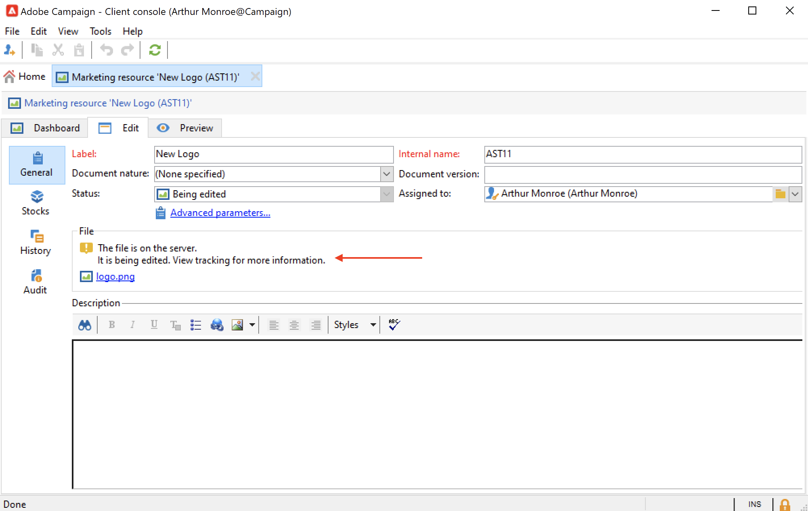

# Administración de recursos de marketing{#managing-marketing-resources}

Utilice Adobe Campaign para administrar y rastrear los recursos de marketing implicados en el ciclo de vida de la campaña. Estos recursos de marketing pueden ser un documento técnico, un archivo de datos, un logotipo o cualquier otro recurso relacionado con una campaña.

Puede rastrear el estado y el historial de cada recurso de marketing gestionado por Adobe Campaign en cualquier momento y consultar la versión actual.

De forma predeterminada, los recursos de marketing se almacenan en **[!UICONTROL MRM > Marketing resources]** del explorador de Campaign.

## Añadir un recurso de marketing {#adding-a-marketing-resource}

Para añadir un recurso de marketing, siga los pasos a continuación:

1. Vaya a la **[!UICONTROL Campaigns]** y seleccione. **[!UICONTROL Marketing resouces]**.

1. Haga clic en el botón **[!UICONTROL Create]**.
   
1. Arrastre y suelte el archivo en la ventana de recursos de marketing para cargarlo en el servidor de Campaign. También puede utilizar la variable **[!UICONTROL Upload file to server...]** vínculo.
   

Una vez completada la carga, el recurso se añade a la lista de recursos disponibles.

## Administración de recursos de marketing {#manage-marketing-resources}

Una vez cargado, el recurso de marketing está disponible para todos los operadores de Adobe Campaign. Pueden verlo, realizar una copia para modificarlo o actualizar el archivo en el servidor.

Utilice el **[!UICONTROL Assigned to]** en la lista desplegable de **[!UICONTROL Edit]** para seleccionar el operador responsable del recurso.

También puede seleccionar los operadores o grupos de operadores a cargo de la validación de recursos y la publicación de recursos. Para acceder a estas opciones, haga clic en  **[!UICONTROL Advanced parameters]** vínculo.

Se notifica a estos operadores por correo electrónico cuando se inicia el proceso de validación de recursos.

Si no hay ningún revisor seleccionado, el recurso **[!UICONTROL cannot be]** puede estar sujeto a aprobación.

Utilice el **[!UICONTROL Audit]** para añadir un lector de pruebas y definir una fecha de disponibilidad para el recurso. Más allá de esta fecha, aparece con estado **[!UICONTROL Late]**.

>[!NOTE]
>
>La pestaña **[!UICONTROL History]** contiene el registro de descargas y actualizaciones del recurso. El botón **[!UICONTROL Details]** permite ver la versión seleccionada.
>
>La pestaña **[!UICONTROL Audit]** le permite hacer un seguimiento de cualquier acción llevada a cabo sobre el recurso: aprobaciones, denegaciones de aprobación, comentarios relacionados o publicaciones.

### Bloqueo/desbloqueo de un recurso {#locking-unlocking-a-resource}

Una vez creados, los recursos están disponibles en el panel de recursos de marketing y los operadores pueden editarlos y modificarlos.

Cuando un operador comienza a trabajar en un recurso, la práctica recomendada es bloquearlo para evitar que otros operadores lo modifiquen al mismo tiempo. A continuación, el recurso se reserva: permanece accesible, pero otro operador no lo puede publicar ni actualizar en el servidor.

Un recurso de marketing solo se puede bloquear si no se ha aprobado.

Para bloquear un recurso, debe hacer clic en el **[!UICONTROL Lock]** en el panel de recursos.

Cuando se haya actualizado el recurso, haga clic en **[!UICONTROL Lock]** en el panel de recursos para que todos los operadores estén disponibles de nuevo.

Un mensaje especial notifica a los operadores que intentan acceder a él:

El **[!UICONTROL Tracking]** indica el nombre del operador que ha bloqueado el recurso.

>[!NOTE]
>
>Solo el operador que ha bloqueado el recurso y los operadores con derechos de administrador están autorizados a desbloquear un recurso.

### Foros de debate {#discussion-forums}

Para cada recurso, la variable **[!UICONTROL Forum]** La pestaña permite a los participantes compartir información.

Obtenga más información en la [Foros de debate](discussion-forums.md) sección.

### Proceso de aprobación {#approval-process}

La fecha de disponibilidad prevista se muestra en los detalles del recurso si dicha fecha se especificó en la pestaña **[!UICONTROL Tracking]**. Una vez que llegue esta fecha, puede ejecutar el proceso de aprobación mediante el botón **[!UICONTROL Submit for approval]** del panel de recursos. El estado del recurso cambia a **[!UICONTROL Approval in progress]**.

Para aprobar un recurso, haga clic en **[!UICONTROL Approve the resource]** en su panel.

Los operadores autorizados pueden aceptar o rechazar la aprobación. Esta acción se puede realizar a través del mensaje de correo electrónico enviado (haciendo clic en el vínculo en el mensaje de notificación) o a través de la consola del cliente (haciendo clic en el botón **[!UICONTROL Approve]** ) botón.

La ventana de aprobación permite introducir un comentario.

Vaya a la **[!UICONTROL Tracking]** para comprobar las aprobaciones.

>[!NOTE]
>
>Además del revisor designado para cada recurso de marketing, los operadores con derechos de administrador y el gestor de recursos tienen autorización para aprobar un recurso de marketing.

### Publicación de un recurso {#publishing-a-resource}

Cuando se aprueba, el recurso de marketing debe publicarse. El proceso de publicación debe estar sujeto a una implementación específica según los requisitos de la empresa. Esto significa que los recursos se pueden publicar en una extranet o en cualquier otro servidor, se puede enviar información específica a un proveedor de servicios externos, etc.

Para publicar un recurso, haga clic en el botón **[!UICONTROL Publish]** en el área de edición del panel de recursos de marketing.

También puede automatizar la publicación de un recurso mediante un flujo de trabajo.

La publicación de un recurso implica que está disponible para su uso (por ejemplo, por otra tarea). La publicación como tal varía según la naturaleza del recurso: para un folleto, la publicación puede significar la entrega del archivo a una imprenta; para una agencia web, puede significar publicarlo en un sitio web, etc.

Para que Adobe Campaign publique, se debe crear un flujo de trabajo adecuado y vincularlo al recurso. Para ello, abra el cuadro **[!UICONTROL Advanced settings...]** del recurso y seleccione el flujo de trabajo deseado en el campo **[!UICONTROL Post-processing]**.

Se ejecuta el flujo de trabajo:

* Cuando el revisor haga clic en el vínculo **[!UICONTROL Publish resource]** (o, si no se ha definido ningún revisor, la persona responsable del recurso).
* Si el recurso se administra mediante una tarea de creación de recursos de marketing, se ejecuta cuando la tarea esté configurada como **[!UICONTROL Finished]**, siempre que la variable **[!UICONTROL Publish the marketing resource]** está activada en la tarea. [Más información](creating-and-managing-tasks.md#marketing-resource-creation-task))

Si un flujo de trabajo no se inicia inmediatamente (si el flujo de trabajo se detiene, por ejemplo), el estado del recurso cambia a **[!UICONTROL Pending publication]**. Una vez iniciado el flujo de trabajo, el estado del recurso cambia a **[!UICONTROL Published]**. Este estado no tiene en cuenta los posibles errores en el proceso de publicación. Compruebe el estado del flujo de trabajo para asegurarse de que se ha ejecutado correctamente.

## Vinculación de recursos a una campaña {#linking-a-resource-to-a-campaign}

### Referencia a un recurso de marketing {#referencing-a-marketing-resource}

Los recursos de marketing se pueden asociar a las campañas, siempre que esta característica se haya seleccionado en la [plantilla de campaña](../campaigns/marketing-campaign-templates.md).

Vaya a la **[!UICONTROL Edit > Documents > Resources]** en el panel de campañas y haga clic en **[!UICONTROL Add]** para seleccionar el recurso que desee.

Puede filtrar los recursos por estado, naturaleza o tipo, o aplicar un filtro personalizado.

Utilice el **[!UICONTROL Details]** para editar y previsualizar el recurso.

### Adición de un recurso de marketing a una descripción del envío {#adding-a-marketing-resource-to-a-delivery-outline}

Los recursos de marketing se pueden asociar a los envíos a través de las descripciones de entrega.

Obtenga más información sobre los esquemas de entrega en [esta sección](../campaigns/marketing-campaign-deliveries.md).

Para ello, haga clic con el botón derecho en una descripción del envío y seleccione **Nuevo > Recurso**.

Introduzca el nombre del recurso y selecciónelo en la **Recurso de marketing** lista desplegable.

## Gestión de stock {#stock-management}

Puede asociar un recurso de marketing con uno o más inventarios de existencias para administrar los suministros y mostrar una advertencia en el panel de control en caso de que no haya existencias suficientes.

Para asociar un recurso de marketing a un inventario de stock, siga los pasos a continuación:

1. Edite un inventario o cree uno nuevo. Más información sobre las existencias en [esta sección](../campaigns/providers--stocks-and-budgets.md#stock-management).

1. Añada una línea de stock y seleccione el recurso de marketing correspondiente.

   

   Puede editar el recurso seleccionado mediante la variable **[!UICONTROL Edit the link]** situado a la derecha del recurso una vez que se ha seleccionado.

1. Especifique las existencias iniciales y las existencias de advertencia y, a continuación, guárdelo.

Las existencias se indican en el recurso de marketing **Existencias** pestaña.
