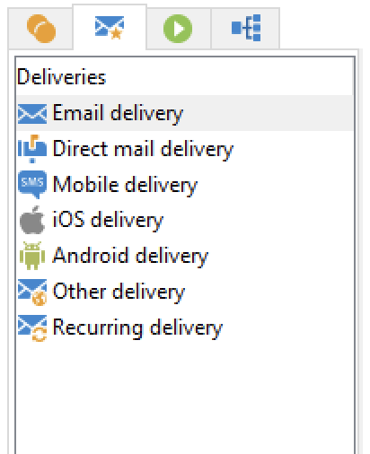

# Actividades de flujo de trabajo{#wf-activities}

Las actividades de flujo de trabajo se agrupan por categoría en cuatro pestañas diferentes.

Según los permisos, la implementación y el contexto en el que se diseñe el flujo de trabajo, las actividades disponibles pueden diferir.

Por ejemplo, los flujos de trabajo creados en una campaña tienen una ficha **Envíos** específica, con todos los canales. Esta ficha no está disponible en [flujo de trabajo técnico](technical-workflows.md).

Los flujos de trabajo técnicos tienen una ficha **Events** específica que no está disponible en [flujos de trabajo de campaña](campaign-workflows.md).

Todas las actividades se detallan en las secciones siguientes:

* [Actividades de segmentación](targeting-activities.md)
* [Actividades de control de flujo](flow-control-activities.md)
* [Actividades de acciones](action-activities.md)
* [Actividades de evento](event-activities.md)
* [Actividades específicas del flujo de trabajo de campaña](../campaigns/marketing-campaign-deliveries.md)
