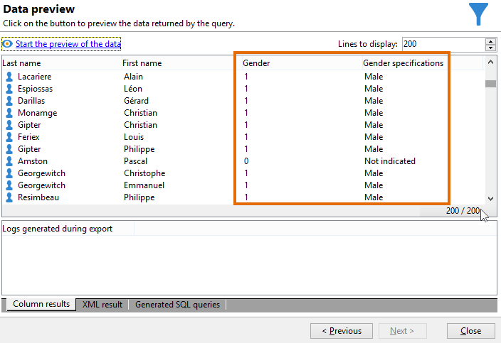

# Adición de un campo calculado de tipo Lista desglosada {#adding-an-enumeration-type-calculated-field}

Aquí se desea crear una consulta con un campo calculado de tipo **[!UICONTROL Enumerations]**. Este campo genera una columna adicional en la ventana de vista previa de datos. Esta columna especifica los valores numéricos devueltos como resultado de cada destinatario (0, 1 y 2). Se asigna un sexo a cada valor de la nueva columna: “Hombre” para “1”, “Mujer” para “2” o “No indicado” si el valor es igual a “0”.

* ¿Qué tabla se debe seleccionar?

  La tabla de destinatario (nms:recipient).

* ¿Campos que se desea seleccionar en la columna de salida?

  Apellidos, Nombre, Sexo

* ¿Con qué criterios se va a filtrar la información?

  El lenguaje del destinatario.

Siga estos pasos:

1. Abra el Editor de consultas genérico y seleccione la tabla de destinatarios (**[!UICONTROL nms:recipient]**).
1. En la ventana **[!UICONTROL Data to extract]**, seleccione **[!UICONTROL Last name]**, **[!UICONTROL First name]** y **[!UICONTROL Gender]**.

   

1. En la ventana **[!UICONTROL Sorting]**, haga clic en **[!UICONTROL Next]**: en este ejemplo, no es necesario ordenar.
1. En **[!UICONTROL Data filtering]**, seleccione **[!UICONTROL Filtering conditions]**.
1. En la ventana **[!UICONTROL Target element]**, defina una condición de filtro para recopilar los destinatarios que hablan en inglés.

   

1. En la ventana **[!UICONTROL Data formatting]**, haga clic en **[!UICONTROL Add a calculated field]**.

   

1. En la ventana **[!UICONTROL Type]**, vaya a la ventana **[!UICONTROL Export calculated field definition]** y seleccione **[!UICONTROL Enumerations]**.

   Defina la columna a la que debe hacer referencia el nuevo campo calculado. Para ello, en el menú desplegable **[!UICONTROL Gender]**, seleccione **[!UICONTROL Source column]** en la columna: los valores de destino coinciden con la columna **[!UICONTROL Gender]**.

   

   Defina los valores de **Origen** y **Destino**: el valor de destino facilita la lectura del resultado de la consulta. Esta consulta debe devolver el sexo del destinatario y el resultado será 0, 1 o 2.

   Para que se introduzca cada línea “origen-destino”, en **[!UICONTROL Add]**, haga clic en **[!UICONTROL List of enumeration values]**:

   * En la columna **[!UICONTROL Source]**, introduzca el valor de origen de cada sexo (0, 1, 2) en una nueva línea.
   * En la columna **[!UICONTROL Destination]**, introduzca los valores: “No indicado” para la línea “0”, “Hombre” para la línea “1” y “Mujer” para la línea “2”.

   Seleccione la función **[!UICONTROL Keep the source value]**.

   Haga clic en **[!UICONTROL OK]** para aprobar el campo calculado.

   

1. En la ventana **[!UICONTROL Data formatting]**, haga clic en **[!UICONTROL Next]**.
1. En la ventana de vista previa, **[!UICONTROL start the preview of the data]**.

   La columna adicional define el género de 0, 1 y 2:

   * 0 para “No indicado”,
   * 1 para “Masculino”,
   * 2 para “Femenino”.

   

   Por ejemplo, si no introduce el género “2” en **[!UICONTROL List of enumeration values]** y la función **[!UICONTROL Generate a warning and continue]** del campo **[!UICONTROL In other cases]** está seleccionada, aparece un registro de advertencia. Este registro indica que no se ha introducido el género “2” (Femenino). Se muestra en el campo **[!UICONTROL Logs generated during export]** de la ventana de vista previa de datos.

   

   Tomemos otro ejemplo y digamos que el valor de la enumeración “2” no se ingresó. Seleccione la función **[!UICONTROL Generate an error and reject the line]** : todos los destinatarios de sexo “2” generan anomalías y el resto de la información de la línea (nombre y apellido, etc.) no se exporta. Se muestra un registro de error en el campo **[!UICONTROL Logs generated during export]** de la ventana de vista previa de datos. Este registro indica que no se ha introducido el valor de enumeración “2”.

   
