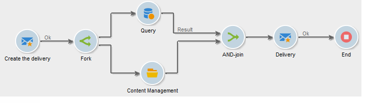

# AND-join{#and-join}

Una unión activa su transición saliente solo cuando se activan todas las transiciones entrantes, es decir, cuando terminan todas las actividades anteriores. Esto le permite asegurarse de que algunas actividades han finalizado antes de continuar ejecutándose el flujo de trabajo.

Por ejemplo, puede utilizar una actividad AND-join en el contexto de la creación de contenido y la automatización de entrega de envíos para asegurarse de que un envío se inicie solo cuando se hayan completado los pasos de consultas de destinatario y actualizaciones de contenido. Hay un caso de uso específico en

>[!NOTE]
>
>Tenga en cuenta que las transiciones entrantes configuradas con diferentes dimensiones de segmentación no se pueden unir mediante una actividad **[!UICONTROL AND-join]**.

La población enviada de la actividad se determina seleccionando un conjunto principal entre las transiciones entrantes de la actividad.

La transición saliente solo puede contener una de las poblaciones de transición entrantes. Si la actividad no está configurada, la transición saliente seleccionará de forma aleatoria una de las poblaciones entrantes.

>[!CAUTION]
>
>En el caso de las actividades de tipo **AND-join**, las variables de eventos se combinan, pero si se define el mismo evento variable dos veces, se genera un conflicto y el valor se mantiene indeterminado. Para obtener más información, consulte [esta sección](javascript-scripts-and-templates.md#event-variables).
