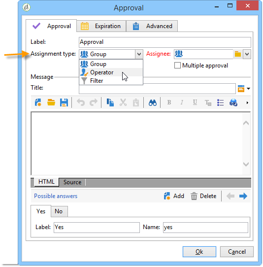
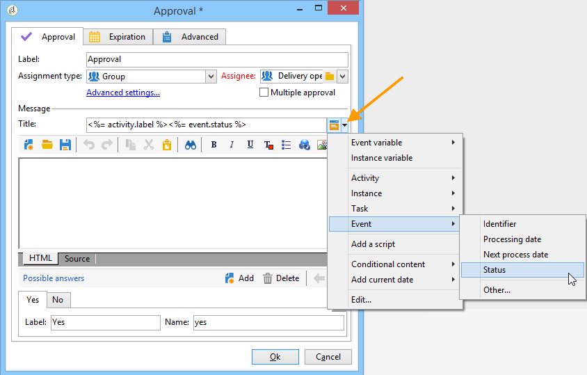

# Aprobación{#approval}

Una tarea de **Approval** implica la participación de un operador. Al operador se le asigna una tarea y puede responder por correo electrónico, utilizando la página web vinculada en el mensaje del correo electrónico o a través de la consola.

## Asignación de tareas {#task-assignment}

De forma predeterminada, la aprobación se le asigna a un grupo de operadores. Este grupo representa una función, por ejemplo, un “grupo de contenido del boletín informativo” o “grupo de objetivos del boletín informativo”. Cada operador del grupo puede responder, pero solo se tiene en cuenta la primera respuesta (excepto en caso de varias aprobaciones).

Si es necesario, puede asignar la tarea de aprobación a un solo operador o a un conjunto de operadores definidos por un filtro.

* Para seleccionar un solo operador, seleccione el valor **[!UICONTROL Operator]** en el campo **[!UICONTROL Assignment type]** y seleccione el operador correspondiente en la lista desplegable del campo **[!UICONTROL Assignee]**.

  

  >[!CAUTION]
  >
  >Sólo el operador elegido estará autorizado a aprobar la tarea.

* Puede definir una consulta para filtrar los operadores de aprobación. Para ello, en el campo **[!UICONTROL Assignment type]** seleccione el valor **[!UICONTROL Filter]** y haga clic en el vínculo **[!UICONTROL Advanced parameters...]** para definir las condiciones de filtrado, como se muestra en el siguiente ejemplo:

  

En caso de una sola aprobación, la transición correspondiente a la opción de operador se activa y la tarea finaliza: los demás operadores no pueden responder.

En caso de varias aprobaciones, se activan las transiciones correspondientes a la opción de cada operador. La tarea finaliza cuando han respondido todos los operadores del grupo o si ha caducado la tarea.

Esta actividad no bloquea el procesamiento y el flujo de trabajo puede realizar otras tareas mientras espera una respuesta.

Un operador puede aprobar las tareas asignadas a ese operador desde la consola del cliente. Un operador con derechos de administrador puede ver y eliminar las tareas asignadas a cualquier operador, pero no puede responder a ellas.

Modificar el título o el cuerpo del mensaje de la actividad no afecta a las tareas actuales, sino que modifica las posibles elecciones que directamente afectan a las tareas actuales, que heredan automáticamente la nueva lista de opciones.

Se puede acceder a las tareas de tipo de **Approval** desde el nodo **[!UICONTROL Administration > Production > Objects created automatically > Approvals pending]**: los operadores pueden acceder al formulario de aprobación directamente a través de esta vista.

## Propiedades {#properties}

Las variables personalizadas se pueden utilizar en el mensaje enviado a los revisores. Pueden insertarse en el título o en el cuerpo del mensaje.

Este campo **[!UICONTROL Title]** contiene el título del mensaje: Este es el asunto del mensaje de correo electrónico enviado. El título, así como el cuerpo del mensaje, son plantillas JavaScript y, por tanto, contienen valores calculados según el contexto del flujo de trabajo.

La sección inferior del editor permite definir la lista de posibles respuestas. Hay una transición correspondiente a cada respuesta. El nombre es el identificador interno y la etiqueta es el texto que se mostrará en la lista de opciones.

Haga clic en el enlace **[!UICONTROL Advanced parameters...]** para seleccionar la plantilla de envío que desea utilizar para notificar a los operadores. La plantilla predeterminada (nombre interno &#39;notifyAssignee&#39;) toma el título y el mensaje y añade un vínculo a la página web que se utiliza para responder.

Esta plantilla se puede modificar para personalizar el diseño del mensaje, pero es preferible realizar una copia. El mecanismo de objetivo (archivo externo, asignación de destino) no debe modificarse porque es necesario para que las notificaciones funcionen correctamente.

Se muestra un ejemplo de aprobación en [Definición de aprobaciones](define-approvals.md).

## Parámetros de salida {#output-parameters}

* **[!UICONTROL response]**

  Comentario relacionado con la respuesta

* **[!UICONTROL responseOperator]**

  Identificador del operador que ha respondido. Este campo es un valor numérico, pero un campo **[!UICONTROL String]**.
