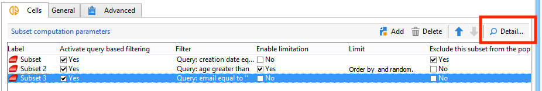

# Celdas{#cells}

La actividad **[!UICONTROL Cells]** proporciona una vista de los distintos subconjuntos como columnas de datos. Facilita la manipulación de subconjuntos y está diseñado para aprovechar las capacidades de personalización.


Esta actividad se puede configurar para que introduzca parámetros específicos basados en las necesidades del usuario. De forma predeterminada, el detalle de cada subconjunto se detalla en una ventana dedicada a través de las pestañas **[!UICONTROL Cells]** y **[!UICONTROL Advanced]**.



En el ejemplo que se muestra a continuación, se ha modificado el formulario de entrada: se ha agregado una pestaña **[!UICONTROL Data]** para habilitar la asociación de una oferta y un nivel de prioridad para cada subconjunto.


Para esta configuración, se agregó la siguiente información al formulario de flujo de trabajo, en el nodo **[!UICONTROL Administration > Configurations > Input forms]** del explorador de Adobe Campaign:

```
<container img="nms:miniatures/mini-enrich.png" label="Data">
                <input xpath="@code"/>
                <container xpath="select/node[@alias='@numTest']">
                  <input alwaysActive="true" expr="'long'" type="expr" xpath="@type"/>
                  <input alwaysActive="true" expr="'Priority'" type="expr" xpath="@label"/>
                  <input label="Priority" maxValue="12" minValue="0" type="number"
                         xpath="@value" xpathEditFromType="@type"/>
                </container>
                <container xpath="select/node[@alias='@test']">
                  <input alwaysActive="true" expr="'string'" type="expr" xpath="@type"/>
                  <input alwaysActive="true" expr="'Identifier'" type="expr" xpath="@label"/>
                  <input label="Cell identifier" xpath="@value"/>
                </container>
                <container xpath="select/node[@alias='linkTest']">
                  <input alwaysActive="true" expr="'link'" type="expr" xpath="@type"/>
                  <input alwaysActive="true" expr="'nms:offer'" type="expr" xpath="@dataType"/>
                  <input alwaysActive="true" expr="'Offre'" type="expr" xpath="@label"/>
                  <input computeStringAlias="@valueLabel" label="Offers" notifyPathList="@_cs|@valueLabel"
                         schema="nms:offer" type="linkEdit" xpath="@value"/>
                </container>
```

La personalización del formulario de entrada en Adobe Campaign está reservada para usuarios expertos.