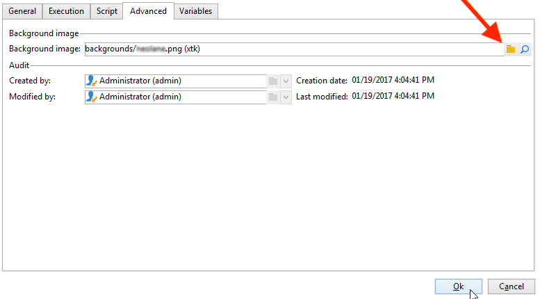

# Cambio de imágenes de actividad{#change-activity-images}

Las imágenes utilizadas en los diagramas de los distintos flujos de trabajo pueden modificarse. Sin embargo, deben cumplir ciertas limitaciones. Estas son las etapas de implementación:

* Para cambiar la imagen de fondo, seleccione el flujo de trabajo de objetivos deseado y haga clic en la pestaña **[!UICONTROL Properties]**.

  

  Para seleccionar la imagen que desea utilizar, haga clic en el icono **[!UICONTROL Select link]** a la derecha del campo **[!UICONTROL Background image]**.

  >[!NOTE]
  >
  >La anchura en píxeles de la imagen de fondo debe ser múltiplo de 4.

  

  El icono **[!UICONTROL Edit link]** permite ver la imagen seleccionada.

* Para cambiar la imagen asociada a una actividad, haga doble clic en el objeto y, a continuación, haga clic en la pestaña **[!UICONTROL Advanced]**.

  Para seleccionar la imagen que desea utilizar, haga clic en el icono **[!UICONTROL Select link]** a la derecha del campo **[!UICONTROL Image]**.

  

  El icono **[!UICONTROL Edit link]** permite ver la imagen seleccionada.

  

>[!NOTE]
>
>Las imágenes guardadas en el nodo **[!UICONTROL Administration > Configuration > Images]** del árbol se pueden seleccionar.
>  
>Las imágenes deben tener formato PNG, con 48x48 píxeles, 16 millones de colores y un fondo transparente.
