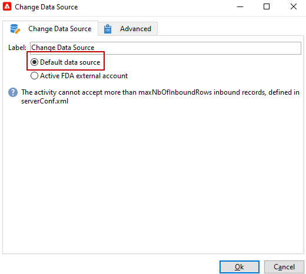

# Cambio de la fuente de datos {#change-data-source}

Utilice la actividad **[!UICONTROL Change data source]** para cambiar el origen de datos de una [tabla de trabajo del flujo de trabajo](use-workflow-data.md#workflow-temporary-work-table). Esta actividad proporciona más flexibilidad para administrar datos en diferentes fuentes de datos, como el acceso de datos federado (FDA), la base de datos en la nube de Campaign (FDAC) y la base de datos local de Campaign.

El flujo de trabajo **[!UICONTROL Working table]** se usa para controlar y compartir datos con las actividades de flujo de trabajo.

De manera predeterminada, **[!UICONTROL Working table]** se crea en la misma base de datos que el origen de los datos que necesita consultar.
Por ejemplo, al consultar la tabla **[!UICONTROL Recipients]**, almacenada en la base de datos en la nube, el flujo de trabajo crea un **[!UICONTROL Working table]** en la misma base de datos en la nube.

Use una actividad **[!UICONTROL Change Data Source]** para usar un origen de datos diferente para su **[!UICONTROL Working table]**.

Tenga en cuenta que cuando utilice la actividad **[!UICONTROL Change Data Source]**, deberá volver a la base de datos en la nube para continuar con la ejecución del flujo de trabajo.

>[!IMPORTANT]
>
>Tenga en cuenta que las actividades **[!UICONTROL Change Dimension]** y **[!UICONTROL Change Data source]** no deben agregarse en una fila. Si necesita usar ambas actividades consecutivamente, asegúrese de incluir una actividad **[!UICONTROL Enrichement]** entre ellas. Esto garantiza una ejecución adecuada y evita posibles conflictos o errores.

>[!NOTE]
>
>La actividad **Change Data Source** puede procesar un máximo de un millón de registros por ejecución. Póngase en contacto con su representante de Adobe si necesita aumentar este límite.

Para usar la actividad **[!UICONTROL Change Data Source]**, debe:

1. Cree un flujo de trabajo.

1. Consulte los destinatarios objetivo con una actividad **[!UICONTROL Query]**.

   Para obtener más información sobre la actividad **[!UICONTROL Query]**, consulte esta [página](query.md#create-a-query)

1. Agregue una actividad **[!UICONTROL Change data source]**.

   

1. Edite su actividad **[!UICONTROL Change data source]** para seleccionar **[!UICONTROL Default data source]**.

   La tabla de trabajo, que contiene el resultado de la consulta, se mueve a la base de datos local de Campaign predeterminada.

   

1. Agregue una actividad **[!UICONTROL JavaScript code]** para realizar operaciones unitarias en la tabla de trabajo.

   Para obtener más información sobre la actividad **[!UICONTROL JavaScript code]**, consulte [esta página](sql-code-and-javascript-code.md#javascript-code).

1. Añada otra actividad **[!UICONTROL Change data source]** para volver a la base de datos en la nube.

1. Edite esta actividad y seleccione **[!UICONTROL Active FDA external account]**, junto con la cuenta externa correspondiente **[!UICONTROL External database]**.

   

1. Ahora puede iniciar el flujo de trabajo.
