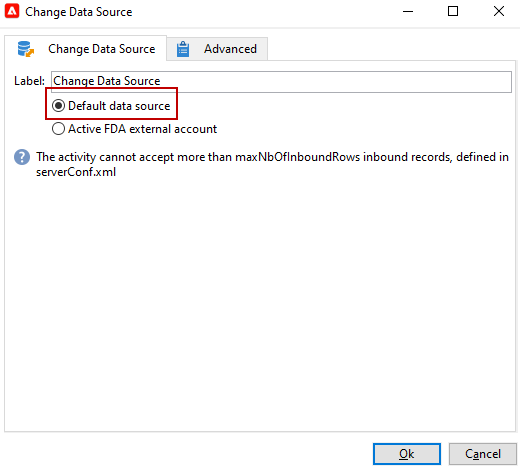

# Cambio de la fuente de datos {#change-data-source}

Utilice la variable **[!UICONTROL Change data source]** actividad para cambiar la fuente de datos de un [tabla de trabajo del flujo de trabajo](use-workflow-data.md#workflow-temporary-work-table). Esta actividad proporciona más flexibilidad para administrar los datos en diferentes fuentes de datos, como el acceso de datos federado (FDA), la base de datos de Campaign Cloud (FFDA) y la base de datos local de Campaign.

El flujo de trabajo **[!UICONTROL Working table]** se utiliza para gestionar y compartir datos con las actividades de flujo de trabajo.

De forma predeterminada, la variable **[!UICONTROL Working table]** se crea en la misma base de datos que el origen de los datos en los que debe realizar la consulta.
Por ejemplo, al consultar la **[!UICONTROL Recipients]** , almacenado en la base de datos de Cloud, el flujo de trabajo crea un **[!UICONTROL Working table]** en la misma base de datos de Cloud.

Utilice un **[!UICONTROL Change Data Source]** actividad para usar una fuente de datos diferente para su **[!UICONTROL Working table]**.

Tenga en cuenta que al usar la variable **[!UICONTROL Change Data Source]** actividad , debe volver a la base de datos de Cloud para continuar con la ejecución del flujo de trabajo.

Para usar la variable **[!UICONTROL Change Data Source]** actividad, debe:

1. Cree un flujo de trabajo.

1. Consulte los destinatarios objetivo con una actividad **[!UICONTROL Query]**.

   Para obtener más información sobre la actividad **[!UICONTROL Query]**, consulte esta [página](query.md#create-a-query)

1. Agregue un **[!UICONTROL Change data source]** actividad.

   

1. Edite su **[!UICONTROL Change data source]** actividad que desea seleccionar **[!UICONTROL Default data source]**.

   La tabla de trabajo, que contiene el resultado de la consulta, se mueve a la base de datos local de Campaign predeterminada.

   

1. Agregue un **[!UICONTROL JavaScript code]** actividad para realizar operaciones unitarias en la tabla de trabajo.

   Para obtener más información sobre **[!UICONTROL JavaScript code]** actividad, consulte la [esta página](sql-code-and-javascript-code.md#javascript-code).

1. Añada otra actividad **[!UICONTROL Change data source]** para volver a la base de datos en la nube.

1. Edite esta actividad y seleccione **[!UICONTROL Active FDA external account]** y el **[!UICONTROL External database]** cuenta externa.

   

1. Ahora puede iniciar el flujo de trabajo.
