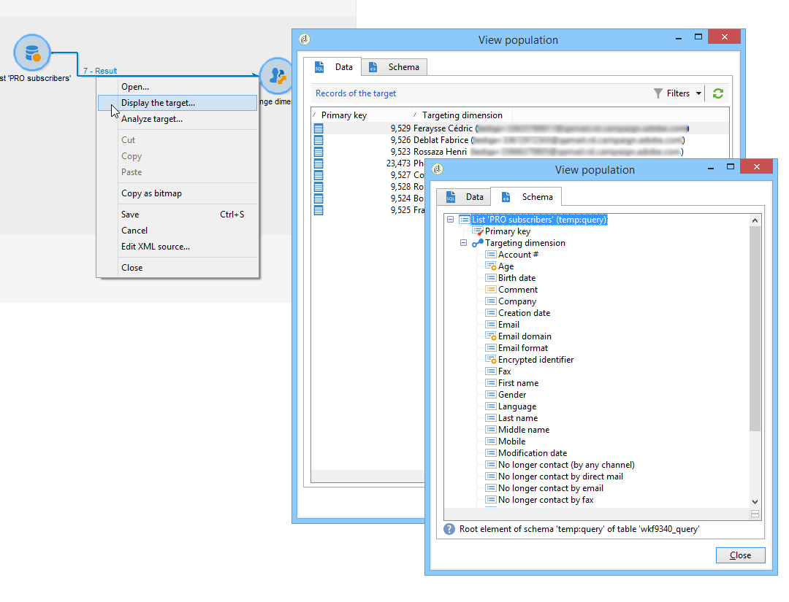

# Cambio de dimensión{#change-dimension}

Utilice el **[!UICONTROL Change dimension]** actividad para cambiar la dimensión de segmentación mientras crea una audiencia. Esta actividad desplaza el eje según la plantilla de datos y la dimensión de entrada. Por ejemplo, cambia de la dimensión &quot;contratos&quot; a la dimensión &quot;clientes&quot;.

También puede utilizar esta actividad para definir las columnas adicionales del nuevo destinatario y los criterios de anulación de duplicación de datos.

>[!IMPORTANT]
>
>Tenga en cuenta que las **[!UICONTROL Change Dimension]** y **[!UICONTROL Change Data source]** las actividades no deben agregarse en una fila. Si necesita utilizar ambas actividades consecutivamente, asegúrese de incluir un **[!UICONTROOL Enriquecimiento]** actividad entre ellos. Esto garantiza una ejecución adecuada y evita posibles conflictos o errores.

Para configurar la variable **[!UICONTROL Change dimension]** actividad, siga los siguientes pasos:

1. Seleccione la nueva dimensión de destino mediante el campo **[!UICONTROL Change dimension]**.

   

1. Durante el cambio de dimensión, se pueden mantener todos los elementos o seleccionar los que desea conservar en la salida. En el ejemplo siguiente, el número máximo de duplicados se establece en 2.

   

   Cuando decide mantener un solo registro, se muestra una colección en el esquema de trabajo: Esta colección representa todos los registros que no van a ser objetivo en el resultado final (ya que solo se guarda un registro). Al igual que todas las demás colecciones, este permite calcular las agregaciones o recuperar información en columnas.

   Por ejemplo: si se cambia la dimensión **[!UICONTROL Customers]** a la dimensión **[!UICONTROL Recipients]**, es posible dirigirse a los clientes de un almacén específico, al mismo tiempo que se añade el número de compras realizadas.

1. Si elige no conservar toda esta información, puede configurar el modo de gestión del duplicado.

   

   Las flechas azules permiten definir la prioridad de procesamiento duplicada.

   En el ejemplo anterior, los destinatarios se deduplicarán en su dirección de correo electrónico primero, luego, si es necesario, en su número de cuenta.

1. La pestaña **[!UICONTROL Result]** permite añadir información adicional.

   Por ejemplo, se puede recuperar el municipio en función del código postal utilizando una función de tipo **Substring**. Para ello:

   * Haga clic en el vínculo **[!UICONTROL Add data...]** y seleccione **[!UICONTROL Data linked to the filtering dimension]**.

     

     >[!NOTE]
     >
     >Para obtener información sobre la creación y administración de columnas adicionales, consulte [Añadir datos](query.md#add-data).

   * Seleccione la dimensión de segmentación anterior (antes del cambio de eje) y, en el subárbol **[!UICONTROL Zip Code]** del destinatario, seleccione **[!UICONTROL Location]** y haga clic en **[!UICONTROL Edit expression]**.

     

   * Haga clic en **[!UICONTROL Advanced selection]** y elija **[!UICONTROL Edit the formula using an expression]**.

     

   * Utilice las funciones ofrecidas en la lista y especifique el cálculo que se va a realizar.

     

   * Finalmente, introduzca la etiqueta de la columna que acaba de crear.

     

1. Ejecute el flujo de trabajo para ver el resultado de esta configuración. Compare los datos de las tablas antes y después de la actividad de dimensión cambiante y compare la estructura de las tablas de flujo de trabajo, como se muestra en los ejemplos siguientes:

   

   
