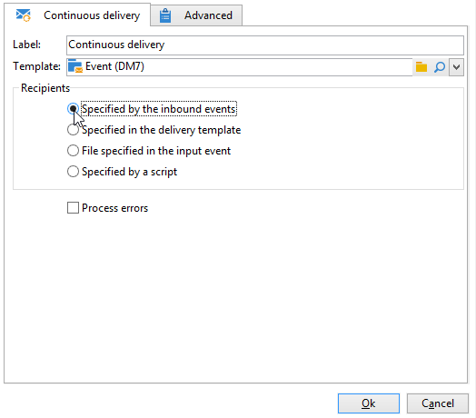

# Entrega continua{#continuous-delivery}

Una acción del tipo **Entrega continua** permite agregar nuevos destinatarios a una entrega existente. Este tipo de envío evita tener que crear una nueva cada vez: este modo suele ser más eficaz, en particular para alertas de bajo volumen o notificaciones enviadas cuando es necesario.

 [Descubra esta función en vídeo](#continuous-delivery-video)

A nivel de la plantilla de envío, puede especificar un script para calcular la etiqueta (y la carpeta de la campaña) de la entrega asociado. Si la secuencia de comandos calcula una entrega que aún no existe, se crea sobre la marcha.

La opción **[!UICONTROL Process errors]** muestra una transición particular que se activa si se genera un error. En este caso, el flujo de trabajo no pasa al modo de error y se activa con la ejecución.

Los errores que se tienen en cuenta son los errores del sistema de archivos (el archivo no se puede mover, no se puede acceder a un directorio, etc.).

Esta opción no procesa los errores relacionados con la configuración de la actividad, es decir, valores no válidos.

## Parámetros de entrada {#input-parameters}

* tableName
* esquema

Cada evento entrante debe especificar un objetivo definido por estos parámetros.

Solamente cuando la opción **[!UICONTROL Specified by the inbound event]** está seleccionada.

## Parámetros de salida {#output-parameters}

* tableName
* esquema
* recCount

Este conjunto de tres valores identifica el objetivo resultante de la entrega sobre la marcha. **[!UICONTROL tableName]** es el nombre de la tabla que memoriza los identificadores del objetivo, **[!UICONTROL schema]** es el esquema de la población (normalmente nms:recipient) y **[!UICONTROL recCount]** es el número de elementos de la tabla.

La transición asociada al complemento tiene los mismos parámetros.

## Configuración de envíos continuos

En esta sección se explica cómo configurar un envío continuo.

Los **envíos continuos** le permiten añadir destinatarios nuevos a un envío existente, lo que evita tener que crear un envío nuevo cada vez que se añade un nuevo destinatario. Puede actualizar el elemento creativo directamente en el flujo de trabajo de campaña para que se actualice la plantilla en la carpeta Recurso de plantilla de envíos.

Un envío continuo creará un envío ÚNICO y registros de envío (broadLog) y registros de seguimiento que hacen referencia a que se agrega un envío cada vez que se ejecuta.

## Tutorial en vídeo {#continuous-delivery-video}

Este vídeo muestra cómo configurar un envío continua con una consulta incremental.

>[!VIDEO](https://video.tv.adobe.com/v/25039?quality=12)

Hay disponibles [más vídeos de procedimientos para Campaign aquí](https://experienceleague.adobe.com/docs/campaign-learn/tutorials/getting-started/introduction-to-adobe-campaign.html?lang=es){target="_blank"}.
