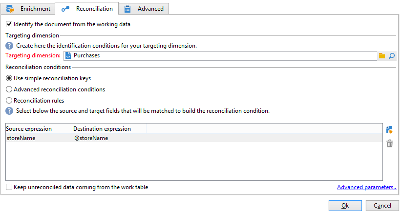

# Creación de una lista de resumen{#creating-a-summary-list}

Este caso de uso detalla la creación de un flujo de trabajo que, después de recopilar archivos y luego de varios enriquecimientos, permite crear una lista de resumen. El ejemplo se basa en una lista de contactos que realizaron compras en una tienda.


Se utiliza la siguiente estructura de datos:


Su objetivo es:

* Para utilizar las distintas opciones de la actividad de enriquecimiento
* Para actualizar los datos de la base de datos después de una conciliación
* Para crear una “vista” global de los datos enriquecidos

Para crear una lista de resumen, se debe seguir estos pasos:

1. Recopilación y carga de un archivo “Compras” en la tabla de trabajo del flujo de trabajo.
1. Enriquecimiento de los datos importados creando un vínculo con una tabla de referencia.
1. Actualización de la tabla “Compras” con los datos enriquecidos.
1. Enriquecimiento de los datos de “Contactos” con un cálculo agregado de la tabla “Compras”.
1. Creación de la lista de resumen

## Paso 1: Cargue el archivo y concilie los datos importados {#step-1--loading-the-file-and-reconciling-the-imported-data}

Los datos que se desean cargar son aquellos relacionados con las “Compras” con el siguiente formato:

```
Product Name;Product price;Store
Computer;2000;London 3
Tablet;600;Cambridge
Computer;2000;London 5
Computer;2000;London 8
Tablet;600;Cambridge
Phone;500;London 5
```

Estos datos se incluyen en un archivo de texto “Compras.txt”.

1. Agregue las actividades de **Recolección de archivos** y **Carga de datos (archivo)** al flujo de trabajo.

   La actividad **Recolección de archivos** permite recopilar y enviar archivos desde y hacia el servidor de Adobe Campaign.

   La actividad **Carga de datos (archivo)** permite enriquecer la tabla de trabajo del flujo de trabajo con los datos recopilados. Para obtener más información, consulte [esta página](data-loading--file-.md).

1. Configure la actividad **Recolector de ficheros** para recopilar archivos de texto (*.txt) &#42; del directorio seleccionado.

   

   La actividad **Recolector de ficheros** permite administrar la ausencia de un archivo en el directorio fuente. Para ello, marque la opción **[!UICONTROL Process file nonexistence]**. En este flujo de trabajo se ha agregado una actividad de **Espera** para probar otra recopilación de archivos si no se encuentra en el directorio en el momento de la recopilación.

1. Configure la actividad **Data loading (file)** con un archivo de muestra con el mismo formato que los datos que se desean importar.

   

   Haga clic en el vínculo **[!UICONTROL Click here to change the file format...]** para cambiar el nombre de las columnas con los nombres y etiquetas internos de la tabla &quot;Purchases&quot;.

   

Una vez importados los datos, se lleva a cabo el enriquecimiento creando un vínculo a una tabla de referencia que coincida con el esquema “Stores”.

Añada la actividad de enriquecimiento y configúrela como se indica a continuación:

1. Seleccione el conjunto principal compuesto de los datos en la actividad **Data loading(file)**.

   

1. Haga clic en **[!UICONTROL Add data]**, luego seleccione la opción **[!UICONTROL A link]**.

   

1. Seleccione la opción **[!UICONTROL Define a collection]**.
1. Seleccione el esquema “Stores” como objetivo.

   

Para obtener más información sobre los distintos tipos de vínculos, consulte [Enriquecimiento y modificación de datos](targeting-workflows.md#enrich-and-modify-data).

En la siguiente ventana, se debe crear una condición de unión seleccionando el campo de origen (en el conjunto principal) y el campo de objetivo (perteneciente al esquema “Stores”) para configurar la conciliación de datos.


Con el vínculo ya creado, se agrega una columna a la tabla de trabajo del flujo de trabajo desde el esquema “Stores”: el campo “ZipCode Reference”.

1. Abra la actividad de enriquecimiento.
1. Haga clic en **[!UICONTROL Edit additional data]**.
1. Agregue el campo “ZipCode Reference” a **[!UICONTROL Output columns]**.


Los datos de la tabla de trabajo del flujo de trabajo después de este enriquecimiento son los siguientes:


## Paso 2: Escriba datos enriquecidos en la tabla “Compras” {#step-2--writing-enriched-data-to-the--purchases--table}

Este paso detalla cómo escribir los datos importados y enriquecidos en la tabla “Purchases”. Para ello, se debe utilizar una actividad **Update data**.

Se debe llevar a cabo una conciliación entre los datos de la tabla de trabajo del flujo de trabajo y del entorno de segmentación de **Purchases** antes de actualizar los datos en la tabla **Purchases**.

1. En la actividad de enriquecimiento, haga clic en la pestaña **[!UICONTROL Reconciliation]**.
1. Seleccione el entorno de segmentación, el esquema “Purchases” en este caso.
1. Seleccione una “Source expression” para los datos de la tabla de flujo de trabajo (el campo “storeName” en este caso).
1. Seleccione una “Destination expression” para los datos de la tabla “Purchases” (el campo “storename” en este caso).
1. Marque la opción **[!UICONTROL Keep unreconciled data coming from the work table]**.



En la actividad **Update date**, se necesita la siguiente configuración:

1. Seleccione la opción **[!UICONTROL Insert or update]**, en el campo **[!UICONTROL Operation type]** para evitar la creación de registros nuevos cada vez que se recopile el archivo.
1. Seleccione el valor **[!UICONTROL By directly using the targeting dimension]** de la opción **[!UICONTROL Record identification]**.
1. Seleccione el esquema “Purchases” como **[!UICONTROL Document type]**.
1. Especifique la lista de campos que desea actualizar. La columna **[!UICONTROL Destination]** permite definir los campos del esquema “Purchases”. La columna **[!UICONTROL Expression]** permite seleccionar los campos de la tabla de trabajo para realizar una asignación.
1. Haga clic en la opción **[!UICONTROL Generate an outbound transition]**.


## Paso 3: Enriquezca los datos de “Contacto” {#step-3--enriching--contact--data-}

El esquema “Contacts” está vinculado físicamente al esquema “Purchases”. Esto significa que se puede utilizar otra opción de “Enrichment”: agregar datos vinculados al entorno de filtrado.

El propósito de este segundo enriquecimiento es crear un agregado en el esquema de compra para calcular la cantidad total de compras para cada contacto identificado.

1. Agregue una actividad de **consulta** que le permita recuperar todos los **contactos** almacenados.
1. Agregue una actividad **Enrichment** y seleccione el conjunto principal resultante de la consulta anterior.
1. Haga clic en añadir **[!UICONTROL Data]**.
1. Haga clic en la opción **[!UICONTROL Data linked to the targeting dimension]**.
1. Haga clic en la opción **[!UICONTROL Data linked to the filtering dimension]** de la ventana **[!UICONTROL Select fields to add]**.
1. Seleccione el nodo **[!UICONTROL Purchases]** y haga clic en **[!UICONTROL Next]**.

   

1. Cambie el campo **[!UICONTROL Collected data]** seleccionando la opción **[!UICONTROL Aggregates]**.

   

1. Haga clic en **[!UICONTROL Next]**.
1. Agregue la siguiente expresión para calcular el total de compra para cada contacto:&quot;Sum(@prodprice)&quot;.

   

Para preparar la lista de resumen, se debe agregar campos desde “Purchases” y del primer enriquecimiento: el campo “ZipCode Reference”.

1. Haga clic en el vínculo **[!UICONTROL Edit additional data...]** de la actividad de enriquecimiento.
1. Agregue los campos “Store name” y “Purchases / Zip Code Reference”.

   

1. Seleccione la pestaña **[!UICONTROL Properties]**.
1. Cambie el segundo vínculo para crear solo una línea.

## Paso 4: Cree y añada a una lista de resumen {#step-4--creating-and-adding-to-a-summary-list}

El último paso implica la escritura de todos los datos enriquecidos en una lista.

1. Agregue una actividad **List update** al flujo de trabajo. Esta actividad debe estar vinculada a la transición saliente de la segunda actividad de enriquecimiento.
1. Seleccione la opción **[!UICONTROL Create the list if necessary (Calculated name)]**.
1. Seleccione un valor para el nombre calculado. La etiqueta elegida para la lista es la fecha actual: &lt;%= formatDate(new Date(), &quot;%2D/%2M/%2Y&quot;) %>.

Una vez ejecutado el flujo de trabajo, la lista incluye:

* una lista de contactos,
* una columna “Total purchases”,
* una columna “Store name”,
* una columna “Zip Code Reference” para todas las tiendas incluidas en el esquema de referencia de tiendas.


