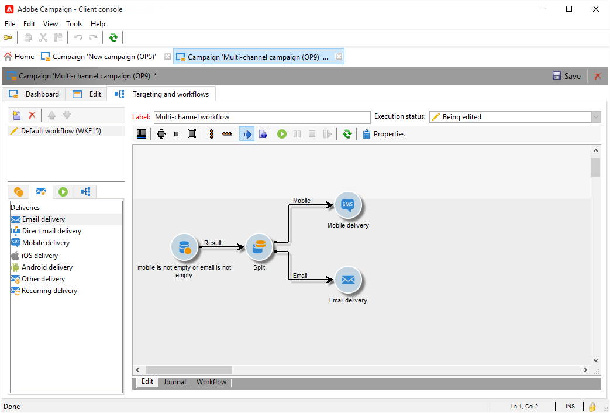

# Entregas multicanal{#cross-channel-deliveries}

Los envíos multicanal están disponibles en la pestaña **[!UICONTROL Deliveries]** de las actividades de [flujo de trabajo de la campaña](campaign-workflows.md).

Seleccione la plantilla en la que desea basar la entrega y defina su contenido.

Puede especificar un público objetivo para la entrega ascendente del flujo de trabajo utilizando las distintas actividades de direccionamiento.

En el siguiente ejemplo, aprenda a crear un flujo de trabajo para enviar un correo electrónico o un SMS a los suscriptores de las notificaciones push una semana después. Para ello:

1. Cree una campaña.
1. En la ficha **[!UICONTROL Targeting and workflows]** de su campaña, agregue una actividad **[!UICONTROL Query]**.
1. Configure your query: seleccione los destinatarios suscritos a las notificaciones push como dimensión objetivo.

   >[!NOTE]
   >
   >Para las notificaciones push, recuerde utilizar la dimensión objetivo **aplicaciones del suscriptor**.

   

1. Agregue las condiciones de filtro a la consulta. En este caso, se seleccionarán los destinatarios que tengan un número de teléfono móvil o una dirección de correo electrónico.

   

1. Añada una actividad **[!UICONTROL Split]** al flujo de trabajo para dividir los destinatarios que tienen número de móvil y aquellos que tienen dirección de correo electrónico.
1. En la pestaña **[!UICONTROL Delivery]**, seleccione una entrega para cada uno de sus destinatarios.

   Cree su envío de la misma manera que con el asistente de envíos clásico haciendo doble clic en la actividad de envío del flujo de trabajo.

   

1. Añada y configure una actividad **[!UICONTROL Wait]** para que los destinatarios no reciban demasiados envíos a la vez.
1. Añada una actividad **[!UICONTROL Split]** para dividir los suscriptores de aplicaciones móviles iOS o Android.

   Seleccione un servicio para cada uno de los sistemas operativos.

   

1. Seleccione y configure una entrega de aplicaciones para dispositivos móviles para cada uno de los sistemas operativos.

   
