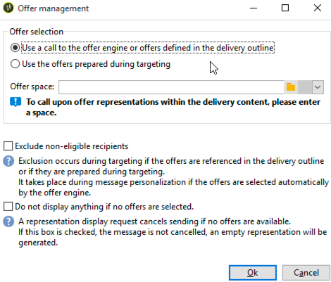

# Flujo de trabajo de entrega por canales cruzados{#cross-channel-delivery-workflow}

Este caso de uso presenta un ejemplo que implica un flujo de trabajo de envío por canales cruzados. En [esta sección](cross-channel-deliveries.md) se presenta el concepto general de envíos por canales cruzados.

El objetivo es segmentar a un público de los destinatarios de la base de datos en grupos diferentes con el fin de enviar un correo electrónico a un grupo y un mensaje SMS a otro grupo.

Los pasos de implementación principales para este caso de uso son los siguientes:

1. Creación de una actividad **[!UICONTROL Query]** para dirigirse al público.
1. Creación de una actividad **[!UICONTROL Email delivery]** que contenga un vínculo a una oferta.
1. Uso de una actividad **[!UICONTROL Split]** para:

   * Enviar otro correo electrónico a los destinatarios que no hayan abierto el primer correo electrónico.
   * Enviar un SMS a los destinatarios que abrieron el correo electrónico pero que no hicieron clic en el vínculo de la oferta.
   * Agregar a la base de datos los destinatarios que abrieron el correo electrónico e hicieron clic en el vínculo.

## Paso 1: Creación de la audiencia {#step-1--build-the-audience}

Para definir el objetivo, cree una consulta para identificar los destinatarios.

1. Cree una campaña. Obtenga más información en [esta página](../campaigns/marketing-campaign-create.md).
1. En la pestaña **[!UICONTROL Targeting and workflows]** de la campaña, añada una actividad **Query** al flujo de trabajo. Para obtener más información sobre esta actividad, consulte [esta sección](query.md).
1. Defina los destinatarios que recibirán las entregas. Por ejemplo, seleccione miembros “Gold” como el entorno objetivo.
1. Agregue condiciones de filtro a la consulta. En este ejemplo, seleccione destinatarios que tengan una dirección de correo electrónico y un número de móvil.

   

1. Guarde los cambios.

## Paso 2: Crear un correo electrónico que incluya una oferta {#step-2--create-an-email-including-an-offer}

1. Creación de una entrega de correo electrónico.
1. Diseñe el mensaje e inserte un vínculo que incluya una oferta en el contenido.

   

   Para obtener más información sobre la integración de una oferta en el cuerpo de un mensaje, consulte [esta página](../../v8/send/email.md).

1. Guarde los cambios.
1. Haga clic con el botón derecho en la actividad **[!UICONTROL Email delivery]** para abrirla.
1. Seleccione la opción **[!UICONTROL Generate an outbound transition]** para recuperar la población y los registros de seguimiento.

   

   Esto permite utilizar dicha información para efectuar otro envío según los comportamientos de los destinatarios al recibir el primer correo electrónico.

1. Agregue una actividad **[!UICONTROL Wait]** para que los destinatarios tengan unos días para abrir el correo electrónico.

   

## Paso 3: Segmentar la audiencia resultante {#step-3--segment-the-resulting-audience}

Una vez identificado el objetivo y que se haya creado el primer envío, se debe segmentar el objetivo en diferentes poblaciones utilizando condiciones de filtrado.

1. Agregue una actividad **Split** al flujo de trabajo y ábrala. Para obtener más información sobre esta actividad, consulte [esta sección](split.md).
1. Cree tres segmentos a partir de la población calculada de forma ascendente en la consulta.

   

1. Para el primer subconjunto, seleccione la opción **[!UICONTROL Add a filtering condition on the inbound population]** haciendo clic en **[!UICONTROL Edit]**.

   

1. Seleccione **[!UICONTROL Recipients of a delivery]** como filtro de restricción y haga clic en **[!UICONTROL Next]**.

   

1. En la configuración del filtro, seleccione **[!UICONTROL Recipients who have not opened or clicked (email)]** en la lista desplegable **[!UICONTROL Behavior]** y seleccione el correo electrónico que incluye la oferta que desea enviar desde la lista de envío. Haga clic en **[!UICONTROL Finish]**.

   

1. Proceda de forma similar para el segundo subconjunto y seleccione **[!UICONTROL Recipients who have not clicked (email)]** en la lista desplegable **[!UICONTROL Behavior]**.

   

1. Para el tercer subconjunto, después de seleccionar el **[!UICONTROL Add a filtering condition on the inbound population]** y hacer clic en **[!UICONTROL Edit]**, seleccione la opción **[!UICONTROL Use a specific filtering dimension]**.
1. Seleccione **[!UICONTROL Recipient tracking log]** en la lista desplegable **[!UICONTROL Filtering dimension]**, resalte **[!UICONTROL Filtering conditions]** en el **[!UICONTROL List of restriction filters]** y haga clic en **[!UICONTROL Next]**.

   

1. Seleccione las condiciones de filtrado como se indica a continuación:

   

1. Haga clic en **[!UICONTROL Finish]** para guardar los cambios.

## Paso 4: Finalizar del flujo de trabajo {#step-4--finalize-the-workflow}

1. Agregue las actividades relevantes al flujo de trabajo después de los tres subconjuntos resultantes de la actividad **[!UICONTROL Split]**:

   * Agregue una actividad **[!UICONTROL Email delivery]** para enviar un correo electrónico recordatorio al primer subconjunto.
   * Agregue una actividad **[!UICONTROL Mobile delivery]** para enviar un mensaje SMS al segundo subconjunto.
   * Agregue una actividad **[!UICONTROL List update]** para añadir los destinatarios correspondientes a la base de datos.

1. Haga doble clic en las actividades de envío del flujo de trabajo para editarlas.
1. Haga doble clic en la actividad de **[!UICONTROL List update]** y seleccione la opción **[!UICONTROL Generate an outbound transition]**.
1. Haga clic en el botón **Inicio** de la barra de acciones para ejecutar el flujo de trabajo.

La población a la que se dirige la actividad **Consulta** se segmenta para recibir un correo electrónico o un SMS según los comportamientos de los destinatarios. La población restante se agregará a la base de datos utilizando la actividad **[!UICONTROL List update]**.
