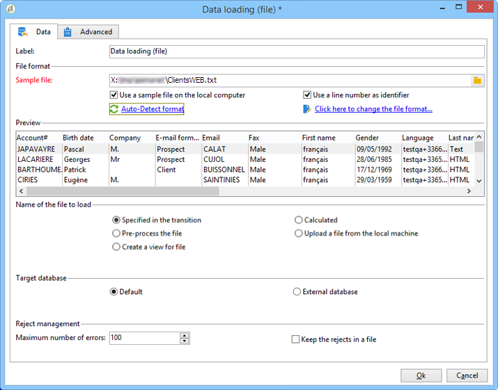

# Carga de datos (archivo){#data-loading-file}

## Uso {#use}

La actividad **[!UICONTROL Data loading (File)]** permite acceder directamente a una fuente de datos externos y utilizarla en Adobe Campaign. De hecho, todos los datos necesarios para las operaciones objetivos no se encuentran siempre en la base de datos de la campaña de Adobe: pueden estar disponibles en archivos externos.

El archivo que se va a cargar se puede especificar mediante la transición o se calcula durante la ejecución de esta actividad. Por ejemplo, puede ser la lista de los 10 productos favoritos de un cliente, cuyas compras se administran en una base de datos externa.

La sección superior de la ventana de configuración de esta actividad permite definir el formato de archivo. Para esto, utilice un archivo de muestra con el mismo formato que el que se va a importar. Este archivo se puede almacenar localmente o en el servidor.

>[!CAUTION]
>
>Solo se admiten archivos de estructura “plana” (por ejemplo, CSV, TXT, etc.). No se recomienda utilizar el formato XML.

Puede definir un proceso previo para que se ejecute durante la importación de archivos, por ejemplo, para que no tenga que descomprimir el archivo en el servidor (y, por lo tanto, ahorrar espacio para el archivo descomprimido), y para incluir la descompresión en el procesamiento de archivos. Seleccione la opción **[!UICONTROL Pre-process the file]** y elija una de las 3 opciones: **[!UICONTROL None]**, **[!UICONTROL Decompression]** (zcat) o **[!UICONTROL Decrypt]** (gpg).

Para obtener más información, consulte esta sección:  .

## Definición del formato del archivo {#defining-the-file-format}

Al cargar un archivo, el formato de columna se detecta automáticamente con los parámetros predeterminados para cada tipo de datos. Puede modificar estos parámetros predeterminados para especificar los procesos concretos que se aplican a los datos, especialmente cuando hay un error o un valor vacío.

Para ello, en la ventana principal de la actividad **[!UICONTROL Data loading (file)]**, seleccione **[!UICONTROL Click here to change the file format...]**. A continuación, se abrirá la ventana de detalles de formato.

A continuación, puede modificar el formato general del archivo y el de cada columna.

El formato del archivo general permite definir la forma en que se reconocerán las columnas (codificación de archivos, separadores utilizados, etc.).

El formato de columna permite definir el valor de procesamiento de cada columna:

* **[!UICONTROL Ignore column]**: no se procesa esta columna durante la carga de datos.
* **[!UICONTROL Data type]**: especifica el tipo de datos esperados para cada columna.
* **[!UICONTROL Allow NULLs]**: especifica cómo administrar los valores vacíos.

   * **[!UICONTROL Adobe Campaign default]**: genera un error solo para los campos numéricos; en caso contrario, inserta un valor NULL.
   * **[!UICONTROL Empty value allowed]**: autoriza los valores vacíos. Por lo tanto, se inserta el valor NULL.
   * **[!UICONTROL Always populated]**: genera un error si un valor está vacío.

* **[!UICONTROL Length]**: especifica el número máximo de caracteres para el tipo de datos de **cadena**.
* **[!UICONTROL Format]**: define el formato de fecha y hora.
* **[!UICONTROL Data transformation]**: define si se debe aplicar un proceso de mayúsculas y minúsculas en una **cadena**.

   * **[!UICONTROL None]**: la cadena importada no se modifica.
   * **[!UICONTROL First letter in upper case]**: la primera letra de cada palabra de la cadena empieza con mayúscula.
   * **[!UICONTROL Upper case]**: todos los caracteres de la cadena están en mayúsculas.
   * **[!UICONTROL Lower case]**: todos los caracteres de la cadena están en minúsculas.

* **[!UICONTROL White space management]**: especifica si se deben ignorar ciertos espacios en una cadena. El valor **[!UICONTROL Ignore spaces]** solo permite que se ignoren los espacios al principio y al final de una cadena.
* **[!UICONTROL Error processings]**: define el comportamiento si se produce un error.

   * **[!UICONTROL Ignore the value]**: se ignora el valor. Se genera una advertencia en el registro de ejecución del flujo de trabajo.
   * **[!UICONTROL Reject line]**: no se procesa la línea completa.
   * **[!UICONTROL Use a default value in case of error]**: reemplaza el valor que provoca el error con un valor predeterminado definido en el campo **[!UICONTROL Default value]**.
   * **[!UICONTROL Reject the line when there is no remapping value]**: no se procesa la línea completa a menos que se haya definido una asignación para el valor incorrecto (consulte la opción **[!UICONTROL Mapping]** a continuación).
   * **[!UICONTROL Use a default value in case the value is not remapped]**: reemplaza el valor que provoca el error con un valor predeterminado, definido en el campo **[!UICONTROL Default value]**, a menos que se haya definido una asignación para el valor incorrecto (consulte la opción **[!UICONTROL Mapping]** a continuación).

* **[!UICONTROL Default value]**: especifica el valor predeterminado de acuerdo con el procesamiento de error seleccionado.
* **[!UICONTROL Mapping]**: este campo solo está disponible en la configuración de los detalles de la columna (a los que se accede mediante un doble clic o a través de las opciones a la derecha de la lista de la columna). Esto transforma ciertos valores cuando se importan. Por ejemplo, se puede transformar “tres” en “3”.

## Ejemplo: recopilación de datos y carga en la base de datos {#example--collecting-data-and-loading-it-in-the-database}

El ejemplo siguiente permite recopilar un fichero en el servidor todos los días, cargar su contenido y actualizar los datos en la base de datos según la información que contenga. El archivo que se va a recopilar contiene información sobre los clientes que pueden haber realizado compras (de más o menos de 3000 euros), los que solicitaron un reembolso por una compra o realizaron una visita sin comprar nada. En función de esta información, se aplicarán varios procesos a sus perfiles en la base de datos.

1. El recolector de archivos permite recuperar ficheros almacenados en un directorio, según la frecuencia dada.

   La pestaña **[!UICONTROL Directory]** contiene información sobre los archivos que se van a recuperar. En nuestro ejemplo, se recuperarán todos los ficheros con formato de texto cuyos nombres contengan la palabra “customers” y que se almacenen en el directorio tmp/Adobe/Data/files del servidor.

   El uso de **[!UICONTROL File collector]** se detalla en la sección de [Recolector de archivos](file-collector.md).

   

   La pestaña **[!UICONTROL Schedule]** permite programar la ejecución del recolector, es decir, especificar la frecuencia con la que se comprueba la presencia de estos archivos.

   En este caso, deseamos activar el recolector todos los días a las 9 p. m.

   

   Para ello, haga clic en el botón **[!UICONTROL Change...]** situado en la sección inferior derecha de la herramienta de edición y configure la programación.

   Para obtener más información, consulte [Programador](scheduler.md).

1. A continuación, configure la actividad de carga de datos (archivos) para indicar cómo se deben leer los ficheros recopilados. Para esto, seleccione un fichero de muestra con la misma estructura que los ficheros que se van a cargar.

   

   En este caso, el archivo contiene cinco columnas:

   * la primera columna contiene un código que coincide con el evento: compra (más o menos que 3000 euros), sin compras ni reembolsos en una o más compras.
   * Las cuatro columnas siguientes contienen el nombre, apellido, correo electrónico y número de cuenta del cliente.

   La configuración del formato del archivo que se va a cargar coincide con el definido durante una importación de datos en Adobe Campaign. Para obtener más información, consulte  .

1. En la actividad dividida, especifique los subconjuntos que desea crear, según el valor de la columna **Event**.

   La actividad dividida se detalla en la sección.

   

   Para cada subconjunto, especifique uno de los valores en la columna **Event**.

   

   La actividad **[!UICONTROL Split]**, por lo tanto, contiene la siguiente información:

   

1. A continuación, especifique los procesos que se van a realizar para cada tipo de población. En el ejemplo, vamos a **[!UICONTROL Update the data]** en la base de datos. Para esto, coloque una actividad **[!UICONTROL Update data]** al final de cada transición saliente desde la actividad de división.

   La actividad **[!UICONTROL Update data]** se detalla en la sección [Actualización de datos](update-data.md).
