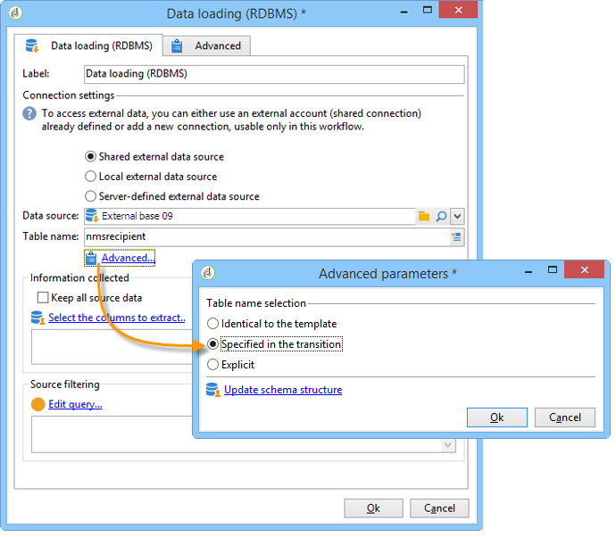

# Carga de datos (RDBMS){#data-loading-rdbms}

La actividad **[!UICONTROL Data loading (RDBMS)]** permite acceder a esta base de datos externa directamente y recopilar solamente los datos necesarios para el objetivo.

Para mejorar el rendimiento, recomendamos utilizar la actividad de consulta (donde se pueden utilizar los datos de una base de datos externa). Para obtener más información, consulte [Acceso a una base de datos externa (FDA)](accessing-an-external-database-fda.md).

La operación es la siguiente:

1. Seleccione el origen de los datos de la lista e introduzca el nombre de la tabla que contiene los datos que se van a extraer.

   

   El nombre de la tabla introducida en el campo correspondiente se utiliza como plantilla para recopilar datos en la base de datos externa. El nombre de la tabla procesada por el flujo de trabajo se puede calcular o transmitir mediante la transición de entrada de la actividad de carga de datos. Para seleccionar la tabla que se va a utilizar, haga clic en **[!UICONTROL Advanced..]**. vínculo y seleccione la opción **[!UICONTROL Specified in the transition]** o **[!UICONTROL Explicit]**.

   

1. Haga clic en el vínculo **[!UICONTROL Select the columns to extract...]** para elegir los datos que se deben recopilar en la base de datos.

   

1. Puede definir un filtro en estos datos. Para ello, haga clic en el vínculo **[!UICONTROL Edit query....]**.

   Los datos recopilados de esta manera se pueden utilizar en todo el ciclo de vida del flujo de trabajo.
