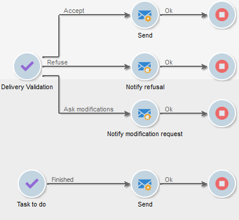

# Definición de aprobaciones {#defining-approvals}


Las aprobaciones permiten a los operadores tomar las decisiones que rigen los flujos de trabajo o confirmar su ejecución continuada.

Se envía un mensaje a un grupo de operadores y el flujo de trabajo espera a recibir una respuesta antes de continuar. El flujo de trabajo no está detenido, y se pueden realizar otras operaciones. Por ejemplo, puede haber varias aprobaciones pendientes simultáneamente.

Una aprobación puede contener múltiples opciones para que el operador elija. Sin embargo, se puede restringir el número de opciones a una para enviar una tarea a un operador para que la realice, como, por ejemplo, realizar la segmentación. El operador puede responder después de realizar la tarea (el proceso se reanuda). El siguiente ejemplo ilustra estos tipos de aprobaciones:



En las operaciones, todas las etapas que requieren aprobación se basan en el mismo principio.


Se pueden encontrar ejemplos de aprobación en .

Un operador puede responder de una de estas dos maneras: validar mediante la página web vinculada en el mensaje de correo electrónico o a través de la consola.

>[!NOTE]
>
>Una vez guardada la respuesta, no se puede modificar.

## Aprobaciones por correo electrónico {#sending-emails}

Es posible recibir un mensaje de aprobación que contenga un vínculo a una página web a través de la cual se puede responder. Para que el operador de destino reciba un correo electrónico de aprobación, se debe haber rellenado la dirección de correo electrónico del operador. Si no es así, el operador debe utilizar la consola para responder

La administración del operador se detalla en esta sección .

Los correos electrónicos de aprobación se envían de forma continua. La plantilla de entrega predeterminada es **[!UICONTROL notifyAssignee]**: se guarda en la carpeta **[!UICONTROL Administration > Campaign management > Technical delivery templates]**. Este escenario se puede personalizar, y se recomienda realizar una copia y cambiar las plantillas para cada actividad.

Las entregas creados mediante esta plantilla se almacenan en la carpeta **[!UICONTROL Administration > Production > Objects created automatically > Technical deliveries > Workflow notifications]**.

## Aprobación mediante la consola {#approval-via-the-console}

En las operaciones, los elementos que se vayan a aprobar se muestran en el tablero de campañas.

Para los flujos de trabajo técnicos, se puede acceder a las tareas que el usuario puede aprobar desde la estructura de árbol de la carpeta **[!UICONTROL Administration > Production > Objects created automatically > Pending approvals]**.


## Grupos {#groups}

Se asigna una aprobación a un grupo de operadores, a un operador individual o a un conjunto de operadores seleccionados mediante una condición de filtrado.

1. Para la forma más sencilla de aprobación, la tarea finaliza en cuanto un operador responde. Cualquier otro operador que intente responder recibe una notificación avisando que alguien lo ha hecho ya.
1. Para varias aprobaciones, consulte [Aprobación múltiple](#multiple-approval).

Los grupos de operadores para las aprobaciones deben designarse como roles o funciones en lugar de como personas con nombre. Por ejemplo, es preferible un grupo “Presupuesto de campañas” en vez de “grupo de Harry”. Se recomienda incluir a al menos dos personas en un grupo que puedan aprobar una tarea. De este modo, si una de ellas está ausente, la otra puede responder.

## Caducidades {#expirations}

Las caducidades son transiciones específicas que se utilizan en diferentes clases de actividades y, en particular, en las autorizaciones. Puede utilizar un vencimiento para desencadenar una acción después de un tiempo determinado sin respuesta. También puede utilizarse, por ejemplo, para continuar el flujo de trabajo y asignar una aprobación a otro grupo.

La segunda pestaña de las propiedades de aprobación de actividad permite definir una o varias caducidades. De hecho, puede definir varios tipos de caducidad.


Para añadir una nueva caducidad, haga clic en **[!UICONTROL Add]**. Se añade una transición a cada una de las caducidades creadas. Se puede:

* modificar los parámetros típicos directamente haciendo clic en una celda de la lista (o presionando F2),
* o editar la expresión haciendo clic en el botón **[!UICONTROL Detail...]**.

>[!NOTE]
>
>No es necesario especificar un orden para las caducidades porque se procesan en orden cronológico.

La opción **[!UICONTROL Do not terminate the task]** mantiene la aprobación activa cuando se supera el periodo de retardo. Este modo permite administrar los recordatorios y mantener la aprobación activa: los operadores aún pueden responder. Esta opción está desactivada de forma predeterminada, lo que significa que la tarea se considera finalizada cuando caduca y que los operadores ya no pueden responder.

Puede crear cuatro tipos de caducidades:

* **Delay after task start**: la caducidad se calcula añadiendo un periodo determinado a la fecha en que se activa la aprobación.
* **Delay after a given date**: la caducidad se calcula añadiendo un periodo a la fecha especificada.
* **Delay before a given date**: la caducidad se calcula restando un periodo desde la fecha especificada.
* **Expiration calculated by script**: la caducidad se calcula mediante JavaScript.

   En el ejemplo siguiente se calcula una caducidad 24 horas antes de que se inicie la entrega (identificado mediante **vars.deliveryId**):

   ```
   var delivery = nms.delivery.get(vars.deliveryId)
   var expiration = delivery.scheduling.contactDate
   var oneDay = 1000*60*60*24
   expiration.setTime(expiration.getTime() - oneDay)
   return expiration
   ```

## Aprobación múltiple {#multiple-approval}

La aprobación múltiple es un mecanismo que permite que todos los operadores de aprobación respondan. Se activa una transición para cada respuesta.

La aprobación múltiple resulta útil para los mecanismos de voto o de encuesta. Puede contar las respuestas y procesar el resultado después de un periodo determinado añadiendo una fecha límite.

## Derechos requeridos {#required-rights}

Los operadores de un grupo deben tener al menos los derechos siguientes para poder responder a una solicitud de aprobación:

* Permisos de escritura para el flujo de trabajo.
* Permisos de lectura y escritura para la carpeta que contiene las tareas que se van a aprobar.

El grupo “Ejecución del flujo de trabajo” tiene estos derechos. Un operador añadido a este grupo tiene derechos para responder a una solicitud de aprobación.
