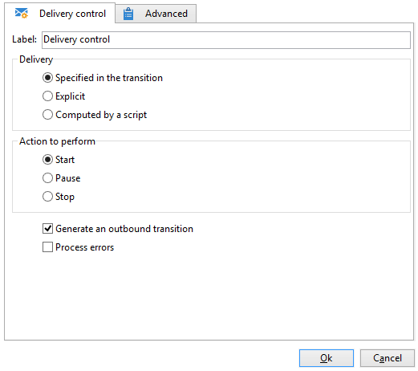

# Control de entregas{#delivery-control}

Una acción del tipo **Delivery control** permite iniciar, pausar o detener una entrega.

El envío puede ser especificado en la transición, una entrega seleccionado de manera explícita o una entrega calculado por un script. Para obtener más información, consulte [Entrega](delivery.md).

Si selecciona **[!UICONTROL Start]**, la actividad realizará todos los pasos necesarios para iniciar la entrega (cálculo del objetivo, preparación del contenido, envío). Si ya se han realizado algunos de estos pasos por una actividad de flujo de trabajo anterior, no se volverán a realizar. Por ejemplo, si la estimación del objetivo ya fue realizada por una actividad de tipo **[!UICONTROL Delivery]** (consulte ), la actividad **[!UICONTROL Act on the delivery]** iniciará los pasos restantes (preparación y envío del contenido).

Estas son las opciones disponibles:

* **[!UICONTROL Generate an outbound transition]**

  Crea una transición saliente que se activará al final de la ejecución. Puede elegir si desea o no recuperar el objetivo de la entrega saliente.

* **[!UICONTROL Processing errors]**

  Consulte [Errores de procesamiento](monitor-workflow-execution.md#processing-errors).

## Parámetros de entrada {#input-parameters}

* deliveryId

  Identificador de envío, si la acción seleccionada es **[!UICONTROL Specified in the transition]**.
