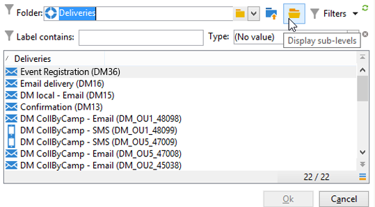

# Entrega{#delivery}


Una actividad de tipo **Entrega** permite crear una acción de entrega. Se puede construir utilizando elementos de entrada.

Para configurarlo, edite la actividad e introduzca las opciones de entrega.


1. **Entrega**

   Se puede:

   * Actuar sobre la entrega especificado en la transición entrante. Para ello, seleccione la primera opción de la sección **[!UICONTROL Delivery]** de la ventana.

      Esta opción se puede utilizar si ya se ha creado o especificado una actividad de flujo de trabajo anterior. Esto se puede hacer, como en el ejemplo a continuación, con una actividad del mismo tipo que generó una transición saliente.

      En el ejemplo siguiente, se crea la entrega por primera vez. La población y el contenido se definen más adelante. A continuación, la información de estos tres elementos se reingresa en una nueva actividad de entrega utilizando la transición entrante para que se pueda enviar.

      

   * Seleccione directamente la entrega correspondiente. Para ello, seleccione la opción **[!UICONTROL Explicit]** y seleccione la entrega en la lista desplegable del campo **[!UICONTROL Delivery]**.

      La lista muestra los envíos no finalizados contenidos en la carpeta **Envíos** de forma predeterminada. Para acceder a otras campañas, haga clic en el icono **[!UICONTROL Select link]**.

      

      Seleccione la campaña en la lista desplegable del campo **[!UICONTROL Folder]** o haga clic en **[!UICONTROL Display sub-levels]** para mostrar todas las entregas contenidos en las subcarpetas:

      

      Después de seleccionar la acción de entrega, puede mostrar el contenido haciendo clic en el icono **[!UICONTROL Edit link]**.

   * Cree una secuencia de comandos para calcular la entrega. Para ello, haga clic en la opción **[!UICONTROL Computed by a script]** e introduzca la secuencia de comandos. Puede abrir una ventana de entrada haciendo clic en la opción **[!UICONTROL Edit...]**. El ejemplo siguiente recupera el identificador de la entrega:

      

   * Crear una entrega nueva. Para hacerlo, seleccione la opción **[!UICONTROL New, created from a template]** y la plantilla de entrega en la que se debe basar la entrega.

      

      Haga clic en el icono **[!UICONTROL Select link]** para examinar las carpetas y haga clic en el icono **[!UICONTROL Edit link]** si desea ver el contenido de la plantilla seleccionada.

1. **Recipients**

   Los eventos de entrada pueden especificar los destinatarios, por ejemplo, con una importación de archivos o especificados en la acción de entrega. También pueden almacenarse en uno o más archivos.

   

1. **Content**

   El contenido del mensaje se puede definir en la entrega o en el evento de entrada.

   

1. **Acción que quiere ejecutar**

   Puede crear la entrega, prepararlo, iniciarlo, estimar el objetivo o enviar una prueba.

   

   Seleccione el tipo de acción que se va a realizar:

   * **[!UICONTROL Save]**: esta opción permite crear la entrega y guardarlo. No lo analiza ni lo envía.
   * **[!UICONTROL Estimate the target]**: esta opción permite calcular el objetivo de la entrega para evaluar su potencial (primera fase del análisis). Esta acción equivale a seleccionar la opción **[!UICONTROL Estimate the population to be targeted]** y al hacer clic en **[!UICONTROL Analyze]** al enviar una entrega al objetivo principal mediante **Entrega**.
   * **[!UICONTROL Prepare]**: esta opción permite ejecutar el proceso de análisis completo (cálculo del objetivo y preparación de contenido). No se manda la entrega. Esta acción equivale a seleccionar la opción **[!UICONTROL Deliver as soon as possible]** y hacer clic en **[!UICONTROL Analyze]** al enviar una entrega al objetivo principal mediante **Entrega**.
   * **[!UICONTROL Send a proof]**: esta opción permite enviar una prueba de la entrega. Esta acción equivale a hacer clic en el botón **[!UICONTROL Send a proof]** de la barra de herramientas de una entrega con **Entrega**.
   * **[!UICONTROL Prepare and start]**: esta opción inicia el proceso de análisis completo (cálculo del objetivo y preparación de contenido) y realiza la entrega. Esta acción equivale a hacer clic en las opciones **[!UICONTROL Deliver as soon as possible]**, **[!UICONTROL Analyze]** y **[!UICONTROL Confirm delivery]** al mandar una envío al objetivo principal con **Entrega**.

   La actividad **[!UICONTROL Act on a delivery]** utilizada en el flujo de trabajo permite iniciar todos los pasos restantes necesarios para comenzar la entrega (cálculo del objetivo, preparación de contenido, entrega). Para obtener más información, consulte [Control de envíos](delivery-control.md).

   Las siguientes opciones también están disponibles:

   * **[!UICONTROL Generate an outbound transition]**

      Crea una transición saliente que se activará al final de la ejecución. Puede elegir si desea o no recuperar el objetivo de la entrega saliente.

   * **[!UICONTROL Do not recover target]**

      No recupera el objetivo de la acción de entrega saliente.

   * **[!UICONTROL Processing errors]**

      Consulte [Control de envíos](delivery-control.md).
   La pestaña **Script** permite modificar los parámetros de entrega.

   

## Ejemplo: Flujo de trabajo de la entrega {#example--delivery-workflow}

Cree un nuevo flujo de trabajo y añada actividades como se muestra en el gráfico siguiente:


Abra la actividad **Entrega** y defina las propiedades como se indica a continuación:

* En la sección **[!UICONTROL Delivery]**, seleccione **[!UICONTROL New, created from a template]** y, luego, una plantilla de entrega.
* En la sección **[!UICONTROL Recipients]**, seleccione **[!UICONTROL Specified in the delivery]**.
* En la sección **[!UICONTROL Action to execute]**, mantenga la opción **[!UICONTROL Prepare]**.


Haga clic en **[!UICONTROL OK]** para cerrar la ventana de propiedades. Acaba de configurar una actividad que consista en crear y preparar una nueva entrega basada en una plantilla de entrega cuyo objetivo se especificará ahí dentro.

Abra la actividad **Approval** y defina las propiedades como se indica a continuación:

1. En el campo **[!UICONTROL Assignment type]**, seleccione un grupo en el que esté registrado. Si está conectado con la cuenta “admin”, seleccione el grupo Administración.
1. A continuación, introduzca un título e inserte el texto siguiente en el cuerpo del mensaje:

   ```
   Do you wish to approve delivery (<%= vars.recCount %> recipient(s))?
   ```

   Este es un mensaje que incluye una expresión escrita en JavaScript: **[!UICONTROL vars.recCount]** representa el número de destinatarios objetivo de la entrega de la tarea anterior. Para obtener más información sobre las expresiones JavaScript, consulte [Plantillas y secuencias de comandos de JavaScript](javascript-scripts-and-templates.md).

   

   La tarea de aprobación se detalla en [Aprobación](approval.md).

## Parámetros de entrada {#input-parameters}

Identificador de entrega, si la opción **[!UICONTROL Specified in the transition]** está seleccionada en la sección **[!UICONTROL Delivery]**.

* deliveryId
* tableName
* esquema

Cada evento entrante debe especificar un objetivo definido por estos parámetros.

>[!NOTE]
>
>Este parámetro solo aparece si la opción **[!UICONTROL Specified by inbound event(s)]** está seleccionada en la sección **[!UICONTROL Recipients]**.

* filename

   Nombre completo del archivo generado si se selecciona la opción **[!UICONTROL File(s) specified by inbound event(s)]** en la sección **[!UICONTROL Recipients]**.

* contentId

   Identificador de contenido si la opción **[!UICONTROL Specified by inbound events]** está seleccionada en la sección **[!UICONTROL Content]**.

## Parámetros de salida {#output-parameters}

* tableName
* esquema
* recCount

Este conjunto de tres valores identifica el objetivo resultante de la entrega. **[!UICONTROL tableName]** es el nombre de la tabla que memoriza los identificadores del objetivo; **[!UICONTROL schema]** es el esquema de la población (normalmente nms:recipient) y **[!UICONTROL recCount]** es el número de elementos de la tabla.

La transición asociada al complemento tiene los mismos parámetros.

>[!NOTE]
>
>No hay parámetros de salida cuando se selecciona la opción **[!UICONTROL Do not recover target]**.
