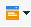

# Enriquecimiento de correo electrónico con campos de datos personalizados{#email-enrichment-with-custom-date-fields}


En este ejemplo, deseamos enviar un correo electrónico con campos de datos personalizados a los destinatarios que celebran su cumpleaños este mes. El correo electrónico incluirá un cupón válido una semana antes y después de su cumpleaños.

Es necesario segmentar a los destinatarios de una lista que celebran su cumpleaños este mes con una actividad **[!UICONTROL Split]**. A continuación, con la actividad **[!UICONTROL Enrichment]**, el campo de datos personalizados actuará como fecha de validez en el mensaje de correo electrónico para la oferta especial del cliente.


Para crear este ejemplo, aplique los pasos siguientes:

1. En la pestaña **[!UICONTROL Targeting and workflows]** de la campaña, arrastre y coloque una actividad **[!UICONTROL Read list]** para segmentar la lista de destinatarios.
1. La lista que se desea procesar se puede especificar explícitamente, calcularse por una secuencia de comandos o localizarse dinámicamente, según las opciones seleccionadas y los parámetros definidos aquí.

   

1. Agregue una actividad **[!UICONTROL Split]** para diferenciar a los destinatarios que celebren su cumpleaños este mes de otros destinatarios.
1. Para dividir la lista, en la categoría **[!UICONTROL Filtering of selected records]**, seleccione **[!UICONTROL Add a filtering condition on the inbound population]**. A continuación, haga clic en **[!UICONTROL Edit]**.

   

1. Seleccione **[!UICONTROL Filtering conditions]** y haga clic en el botón **[!UICONTROL Edit expression]** para filtrar el mes del cumpleaños del destinatario.

   

1. Haga clic en **[!UICONTROL Advanced Selection]** y luego **[!UICONTROL Edit the formula using an expression]** y agregue la siguiente expresión: Month(@birthDate).
1. En la columna **[!UICONTROL Operator]**, seleccione **[!UICONTROL equal to]**.
1. Para filtrar más la condición, agregue el mes **[!UICONTROL Value]** de la fecha actual: Month(GetDate()).

   Esto consulta a los destinatarios cuyo mes de cumpleaños corresponda al mes actual.

   

1. Haga clic **[!UICONTROL Finish]**. A continuación, en la pestaña **[!UICONTROL General]** de su actividad **[!UICONTROL Split]**, haga clic en **[!UICONTROL Generate complement]** en la categoría **[!UICONTROL Results]**.

   Con el resultado **[!UICONTROL Complement]**, puede añadir una actividad de envío o actualizar una lista. Aquí, agregamos una actividad **[!UICONTROL End]**.

   

Ahora necesita configurar su actividad **[!UICONTROL Enrichment]**:

1. Agregue una actividad **[!UICONTROL Enrichment]** al subconjunto para añadir los campos de fecha personalizados.

   

1. Abra la actividad **[!UICONTROL Enrichment]**. En la categoría **[!UICONTROL Complementary information]**, haga clic en **[!UICONTROL Add data]**.

   

1. Seleccione **[!UICONTROL Data linked to the filtering dimension]** luego **[!UICONTROL Data of the filtering dimension]**.
1. Haga clic en el botón **[!UICONTROL Add]**.

   

1. Agregar una **[!UICONTROL Label]**. A continuación, en la columna **[!UICONTROL Expression]**, haga clic en **[!UICONTROL Edit expression]**.

   

1. En primer lugar, se debe establecer como objetivo la semana antes del cumpleaños como **Fecha de inicio de validez** con la siguiente **[!UICONTROL Expression]**: `SubDays([target/@birthDate], 7)`.

   

1. A continuación, para crear el campo de fecha personalizado **Fecha de fin de validez**, que abarca la semana después del cumpleaños, se debe agregar la **[!UICONTROL Expression]**: `AddDays([target/@birthDate], 7)`.

   Se puede añadir una etiqueta a la expresión.

   

1. Haga clic **[!UICONTROL Ok]**. El enriquecimiento está listo.

Después de la actividad de **[!UICONTROL Enrichment]** puede agregar una entrega. En este caso, agregamos una entrega por correo electrónico para enviar a los destinatarios una oferta especial con fechas de validez para los clientes que celebran su cumpleaños ese mes.

1. Arrastre y suelte una actividad de **[!UICONTROL Email delivery]** después de su actividad de **[!UICONTROL Enrichment]**.

   

1. Haga doble clic en la actividad **[!UICONTROL Email delivery]** para comenzar a personalizar la entrega.
1. Añada a la entrega una **[!UICONTROL Label]** y haga clic en **[!UICONTROL Continue]**.
1. Haga clic en **[!UICONTROL Save]** para crear su envío por correo electrónico.
1. Compruebe en la pestaña **[!UICONTROL Approval]** del envío de correo electrónico **[!UICONTROL Properties]** que **[!UICONTROL Confirm delivery before sending option]** está marcado.

   A continuación, inicie el flujo de trabajo para enriquecer la transición saliente con la información objetivo.

   

Ahora puede empezar a diseñar su envío por correo electrónico con los campos de fecha personalizados creados en la actividad **[!UICONTROL Enrichment]**.

1. Haga doble clic en la actividad **[!UICONTROL Email delivery]**.
1. Añada sus extensiones de destino al correo electrónico. Debe estar dentro de la siguiente expresión para configurar el formato de las fechas de validez:

   ```
   <%=
           formatDate(targetData.alias of your expression,"%2D.%2M")  %>
   ```

1. Haga clic en . Seleccione **[!UICONTROL Target extension]** y luego las fechas de validez personalizadas creadas anteriormente con la actividad **[!UICONTROL Enrichment]** para agregar la extensión a la expresión formatDate.

   

1. Configure su contenido de correo electrónico según sea necesario.

   

1. Previsualice el correo electrónico para comprobar si los campos de fecha personalizados se han configurado correctamente.

   

Su correo electrónico está listo. Puede comenzar a enviar las pruebas y confirmar el envío para mandar los correos electrónicos de cumpleaños.
