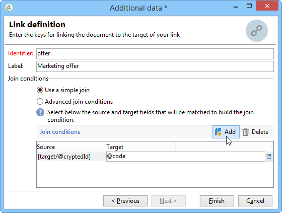

# Enriquecimiento{#enrichment}


La actividad **[!UICONTROL Enrichment]** permite agregar información a una lista de perfiles y vínculos a una lista existente (creación de un nuevo vínculo). También se pueden definir criterios de comparación con los perfiles de la base de datos.


## Definiciones {#definitions}

Para utilizar la actividad de enriquecimiento, debe estar familiarizado con las diversas opciones disponibles al agregar datos.


La opción **[!UICONTROL Data linked to the filtering dimension]** le da acceso a:

* Datos de la dimensión de filtrado: acceso a los datos de la tabla de trabajo
* Datos vinculados a la dimensión del filtrado: acceso a los datos vinculados a la tabla de trabajo


La opción **[!UICONTROL A link]** permite crear una unión en cualquier tabla de la base de datos.


Existen cuatro tipos de vínculos:

* **[!UICONTROL Define a collection]**: permite definir un vínculo con una cardinalidad 1-N entre las tablas.
* **[!UICONTROL Define a link whose target is still available]**: permite definir un enlace con una cardinalidad 1-1 entre las tablas. Las condiciones de la unión deben estar definidas por un único registro en la tabla de destino.
* **[!UICONTROL Define a link whose target does not necessarily exist in the base]**: permite definir un enlace con una cardinalidad 0-1 entre las tablas. La condición que los una debe definirse por el registro de 0 o 1 (máximo) en la tabla objetivo.

   Esta opción se configura en la pestaña **[!UICONTROL Simple Join]** a la que se puede acceder mediante el vínculo **[!UICONTROL Edit additional data]** de la actividad **[!UICONTROL Enrichment]**.

* **[!UICONTROL Define a link by searching for a reference among several options]**: este tipo de vínculo define una reconciliación hacia un registro único. Adobe Campaign crea un vínculo a una tabla de destino agregando una clave externa en la tabla objetivo para almacenar una referencia del registro único.

   Esta opción se configura en la pestaña **[!UICONTROL Reconciliation and deduplication]** a la que se puede acceder mediante el vínculo **[!UICONTROL Edit additional data]** de la actividad **[!UICONTROL Enrichment]**.

En estas secciones también se encuentran disponibles casos de uso que detallan el funcionamiento de actividades de Enriquecimiento en su contexto:

* [Enriquecimiento de correo electrónico con campos de datos personalizados](email-enrichment-with-custom-date-fields.md).
* [Enriquecimiento de datos](enrich-data.md)
* [Creación de la lista de resumen](create-a-summary-list.md)

## Adición de información {#adding-information}

Utilice la actividad **[!UICONTROL Enrichment]** para añadir columnas a una tabla de trabajo: esta actividad se puede utilizar como complemento para una actividad de consulta.

La configuración de columnas adicionales se detalla en [Añadir datos](query.md#adding-data).

El campo **[!UICONTROL Primary set]** permite seleccionar la transición entrante: los datos de la tabla de resultados de esta actividad se ampliarán.

Haga clic en el vínculo **[!UICONTROL Add data]** y seleccione el tipo de datos que desee añadir. La lista de tipos de datos ofrecidos depende de los módulos y las opciones instalados en la plataforma. En una configuración básica, siempre se pueden agregar datos vinculados a la dimensión de filtrado y al vínculo.


En el ejemplo que se muestra a continuación, la transición saliente se ampliará con información sobre la edad de los perfiles destinatarios.


Haga clic con el botón derecho en la transición entrante de la actividad desarrollada para ver los datos antes de la fase de incremento.


La tabla de resultados contiene el esquema asociado y los siguientes datos:


Repita esta operación en la salida de la fase de ampliación.


Se puede ver que se han agregado los datos relativos a las edades:


El esquema coincidente también se ha enriquecido.

## Gestión de datos adicionales {#managing-additional-data}

Desmarque la opción **[!UICONTROL Keep all additional data from the main set]** si no desea conservar los datos adicionales definidos previamente. En este caso, solo las columnas adicionales seleccionadas en la actividad de ampliación se añadirán a la tabla de resultados saliente. La información adicional añadida a las actividades anteriores no se guardará.


Los datos y el esquema en la salida de la fase de ampliación serán los siguientes:


## Creación de un vínculo {#creating-a-link}

Se puede utilizar la actividad de ampliación para crear un vínculo entre los datos de trabajo y la base de datos de Adobe Campaign: será un vínculo local al flujo de trabajo entre los datos entrantes.

Por ejemplo, si se cargan datos de un archivo que contiene el número de cuenta, el país y el correo electrónico de los destinatarios, se deberá crear un vínculo hacia la lista del país para actualizar esta información en sus perfiles.

Para ello, siga los siguientes pasos:

1. Recopile y cargue el siguiente tipo de archivo:

   ```
   Account number;Country;Email
   18D65;FRANCE;agnes@gmail.com
   243PP;RUSSIA;paul@gmail.com
   55H87;CROATIA;dave@gmail.com
   56U81;USA;susan@gmail.com
   853PI;ITALY;anna@gmail.com
   890LP;FRANCE;robert@gmail.com
   83TY2;SWITZERLAND;mike@gmail.com
   ```

1. Edite la actividad de ampliación y haga clic en el vínculo **Add data...** para establecer un vínculo con la lista del país.

   

1. Seleccione la opción **[!UICONTROL Link definition]** y haga clic en el botón **[!UICONTROL Next]**. Especifique el tipo de vínculo que se va a crear. En este ejemplo, se desea enlazar el país del destinatario del archivo con un país en la lista de países disponibles de la lista de la base de datos. Elija la opción **[!UICONTROL Define a link by searching for a reference among several options]**. Seleccione la lista del país en el campo **[!UICONTROL Target schema]**.

   

1. Finalmente, seleccione los campos que le permitirán vincular los valores del archivo de origen a los de la base de datos.

   

En la salida de esta actividad de ampliación, el esquema temporal contendrá el vínculo a la lista del país:


## Comparación de datos {#data-reconciliation}

La actividad de enriquecimiento se puede utilizar para configurar la comparación de datos, incluso una vez cargados la información en la base de datos. En este caso, la pestaña **[!UICONTROL Reconciliation]** permite definir el vínculo entre los datos de la base de datos de Adobe Campaign y los de la tabla de resultados.

Seleccione la opción **[!UICONTROL Identify the targeting document based on work data]**, especifique el esquema al que desee agregar un vínculo y defina las condiciones del vínculo: para ello, seleccione los campos a comparar en los datos de trabajo (**[!UICONTROL Source expression]**) y en la dimensión de segmentación (**[!UICONTROL Destination expression]**).

Se pueden utilizar uno o más criterios de comparación.


Si se especifican varias condiciones de vínculo, todas deben verificarse para que los datos puedan vincularse.

## Inserción de una propuesta de oferta {#inserting-an-offer-proposition}

La actividad de enriquecimiento permite añadir ofertas o vínculos a ofertas para los destinatarios de la entrega.

Para obtener más información sobre la actividad de enriquecimiento, consulte esta [sección](enrichment.md).

Por ejemplo, puede ampliar los datos de una consulta al destinatario antes de una entrega.


Después de configurar la consulta (consulte esta [sección](query.md)):

1. Añada y abra una actividad de enriquecimiento.
1. En la pestaña **[!UICONTROL Enrichment]**, seleccione **[!UICONTROL Add data]**.
1. Seleccione **[!UICONTROL An offer proposition]** en los tipos de datos que desea añadir.

   

1. Especifique un identificador y una etiqueta para la propuesta a añadir.
1. Especifique la selección de la oferta. Hay dos formas de hacerlo:

   * **[!UICONTROL Search for the best offer in a category]**: marque esta opción y especifique los parámetros de recurso del motor de oferta (espacio de oferta, categoría o temas, fecha de contacto, cantidad de ofertas que desea mantener). Según estos parámetros, el motor calculará automáticamente las ofertas a agregar. Se recomienda completar el campo **[!UICONTROL Category]** o el campo **[!UICONTROL Theme]** en vez de ambos al mismo tiempo.

      

   * **[!UICONTROL A predefined offer]**: marque esta opción y especifique un espacio de oferta, una oferta específica y una fecha de contacto para configurar directamente la oferta que desee añadir, sin recurrir al motor de oferta.

      

1. A continuación, configure una actividad de entrega que corresponda al canal elegido. Consulte [Envíos multicanal](cross-channel-deliveries.md).

   El número de propuestas disponibles para la vista previa depende de la configuración realizada en la actividad de enriquecimiento y no de cualquier configuración realizada directamente en la entrega.

Para especificar propuestas de oferta, también se puede optar por hacer referencia al vínculo de una oferta. Para obtener más información sobre esto, consulte la siguiente sección [Referencia a un vínculo a una oferta](#referencing-a-link-to-an-offer).

## Referencia al vínculo de una oferta {#referencing-a-link-to-an-offer}

También puede hacer referencia a un vínculo de oferta en una actividad de ampliación.

Para ello:

1.  En la pestaña **[!UICONTROL Enrichment]** de la actividad, seleccione **[!UICONTROL Add data]**.
1. En la ventana donde se elige el tipo de datos a añadir, seleccione **[!UICONTROL A link]**.
1. Seleccione el tipo de vínculo que desea establecer y su destino. En este caso, el destino es el esquema de oferta.

   

1. Especifique el vínculo entre los datos de la lista entrante en la actividad de ampliación (lista de destinatarios) y la lista de oferta. Por ejemplo, se puede vincular un código de oferta a un destinatario.

   

1. A continuación, configure una actividad de entrega que corresponda al canal elegido. Consulte [Envíos multicanal](cross-channel-deliveries.md).

   >[!NOTE]
   >
   >El número de propuestas disponibles para la vista previa depende de la configuración realizada en la entrega.

## Almacenamiento de calificaciones y consideraciones de oferta {#storing-offer-rankings-and-weights}

De forma predeterminada, cuando se utiliza una actividad de **enriquecimiento** para entregar ofertas, sus calificaciones y sus consideraciones no se almacenan en la lista de propuestas.

La actividad **[!UICONTROL Offer engine]** almacena esta información de forma predeterminada.

Sin embargo, se puede almacenar esta información de la siguiente manera:

1. Cree una llamada al motor de oferta en una actividad de enriquecimiento colocada después de una consulta y antes de una actividad de entrega.
1. En la ventana principal de la actividad, seleccione **[!UICONTROL Edit additional data...]**

   

1. Añada las columnas **[!UICONTROL @rank]** para la clasificación y **[!UICONTROL @weight]** para las ponderaciones de la oferta.

   

1. Confirme su adición y guarde el flujo de trabajo.

La entrega almacena automáticamente la clasificación y las consideraciones de las ofertas. Esta información está visible en la pestaña de la entrega **[!UICONTROL Offers]**.
