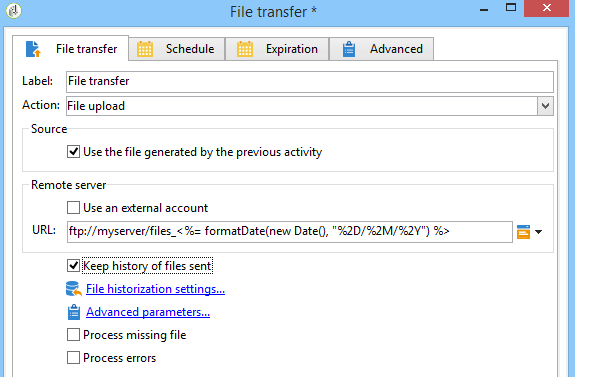

# Transferencia de archivos{#file-transfer}

La actividad de **Transferencia de archivos** permite recibir o enviar archivos, probar la presencia de archivos o mostrar archivos en un servidor. El protocolo utilizado es Azure Blob Storage, Amazon Simple Storage Service (S3), FTP o SFTP.
Con la conexión S3, Azure Blob Storage o SFTP, también puede importar datos de segmentos a Adobe Campaign con la plataforma de datos del cliente en tiempo real de Adobe. Para obtener más información, consulte esta [Documentación](https://experienceleague.adobe.com/docs/experience-platform/destinations/catalog/email-marketing/adobe-campaign.html?lang=es#catalog).

## Propiedades {#properties}

Utilice la lista desplegable del campo **[!UICONTROL Action]** para seleccionar la acción de la actividad.

La configuración depende de la acción seleccionada.

1. **Receiving files**

   Para recibir archivos almacenados en un servidor remoto, seleccione **[!UICONTROL File download]** en el campo **[!UICONTROL Action]**. Debe especificar la URL en el campo correspondiente.

   

   Consulte **[!UICONTROL Use an external account]** para seleccionar una cuenta de las cuentas configuradas en Azure Blob storage, S3, FTP o SFTP en el nodo **[!UICONTROL Administration > Platform > External accounts]** del árbol. A continuación, especifique el directorio del servidor que contiene el archivo(s) que se va a descargar.

   

1. **Transferencia de archivos**

   Para enviar un archivo a un servidor, seleccione **[!UICONTROL File upload]** en el campo **[!UICONTROL Action]**. Debe especificar el servidor de destino en la sección **[!UICONTROL Remote server]** del editor. Los parámetros son los mismos que para los archivos de entrada. Véase más arriba.

   El archivo de origen puede proceder de la actividad anterior. En este caso, se debe seleccionar la opción **[!UICONTROL Use the file generated by the previous activity]**.

   

   Esto puede afectar a uno o más archivos. Para seleccionarlos, anule la selección de la opción y haga clic en **[!UICONTROL Insert]**. Especifique el trazado de acceso del archivo que se va a enviar. Para añadir otro archivo, haga clic de nuevo en **[!UICONTROL Insert]**. Los archivos tienen ahora su propia pestaña.

   

   Utilice las flechas para cambiar el orden de las pestañas. Esto se relaciona con el orden en que se envían los archivos al servidor.

   La opción **[!UICONTROL Keep history of files sent]** permite rastrear los archivos enviados. Es posible acceder a este historial desde el directorio.

1. **Test to see if file exists**

   Para comprobar la existencia de un archivo, seleccione la opción **[!UICONTROL Test to see if file exists]** en el campo **[!UICONTROL Action]**. La configuración del servidor remoto es la misma que para la descarga de archivos. Para obtener más información, consulte esta [sección](#properties).

   

1. **Listing of files**

   Para enumerar los archivos, seleccione la opción **[!UICONTROL File listing]** en el campo **[!UICONTROL Action]** . La configuración del servidor remoto es la misma que para recibir archivos. Para obtener más información, consulte esta [sección](#properties).

   La opción **[!UICONTROL List all files]**, disponible cuando se selecciona la acción **[!UICONTROL File listing]**, permite almacenar todos los archivos presentes en el servidor en la variable de evento **vars.filenames**, donde los nombres de archivo están separados por caracteres `\n`.

Hay dos opciones posibles para todas las opciones de transferencia de archivos:

* La opción **[!UICONTROL Process missing file]** añade una transición activada si no se encuentra ningún archivo en el directorio especificado.
* La opción **[!UICONTROL Process errors]** se detalla en [Procesamiento de errores](monitor-workflow-execution.md#processing-errors).

El enlace **[!UICONTROL Advanced parameters...]** permite acceder a las siguientes opciones:

* **[!UICONTROL Delete the source files after transfer]**

  Borra los archivos del servidor remoto. Si deja esta opción sin marcar, asegúrese de monitorizar manualmente el tamaño del contenido archivado en el directorio SFTP.

* **[!UICONTROL Use SSL]**

  Permite utilizar una conexión segura mediante el protocolo SSL durante las transferencias de archivos.

* **[!UICONTROL Display the session logs]**

  Permite recuperar los registros de la transferencia Azure Blob storage, S3, FTP o SFTP e incluirlos en los registros de flujo de trabajo.

* **[!UICONTROL Disable passive mode]**

  Permite especificar el puerto de conexión que se utilizará para la transferencia de datos.

El vínculo **[!UICONTROL File historization settings...]** da acceso a las opciones detalladas en [ Descarga web](web-download.md) (paso **[!UICONTROL File historization]**).

## Parámetros de entrada {#input-parameters}

* filename

  Nombre completo del archivo enviado.

## Parámetros de salida {#output-parameters}

* filename

  Nombre completo del archivo recibido si se selecciona la opción **[!UICONTROL Use the file generated by the previous activity]**.
