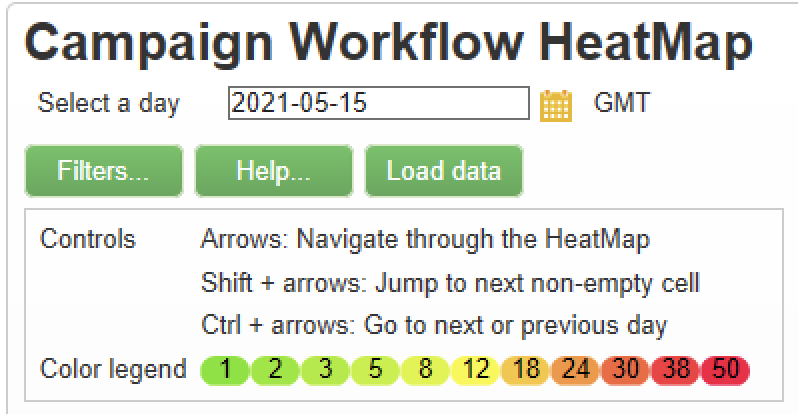

# Mapa de calor del flujo de trabajo {#workflow-heatmap}

El mapa de calor del flujo de trabajo de Campaign consiste en una representación gráfica con códigos de color de todos los flujos de trabajo que se están ejecutando actualmente. Solo está disponible para **Administradores de Campaign**.

## Introducción al mapa de calor del flujo de trabajo {#about-the-workflow-heatmap}

Al proporcionar información general rápida sobre el número de flujos de trabajo simultáneos, Workflow HeatMap permite a los administradores de la plataforma Adobe Campaign supervisar la carga en la instancia y planificar los flujos de trabajo en consecuencia.

Más precisamente, ayuda a los administradores de la plataforma a:

* Ver y comprender flujos de trabajo simultáneos
* Filtrar flujos de trabajo por duración para ver qué flujos de trabajo pueden encontrar problemas
* Filtrar actividades por duración para ver qué actividades pueden encontrar problemas
* Encuentre fácilmente flujos de trabajo individuales y todas las actividades relacionadas (con su duración)
* Filtrar por tipo de flujo de trabajo: [flujos de trabajo técnicos](technical-workflows.md) o [flujos de trabajo de la campaña](campaign-workflows.md)
* Buscar un flujo de trabajo específico para analizar

>[!NOTE]
>
>Además de **Mapa de calor del flujo de trabajo**, puede crear un flujo de trabajo que le permitirá supervisar el estado de un conjunto de flujos de trabajo y enviar mensajes recurrentes a los supervisores. Para obtener más información, consulte [la sección dedicada](workflow-supervision.md).

El uso del mapa de calor del flujo de trabajo requiere comprender bien los siguientes conceptos: Optimizaciones para [Flujos de trabajo](about-workflows.md), [Actividades](activities.md) y [Flujos de trabajo](workflow-best-practices.md).

## Personalización del mapa de calor del flujo de trabajo {#using-the-heatmap}

>[!NOTE]
>
>Si no se muestran datos en el mapa de calor del flujo de trabajo, haga clic en el botón **[!UICONTROL Load data]**.

1. Vaya a **[!UICONTROL Monitoring]** y haga clic en el vínculo **[!UICONTROL Workflow HeatMap]** para mostrar la página **[!UICONTROL Campaign Workflow HeatMap]**.

   

1. Haga clic en el calendario para seleccionar un día.

   De forma predeterminada, la página muestra la actividad de flujo de trabajo del día actual. Puede cambiarlo y seleccionar cualquier día del pasado.

   >[!NOTE]
   > 
   >De forma predeterminada, la zona horaria de mapa de calor del flujo de trabajo es la definida para el usuario administrador actual. Por ejemplo: puede que desee cambiarlo si no se encuentra en el mismo área que los usuarios de mercadotecnia con los que está trabajando.

1. Haga clic en el botón **[!UICONTROL Filters]**.

   

1. Utilice el control deslizante para establecer la duración mínima de 0 segundo a 1 hora. Esto le permite buscar únicamente flujos de trabajo que se ejecuten durante más de un determinado número de segundos o minutos.

   

1. También puede elegir un flujo de trabajo específico en la lista desplegable **[!UICONTROL Workflows]**.

   

   >[!NOTE]
   >
   >Se aplica el filtro **[!UICONTROL Min duration]**. Si no encuentra un flujo de trabajo específico, restablezca la duración mínima a 0 para que todos los flujos de trabajo se muestren en la lista.

1. También puede filtrar por **[!UICONTROL Workflow type]**:

   * **[!UICONTROL Technical]**: solo se muestran [flujos de trabajo técnicos integrados](technical-workflows.md) y [flujos de trabajo de administración de datos](targeting-workflows.md#data-management).
   * **[!UICONTROL Marketing]**: solo se muestran los flujos de trabajo vinculados a una campaña de marketing, conocidos como [flujos de trabajo de campaña](campaign-workflows.md).

1. Para buscar un flujo de trabajo específico por su nombre, también puede utilizar el campo **[!UICONTROL Workflow name filter]**.

1. Si ha editado algunos flujos de trabajo en el tiempo transcurrido entre una y otra, haga clic en el botón **[!UICONTROL Reload data]** para actualizar los datos que se muestran en la cuadrícula.

## Interpretación del mapa de calor del flujo de trabajo {#reading-the-heatmap}

El mapa de calor del flujo de trabajo de la campaña es una cuadrícula legible de forma natural de arriba a izquierda a abajo, lo que permite encontrar las &quot;zonas interactivas&quot; con un rango de color de verde a rojo.

* Las celdas rojas más oscuras corresponden a períodos en los que se está ejecutando un número elevado de flujos de trabajo al mismo tiempo.
* Las celdas grises corresponden a períodos en los que no se está ejecutando ningún flujo de trabajo.

Para conocer cómo se aplica el código de color y cómo navegar por el mapa de calor, haga clic en el botón de **[!UICONTROL Help]**.

Cada fila representa una hora del día y cada celda representa 5 minutos de esa hora.

La cuadrícula muestra todos los flujos de trabajo que se ejecutan al mismo tiempo para cada uno de estos períodos de 5 minutos.

En el ejemplo siguiente, entre las 8:00 y las 8:05 de la mañana, se están ejecutando tres flujos de trabajo (independientemente de su duración individual):

1. Haga clic en una celda de color para mostrar los detalles de todos los flujos de trabajo simultáneos que se ejecutan durante este periodo.

   

   Para cada flujo de trabajo, se muestran todas las actividades que contiene, con su duración.

1. Haga clic en el nombre o ID del flujo de trabajo para abrir directamente un flujo de trabajo.
1. Para volver a la vista **[!UICONTROL Campaign Workflow HeatMap]**, haga clic en el botón **[!UICONTROL Home]**.

## Casos de uso: Uso del mapa de calor para realizar acciones {#use-cases--using-the-heatmap-to-take-actions}

Existen dos casos principales en los que el mapa de calor del flujo de trabajo de Campaign puede resultar útil.

### Reducción del número de flujos de trabajo simultáneos {#reducing-the-number-of-concurrent-workflows}

Como administrador de Campaign, el mapa de calor del flujo de trabajo puede ayudarle a comprender la carga de la instancia y a planificar los flujos de trabajo existentes o nuevos en los momentos adecuados.

1. En la vista **[!UICONTROL Campaign Workflow HeatMap]**, haga clic en el botón **[!UICONTROL Filters]**.
1. Establezca la duración en unos segundos o en unos minutos.
1. Excluya los flujos de trabajo más cortos que no sean significativos aumentando el filtro de duración.

   

1. Explore los resultados para comprender la carga de la instancia y realizar las acciones correspondientes:

   * Si se producen problemas de rendimiento y se muestran una o más celdas rojas en la cuadrícula, considere la posibilidad de cambiar los tiempos de inicio de varios flujos de trabajo. Pida a los usuarios de mercadotecnia que pasen manualmente los flujos de trabajo de los períodos ocupados (&quot;activos&quot;) a los más disponibles. Esto debería mantener un nivel de actividad estable durante el día.
   * Para evitar picos y evitar que la instancia se sobrecargue, consulte el mapa de calor antes de planificar nuevos flujos de trabajo y elija el mejor momento. Considere los espacios de tiempo correspondientes a las celdas grises o verdes de la cuadrícula para iniciar nuevos flujos de trabajo.

### Búsqueda de flujos de trabajo de larga duración que afectan al rendimiento {#finding-long-running-workflows-that-impact-performance}

Como administrador de Campaign, el mapa de calor del flujo de trabajo le ayuda a encontrar los flujos de trabajo más largos que pueden ralentizar la actividad.

1. En la vista **[!UICONTROL Campaign Workflow HeatMap]**, haga clic en el botón **[!UICONTROL Filters]**.
1. Establezca la duración en 1 hora.

   

1. Incluya más resultados disminuyendo el filtro de **[!UICONTROL Min duration]**.
1. Explore los resultados para encontrar los flujos de trabajo más largos, que pueden tener un mayor impacto en los recursos del servidor y la base de datos (CPU, RAM, red, IOPS, etc.).
1. Realice las acciones apropiadas:

   * Aconseje a los usuarios de marketing que dividan los flujos de trabajo más largos para reducir el tiempo de procesamiento.
   * Inicie un análisis más profundo de flujos de trabajo específicos y actividades específicas (como JavaScript, importación, exportación, etc.) para aislar los problemas y resolverlos más fácilmente.

## Uso del mapa de calor para mejorar la planificación del flujo de trabajo {#example--using-the-heatmap-to-improve-workflow-planning}

El ejemplo siguiente muestra cómo la planificación puede ser más eficiente y cómo se puede mejorar el rendimiento al utilizar el mapa de calor del flujo de trabajo de Adobe Campaign.

En este caso, muchos usuarios se quejan del rendimiento del flujo de trabajo. Debe comprobar qué está ralentizando la actividad y cómo resolver el problema.

1. Vaya a **[!UICONTROL Monitoring]** y haga clic en el vínculo **[!UICONTROL Workflows]** para mostrar la página **[!UICONTROL Campaign Workflow HeatMap]**.
1. Establezca el filtro **[!UICONTROL Min duration]** en 5 minutos.
1. Establezca el filtro **[!UICONTROL Workflow type]** en **[!UICONTROL Marketing]**.
1. Desde la cuadrícula de mapa de calor, observe lo siguiente:

   

   * Cincuenta flujos de trabajo de campaña de larga duración (más de 5 minutos) se ejecutan a las 10 de la mañana.
   * La mayoría de ellos tienen un estado pendiente (de forma predeterminada, el límite de concurrencia está establecido en 20).
   * Los flujos de trabajo pendientes deben reiniciarse manualmente todos los días.
   * El rendimiento es bajo.

1. En lugar de tener cincuenta flujos de trabajo a partir de las 10:00 a.m., distribuya los tiempos de inicio de los flujos de trabajo de forma uniforme durante el resto del día.
1. Vuelva a la página **[!UICONTROL Campaign Workflow HeatMap]** y haga clic en el botón **[!UICONTROL Reload data]**.
1. Ahora observe lo siguiente:

   

   * Solo dieciocho flujos de trabajo de campaña de larga duración siguen funcionando a las 10:00 a.m.
   * No hay más flujos de trabajo en estado pendiente (el límite de concurrencia sigue establecido en 20).
   * Las horas de inicio del flujo de trabajo se distribuyen de forma uniforme a lo largo del día.
   * Ya no hay más usuarios que se quejen de problemas de rendimiento.
