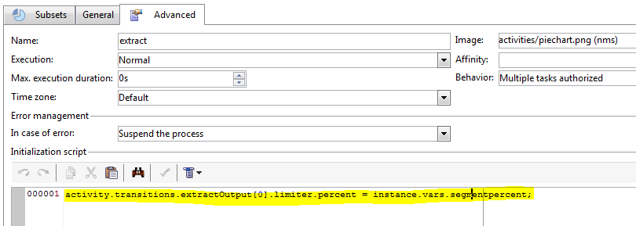

# Plantillas y secuencias de comandos de JavaScript{#javascript-scripts-and-templates}


Las secuencias de comandos permiten calcular valores, intercambiar datos entre las diversas tareas del proceso y ejecutar operaciones específicas utilizando llamadas SOAP.

Las secuencias de comandos son ubicuas en los diagramas de flujo de trabajo:

* Todas las actividades tienen secuencias de comandos de inicialización. Cuando se activa una actividad, se ejecuta una secuencia de comandos de inicialización que se puede utilizar para inicializar variables y para modificar las propiedades.
* La actividad “JavaScript code” se utiliza simplemente para ejecutar una secuencia de comandos.
* La actividad “Test” evalúa las expresiones JavaScript para activar la transición apropiada.
* La mayoría de los campos de texto son plantillas JavaScript: Las expresiones de JavaScript se pueden incluir entre &lt;%= and %>. Estos campos presentan un botón que abre una lista desplegable para ayudarle a introducir expresiones.

  

## Objetos expuestos {#objects-exposed}

Los JavaScript ejecutados en el contexto de un flujo de trabajo acceden a una serie de objetos globales adicionales.

* **instance**: Representa el flujo de trabajo que se está ejecutando. El esquema de este objeto es **xtk:workflow**.
* **task**: Representa las tareas que se están ejecutando. El esquema de este objeto es **xtk:workflowTask**.
* **event**: Representa los eventos que activan la tarea en ejecución. El esquema de este objeto es **xtk:workflowEvent**. Este objeto no se inicializa para actividades de tipo **AND-join** activadas desde varias transiciones.
* **events**: Representa la lista de eventos que activan la tarea actual. El esquema de este objeto es **xtk:workflowEvent**. Esta tabla generalmente contiene un elemento, pero puede contener varios para las actividades de tipo **AND-join** que han sido activadas en función de diversas transiciones.
* **activity**: Representa el modelo de la tarea que se está ejecutando. El esquema de este objeto depende del tipo de actividad. La secuencia de comandos de inicialización puede modificar este objeto, y en otras secuencias de comandos las modificaciones tienen efectos indeterminables.

Las propiedades disponibles para estos objetos se pueden ver en una lista desplegable haciendo clic en el botón situado a la derecha de la barra de herramientas de secuencias de comandos.

>[!CAUTION]
>
>Las propiedades de estos objetos son de solo lectura excepto para las subpropiedades de la propiedad vars.
>  
>La mayoría de estas propiedades solo se actualizan después de ejecutar una tarea básica o al pasivar la instancia. Los valores leídos no coinciden necesariamente con el estado actual, pero sí con el estado anterior.

**Ejemplo**

En este ejemplo, y en los ejemplos siguientes, cree un flujo de trabajo que incluya una actividad **JavaScript code** y una actividad **End** como se muestra en el diagrama siguiente.


Haga doble clic en la actividad **JavaScript code** e inserte las siguientes secuencias de comandos:

```
logInfo("Label: " + instance.label)
logInfo("Start date: " + task.creationDate)
```

La **[!UICONTROL logInfo(message)]** función inserta un mensaje en el registro.

Haga clic en **[!UICONTROL OK]** para cerrar el asistente de creación y, a continuación, inicie el flujo de trabajo utilizando los botones de acción situados en la parte superior derecha de la lista de flujos de trabajo. Al final de la ejecución, consulte el “log”. Debería poder ver dos mensajes correspondientes a la secuencia de comandos: uno muestra la etiqueta del flujo de trabajo y el otro muestra la fecha en que se activó la secuencia de comandos.

## Variables {#variables}

Las variables son las propiedades libres de los objetos **[!UICONTROL task]**,**[!UICONTROL instance]** y **[!UICONTROL event]**. Los tipos de JavaScript autorizados para estas variables son **[!UICONTROL string]**, **[!UICONTROL number]** y **[!UICONTROL Date]**.

### Variables de instancia {#instance-variables}

Las variables de instancia (**[!UICONTROL instance.vars.xxx]**) son comparables a las variables globales. Las comparten todas las actividades.

### Variables de tareas {#task-variables}

Las variables de tareas (**[!UICONTROL task.vars.xxx]**) son comparables a las variables locales. Solo se utilizan en la tarea actual. Las actividades persistentes utilizan estas variables para conservar datos y, a veces, se utilizan para intercambiar datos entre las diferentes secuencias de comandos de una misma actividad.

### Variables de eventos {#event-variables}

Las variables de eventos (**[!UICONTROL vars.xxx]**) permiten el intercambio de datos entre las tareas básicas de un proceso de flujo de trabajo. La tarea que activó la tarea en curso transfiere estas variables. Es posible modificarlas y definir nuevas. Después, se transfieren a las siguientes actividades.

>[!CAUTION]
>
>En el caso de las actividades de tipo [AND-join](and-join.md), las variables se combinan, pero si se define una misma variable dos veces, se genera un conflicto y el valor se mantiene como indeterminado.

Eventos son las variables más utilizadas, que deben utilizarse con preferencia sobre las variables de instancia.

Las distintas actividades modifican o leen ciertas variables de evento. Todas son variables de tipo cadena. Por ejemplo, una exportación establece la variable **[!UICONTROL vars.filename]** con el nombre completo del archivo que acaba de exportarse. Todas estas variables leídas o modificadas se documentan en [Acerca de actividades](activities.md), en las secciones **Parámetros de entrada** y **Parámetros de salida** de las actividades.

### Casos de uso {#example}

>[!NOTE]
>
>Los casos de uso de flujo de trabajo adicional están disponibles en [esta sección](workflow-use-cases.md).

**Ejemplo 1**

En este ejemplo, se utiliza una variable de instancia para calcular dinámicamente el porcentaje dividido que se aplicará a una población.

1. Crear un flujo de trabajo y agregar una actividad de inicio.

1. Agregar y configurar una actividad de código JavaScript para definir una variable de instancia.

   Por ejemplo: `instance.vars.segmentpercent = 10;`

   

1. Agregar una actividad de consulta y dirigir los destinatarios según sus necesidades.

1. Agregar una actividad de división y configurar para realizar un muestreo aleatorio de la población entrante. El porcentaje de muestra puede ser cualquier cosa de su elección. En este ejemplo se establece en 50%.

   Este porcentaje se actualiza dinámicamente gracias a la variable de instancia definida anteriormente.

   

1. En la sección Secuencia de comandos de inicialización de la ficha Avanzadas de la actividad Dividir, defina una condición JS. La condición JS selecciona el porcentaje de muestreo aleatorio de la primera transición que sale de la actividad Split y la actualiza a un valor establecido por la variable de instancia creada anteriormente.

   ```
   activity.transitions.extractOutput[0].limiter.percent = instance.vars.segmentpercent;
   ```

   

1. Asegúrese de que el complemento se genera en una transición independiente de la actividad Dividir y agregue actividades de finalización después de cada una de las transiciones de salida.

1. Guarde y ejecute el flujo de trabajo. El muestreo dinámico se aplica según la variable de instancia.

   

**Ejemplo 2**

1. Utilice el flujo de trabajo del ejemplo anterior y sustituya la secuencia de comandos de la actividad **JavaScript code** por la siguiente secuencia de comandos:

   ```
   instance.vars.foo = "bar1"
   vars.foo = "bar2"
   task.vars.foo = "bar3"
   ```

1. Añada la siguiente secuencia de comandos a la secuencia de comandos de inicialización de la actividad **final**:

   ```
   logInfo("instance.vars.foo = " + instance.vars.foo)
   logInfo("vars.foo = " + vars.foo)
   logInfo("task.vars.foo = " + task.vars.foo)
   ```

1. Inicie el flujo de trabajo y consulte el “log”.

   ```
   Workflow finished
   task.vars.foo = undefined
   vars.foo = bar2
   instance.vars.foo = bar1
   Starting workflow (operator 'admin')
   ```

Este ejemplo muestra que la actividad siguiente a **JavaScript code** accede a las variables de instancia y a las variables de evento, pero no se puede acceder a las variables de tareas desde el exterior (“indefinido”).

### Llamada a una variable de instancia en una consulta {#calling-an-instance-variable-in-a-query}

Una vez especificada una variable de instancia en una actividad, puede volver a utilizarla en una consulta de flujo de trabajo.

Por consiguiente, para llamar a una variable **instance.vars.xxx = &quot;yyy&quot;** en un filtro, escriba **$(instance/vars/@xxx)**.

Por ejemplo:

1. Cree una variable de instancia que defina el nombre interno de un envío mediante el ****[!UICONTROL JavaScript code]**: instance.vars.deliveryIN = “DM42”**.

   

1. Cree una consulta cuyos objetivos y dimensiones de filtrado sean los destinatarios. En las condiciones, especifique que desea buscar todos los destinatarios a los que se envió la entrega especificado por la variable.

   Como recordatorio, esta información se almacena en los registros de entregas.

   Para referirse a la variable de instancia en la columna **[!UICONTROL Value]**, introducir **$(instance/vars/@deliveryIN)**.

   El flujo de trabajo devuelve los destinatarios de la entrega DM42.

   

## Funciones avanzadas {#advanced-functions}

Además de las funciones estándar de JavaScript, existen funciones especiales disponibles para manipular archivos, leer o modificar datos de la base de datos o añadir mensajes al “log”.

### Diario {#journal}

Se ha detallado **[!UICONTROL logInfo(message)]** en los ejemplos anteriores. Esta función añade un mensaje de información al historial.

**[!UICONTROL logError(message)]** añade un mensaje de error al registro. La secuencia de comandos interrumpe su ejecución y el flujo de trabajo cambia de estado a “error” (la instancia se detiene de forma predeterminada).

## Secuencia de comandos de inicialización {#initialization-script}

En determinadas condiciones, se puede modificar una propiedad de una actividad en el momento de su ejecución.

La mayoría de las propiedades de las actividades se pueden calcular dinámicamente, ya sea mediante una plantilla JavaScript o porque las propiedades de flujo de trabajo permiten el cálculo del valor mediante una secuencia de comandos.

Sin embargo, para otras propiedades, debe utilizar la secuencia de comandos de inicialización. Esta secuencia de comandos se evalúa antes de que se ejecute la tarea. La variable **[!UICONTROL activity]** hace referencia a la actividad correspondiente a la tarea. Las propiedades de esta actividad se pueden modificar y afectan solo a esta tarea.

**Temas relacionados**
[Ejemplos de código JavaScript en flujos de trabajo](javascript-in-workflows.md)
