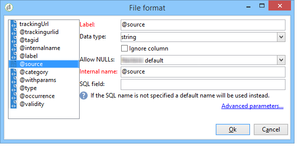

# Carga (SOAP){#loading-soap}

>[!CAUTION]
>
>La actividad **Loading (SOAP)** solo está disponible si tiene instalado el módulo **FDA (Federated Data Access)**. Compruebe el acuerdo de licencia.

La actividad **Load (SOAP)** se utiliza además de la actividad de **data loading (RDBMS)** cuando no es posible recopilar datos directamente mediante el FDA en una base de datos externa.

La operación es la siguiente:

1. Seleccione entre utilizar un ejemplo XML o un WSDL.

   El siguiente ejemplo proviene de un flujo de trabajo técnico del módulo Centro de mensajes.

   

1. Para un ejemplo XML, seleccione un archivo de muestra. El archivo se analiza para establecer un ejemplo del resultado.

   Para un WSDL, introduzca la URL de acceso coincidente y, a continuación, genere el código esquemático. El servicio y la llamada seleccionados se actualizan y se muestran automáticamente.

   

1. Seleccione **[!UICONTROL Click here to view and edit analysis results]** para especificar cada columna identificada.

   

   Si desea actualizar el ejemplo, seleccione **[!UICONTROL Re-analyze the example]**.

1. Puede utilizar el número de línea como identificador o especificar que la llamada SOAP devuelva varios elementos.
1. Introduzca los siguientes scripts de pestañas según su función:

   * **[!UICONTROL Initialization]**: establece una conexión SOAP.
   * **[!UICONTROL Iteration]**: realiza la llamada al servicio SOAP. El retorno de esta función debe ser un objeto XML compatible con la descripción del ejemplo o el WSDL.

     Adobe Campaign llama al código de esta pestaña hasta que devuelva un objeto XML nulo.

   * **[!UICONTROL Finalization]**: cierra la conexión o libera otros recursos creados durante el procesamiento.
