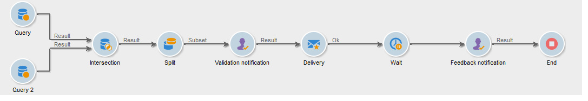

# Uso de la actividad de aprobación local{#using-the-local-approval-activity}

La actividad **[!UICONTROL Local approval]** integrada en un flujo de trabajo de objetivo permite configurar un proceso de aprobación del destinatario antes de realizar la entrega.

>[!CAUTION]
>
>Para utilizar esta función, es necesario adquirir el módulo Distributed Marketing, que es una opción de Campaign. Compruebe el acuerdo de licencia.

Para configurar este caso de uso, se ha creado el siguiente flujo de trabajo de objetivo:

Los pasos principales del proceso de aprobación local son:

1. La población resultante de la segmentación se puede limitar gracias a la actividad de tipo **[!UICONTROL Split]** que utiliza un modelo de distribución de datos.

   

1. A continuación, la actividad **[!UICONTROL Local approval]** toma el cargo y envía un mensaje de correo electrónico de notificación a cada supervisor local. La actividad permanece pendiente hasta que cada supervisor local apruebe los destinatarios asignados a ellos.

1. Una vez que se llega al plazo de aprobación, el flujo de trabajo se inicia nuevamente. En este ejemplo, la actividad **[!UICONTROL Delivery]** se inicia y se realiza la entrega a los objetivos aprobados.

   >[!NOTE]
   >
   >Una vez alcanzada la fecha límite, los destinatarios que no han sido aprobados se excluyen de los objetivos.

   

1. Después de unos días, la segunda actividad **[!UICONTROL Local approval]** envía un correo electrónico de notificación a cada supervisor local con un resumen de las acciones de sus contactos (clics, aperturas, etc.).

## Paso 1: Crear la plantilla de distribución de datos {#step-1--creating-the-data-distribution-template-}

La plantilla de distribución de datos permite limitar la población resultante de la segmentación en función de la agrupación de datos, así como asignar cada valor a un supervisor local. En este ejemplo, se ha definido el campo **[!UICONTROL Email address domain]** como campo de distribución y se ha asignado un dominio a cada supervisor local.

Para obtener más información sobre la creación de una plantilla de distribución de datos, consulte [Limitación del número de registros de subconjuntos por distribución de datos](split.md#limiting-the-number-of-subset-records-per-data-distribution).

1. Para crear la plantilla de distribución de datos, vaya al nodo **[!UICONTROL Resources > Campaign management > Data distribution]** y haga clic en **[!UICONTROL New]**.

   

1. Seleccione la pestaña **[!UICONTROL General]** .

   

1. Introduzca el **[!UICONTROL Label]** y el **[!UICONTROL Distribution context]**. En este ejemplo, se ha seleccionado el esquema objetivo **[!UICONTROL Recipient]** y el campo **[!UICONTROL Email domain]** como campo de distribución. La lista de destinatarios se desglosan por dominio.
1. En el campo **[!UICONTROL Distribution type]**, seleccione cómo se expresa el valor de limitación objetivo en la pestaña **[!UICONTROL Distribution]**. Aquí, se ha elegido **[!UICONTROL Percentage]**.
1. En el campo **[!UICONTROL Approval storage]**, introduzca el esquema de almacenamiento de las aprobaciones que coinciden con el esquema de objetivo en uso. A continuación, se va a utilizar el esquema de almacenamiento predeterminado: **[!UICONTROL Local approval of recipients]**.
1. Luego haga clic en el vínculo **[!UICONTROL Advanced parameters]**.

   

1. Mantenga la opción **[!UICONTROL Approve the targeted messages]** activada para que todos los destinatarios estén preseleccionados desde la lista de destinatarios por aprobar.
1. En el campo **[!UICONTROL Delivery label]**, se ha dejado la expresión predeterminada (cálculo de cadena de la entrega). La etiqueta estándar de la entrega se utiliza en la notificación de comentarios.
1. En la sección **[!UICONTROL Grouping field]**, se ha seleccionado el campo **[!UICONTROL Gender]** como un campo de agrupación para mostrar los destinatarios en las notificaciones de aprobación y comentarios.
1. En la sección **[!UICONTROL Edit targeted messages]**, se ha seleccionado la aplicación web **[!UICONTROL Edit recipients]** y el parámetro **[!UICONTROL recipientId]**. En las notificaciones de aprobación y comentarios, se puede hacer clic en los destinatarios y estos se dirigirán a la dirección URL de la aplicación web. El parámetro de la dirección URL adicional es **[!UICONTROL recipientId]**.
1. Luego haga clic en la pestaña **[!UICONTROL Distribution]**. Para cada dominio, introduzca los siguientes campos:

   

   * **[!UICONTROL Value]**: introduzca el valor del nombre de dominio.
   * **[!UICONTROL Percentage / Fixed]**: para cada dominio, escriba el máximo. número de destinatarios a los que desea enviar la entrega. En este ejemplo, se desea limitar la entrega a 10% por dominio.
   * **[!UICONTROL Label]**: introduzca la etiqueta del dominio a mostrar en las notificaciones de aprobación y comentarios.
   * **[!UICONTROL Group or operator]**: seleccione el operador o el grupo de operadores asignados al dominio.

     >[!CAUTION]
     >
     >Asegúrese de que se hayan asignado los derechos adecuados a los operadores.

## Paso 2: Creación de un flujo de trabajo de objetivos {#step-2--creating-the-targeting-workflow}

Para configurar este caso de uso, se ha creado el siguiente flujo de trabajo de objetivo:

Se agregaron las siguientes actividades:

* Dos actividades **[!UICONTROL Query]**,
* Una actividad **[!UICONTROL Intersection]**,
* Una actividad **[!UICONTROL Split]**,
* Una actividad **[!UICONTROL Local approval]**,
* Una actividad **[!UICONTROL Delivery]**,
* Una actividad **[!UICONTROL Wait]**,
* Una segunda actividad **[!UICONTROL Local approval]**,
* Una actividad **[!UICONTROL End]**.

### Consultas, Intersección y División {#queries--intersection-and-split}

La segmentación ascendente se compone de dos consultas, una intersección y una división. La población resultante de la segmentación se puede limitar con una actividad **[!UICONTROL Split]** que utiliza una plantilla de distribución de datos.

Para obtener más información sobre la configuración de una actividad de división, consulte [Dividir](split.md). La creación de una plantilla de distribución de datos se detalla en [Limitar el número de registros de subconjuntos por distribución de datos](split.md#limiting-the-number-of-subset-records-per-data-distribution).

Si no desea limitar la población de la consulta, no tiene que utilizar las actividades **[!UICONTROL Query]**, **[!UICONTROL Intersection]** ni **[!UICONTROL Split]**. En este caso, complete la plantilla de distribución de datos en la primera actividad **[!UICONTROL Local approval]**.

1. En la sección **[!UICONTROL Record count limitation]**, seleccione la opción **[!UICONTROL Limit the selected records]** y haga clic en el vínculo **[!UICONTROL Edit]**.

   

1. Seleccione la opción **[!UICONTROL Keep only the first records after sorting]** y haga clic en **[!UICONTROL Next]**.

   

1. En la sección **[!UICONTROL Sort columns]**, añada el campo al que se aplica la ordenación. Aquí, se ha elegido el campo **[!UICONTROL Email]**. Haga clic en **[!UICONTROL Next]**.

   

1. Seleccione la opción **[!UICONTROL By data distribution]**, seleccione la plantilla de distribución creada anteriormente (consulte el [Paso 1: Creación de la plantilla de distribución de datos](#step-1--creating-the-data-distribution-template-)) y haga clic en **[!UICONTROL Finish]**.

   

En la plantilla de distribución, se ha elegido limitar la población al 10 % por valor de agrupación, lo que coincide con los valores mostrados en el flujo de trabajo (340 como entrada y 34 como salida).

### Notificación de aprobación {#approval-notification}

La actividad **[!UICONTROL Local approval]** permite enviar una notificación a cada supervisor local.

Para obtener más información sobre la configuración de la actividad de **[!UICONTROL Local approval]**, consulte [Aprobación local](local-approval.md).

Se deben introducir los campos siguientes:

1. En la sección **[!UICONTROL Action to execute]**, seleccione la opción **[!UICONTROL Target approval notification]**.
1. En la sección **[!UICONTROL Distribution context]**, seleccione la opción **[!UICONTROL Specified in the transition]**.

   Si no desea limitar la población objetivo, seleccione la opción **[!UICONTROL Explicit]** aquí e introduzca la plantilla de distribución creada anteriormente en el campo **[!UICONTROL Data distribution]**.

1. En la sección **[!UICONTROL Notification]**, seleccione la plantilla de entrega y el asunto a utilizar para el correo electrónico de notificación. Aquí, se ha elegido la plantilla predeterminada: **[!UICONTROL Local approval notification]**.
1. En la sección **[!UICONTROL Approval schedule]**, se ha guardado el plazo de aprobación predeterminado (3 días) y se ha agregado un recordatorio. La entrega se realiza 3 días después del inicio de la aprobación. Una vez que se ha alcanzado el plazo de aprobación, la segmentación no tiene en cuenta los destinatarios no aprobados.

La actividad **[!UICONTROL Local approval]** envía un mensaje de correo electrónico de notificación a los supervisores locales.

### Espera {#wait}

La actividad de espera permite posponer el inicio de la segunda actividad de aprobación local que envía la notificación de entrega de comentarios. En el campo **[!UICONTROL Duration]**, se ha introducido el valor **[!UICONTROL 5d]** (5 días). Las acciones que realizan los destinatarios durante 5 días después del envío la entrega se incluyen en la notificación de comentarios.

### Notificación de comentarios {#feedback-notification}

La segunda actividad **[!UICONTROL Local approval]** permite enviar una notificación de comentarios de entrega a cada supervisor local.

Se deben introducir los campos siguientes:

1. En la sección **[!UICONTROL Action to execute]**, elija **[!UICONTROL Delivery feedback report]**.
1. En la sección **[!UICONTROL Delivery]**, elija **[!UICONTROL Specified in the transition]**.
1. En la sección **[!UICONTROL Notification]**, seleccione la plantilla de entrega y el asunto a utilizar para el correo electrónico de notificación.

Una vez que se alcanza la fecha límite configurada en la actividad de espera, la segunda actividad **[!UICONTROL Local approval]** envía el correo electrónico de notificación siguiente a cada supervisor local:

### Seguimiento de aprobación por el administrador {#approval-tracking-by-the-administrator}

Cada vez que se inicia la actividad de aprobación local, se crea una tarea de aprobación. El administrador puede controlar cada una de estas tareas de aprobación.

Vaya al flujo de trabajo de objetivo de la campaña y haga clic en la pestaña **[!UICONTROL Local approval tasks]**.

También se puede acceder a la lista de tareas de aprobación locales a través de la pestaña **[!UICONTROL Approval tasks]** de la plantilla de distribución de datos.

Seleccione la tarea que desee monitorizar y haga clic en el botón **[!UICONTROL Detail]**. La pestaña **[!UICONTROL General]** de la tarea de aprobación local permite ver información sobre la tarea. Si es necesario, se pueden modificar las fechas de aprobación y de recordatorio.

Esta pestaña muestra la siguiente información:

* la etiqueta de la tarea y su ID
* la plantilla de distribución utilizada
* el número de mensajes dirigidos
* el flujo de trabajo y la campaña vinculados
* la programación de tareas

La pestaña **[!UICONTROL Distribution]** de la tarea permite ver los registros de aprobación, su estado, el número de mensajes dirigidos, la fecha de aprobación y el operador que ha aprobado la entrega.

Seleccione un registro de aprobación y haga clic en el botón **[!UICONTROL Detail]** para obtener más información. La pestaña **[!UICONTROL General]** del registro de aprobación local permite ver la información general de registro. Asimismo, se puede cambiar el estado de aprobación.

Esta pestaña muestra la siguiente información:

* la tarea de aprobación vinculada
* el estado de aprobación (**[!UICONTROL Approved]** o **[!UICONTROL Pending]**)
* la plantilla de distribución utilizada
* el supervisor local que aprobó y la fecha de aprobación
* el número de mensajes dirigidos y aprobados

La pestaña **[!UICONTROL Targeted]** del registro de aprobación muestra la lista de destinatarios objetivo y su estado de aprobación. Se puede cambiar este estado si es necesario.

