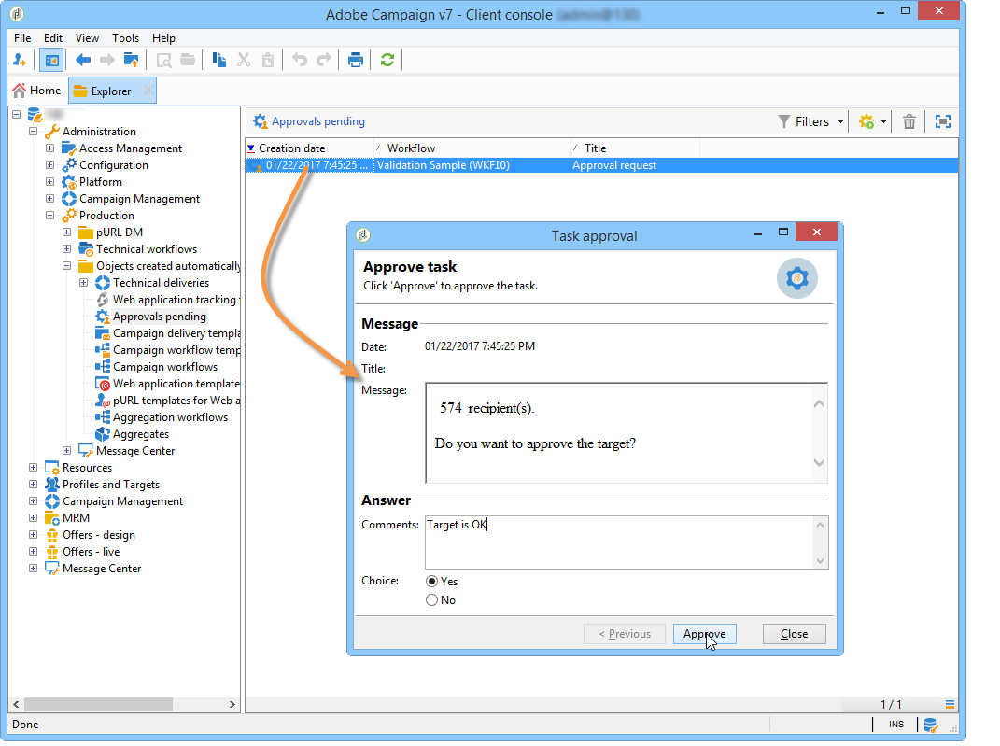

# Aprobación local{#local-approval}

Cuando se integra en un flujo de trabajo de objetivos, la actividad **[!UICONTROL Local approval]** permite configurar un proceso de aprobación de destinatarios antes de la entrega.

>[!CAUTION]
>
>Para utilizar esta actividad, debe haber adquirido el módulo de Distributed Marketing, que es una opción de la campaña. Compruebe el acuerdo de licencia.

Para ver un ejemplo de la actividad **[!UICONTROL Local approval]** con una plantilla de distribución, consulte [Uso de la actividad de aprobación local](local-approval-activity.md).

Comience introduciendo una etiqueta para la actividad y el campo **[!UICONTROL Action to execute]**:

* Seleccione la opción **[!UICONTROL Target approval notification]** para enviar un correo electrónico de notificación a los supervisores locales antes de la entrega para pedirles que aprueben los destinatarios asignados a ellos.

* **Incremental query**: permite realizar una consulta y planificar su ejecución. Consulte la sección [Consulta incremental](incremental-query.md).

  

## Notificación de aprobación del objetivo {#target-approval-notification}

En este caso, la actividad **[!UICONTROL Local approval]** se coloca entre el objetivo ascendente y la entrega:

Los campos que se deben ingresar en caso de una notificación para la aprobación del objetivo son los siguientes:

* **[!UICONTROL Distribution context]**: seleccione la opción **[!UICONTROL Specified in the transition]** si utiliza una actividad de tipo **[!UICONTROL Split]** para limitar la población objetivo. En este caso, la plantilla de distribución se introduce en la actividad dividida. Si no limita la población objetivo, seleccione la opción **[!UICONTROL Explicit]** aquí e introduzca la plantilla de distribución en el campo **[!UICONTROL Data distribution]**.

  Para obtener más información sobre la creación de una plantilla de distribución de datos, consulte [Limitación del número de registros de subconjuntos por distribución de datos](split.md#limiting-the-number-of-subset-records-per-data-distribution).

* **[!UICONTROL Approval management]**

   * Seleccione la plantilla de envío y el asunto que se utilizará para la notificación por correo electrónico. Hay disponible una plantilla predeterminada: **[!UICONTROL Local approval notification]**. También puede añadir una descripción que aparecerá sobre las listas de destinatarios en las notificaciones de aprobación y comentarios.
   * Especifique el **[!UICONTROL Approval type]** correspondiente a la fecha límite de aprobación (fecha o fecha límite desde el inicio de la aprobación). En esta fecha, el flujo de trabajo se inicia nuevamente y los destinatarios que no se hayan aprobado no se tienen en cuenta para los objetivos. Una vez enviadas las notificaciones, la actividad se pone en cola para que los supervisores locales puedan aprobar sus contactos.

     >[!NOTE]
     >
     >De forma predeterminada, cuando se inicia el proceso de aprobación, la actividad queda pendiente durante tres días.

     También puede añadir uno o más recordatorios para informarles a los supervisores locales que la fecha límite se acerca. Para ello, haga clic en el vínculo **[!UICONTROL Add a reminder]**.

* **[!UICONTROL Complementary set]**: la opción **[!UICONTROL Generate complement]** permite generar un segundo conjunto que incluya todos los objetivos no aprobados.

  >[!NOTE]
  >
  >Esta opción está desactivada de forma predeterminada.

## Informe de comentarios de la entrega {#delivery-feedback-report}

En este caso, la actividad **[!UICONTROL Local approval]** se coloca después de la entrega:

En caso de un informe de comentarios de la entrega, se deben ingresar los siguientes campos:

* Seleccione la opción **[!UICONTROL Specified in the transition]** si la entrega se ha ingresado durante una actividad anterior. Seleccione **[!UICONTROL Explicit]** para especificar la entrega en la actividad de aprobación local.
* Seleccione la plantilla de envío y la finalidad del correo electrónico de notificación. Hay una plantilla predeterminada: **[!UICONTROL Local approval notification]**.

## Ejemplo: Aprobación de una entrega de flujo de trabajo {#example--approving-a-workflow-delivery}

Este ejemplo muestra la configuración de un proceso de aprobación para una entrega de flujo de trabajo. Para obtener más información sobre la creación de los flujos de trabajo de la entrega, consulte la sección [Ejemplo: flujo de trabajo de envíos](delivery.md#example--delivery-workflow).

Un operador puede aprobar una entrega de una de las dos maneras siguientes: mediante la página web vinculada en el mensaje de correo electrónico o a través de la consola del cliente.

* Aprobación en la web

  El correo electrónico enviado a los operadores del grupo Administrador permite aprobar el objetivo de la entrega. El mensaje utiliza el texto definido y la expresión JavaScript se sustituye por el valor calculado (en este caso, “574”).

  Para aprobar la entrega, haga clic en el vínculo correspondiente e inicie sesión en la consola del cliente de Adobe Campaign.

  

  Seleccione y haga clic en el botón **[!UICONTROL Submit]**.

  

* Aprobación mediante la consola de cliente

  En la estructura de árbol, el nodo **[!UICONTROL Administration > Production > Objects created automatically > Approvals pending]** contiene la lista de tareas que debe aprobar el operador conectado actualmente. La lista debe mostrar una línea. Haga doble clic en esta línea para responder. Se muestra la siguiente ventana:

Seleccione **Yes** y haga clic en **[!UICONTROL Approve]**. Un mensaje le informará de que la respuesta se ha registrado.

Vuelva a la pantalla de flujo de trabajo: Después de unos diez segundos, el diagrama se muestra de la siguiente manera:

El flujo de trabajo ha ejecutado la tarea **[!UICONTROL Delivery control]**, que en este caso implica iniciar la entrega creada previamente. El flujo de trabajo ha finalizado sin errores.
