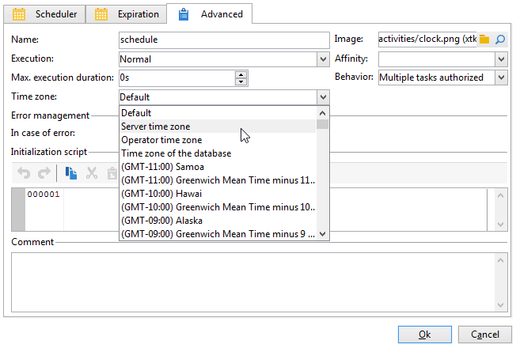

# Administración de zonas horarias{#managing-time-zones}

Adobe Campaign le permite administrar desfases temporales entre los distintos países de la misma instancia. La configuración aplicada se configura durante la creación de instancias.

En un flujo de trabajo, puede adaptar las programaciones de ejecución de una actividad y vincular una zona horaria específica a una actividad o a todo el flujo de trabajo. Esta configuración puede resultar útil al importar el archivo o en el contexto de la programación de envíos.

## Programación de la ejecución {#execution-scheduling}

Puede planificar la ejecución de tareas utilizando el planificador (consulte [Planificador](scheduler.md)). También puede utilizar las opciones de planificación disponibles en las actividades que ofrecen esta funcionalidad. Estas actividades ofrecen una pestaña **[!UICONTROL Schedule]**: **[!UICONTROL File collector]**, **[!UICONTROL File transfer]**, **[!UICONTROL Web download]**, **[!UICONTROL Email reception]** y **[!UICONTROL SMS]**, etc.

Para todas las tareas planificadas, es decir, todas las actividades con opciones de planificación, puede seleccionar la zona horaria que desee aplicar. La zona horaria se selecciona a través de la pestaña **[!UICONTROL Advanced]** de la actividad correspondiente:

Los valores posibles son:

* Zona horaria del servidor

  Utiliza la zona horaria del servidor de aplicaciones de Adobe Campaign.

* Zona horaria del usuario

  Utiliza la zona horaria del operador de Adobe Campaign que ejecuta el flujo de trabajo.

* Zona horaria de la base de datos

  Utiliza la zona horaria del servidor de la base de datos utilizado.

* Zonas horarias específicas

  Utiliza la zona horaria seleccionada.

Si se selecciona el valor **[!UICONTROL By default]**, se aplica la zona horaria del flujo de trabajo o, en caso contrario, la del servidor de aplicaciones.

## Vinculación de una zona horaria a una actividad {#linking-a-time-zone-to-an-activity}

La pestaña **[!UICONTROL Advanced]** de las actividades de flujo de trabajo permite seleccionar su zona horaria. Aunque la mayor parte del tiempo la zona horaria del flujo de trabajo es suficiente, puede ser necesario sobrecargarla de vez en cuando para una actividad específica, como la importación de datos, para vincular las fechas a la zona horaria correcta.
