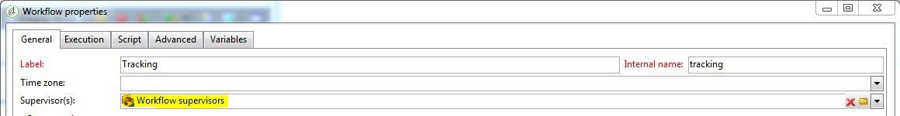

# Monitorización de flujos de trabajo técnicos {#monitoring-technical-workflows}

Es necesario supervisar los flujos de trabajo técnicos, y deben tomarse medidas cuando se producen errores.

## Panel de monitorización de instancias {#instance-monitoring-dashboard}

Se puede acceder al tablero de monitorización de instancias a través de la pestaña **[!UICONTROL Monitoring]**.

En los indicadores del sistema y los archivos principales, compruebe que no hay indicadores resaltados en rojo. Si así fuera:

* Compruebe que los procesos necesarios estén siempre en ejecución,
* Compruebe que ninguno de los procesos es demasiado antiguo,
* Compruebe que los archivos de registro de los diferentes procesos no contengan errores preocupantes y recurrentes.

## Flujos de trabajo técnicos {#technical-workflows}

Los flujos de trabajo técnicos están disponibles en **[!UICONTROL Technical workflows]**&#x200B;**[!UICONTROL Administration]**, **[!UICONTROL Production]**, .

Dependiendo del flujo de trabajo técnico, siga los pasos detallados a continuación para asegurarse de que todo funciona correctamente.

Para comprender mejor qué debe hacer cada flujo de trabajo técnico, consulte esta [sección](technical-workflows.md).

En el caso de **[!UICONTROL Database Cleanup workflow ('cleanup')]**:

Compruebe el historial para comprobar que el tiempo transcurrido es relativamente constante en el tiempo y no interfiere con otros flujos de trabajo.

En el caso de **[!UICONTROL Tracking workflow ('tracking')]**:

Compruebe que el flujo de trabajo de seguimiento se ejecute como está planificado (cada hora de forma predeterminada) y que el historial no destaque errores recurrentes. Para obtener más información, consulte [esta sección](delivery.md).

En el caso de **[!UICONTROL Deliverability update ('deliverabilityUpdate')]**:

1. Compruebe que el flujo de trabajo **[!UICONTROL Deliverability update]** se ejecuta y finaliza correctamente todos los días.
1. Compruebe en el historial que las reglas se actualizan regularmente.

En el caso de **[!UICONTROL Campaign process ('operationMgt', 'deliveryMgt', ...)]**:

1. Observe todos los flujos de trabajo ubicados en la carpeta **[!UICONTROL Campaign process]**. Para obtener más información, consulte [esta página](technical-workflows.md).
1. Compruebe que los flujos de trabajo se ejecutan como está planificado y que el historial no destaca errores recurrentes.

## Monitorización del flujo de trabajo {#workflow-supervision}

El grupo **[!UICONTROL Workflow supervisors]** debe contener operadores a los que hay que mantener informados sobre los fallos y que pueden actuar a tiempo.

Se debe generar una alerta y enviarla al grupo correcto en caso de problemas.

Asegúrese de que cada operador tiene una dirección de correo electrónico válida.

Cualquier flujo de trabajo que se ejecute para mantener la plataforma en funcionamiento, como las importaciones diarias de datos, debe declararse como &quot;Producción&quot; (casilla de verificación) y aparecer en negrita.

## Lista de mantenimiento del flujo de trabajo {#workflow-maintenance-list}

Todos los flujos de trabajo técnicos personalizados deben documentarse en una hoja de cálculo que contenga:

* Nombre y ubicación del flujo de trabajo.
* Objetivo.
* Programación y dependencias.
* Operador responsable de la monitorización.
* Instrucciones sobre qué hacer en caso de error.

## Planificación y automatización de la monitorización {#planning-and-automation-of-monitoring}

La planificación de la monitorización del flujo de trabajo mejora su eficacia. Es necesario llevar a cabo algunas tareas diariamente, mientras que otras pueden realizarse semanalmente o mensualmente.

La configuración de flujos de trabajo en carpetas con nombre por repetición y ordenadas por planificación de ejecución mejora la eficacia del control.

La automatización de la monitorización reduce los costes de los recursos y garantiza que las tareas se planifiquen con la frecuencia adecuada.

Puede crear un flujo de trabajo de monitorización para enviar un mensaje de correo electrónico cada vez que se produce un error o una tabla esencial se vuelve demasiado grande.

Puede crear una vista para que se puedan monitorizar todos los flujos de trabajo de un área funcional o de todo un sistema.

También puede utilizar la funcionalidad de trabajo o informes de Adobe Campaign para crear documentación bajo demanda que siempre esté actualizada.
