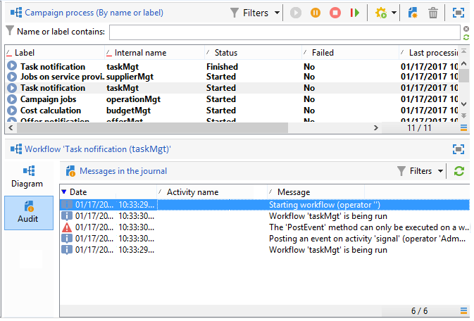
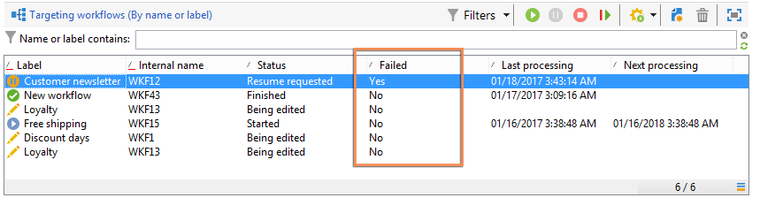
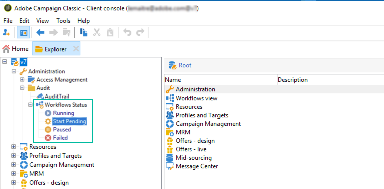

# Monitorización de la ejecución del flujo de trabajo {#monitoring-workflow-execution}

Esta sección presenta información sobre cómo monitorizar la ejecución de los flujos de trabajo.

En [esta sección](workflow-supervision.md#supervising-workflows) está disponible un caso de uso que detalla la creación de un flujo de trabajo que permite monitorizar el estado de un conjunto de flujos de trabajo que están “en pausa”, “detenidos” o “con errores”.

Además, los administradores de la instancia pueden utilizar la **pista de auditoría** para comprobar las actividades y las últimas modificaciones realizadas en los flujos de trabajo y el estado de los mismos. Obtenga más información sobre la pista de auditoría en esta [página](../../v8/reporting/audit-trail.md){target="_blank"}.

## Visualización del progreso {#displaying-progress}

Puede monitorizar la ejecución mediante la visualización del progreso con el icono correspondiente de la barra de herramientas.

El icono **[!UICONTROL Display progress information]** permite mostrar el estado y el resultado de la actividad en la pantalla de ejecución.


Cuando se selecciona esta opción, las actividades ejecutadas se muestran en azul, las actividades pendientes parpadean, las advertencias se muestran en naranja y los errores en rojo. Esta opción también muestra el resultado de las actividades en su transición saliente, seguido de la etiqueta del resultado como se establece en las propiedades de la actividad y la duración del trabajo si esta es superior a un segundo


## Visualización de registros {#displaying-logs}

El “log” contiene el historial o la pista de auditoría del flujo de trabajo. Registra todas las acciones del usuario, todas las operaciones realizadas y los errores encontrados. Se puede:

* Seleccione la pestaña **[!UICONTROL Tracking]** en los detalles. Esta lista contiene todos los mensajes del flujo de trabajo.

  

* Filtrado de los mensajes de “log” por actividad. Para ello, haga clic en **[!UICONTROL Display the tasks and the log]** en la barra de herramientas situada encima del diagrama para mostrar las pestañas **[!UICONTROL Log]** y **[!UICONTROL Tasks]** debajo del diagrama. Seleccione una actividad para ver todos los mensajes relacionados. Esta lista contiene todos los mensajes cuando no hay actividad seleccionada.

  

  >[!NOTE]
  >
  >Haga clic en el fondo del diagrama para anular la selección de todos los elementos.

* Visualice solo los mensajes vinculados a una tarea determinada. Para ello, seleccione la pestaña **[!UICONTROL Tasks]** y elija una actividad en el diagrama para restringir la lista. Haga doble clic en una tarea para mostrar la información; la última pestaña de la ventana contiene el “log”.

  

  El botón **[!UICONTROL Details...]** permite mostrar toda la información adicional sobre la ejecución de la actividad. Por ejemplo, puede ver el operador de validación y, cuando corresponda, el comentario que ha introducido durante la aprobación.

>[!NOTE]
>
>El “log” no se depura cuando se reinicia un flujo de trabajo. Todos los mensajes se mantienen. Si desea descartar los mensajes de una ejecución anterior, debe depurar el historial.

El “log” muestra la lista de mensajes de ejecución relacionados con las actividades de flujo de trabajo de objetivos.

* “Log” de una campaña de objetivos

  Una vez que se ha ejecutado una campaña de objetivos, haga clic en la pestaña **[!UICONTROL Tracking]** para ver el historial de ejecución.

  

  Se muestran todos los mensajes de campaña: campañas realizadas, así como advertencias o errores.

* “Log” de una actividad

  También puede ver el “log” de ejecución y los detalles de cada actividad. Hay dos formas de hacerlo:

   1. Seleccione la actividad de objetivo y haga clic en el icono **[!UICONTROL Display the tasks and the log]**.

      

      La sección inferior del diagrama muestra dos pestañas: Logs y Tasks.

      Las actividades seleccionadas dentro del diagrama actúan como filtros en la lista de “logs” y tareas.

      

   1. Haga clic con el botón derecho del ratón en la carpeta y seleccione **[!UICONTROL Display logs]**.

      

      El registro se muestra en una ventana independiente.

## Depuración de registros {#purging-the-logs}

El historial del flujo de trabajo no se purga automáticamente: todos los mensajes se mantienen de forma predeterminada. El historial se puede eliminar a través del menú **[!UICONTROL File > Actions]**&#x200B;**[!UICONTROL Actions]** o haciendo clic en el botón ubicado en la barra de herramientas situada encima de la lista. Seleccione **[!UICONTROL Purge history]**. Las opciones disponibles en el menú **[!UICONTROL Actions]** se detallan en la sección [Barra de herramientas de acciones](start-a-workflow.md).


## Esquema de tablas de trabajo y flujo de trabajo {#worktables-and-workflow-schema}

El flujo de trabajo transmite tablas de trabajo que se pueden manipular mediante determinadas actividades. Adobe Campaign le permite, a través de las actividades de gestión de datos, modificar, cambiar el nombre y enriquecer las columnas de las tablas de trabajo del flujo de trabajo, por ejemplo, para alinearlas con la nomenclatura dependiendo de las necesidades del cliente, para recoger información adicional sobre el cobeneficiario de un contrato, etc.

También es posible crear vínculos entre diferentes dimensiones de trabajo y definir los cambios de dimensión. Por ejemplo, para cada contrato registrado en la base de datos, diríjase al titular principal y utilice los datos del copropietario en la información adicional.

Las tablas de trabajo del flujo de trabajo se eliminan automáticamente cuando el flujo de trabajo se pasiva. Si desea mantener una tabla de trabajo, guárdela en una lista a través de la actividad **[!UICONTROL List update]** (consulte [Actualización de listas](list-update.md)).

## Administración de errores {#managing-errors}

Cuando se produce un error, el flujo de trabajo se detiene y la actividad que se está ejecutando cuando se produce el error parpadea en rojo. En la descripción general del flujo de trabajo, en la pestaña **[!UICONTROL Monitoring]** del vínculo **[!UICONTROL Workflows]**, puede mostrar solo los flujos de trabajo con errores, como se muestra a continuación.


En Adobe Campaign Explorer, la lista de flujos de trabajo muestra una columna **[!UICONTROL Failed]** de forma predeterminada.



Cuando un flujo de trabajo sufre un error, se notifica por correo electrónico a los operadores que pertenecen al grupo de supervisión del flujo de trabajo, siempre y cuando su dirección de correo electrónico se muestre en su perfil. Este grupo está seleccionado en el campo **[!UICONTROL Supervisor(s)]** de las propiedades del flujo de trabajo.


El contenido de la notificación está configurado en la plantilla predeterminada **[!UICONTROL Workflow manager notification]**: Esta plantilla está seleccionada en la pestaña **[!UICONTROL Execution]** de las propiedades del flujo de trabajo. La notificación muestra el nombre del flujo de trabajo de error y la tarea correspondiente.

Ejemplo de notificación:


El vínculo le permite acceder a la consola del cliente de Adobe Campaign en el modo web y trabajar con el flujo de trabajo del error una vez que haya iniciado sesión.


Puede configurar el flujo de trabajo para que no se detenga y continúe la ejecución en caso de errores. Para ello, edite **[!UICONTROL Properties]** del flujo de trabajo y, en la sección **[!UICONTROL Error management]**, seleccione la opción **[!UICONTROL Ignore]** del campo **[!UICONTROL In case of error]**. Puede especificar el número de errores consecutivos que se pueden omitir antes de que se ponga en pausa el proceso.

En este caso, se anula la tarea de error. Este modo es especialmente apropiado para los flujos de trabajo diseñados para volver a probar la campaña más tarde (acciones periódicas).


>[!NOTE]
>
>Puede aplicar esta configuración individualmente para cada actividad. Para ello, edite las propiedades de la actividad y seleccione el modo de administración de errores en la pestaña **[!UICONTROL Advanced]**.

## Procesamiento de errores {#processing-errors}

En cuanto a las actividades, la opción **[!UICONTROL Process errors]** muestra una transición específica que se activa si se genera un error. En este caso, el flujo de trabajo no se abre en modo de error y la ejecución continúa.

Los errores que se tienen en cuenta son los errores del sistema de archivos (el archivo no se puede mover, no se puede acceder a un directorio, etc.).

Esta opción no procesa los errores relacionados con la configuración de la actividad, es decir, valores no válidos. Los errores relacionados con una configuración defectuosa no activan esta transición (el directorio no existe, etc.).

Si un flujo de trabajo está en pausa (manual o automáticamente después de un error), el botón **[!UICONTROL Start]** reinicia la ejecución del flujo de trabajo en la que se detuvo. La actividad errónea (o actividad pausada) se vuelve a ejecutar. Las actividades anteriores no se vuelven a ejecutar.

Para volver a ejecutar todas las actividades de flujo de trabajo, utilice el botón **[!UICONTROL Restart]**.

Si modifica las actividades que ya se han ejecutado, los cambios no se tienen en cuenta al reiniciar la ejecución del flujo de trabajo.

Si modifica las actividades no ejecutadas, estas se tienen en cuenta cuando se reinicia la ejecución del flujo de trabajo.

Si modifica las actividades en pausa, los cambios no se tienen en cuenta correctamente cuando se reinicia el flujo de trabajo.

Si es posible, se recomienda reiniciar el flujo de trabajo después de realizar las modificaciones.

## Supervisión de la instancia {#instance-supervision}

La página **[!UICONTROL Instance supervision]** permite ver la actividad del servidor de Adobe Campaign y mostrar la lista de flujos de trabajo y entregas con errores.

Para acceder a esta página, vaya a la pestaña **[!UICONTROL Monitoring]** y haga clic en el vínculo **[!UICONTROL General view]**.


Para mostrar todos los flujos de trabajo, haga clic en el vínculo **[!UICONTROL Workflows]**. Utilice la lista desplegable para mostrar los flujos de trabajo en la plataforma según su estado.


Haga clic en el vínculo de un flujo de trabajo con errores para abrirlo y ver su “log”.


## Prevención de las ejecuciones múltiples simultáneas {#preventing-simultaneous-multiple-executions}

Un único flujo de trabajo puede tener varias ejecuciones a la vez. En algunos casos debe evitar que esto ocurra.

Por ejemplo, puede hacer que un programador active la ejecución del flujo de trabajo cada hora, pero a veces la ejecución del flujo de trabajo completo tarda más de una hora. Puede preferir omitir la ejecución si el flujo de trabajo ya se está ejecutando.

Si tiene una actividad de señal al comienzo del flujo de trabajo, puede que desee omitir la señal si el flujo de trabajo se está ejecutando.

El principio general es el siguiente:


La solución consiste en utilizar una variable de instancia. Las variables de instancia se comparten en todas las ejecuciones paralelas de los flujos de trabajo.

A continuación se muestra un sencillo flujo de trabajo de prueba:


**[!UICONTROL Scheduler]** activa un evento cada minuto. La siguiente actividad **[!UICONTROL Test]** prueba la variable de instancia **isRunning** para decidir si debe continuar o no la ejecución:


>[!NOTE]
>
>**isRunning** es un nombre de variable elegido para este ejemplo. Esta no es una variable integrada.

La actividad inmediatamente posterior a **[!UICONTROL Test]** en la rama **yes** debe establecer la variable de instancia en la **Secuencia de comandos de inicialización**:

```
instance.vars.isRunning = true
```

La última actividad en la rama **sí** debe revertir la variable para establecerla en “falso” en la **Secuencia de comandos de inicialización**:

```
instance.vars.isRunning = false
```

Tenga en cuenta que:

* Puede comprobar el valor actual de la variable de instancia mediante la pestaña **Variables** en el flujo de trabajo **Propiedades**.
* Las variables de instancia se restablecen al reiniciar un flujo de trabajo.
* En JavaScript, un valor indefinido es falso en una prueba, lo que permite probar la variable de instancia incluso antes de haberla inicializado.
* Se pueden monitorizar las actividades que no se procesan debido a este mecanismo con tan solo añadir una instrucción de registro a la secuencia de comandos de inicialización del final “no”.

  ```
  logInfo("Workflow already running, parallel execution not allowed.");
  ```

En esta sección se presenta un caso de uso: [Coordinación de las actualizaciones de datos](coordinate-data-updates.md).

## Mantenimiento de la base de datos {#database-maintenance}

Los flujos de trabajo utilizan muchas tablas de trabajo que consumen espacio y terminan por ralentizar la plataforma completa si no se realiza un mantenimiento.

El flujo de trabajo **Limpieza de la base de datos**, accesible a través del nodo **Administración, Producción, Flujos de trabajo técnicos**, permite eliminar datos obsoletos para evitar el crecimiento exponencial de la base de datos. El flujo de trabajo se activa automáticamente sin intervención del usuario.

También puede crear flujos de trabajo técnicos específicos para depurar los datos innecesarios que consumen espacio. Consulte   y esta [sección](#purging-the-logs).

## Gestión de los flujos de trabajo en pausa {#handling-of-paused-workflows}

De forma predeterminada, si un flujo de trabajo está en pausa, sus tablas de trabajo nunca se depuran. Desde la versión 8880, los flujos de trabajo en estado pausado durante demasiado tiempo se detienen automáticamente y se depuran sus tablas de trabajo. Este comportamiento se activa de la siguiente manera:

* Los flujos de trabajo que llevan en pausa más de siete días aparecen como advertencia en el tablero de monitorización (y la API de monitorización) y se envía una notificación al grupo del supervisor.
* Lo mismo ocurre cada semana, cuando se activa el flujo de trabajo técnico **[!UICONTROL cleanupPausedWorkflows]**. Para obtener más información sobre los flujos de trabajo, consulte [esta sección](delivery.md).
* Después de cuatro notificaciones (por ej., un mes en estado pausado de forma predeterminada), el flujo de trabajo se detiene sin condiciones. Aparece un registro en el flujo de trabajo una vez que se ha detenido. Las tablas se depuran en el siguiente flujo de trabajo de ejecución **[!UICONTROL cleanup]**.

Estos periodos se pueden configurar mediante la opción NmsServer_PausedWorkflowPeriod.

Se notifica a los supervisores del flujo de trabajo. También reciben una notificación el creador y el último usuario que modificó el flujo de trabajo. Los administradores no reciben notificaciones.

## Filtrado de flujos de trabajo según su estado{#filtering-workflows-status}

La interfaz de Campaign Classic permite monitorizar el estado de ejecución de todos los flujos de trabajo de la instancia mediante **vistas** predefinidas. Para acceder a estas vistas, abra el nodo **[!UICONTROL Administration]** / **[!UICONTROL Audit]** / **[!UICONTROL Workflows Status]**.

Estas son las opciones disponibles:

* **[!UICONTROL Running]**: enumera todos los flujos de trabajo en ejecución.
* **[!UICONTROL Paused]**: enumera todos los flujos de trabajo pausados.
* **[!UICONTROL Failed]**: enumera todos los flujos de trabajo con errores.
* ** ).



De forma predeterminada, se puede acceder a estas vistas en la carpeta **[!UICONTROL Audit]**. Sin embargo, puede volver a crearlas en la ubicación que elija en el árbol de carpetas. De esta manera, van a estar disponibles para los usuarios estándar sin derecho de administración.

Para ello:

1. Haga clic derecho en la carpeta donde desee añadir la vista.
1. En **[!UICONTROL Add new folder]** / **[!UICONTROL Administration]**, seleccione la vista que desee añadir.
1. Una vez añadida la carpeta al árbol, asegúrese de configurarla como una vista para que muestre todos los flujos de trabajo, independientemente de la carpeta de origen. Para obtener más información sobre cómo configurar vistas, consulte [esta página](../../v8/audiences/folders-and-views.md#turn-a-folder-to-a-view).

Además de estas vistas, puede configurar carpetas de filtros que le permitan filtrar la lista de flujos de trabajo según su estado de ejecución. Para ello:

1. Acceda a una carpeta de tipo de flujo de trabajo y seleccione el menú **[!UICONTROL Filters]** / **[!UICONTROL Advanced filter]**.
1. Configure el filtro para que el campo **[!UICONTROL @status]** del flujo de trabajo sea igual al estado que elija.
1. Guarde y asigne un nombre al filtro. Luego va a estar disponible directamente desde la lista de filtros.


Para obtener más información, consulte estas secciones:
