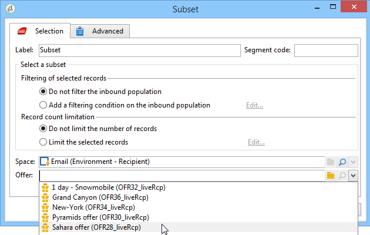

# Ofertas por celda{#offers-by-cell}

La actividad **[!UICONTROL Offers by cell]** permite distribuir la población entrante (desde una consulta por ejemplo) en varios segmentos y especificar una oferta para presentar a cada uno de estos segmentos.

Esta actividad solo se puede utilizar con **Interaction**. Obtenga más información acerca de la administración de ofertas en [esta sección](../../v8/interaction/interaction.md).

Para ello:

1. Una vez que haya especificado la población destinataria, añada la actividad **[!UICONTROL Offers by cell]** y ábrala.
1. En la pestaña **[!UICONTROL General]**, seleccione el espacio de oferta en el que desea presentar las ofertas.
1. En la pestaña **[!UICONTROL Cells]**, especifique los diferentes subconjuntos con el botón **[!UICONTROL Add]**:

   * Especifique la población del subconjunto utilizando las reglas de filtrado y limitación disponibles.
   * A continuación, seleccione la oferta que desee presentar al subconjunto. Las ofertas disponibles son aquellas aptas en el espacio de oferta seleccionado en el paso anterior.

     

1. A continuación, configure una actividad de envío que corresponda al canal elegido. Consulte [Envíos multicanal](cross-channel-deliveries.md).
