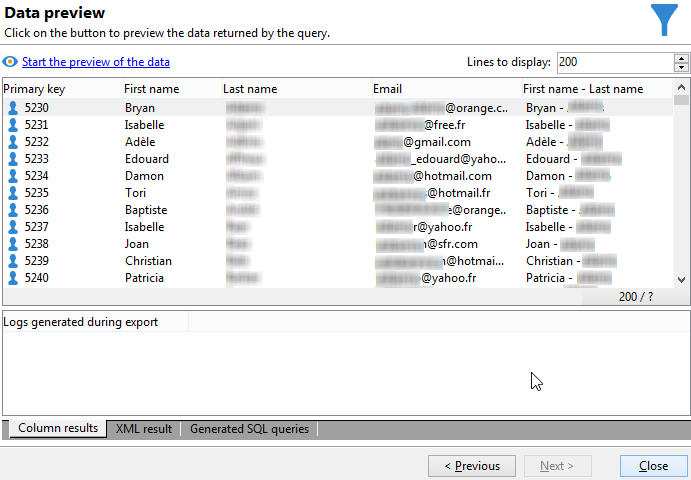

# Realización de consultas con una relación “varios a varios” {#querying-using-a-many-to-many-relationship}


En este ejemplo, se desea recuperar los destinatarios no contactados durante los últimos 7 días. Esta consulta se refiere a todas las entregas.

En este ejemplo también muestra el modo de configurar un filtro relacionado con la selección de un elemento de recopilación (o nodo naranja). Los elementos de recopilación están disponibles en la ventana **[!UICONTROL Field to select]**.

* ¿Qué tabla se debe seleccionar?

  La tabla de destinatario (**nms:recipient**).

* Campos que se desea seleccionar para la columna de salida.

  Clave principal, Apellido, Nombre y Correo electrónico.

* ¿En función de qué criterios se filtra la información?

  En función de los registros de entrega de los destinatarios que van desde los 7 días anteriores a la fecha actual.

Siga estos pasos:

1. Abra el Editor de consultas genérico y seleccione la tabla de destinatarios **[!UICONTROL (nms:recipient)]**.
1. En la ventana **[!UICONTROL Data to extract]** seleccione **[!UICONTROL Primary key]**, **[!UICONTROL First name]**, **[!UICONTROL Last name]** y **[!UICONTROL Email]**.

   

1. En la ventana de ordenación, ordene los nombres alfabéticamente.

   

1. En la ventana **[!UICONTROL Data filtering]** seleccione **[!UICONTROL Filtering conditions]**.
1. En la ventana **[!UICONTROL Target element]**, la condición de filtrado para extraer perfiles sin registro de seguimiento para los últimos 7 días implica dos pasos. El elemento que se debe seleccionar es un vínculo de varios a varios.

   * Para empezar, seleccione el elemento de recopilación (nodo naranja) **[!UICONTROL Recipient delivery logs (broadlog)]** de la primera columna **[!UICONTROL Value]**.

     

     Seleccione el operador **[!UICONTROL do not exist as]**. No es necesario seleccionar un segundo valor en esta línea.

   * El contenido de la segunda condición de filtrado depende de la primera. En este caso, el campo **[!UICONTROL Event date]** se ofrece directamente en la tabla **[!UICONTROL Recipient delivery logs]** ya que hay un vínculo a esta tabla.

     

     Seleccione **[!UICONTROL Event date]** con el operador **[!UICONTROL greater than or equal to]**. Seleccione el valor **[!UICONTROL DaysAgo (7)]**. Para esto, haga clic en **[!UICONTROL Edit expression]** en el campo **[!UICONTROL Value]**. En la ventana **[!UICONTROL Formula type]**, seleccione **[!UICONTROL Process on dates]** y **[!UICONTROL Current date minus n days]**, dando &quot;7&quot; como valor.

     

     Se ha configurado la condición de filtro.

     

1. En la ventana **[!UICONTROL Data formatting]**, cambie los apellidos a mayúscula. En la columna **[!UICONTROL Last name]**, haga clic en la línea **[!UICONTROL Transformation]** y, en el menú desplegable, seleccione **[!UICONTROL Switch to upper case]**.

   

1. Utilice la función **[!UICONTROL Add a calculated field]** para insertar una columna en la ventana de vista previa de datos.

   En este ejemplo, agregue un campo calculado con los nombres y apellidos de los destinatarios en una sola columna. Haga clic en la función **[!UICONTROL Add a calculated field]**. En la ventana **[!UICONTROL Export calculated field definition]**, introduzca una etiqueta y un nombre interno y elija el tipo de **[!UICONTROL JavaScript Expression]**. A continuación, introduzca la siguiente expresión:

   ```
   var rep = source._firstName+" - "+source._lastName
   return rep
   ```

   

   Haga clic en **[!UICONTROL OK]**. La ventana **[!UICONTROL Data formatting]** está configurada.

   Para obtener más información sobre la adición de campos calculados, consulte esta sección.

1. El resultado se muestra en la ventana **[!UICONTROL Data preview]**. Los destinatarios que no hayan sido contactados en los últimos 7 días se muestran en orden alfabético. Los nombres se muestran en mayúsculas y se ha creado la columna con el nombre y los apellidos.

   
