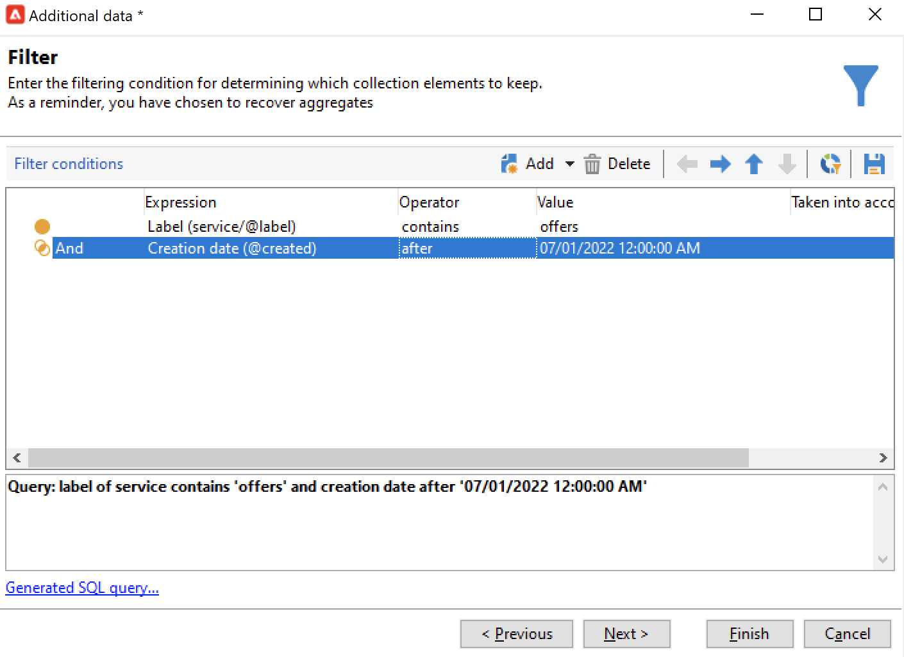

# Consulta{#query}

## Creación de una consulta {#creating-a-query}

Una consulta le permite seleccionar un objetivo según los criterios. Puede asociar un código de segmento al resultado de la consulta e insertar datos adicionales en él.
Aprenda a crear consultas mediante casos de uso en [esta sección](querying-recipient-table.md). Consulte también la sección sobre [Editor de consultas](../../v8/start/query-editor.md).

{width="70%" align="center" zoomable="yes"}

>[!NOTE]
>
>La interfaz de usuario web de Adobe Campaign cuenta con un potente modelador de consultas que simplifica el proceso de filtrado de bases de datos para seleccionar objetivos específicos en función de diversos criterios, lo que le permite crear y administrar la consulta con mayor facilidad. Para obtener más información sobre Query Modeler for Web UI, consulte la [documentación de la interfaz de usuario web de Adobe Campaign](https://experienceleague.adobe.com/es/docs/campaign-web/v8/query-database/query-modeler-overview){target=_blank}.

El enlace **[!UICONTROL Edit query...]** permite definir el tipo de objetivo, las restricciones y los criterios de selección para la población de la siguiente forma:

1. Seleccione la dimensión de segmentación y filtrado. De forma predeterminada, el objetivo se selecciona en los destinatarios. La lista de filtros de restricción es la misma que se utiliza para el objetivo de la entrega.

   La dimensión de segmentación coincide con el tipo de elemento en el que se trabaja, por ejemplo la población objetivo de la operación.

   La dimensión de filtrado permite recopilar estos elementos, por ejemplo información relacionada con la persona de destino (contratos, liquidaciones totales y definitivas, etc.).

   Para obtener más información sobre esto, consulte [Dimensiones de segmentación y filtrado](targeting-workflows.md#targeting-and-filtering-dimensions).

   {width="70%" align="center" zoomable="yes"}

   Una consulta se puede basar en los datos de la transición entrante, si es necesario, seleccionando **[!UICONTROL Temporary schema]** al elegir las dimensiones de segmentación y filtrado.

   {width="70%" align="center" zoomable="yes"}

1. Defina las poblaciones mediante el asistente. Los campos que se van a introducir pueden variar según el tipo de público destinatario. Puede obtener una vista previa de la población objetivo con los criterios actuales en la pestaña **[!UICONTROL Preview]**.

   {width="70%" align="center" zoomable="yes"}

1. Si ha seleccionado **[!UICONTROL Filtering conditions]** en el paso 1 o si utiliza la opción **[!UICONTROL Filters]** > **[!UICONTROL Advanced filter...]**, debe añadir manualmente los criterios de filtrado.

   También puede agregar condiciones de agrupación de datos marcando el cuadro correspondiente. Para ello, la dimensión del filtro debe ser diferente a la dimensión de segmentación de la consulta. Para obtener más información sobre la agrupación, consulte esta [sección](query-grouping-management.md).

   También puede agregar más criterios utilizando el generador de expresiones y combinándolo con las opciones lógicas AND, OR y EXCEPT.

   Guarde el filtro si desea volver a utilizarlo más tarde.

## Adición de datos {#adding-data}

Las columnas adicionales permiten recopilar información adicional sobre la población de destino, por ejemplo, números de contrato, suscripciones a boletines o código fuente. Estos datos se pueden almacenar en la base de datos de Adobe Campaign o en una base de datos externa.

El enlace **[!UICONTROL Add data...]** permite seleccionar los datos adicionales que desea recopilar.

{width="70%" align="center" zoomable="yes"}

Para empezar, seleccione el tipo de datos que desea añadir:

{width="70%" align="center" zoomable="yes"}

* Seleccione la opción **[!UICONTROL Data linked to the filtering dimension]** para seleccionar los datos de la base de datos de Adobe Campaign.
* Seleccione la opción **[!UICONTROL External data]** para añadir datos desde una base de datos externa. Esta opción solo está disponible si ha comprado la opción **Acceso de datos federado**. Para obtener más información, consulte [Acceso a una base de datos externa (FDA)](accessing-an-external-database-fda.md).
* Seleccione la opción **[!UICONTROL An offer proposition]** para añadir un conjunto de columnas que le permitan almacenar la mejor propuesta generada por el motor de oferta. Esta opción solo está disponible si ha comprado el módulo **Interaction**.

Si no hay un módulo opcional instalado en la plataforma, este paso no se muestra. Se le dirigirá al siguiente paso.

Para agregar datos de la base de datos de Adobe Campaign:

1. Seleccione el tipo de datos que desea añadir. Pueden ser datos de la dimensión o datos almacenados en tablas enlazadas.

   {width="70%" align="center" zoomable="yes"}

1. Si los datos pertenecen a la dimensión de filtrado de la consulta, simplemente selecciónelos en la lista de campos disponibles para mostrarlos en las columnas de salida.

   {width="70%" align="center" zoomable="yes"}

   Puede añadir:

   * Campo calculado basado en los datos tomados desde la población de destino o un agregado (número de compras pendientes en el último mes, cantidad promedio de un recibo, etc.). Por ejemplo, vaya a [Selección de datos](targeting-workflows.md#selecting-data).
   * Un campo nuevo, creado con el botón **[!UICONTROL Add]** a la derecha de la lista de columnas de salida.

     También puede añadir una colección de información, por ejemplo, una lista de contratos, las últimas cinco entregas, etc. Las colecciones coinciden con los campos que pueden tener múltiples valores para el mismo perfil (relación 1-N). Para obtener más información, consulte [Edición de datos adicionales](targeting-workflows.md#editing-additional-data).

Para añadir una colección de información enlazada a una población de destino:

1. En el primer paso del asistente, seleccione la opción **[!UICONTROL Data linked to the filtering dimension]**:
1. Seleccione la tabla que contiene la información que desea recopilar y haga clic en **[!UICONTROL Next]**.

   {width="70%" align="center" zoomable="yes"}

1. Si es necesario, especifique el número de elementos de la colección que desea conservar seleccionando uno de los valores en el campo **[!UICONTROL Data collected]**. De forma predeterminada, todas las líneas de la colección se recuperan y luego se filtran de acuerdo con las condiciones especificadas en el siguiente paso.

   * Si un solo elemento de la colección coincide con las condiciones de filtrado para esta colección, seleccione **[!UICONTROL Single row]** en el campo **[!UICONTROL Data collected]**.

     >[!IMPORTANT]
     >
     >Este modo optimiza la consulta SQL generada gracias a una coyuntura directa en los elementos de la colección.
     >
     >Si no se respeta la condición inicial, el resultado puede ser defectuoso (falta de líneas o líneas superpuestas).

   * Si elige recuperar varias líneas (**[!UICONTROL Limit the line count]**), puede especificar el número de líneas que desea recopilar.
   * Si las columnas recopiladas contienen agregados, por ejemplo, el número de errores declarados, el gasto promedio en un sitio, etc., puede utilizar el valor **[!UICONTROL Aggregates]**.

   {width="70%" align="center" zoomable="yes"}

1. Especifique la selección de la colección.

   {width="70%" align="center" zoomable="yes"}

1. Si ha seleccionado la opción **[!UICONTROL Limit the line count]**, defina el orden en el que se de deban filtrar los datos recopilados. Una vez que el número de líneas recopiladas sea mayor que el número de líneas que especificó que deseaba conservar, el orden de filtrado le permite especificar qué líneas mantener.

## Ejemplo: Segmentación en atributos de destinatario simples {#example--targeting-on-simple-recipient-attributes}

En el siguiente ejemplo, la consulta busca identificar hombres de entre 18 y 30 años que viven en Francia. Esta consulta se utilizará en un flujo de trabajo para que sea una oferta exclusiva, por ejemplo.

>[!NOTE]
>
>En [esta sección](querying-recipient-table.md) se presentan más ejemplos de consultas.

1. Asigne un nombre a la consulta y seleccione el enlace **[!UICONTROL Edit query...]**.
1. Seleccione **[!UICONTROL Filtering conditions]** en la lista de tipos de filtro disponibles.
1. Introduzca los diferentes criterios para el objetivo propuesto. Los siguientes criterios se combinan con la opción AND. Para que se incluya en la selección, los destinatarios deberán cumplir las cuatro condiciones siguientes:

   * Destinatarios cuyo título es “Sr.” (también se puede encontrar utilizando el campo **Género** y seleccionar el valor **Hombre**).
   * Destinatarios menores de 30 años.
   * Destinatarios mayores de 18 años.
   * Destinatarios que viven en Francia.

   {width="70%" align="center" zoomable="yes"}

   Puede ver el SQL que coincide con su combinación de criterios:

   {width="70%" align="center" zoomable="yes"}

1. Puede verificar que sus criterios son correctos si obtiene una vista previa de los destinatarios que coinciden con su consulta en la pestaña correspondiente:

   {width="70%" align="center" zoomable="yes"}

1. Guarde los filtros de manera que pueda utilizarlos de nuevo en una fecha posterior haciendo clic en **[!UICONTROL Finish]** > **[!UICONTROL OK]**.
1. Siga editando el flujo de trabajo añadiendo otras actividades. Una vez que se haya iniciado y haya finalizado el paso anterior, se mostrará el número de destinatarios encontrados. Puede ver más detalles con el menú emergente del ratón (haga clic con el botón derecho en la transición > **[!UICONTROL Display the target...]**).

   {width="70%" align="center" zoomable="yes"}

## Parámetros de salida {#output-parameters}

* tableName
* esquema
* recCount

Este conjunto de tres valores identifica la población objetivo de la consulta. **[!UICONTROL tableName]** es el nombre de la tabla que registra los identificadores de destinatario, **[!UICONTROL schema]** es el esquema de la población (normalmente nms:recipient) y **[!UICONTROL recCount]** es el número de elementos de la tabla.

Este valor es el esquema de la tabla de trabajo. Este parámetro es válido para todas las transiciones con **[!UICONTROL tableName]** y **[!UICONTROL schema]**.

## Optimización de las consultas {#optimizing-queries}

La sección siguiente ofrece prácticas recomendadas para optimizar las consultas que se ejecutan en Adobe Campaign a fin de limitar la carga de trabajo en la base de datos y mejorar la experiencia del usuario.

### Uniones e índices {#joins-and-indexes}

* Las consultas eficientes se basan en índices.
* Utilice un índice para todas las uniones.
* La definición de vínculos en el esquema determina las condiciones de unión. La tabla relacionada debe tener un índice único en la clave principal y la unión debe estar en este campo.
* Para realizar combinaciones, defina las claves en campos numéricos en lugar de campos de cadena.
* Evite realizar uniones externas. Siempre que sea posible, utilice el registro de cero ID para lograr la funcionalidad de unión externa.
* Utilice el tipo de datos correcto para las uniones.

  Asegúrese de que la cláusula `where` sea del mismo tipo que el campo.

  Un error común es: `iBlacklist='3'` donde `iBlacklist` es un campo numérico y `3` significa un valor de texto.

  Asegúrese de saber cuál va a ser el plan de ejecución de la consulta. Evite los análisis de tabla completos, especialmente para consultas en tiempo real o consultas casi en tiempo real que se ejecuten a cada minuto.

### Funciones {#functions}

* Tenga cuidado con funciones como `Lower(...)`. Cuando se utiliza la función Lower, no se utiliza Index.
* Compruebe las consultas utilizando la instrucción “like” o las instrucciones “upper” o “lower” cuidadosamente. Aplique “Upper” en la entrada del usuario, no en el campo de la base de datos.

### Filtrado de dimensiones {#filtering-dimensions}

Utilice la dimensión de filtrado de la consulta en lugar del operador “exists such as”.

{width="70%" align="center" zoomable="yes"}

En las consultas, las condiciones de “exists such as” en los filtros no son eficaces. Son el equivalente de una subconsulta en SQL:

`select iRecipientId from nmsRecipient where iRecipientId IN (select iRecipientId from nmsBroadLog where (...))`

Se recomienda utilizar la dimensión de filtrado de la consulta:

{width="70%" align="center" zoomable="yes"}

El equivalente de la dimensión de filtrado en SQL es la unión interna:

`select iRecipientId from nmsRecipient INNER JOIN nmsBroadLog ON (...)`

Para obtener más información sobre dimensiones de filtrado, consulte [esta sección](build-a-workflow.md#targeting-and-filtering-dimensions).

### Arquitectura {#architecture}

* Cree una plataforma de desarrollo con volúmenes, parámetros y arquitectura similares a los de la plataforma de producción.
* Utilice los mismos valores para los entornos de desarrollo y producción. Utilice lo mismo en la medida de lo posible:

   * Sistema operativo,
   * Versión,
   * Datos,
   * Aplicación,
   * Volúmenes.

  >[!NOTE]
  >
  >Es posible que una función que funciona en un entorno de desarrollo no funcione en un entorno de producción en el que los datos puedan ser diferentes. Intente identificar las principales diferencias para anticipar los riesgos y preparar soluciones.

* Realice configuraciones que coincidan con los volúmenes de destinatario. Los volúmenes grandes requieren configuraciones específicas. Una configuración que funcionó para 100.000 destinatarios puede que no funcione para 10.000.000 de destinatarios.

  Considere la escala del sistema cuando se ponga en marcha. Solo porque algo funcione a pequeña escala no significa que sea adecuado con mayores volúmenes. Las pruebas deben realizarse con volúmenes similares al volumen de producción. También debe evaluar el efecto de los cambios en los volúmenes (número de llamadas, tamaño de la base de datos) en las horas pico, los días pico y a lo largo de la duración del proyecto.
